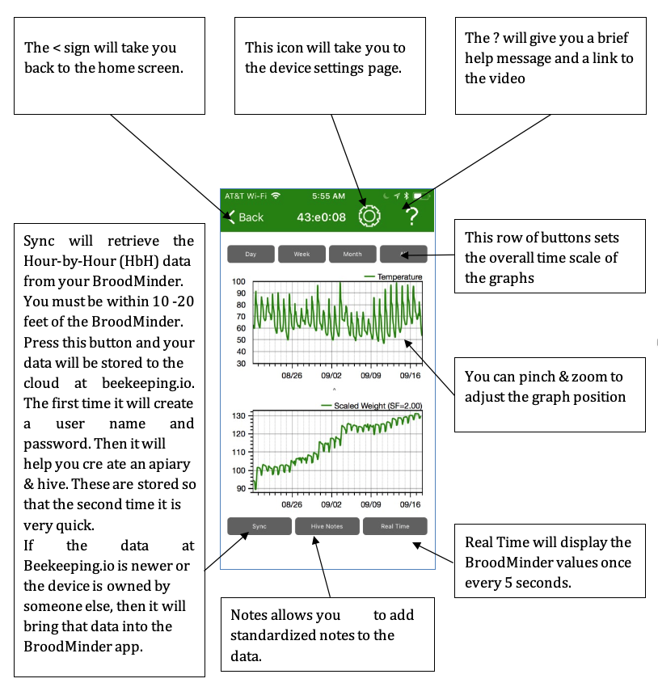

# Broodminder User Guide

_September 2019_

_Version 3.00_

_BroodMinder – Because Every Hive Counts_

## **Document Revisions**

| Date | Version Number | Document Changes |
| --- | --- | --- |
| 1/28/2016 | 0.10 | Initial Draft |
| 1/29/2017 | 0.11 | Added Beekeeping.io and Database sections |
| 1/30/2017 | 0.12 | Fixed Graphs to fit on page and incorporate Theo&#39;s updates |
| 2/2/2017 | 1.00 | Release to the world after a few typo corrections |
| 2/16/2017 | 1.01 | Add BLE advertising info to Appendix B |
| 2/26/2017 | 1.02 | Add scale temperature compensation info |
| 6/15/2017 | 2.60 | Update for version 2.60 app |
| 10/12/2017 | 2.70 | Update for version 2.70 app |
| 12/20/2017 | 2.77 | Update includes Broodminder-APIARY app |
| 5/23/2018 | 2.90 | Cosmetic updates, new video pages, clarifications |
| 7/9/2018 | 2.91 | Correct a detail in the BLE advertising section |
| 11/20/2018 | 2.91 | Add Broodminder-T2 and Android app controls |
| 1/3/2019 | 2.98 | Add Real Time Mode Notes &amp; T2 turn off |
| 3/20/2019 | 2.99 | -T2 Upgrade info, Routine Maintenance |
| 8/27/2019 | 3.00 | Standard App version 3.00 informationApiary App version 1.80 information |

## Introduction

### 1.1 Welcome

Congratulations on the purchase of your Broodminder product. We are happy that you have joined our movement to improve bee health and to share data to enhance our understanding. This manual is intended to fill in any gaps to make your Broodminder experience more pleasant and productive.

If you still have questions or suggestions, or just want to chat about bees, then contact us at support@broodminder.com. We are there to help.

### 1.2 What's New?

There are many changes to the Apps and to MyBroodMinder in this update.

- Standard App
  - The addition of &#39;Whack-A-Mite&#39;. Check it out!
  - Support for Broodminder-T2SwarmMinder (coming soon)
- Apiary app
  - Remote uploading – The apiary app now works with or without internet connectivity.
  - Hub mode – You can use any internet connected iOS or Android device to send data every 10 minutes from your apiary
  - CELL wakeup – The Broodminder-CELL device can be taken out of deep sleep.
- MyBroodMinder.com - In July 2019 we introduced a new version of MyBroodMinder.com
  - New updated user experience
    - Broodminder resources including a video help manual on home page
    - Improved apiary &amp; hive navigation
    - Easy sharing of apiaries with others
  - Text/Hive/Summary views at apiary level
  - Powerful Configuration Manager
    - Easier to move device between hives
    - View and download device inventory
  - Data viewer/Outlier editor
  - Hub monitoring

### 1.3 Quick Start if you plan to share your data (THANK YOU!)

We have done our best to make the installation and usage of your Broodminder intuitive and easy. Here are the basic steps that we will review in detail below.

1. Watch the video help **** that you will find at**[**MyBroodMinder.com**](https://mybroodminder.com/).
2. Load the ****Broodminder Apiary App** to your cell phone or tablet. You will find 3 apps on the store. Choose the Apiary App. The other apps are described below and in the video user guide.
3. Create a MyBroodMinder.com account**by going to [**MyBroodMinder.com**](https://mybroodminder.com/)[.](https://broodminder.com/pages/videos) Go ahead and create an apiary and hive if you have time. (You can do this step after installation.) You will receive 30 days of MyBroodMinder.com-Premium for joining.
4. Activate the battery** in your Broodminder device by pulling the tab (Broodminder-TH) or snapping it in (Broodminder-W) or pushing the button (Broodminder-T2)
5. Install your Broodminder** into your hive.
    - a. Place one Broodminder-TH or -T2 on top of the frames in your lower brood box.
    - b. Place a second Broodminder-TH on top of the frames in your upper brood box.
    - c. Place your Broodminder-W under the front of the hive with a 2x4 or other pivot under the back (or vice-versa). Place the Broodminder in the shady side so that the outside temperature reading is not affected by the sun.
6. Open the apiary app** and wait for yours Broodminder to appear.
    - a. Go to settings (gear icon) and enter your MyBroodMinder.com information
    - b. Return to the device list
7. Retrieve the Hour-by-Hour (HbH) data** after the Broodminder has been running for a couple of hours.  (If you don&#39;t have internet connectivity, go to the section on the Apiary App for further instructions.)
    - a. Tap the cloud with the up arrow in the upper right corner of your screen.
    - b. The app will present a status page and start collecting all of your Broodminder data. You can work on your hives while it completes automatically.
8. Share your data with the world**.
    - a. After sync is complete, you will be asked to upload to the cloud. We hope that you will do this, it will benefit the entire beekeeping community.
    - b. The first time, it will ask for an e-mail and password. The app will use this to create or use an existing MyBroodMinder.com login.
    - c. Next you will identify the Apiary/ZIP and Hive that the device is in.
    - d. Finally, the data will be sent to MyBroodMinder.com. Note that steps a through c only occur the first time you send data.
9. That&#39;s it, you are now part of the solution!**
10. Bee sure and share **your hive data with your friends using our public domain viewer at** BeeCounted.org**

### 1.4 Quick Start if you plan to keep your data private

We have done our best to make the installation and usage of your Broodminder intuitive and easy. Here are the basic steps that we will review in detail below.

1. Watch the video help that you will find at [MyBroodMinder.com](https://mybroodminder.com/)

2. Load the (standard) Broodminder App** to your cell phone or tablet. You will find 3 apps on the store. For iOS (Apple) choose Broodminder. For Android choose BroodMinderLite. Do not choose Broodminder Apiary or Broodminder Cell. They are described below.
3. Load the (standard) Broodminder App** to your cell phone or tablet. You will find 3 apps on the store. For iOS (Apple) choose Broodminder. For Android choose BroodMinderLite. Do not choose Broodminder Apiary or Broodminder Cell. They are described below.
4. Activate the battery** in your Broodminder device by pulling the tab (Broodminder-TH) or snapping it in (Broodminder-W) or pushing the button (Broodminder-T2)
5. Install your Broodminder** into your hive.
    - Place one Broodminder-TH or -T2 on top of the frames in your lower brood box.
    - Place a second Broodminder-TH on top of the frames in your upper brood box.
    - Place your Broodminder-W under the front of the hive with a 2x4 or other pivot under the back (or vice-versa). Place the Broodminder in the shady side so that the outside temperature reading is not affected by the sun.
6. Open the app** and wait for your Broodminder to appear.
7. Retrieve the Hour-by-Hour (HbH) data** after the Broodminder has been running for a couple of hours.
    - Tap the device text to bring up the graph page.
    - Tap SYNC to retrieve the data.
    - You should see the data on the graph.
8. E-mail your data from the device settings page (optional).

## 2 Installing your Broodminder

### 2.1 Sensor Locations

The Citizen Science Package contains two Broodminder-TH (temperature and humidity) or T2 (temperature only) Devices and a Broodminder-W hive scale. Here is where you install these devices:

### 2.2 Broodminder-TH

All Broodminder-TH device IDs start with 42 so they should be easy to recognize. The normal placement of the sensor is on top of the frame near the middle of the hive box of interest. This position is chosen for several reasons:

- Heat rises, therefore the sensor will feel the heat of the brood below
- The brood tends towards the middle of the hive and then surrounds the brood with pollen and honey. Placing the temperature sensor here has the best chance of sensing the brood.
- Using this standardized position allows for cross-hive comparisons across the world.

If you are in a cold climate and you overwinter in more than two boxes, then you may want to move the sensors up. This is because as the cluster moves above a sensor, that sensor tends to sense the outside temperature (since heat rises).

By placing the Broodminder-TH sensor right below the inner cover, you will sense the heat of the entire hive.  Condensation is very likely when it reaches 100% and you may want to inspect the hive and take appropriate action if necessary.

Note: Relative humidity (RH) depends both on moisture in the air and temperature. As temperature goes down, RH goes up. A good example is when RH = 100% outside dew forms. The same thing will happen in your hive.

If you move the Broodminder-TH to the top, then you may want to move the other Broodminder-TH to right below the top box. That way you will see as the cluster moves up past this box.

As a final note, the Broodminder-TH is thin enough that if you want to experiment with different positions such as between the frames you can. We would love to know how this works for you and what you learn.

Whatever position you choose, you can add a tag to the data using the Broodminder app. We&#39;ll talk about doing that in a later chapter.

The CR2032 battery is replaceable by opening the wrapper. It should last more than a year and we recommend replacement each fall before the low temperatures of winter.

### 2.3 Broodminder-T2

All Broodminder -T2 device IDs start with 41 so they should be easy to recognize. The Broodminder-T2 ( **Temperature** ) is a cost reduced version of the Broodminder-TH. It will sense the hive temperature which will indicate brood rearing during the season and winter survival during the winter. Place it above where you believe most of the brood activity will be. In the winter we suggest that you put it on the frames of the upper most hive box so that it catches all of the rising heat from the cluster.

To turn on the Broodminder-T2, press the button for 5 seconds **. The LED will flash for one minute to indicate success**. **IF YOU DON&#39;T HOLD THE BUTTON LONG ENOUGH, YOUR T2 WILL SHUT DOWN AFTER ABOUT 10 SECONDS.** If you ever want to know if the -T2 is operating, press the button again, and the LED will flash momentarily to indicate the battery is fine and the device is operating.

To change the battery, simply cut the tape on three sides around the circuit board. Then swing the board out and replace the battery with a new CR2032. Be sure to seal the circuit board again using packing tape.

If you want to turn off the T2, you must do it with the Broodminder app.

- Find the device and select the graph screen
- Choose device settings (the gear in the upper right corner of the screen)
- Choose Sample Rate then choose &quot;Power Off&quot;. This is only available for T2 devices
- Go back to the graph screen and sync the device. After it finishes, it will power off the T2.

### 2.3 Broodminder-W

The Broodminder-W ( **W** eight) goes under the hive. There is an extensive writeup about positioning the scale in appendix A. That is a good thing to read, but if you are in a hurry, here are the basics.

The CR2032 battery is replaceable. It should last more than a year and we recommend replacement each fall before the low temperatures of winter.

_NOTE: the most typical error source is inadequate support under the scale. This can result in strange behavior as the hive flexes as it expands and contracts due to sun, rain, temperature, etc. Providing a flat support will improve results. An easy fix is to place a ¾&quot; plywood sheet (or equivalent) under the scales._

_ADDITIONAL NOTE: If all you want to see is honey flow, good support is not required. You will just have to ignore the daily fluctuations. You will still be able to observe the overall change in weight._

#### 2.3.1 Place the scale in the shade

The Broodminder-W has a temperature sensor inside which reads the local temperature. For the temperature to be accurate, it should be shaded from direct sun. This temperature is also used to compensate the weight sensors so avoiding the temperature spike created by direct sunshine will improve performance.

Being in the shade will also extend the housing life. We use UV resistant plastic, but in the direct sun even that will become degraded. If this happens, you can order a new housing on Broodminder.com.

#### 2.3.2 Get the Broodminder-W level

We have done our best to make installation simple. However, you need to pay attention to a couple of things.

Make sure the hive is level. This doesn&#39;t mean &quot;crazy level&quot; but if your hive looks like the Leaning Tower of Pisa, then you won&#39;t get good results. 2x4&#39;s and shims are your friends. By using a few 2x4&#39;s and shims creatively, you can level almost anything! We also find that screwing the 2x4&#39;s together makes life better and more stable.

After you install the Broodminder -W, look at the end of it. Through the plastic cover, (remember… install it _with_ the plastic cover), you will see the upper wooden piece and the lower aluminum piece. Make sure that they do not touch. This will ensure that all the weight is sitting on the two little buttons on top of the aluminum base and not somewhere else.

#### 2.3.3 Typical installation, not as accurate

Using the typical installation, you will see small changes to the hive however, the absolute accuracy will not be as good. For improved accuracy, see the recommendations of the next section.

The Broodminder-W is designed to measure ½ of the hive weight. To do this, we want you to support one side of the hive (front or back, left or right) with a 2x4 or similar [However, we recommend that you use a piece of 2&quot; angle for the support. By orienting it so that the point of the angle iron is up, it gives a very precise pivot point. You should be able get this at your local hardware store. Aluminum is extra nice because it won&#39;t rust. A great place to get just what you need for less than $5 each is [Speedy Metals](https://www.speedymetals.com/pc-2186-8344-2-x-2-angle-6061-t6-aluminum-extruded.aspx)(1/8&quot; {A} x 2&quot; {B} x 2&quot; {C} Angle 6061-T6 Aluminum, Extruded).]

The Broodminder-W is placed under the opposite side.

There is a nice explanation of the math and physics involved in Appendix A, however it boils down to this. **Do your best to place the support and the scale directly under the wall of the hive body.** That will give good results.

#### 2.3.4 Better installation, more accurate

A better way to install will require a few modifications to your bottom board. You will make a couple of small cuts that will be used to accommodate precise and repeatable placement of the scale and support.

First off, we recommend that you use a piece of 2&quot; angle for the support. By orienting it so that the point of the angle iron is up, it gives a very precise pivot point. You should be able get this at your local hardware store. Aluminum is extra nice because it won&#39;t rust. A great place to get just what you need for less than $5 each is [Speedy Metals](https://www.speedymetals.com/pc-2186-8344-2-x-2-angle-6061-t6-aluminum-extruded.aspx)(1/8&quot; {A} x 2&quot; {B} x 2&quot; {C} Angle 6061-T6 Aluminum, Extruded).

Now we want to make the cuts in the bottom board. For this setup we recommend using front and back supports and not side to side. That given, you must choose whether to place the Broodminder-W under the front of the hive, or the back of the hive.

In general, it is better to place the Broodminder-W out of the sun. This is because the sun will heat the scale and give you a false reading of the outside temperature. Placing it in the shady side of the scale avoids this problem. It will also make the housing last longer.

Next you will cut the bottom board. For the angle iron side, you will cut a groove the width of your saw blade that the point of the angle will fit in. For the scale side, you will cut a notch 3/16&quot; deep that ends 1&quot; inside the center of the hive body wall. See the images below.

## 3 Routine Maintenance

There is not much routine maintenance that is required. Please note that if your batteries are lasting less than 6 months, something is wrong and you should contact [Support@Broodminder.com](mailto:Support@Broodminder.com) for replacement or refurbishment.

### 3.1 Spring

We have a video talking about spring maintenance on the support page at [mybroodminder.com/resources](https://mybroodminder.com/app/resources).

In the spring, it is a good time to clean up your devices. You can use 91% or better Isopropyl or Ethyl Alcohol, it will not harm the electronics.

You can place the wrappers in the freezer and then propolis will break off more easily.

**Ensure that the scale wrapper is not cracked, that will allow rain to harm the sensors.** You can seal any cracks with packing tape.

We also have replacement wrappers for all the devices on our website at Broodminder.com.

### 3.2 Fall

Prior to winter, replace all of the batteries in your BroodMinders. (A good place to buy them is Amazon.com or Digikey.com. You can get them for less than $0.50 each). All of the batteries are of type CR2032.

**Ensure that the scale wrapper is not cracked, that will allow rain to harm the sensors.** You can seal any cracks with packing tape or order replacement wrappers at Broodminder.com.

## 4 Device Software Updates
The Broodminder-T2 and the Broodminder-Hub devices have provision for Over-The-Air (OTA) upgrades. These are performed by the -Apiary app or the -CELL app. For more information, go to this link.

[mybroodminder.com/resources](https://mybroodminder.com/app/resources)

# EXEMPLE IMAGE
