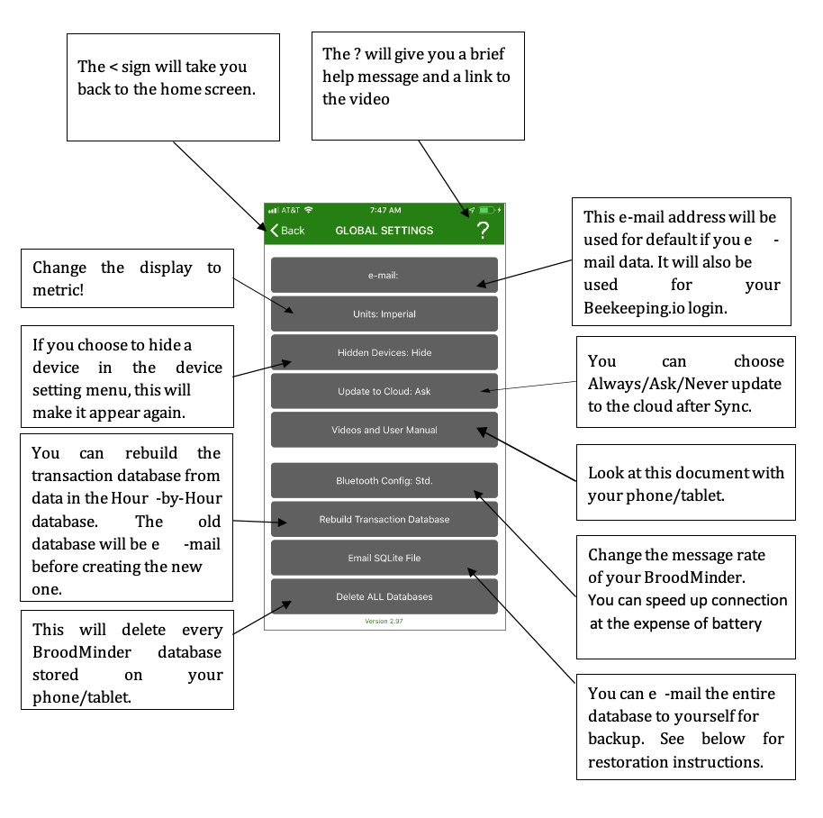
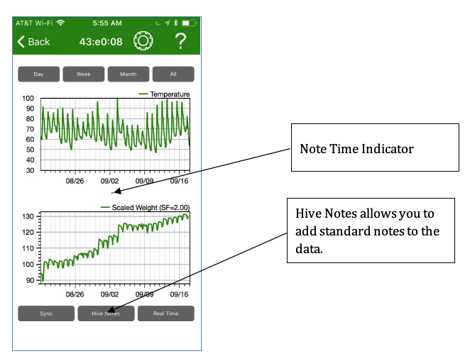
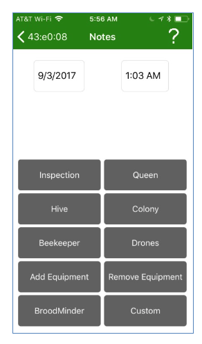
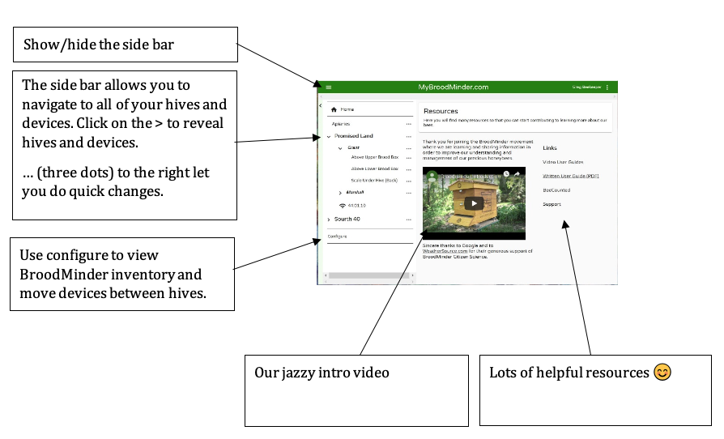
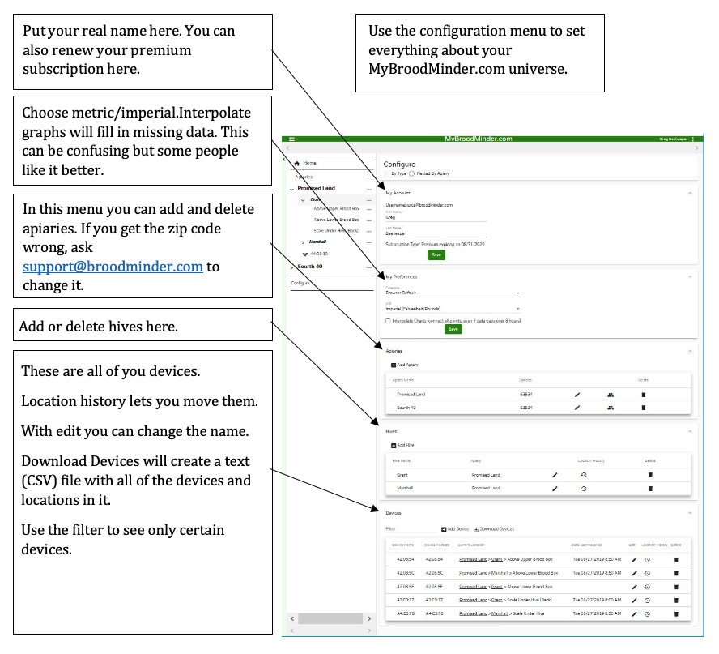
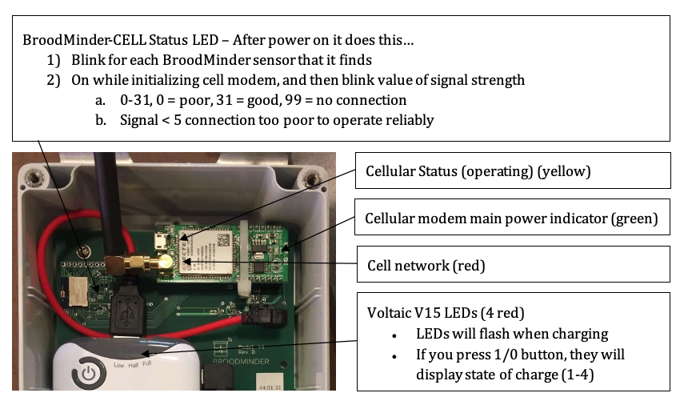
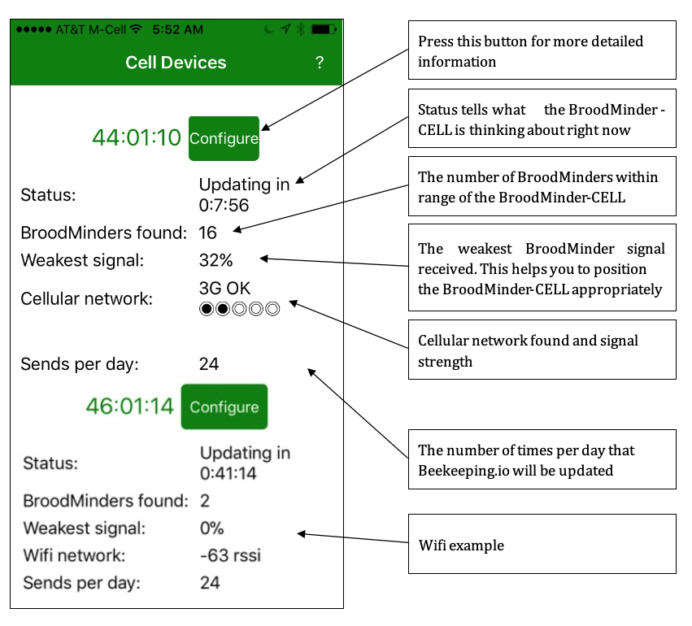
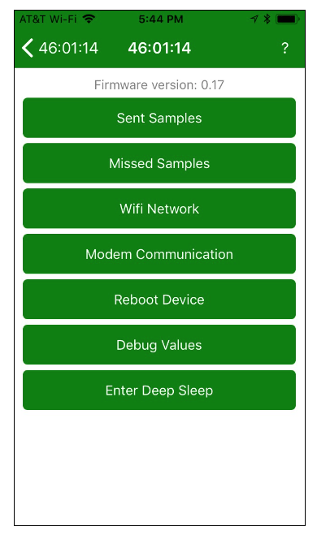

# Broodminder User Guide

_September 2019_

_Version 3.00_

_BroodMinder – Because Every Hive Counts_

## **Document Revisions**

| Date | Version Number | Document Changes |
| --- | --- | --- |
| 1/28/2016 | 0.10 | Initial Draft |
| 1/29/2017 | 0.11 | Added Beekeeping.io and Database sections |
| 1/30/2017 | 0.12 | Fixed Graphs to fit on page and incorporate Theo&#39;s updates |
| 2/2/2017 | 1.00 | Release to the world after a few typo corrections |
| 2/16/2017 | 1.01 | Add BLE advertising info to Appendix B |
| 2/26/2017 | 1.02 | Add scale temperature compensation info |
| 6/15/2017 | 2.60 | Update for version 2.60 app |
| 10/12/2017 | 2.70 | Update for version 2.70 app |
| 12/20/2017 | 2.77 | Update includes Broodminder-APIARY app |
| 5/23/2018 | 2.90 | Cosmetic updates, new video pages, clarifications |
| 7/9/2018 | 2.91 | Correct a detail in the BLE advertising section |
| 11/20/2018 | 2.91 | Add Broodminder-T2 and Android app controls |
| 1/3/2019 | 2.98 | Add Real Time Mode Notes &amp; T2 turn off |
| 3/20/2019 | 2.99 | -T2 Upgrade info, Routine Maintenance |
| 8/27/2019 | 3.00 | Standard App version 3.00 informationApiary App version 1.80 information |

## Introduction

### 1.1 Welcome

Congratulations on the purchase of your Broodminder product. We are happy that you have joined our movement to improve bee health and to share data to enhance our understanding. This manual is intended to fill in any gaps to make your Broodminder experience more pleasant and productive.

If you still have questions or suggestions, or just want to chat about bees, then contact us at support@broodminder.com. We are there to help.

### 1.2 What's New?

There are many changes to the Apps and to MyBroodMinder in this update.

- Standard App
  - The addition of &#39;Whack-A-Mite&#39;. Check it out!
  - Support for Broodminder-T2SwarmMinder (coming soon)
- Apiary app
  - Remote uploading – The apiary app now works with or without internet connectivity.
  - Hub mode – You can use any internet connected iOS or Android device to send data every 10 minutes from your apiary
  - CELL wakeup – The Broodminder-CELL device can be taken out of deep sleep.
- MyBroodMinder.com - In July 2019 we introduced a new version of MyBroodMinder.com
  - New updated user experience
    - Broodminder resources including a video help manual on home page
    - Improved apiary &amp; hive navigation
    - Easy sharing of apiaries with others
  - Text/Hive/Summary views at apiary level
  - Powerful Configuration Manager
    - Easier to move device between hives
    - View and download device inventory
  - Data viewer/Outlier editor
  - Hub monitoring

### 1.3 Quick Start if you plan to share your data (THANK YOU!)

We have done our best to make the installation and usage of your Broodminder intuitive and easy. Here are the basic steps that we will review in detail below.

1. Watch the video help **** that you will find at**[**MyBroodMinder.com**](https://mybroodminder.com/).
2. Load the ****Broodminder Apiary App** to your cell phone or tablet. You will find 3 apps on the store. Choose the Apiary App. The other apps are described below and in the video user guide.
3. Create a MyBroodMinder.com account**by going to [**MyBroodMinder.com**](https://mybroodminder.com/)[.](https://broodminder.com/pages/videos) Go ahead and create an apiary and hive if you have time. (You can do this step after installation.) You will receive 30 days of MyBroodMinder.com-Premium for joining.
4. Activate the battery** in your Broodminder device by pulling the tab (Broodminder-TH) or snapping it in (Broodminder-W) or pushing the button (Broodminder-T2)
5. Install your Broodminder** into your hive.
    - a. Place one Broodminder-TH or -T2 on top of the frames in your lower brood box.
    - b. Place a second Broodminder-TH on top of the frames in your upper brood box.
    - c. Place your Broodminder-W under the front of the hive with a 2x4 or other pivot under the back (or vice-versa). Place the Broodminder in the shady side so that the outside temperature reading is not affected by the sun.
6. Open the apiary app** and wait for yours Broodminder to appear.
    - a. Go to settings (gear icon) and enter your MyBroodMinder.com information
    - b. Return to the device list
7. Retrieve the Hour-by-Hour (HbH) data** after the Broodminder has been running for a couple of hours.  (If you don&#39;t have internet connectivity, go to the section on the Apiary App for further instructions.)
    - a. Tap the cloud with the up arrow in the upper right corner of your screen.
    - b. The app will present a status page and start collecting all of your Broodminder data. You can work on your hives while it completes automatically.
8. Share your data with the world**.
    - a. After sync is complete, you will be asked to upload to the cloud. We hope that you will do this, it will benefit the entire beekeeping community.
    - b. The first time, it will ask for an e-mail and password. The app will use this to create or use an existing MyBroodMinder.com login.
    - c. Next you will identify the Apiary/ZIP and Hive that the device is in.
    - d. Finally, the data will be sent to MyBroodMinder.com. Note that steps a through c only occur the first time you send data.
9. That&#39;s it, you are now part of the solution!**
10. Bee sure and share **your hive data with your friends using our public domain viewer at** BeeCounted.org**

### 1.4 Quick Start if you plan to keep your data private

We have done our best to make the installation and usage of your Broodminder intuitive and easy. Here are the basic steps that we will review in detail below.

1. Watch the video help that you will find at [MyBroodMinder.com](https://mybroodminder.com/)

2. Load the (standard) Broodminder App** to your cell phone or tablet. You will find 3 apps on the store. For iOS (Apple) choose Broodminder. For Android choose BroodMinderLite. Do not choose Broodminder Apiary or Broodminder Cell. They are described below.
3. Load the (standard) Broodminder App** to your cell phone or tablet. You will find 3 apps on the store. For iOS (Apple) choose Broodminder. For Android choose BroodMinderLite. Do not choose Broodminder Apiary or Broodminder Cell. They are described below.
4. Activate the battery** in your Broodminder device by pulling the tab (Broodminder-TH) or snapping it in (Broodminder-W) or pushing the button (Broodminder-T2)
5. Install your Broodminder** into your hive.
    - Place one Broodminder-TH or -T2 on top of the frames in your lower brood box.
    - Place a second Broodminder-TH on top of the frames in your upper brood box.
    - Place your Broodminder-W under the front of the hive with a 2x4 or other pivot under the back (or vice-versa). Place the Broodminder in the shady side so that the outside temperature reading is not affected by the sun.
6. Open the app** and wait for your Broodminder to appear.
7. Retrieve the Hour-by-Hour (HbH) data** after the Broodminder has been running for a couple of hours.
    - Tap the device text to bring up the graph page.
    - Tap SYNC to retrieve the data.
    - You should see the data on the graph.
8. E-mail your data from the device settings page (optional).

## 2 Installing your Broodminder

### 2.1 Sensor Locations

The Citizen Science Package contains two Broodminder-TH (temperature and humidity) or T2 (temperature only) Devices and a Broodminder-W hive scale. Here is where you install these devices:

### 2.2 Broodminder-TH

All Broodminder-TH device IDs start with 42 so they should be easy to recognize. The normal placement of the sensor is on top of the frame near the middle of the hive box of interest. This position is chosen for several reasons:

- Heat rises, therefore the sensor will feel the heat of the brood below
- The brood tends towards the middle of the hive and then surrounds the brood with pollen and honey. Placing the temperature sensor here has the best chance of sensing the brood.
- Using this standardized position allows for cross-hive comparisons across the world.

If you are in a cold climate and you overwinter in more than two boxes, then you may want to move the sensors up. This is because as the cluster moves above a sensor, that sensor tends to sense the outside temperature (since heat rises).

By placing the Broodminder-TH sensor right below the inner cover, you will sense the heat of the entire hive.  Condensation is very likely when it reaches 100% and you may want to inspect the hive and take appropriate action if necessary.

Note: Relative humidity (RH) depends both on moisture in the air and temperature. As temperature goes down, RH goes up. A good example is when RH = 100% outside dew forms. The same thing will happen in your hive.

If you move the Broodminder-TH to the top, then you may want to move the other Broodminder-TH to right below the top box. That way you will see as the cluster moves up past this box.

As a final note, the Broodminder-TH is thin enough that if you want to experiment with different positions such as between the frames you can. We would love to know how this works for you and what you learn.

Whatever position you choose, you can add a tag to the data using the Broodminder app. We&#39;ll talk about doing that in a later chapter.

The CR2032 battery is replaceable by opening the wrapper. It should last more than a year and we recommend replacement each fall before the low temperatures of winter.

### 2.3 Broodminder-T2

All Broodminder -T2 device IDs start with 41 so they should be easy to recognize. The Broodminder-T2 ( **Temperature** ) is a cost reduced version of the Broodminder-TH. It will sense the hive temperature which will indicate brood rearing during the season and winter survival during the winter. Place it above where you believe most of the brood activity will be. In the winter we suggest that you put it on the frames of the upper most hive box so that it catches all of the rising heat from the cluster.

To turn on the Broodminder-T2, press the button for 5 seconds **. The LED will flash for one minute to indicate success**. **IF YOU DON&#39;T HOLD THE BUTTON LONG ENOUGH, YOUR T2 WILL SHUT DOWN AFTER ABOUT 10 SECONDS.** If you ever want to know if the -T2 is operating, press the button again, and the LED will flash momentarily to indicate the battery is fine and the device is operating.

To change the battery, simply cut the tape on three sides around the circuit board. Then swing the board out and replace the battery with a new CR2032. Be sure to seal the circuit board again using packing tape.

If you want to turn off the T2, you must do it with the Broodminder app.

- Find the device and select the graph screen
- Choose device settings (the gear in the upper right corner of the screen)
- Choose Sample Rate then choose &quot;Power Off&quot;. This is only available for T2 devices
- Go back to the graph screen and sync the device. After it finishes, it will power off the T2.

### 2.3 Broodminder-W

The Broodminder-W ( **W** eight) goes under the hive. There is an extensive writeup about positioning the scale in appendix A. That is a good thing to read, but if you are in a hurry, here are the basics.

The CR2032 battery is replaceable. It should last more than a year and we recommend replacement each fall before the low temperatures of winter.

_NOTE: the most typical error source is inadequate support under the scale. This can result in strange behavior as the hive flexes as it expands and contracts due to sun, rain, temperature, etc. Providing a flat support will improve results. An easy fix is to place a ¾&quot; plywood sheet (or equivalent) under the scales._

_ADDITIONAL NOTE: If all you want to see is honey flow, good support is not required. You will just have to ignore the daily fluctuations. You will still be able to observe the overall change in weight._

#### 2.3.1 Place the scale in the shade

The Broodminder-W has a temperature sensor inside which reads the local temperature. For the temperature to be accurate, it should be shaded from direct sun. This temperature is also used to compensate the weight sensors so avoiding the temperature spike created by direct sunshine will improve performance.

Being in the shade will also extend the housing life. We use UV resistant plastic, but in the direct sun even that will become degraded. If this happens, you can order a new housing on Broodminder.com.

#### 2.3.2 Get the Broodminder-W level

We have done our best to make installation simple. However, you need to pay attention to a couple of things.

Make sure the hive is level. This doesn&#39;t mean &quot;crazy level&quot; but if your hive looks like the Leaning Tower of Pisa, then you won&#39;t get good results. 2x4&#39;s and shims are your friends. By using a few 2x4&#39;s and shims creatively, you can level almost anything! We also find that screwing the 2x4&#39;s together makes life better and more stable.

After you install the Broodminder -W, look at the end of it. Through the plastic cover, (remember… install it _with_ the plastic cover), you will see the upper wooden piece and the lower aluminum piece. Make sure that they do not touch. This will ensure that all the weight is sitting on the two little buttons on top of the aluminum base and not somewhere else.

#### 2.3.3 Typical installation, not as accurate

Using the typical installation, you will see small changes to the hive however, the absolute accuracy will not be as good. For improved accuracy, see the recommendations of the next section.

The Broodminder-W is designed to measure ½ of the hive weight. To do this, we want you to support one side of the hive (front or back, left or right) with a 2x4 or similar [However, we recommend that you use a piece of 2&quot; angle for the support. By orienting it so that the point of the angle iron is up, it gives a very precise pivot point. You should be able get this at your local hardware store. Aluminum is extra nice because it won&#39;t rust. A great place to get just what you need for less than $5 each is [Speedy Metals](https://www.speedymetals.com/pc-2186-8344-2-x-2-angle-6061-t6-aluminum-extruded.aspx)(1/8&quot; {A} x 2&quot; {B} x 2&quot; {C} Angle 6061-T6 Aluminum, Extruded).]

The Broodminder-W is placed under the opposite side.

There is a nice explanation of the math and physics involved in Appendix A, however it boils down to this. **Do your best to place the support and the scale directly under the wall of the hive body.** That will give good results.

#### 2.3.4 Better installation, more accurate

A better way to install will require a few modifications to your bottom board. You will make a couple of small cuts that will be used to accommodate precise and repeatable placement of the scale and support.

First off, we recommend that you use a piece of 2&quot; angle for the support. By orienting it so that the point of the angle iron is up, it gives a very precise pivot point. You should be able get this at your local hardware store. Aluminum is extra nice because it won&#39;t rust. A great place to get just what you need for less than $5 each is [Speedy Metals](https://www.speedymetals.com/pc-2186-8344-2-x-2-angle-6061-t6-aluminum-extruded.aspx)(1/8&quot; {A} x 2&quot; {B} x 2&quot; {C} Angle 6061-T6 Aluminum, Extruded).

Now we want to make the cuts in the bottom board. For this setup we recommend using front and back supports and not side to side. That given, you must choose whether to place the Broodminder-W under the front of the hive, or the back of the hive.

In general, it is better to place the Broodminder-W out of the sun. This is because the sun will heat the scale and give you a false reading of the outside temperature. Placing it in the shady side of the scale avoids this problem. It will also make the housing last longer.

Next you will cut the bottom board. For the angle iron side, you will cut a groove the width of your saw blade that the point of the angle will fit in. For the scale side, you will cut a notch 3/16&quot; deep that ends 1&quot; inside the center of the hive body wall. See the images below.

## 3 Routine Maintenance

There is not much routine maintenance that is required. Please note that if your batteries are lasting less than 6 months, something is wrong and you should contact [Support@Broodminder.com](mailto:Support@Broodminder.com) for replacement or refurbishment.

### 3.1 Spring

We have a video talking about spring maintenance on the support page at [mybroodminder.com/resources](https://mybroodminder.com/app/resources).

In the spring, it is a good time to clean up your devices. You can use 91% or better Isopropyl or Ethyl Alcohol, it will not harm the electronics.

You can place the wrappers in the freezer and then propolis will break off more easily.

**Ensure that the scale wrapper is not cracked, that will allow rain to harm the sensors.** You can seal any cracks with packing tape.

We also have replacement wrappers for all the devices on our website at Broodminder.com.

### 3.2 Fall

Prior to winter, replace all of the batteries in your BroodMinders. (A good place to buy them is Amazon.com or Digikey.com. You can get them for less than $0.50 each). All of the batteries are of type CR2032.

**Ensure that the scale wrapper is not cracked, that will allow rain to harm the sensors.** You can seal any cracks with packing tape or order replacement wrappers at Broodminder.com.

## 4 Device Software Updates
The Broodminder-T2 and the Broodminder-Hub devices have provision for Over-The-Air (OTA) upgrades. These are performed by the -Apiary app or the -CELL app. For more information, go to this link.

[mybroodminder.com/resources](https://mybroodminder.com/app/resources)

## 5 The BroodMinder App

### 5.1 Device compatibility

We have designed the BroodMinder App to work with most iOS (iPhone, iPad) and Android devices. We test our software on many different devices.

#### 5.1.1 Apple – iOS

The BroodMinder app will work with any Apples device that has Bluetooth Low Energy (BLE) available. It will work with iPhone model 4s or newer and with iPads 3rd generation or newer.

#### 5.1.2 Android

Android is a bit more complicated. Android introduced BLE support in Version 4.3 (Jelly Bean, July 2012). Devices before that will not work. Devices after that may work. Most new devices (2015 or newer) do work. However, there are many flavors of phone and we have found a few that give us problems. If your device does not work, then contact us at Support@BroodMinder.com.

A new feature has been added to the app in version 2.97 to increase the &quot;advertising rate&quot; of your BroodMinder devices. As shipped, the BroodMinder sends a message out once every five seconds that contains temperature and weight information. The General Settings page now has a Bluetooth Config button which allows you to change the advertising rate to once per second. This will speed device connection and will make data retrieval faster. It will however reduce battery life to 3-6 months.

We have also added a &quot;Reset Android Bluetooth&quot; under the Bluetooth Config button. This will do a system reset of the Bluetooth function. We have found that on some phones this will help re-establish communication.

There is more information at [MyBroodMinder.com/resources](https://mybroodminder.com/app/resources).

### 5.2 Installation

The BroodMinder app is available at the Apple App store, or the Android Play Store, or the Amazon Play Store, depending on your device. If you search for &quot;BroodMinder&quot;, (it is called BroodMinder Lite on Android) you will find it. Install it just like you would any other app.

After it is installed, start the app. The app should present you with a warm and congratulatory welcome message. You can choose to watch our Queen Bee, Laura Davis demonstrate installation, or you can dismiss the message and let the app do its thing.

The app will start scanning for BroodMinder devices in the area and will automatically fill the screen with any that it finds within the area.

If none show up:

- Make sure that the battery tab has been removed from the BroodMinder-TH and make sure that the battery is pressed into place on the BroodMinder-W
- Make sure that your phone/tablet has Bluetooth turned on
- Make sure that you are within 10-20 feet of the BroodMinder device

### 5.3 Home Screen of BroodMinder App

BroodMinder-T will display Temperature
BroodMinder-TH will display Temperature & Humidity 
BroodMinder-W will display Temperature & Weight

### 5.4 Details/Graph Screen of BroodMinder App

### 5.5 General Setting Page

### 5.6 Device Setting Page

### 5.7 Real Time Mode

If you would like to see &quot;Live&quot; data, you can use the &quot;Real Time&quot; button on the Graph screen. Pressing this button will change the sampling rate to 5 seconds and then show a display of values in the lower section of the screen.

B: Battery level  
T: Temperature (currently only F) 
H: Relative Humidity in % 
L/R: Balance between left and right sensors. Adds to 100% (-W scale only) 
W: Total weight (currently only pounds) (-W scale only) 
Delta: Change in weight from when Real-time started. (-W scale only) 

This data will also be saved in the log file.

Pressing the &quot;Real Time&quot; button again will leave this mode and set the sampling rate back to 60 minutes.

### 5.7 Setting the Broodminder-W scale factor

By default, the BroodMinder-W scale factor is set to 2.0. This means that any weight the BroodMinder-W sees is doubled to reflect the full weight of the hive. From looking at the physics of the situation (see appendix below) we know that this is an approximation and not totally accurate. In most cases, it is close enough since small changes will still be seen and a 5-10% error in total weight is not important.

A more accurate total weight display can be obtained by adjusting the scale factor to account for the hive specific situation.

Go to the Graph Screen of the scale and press the real time button. In a few seconds, the app will begin to display the scale reading once every 5 seconds at the very bottom of the screen. You can also see the % load on each load cell.

Now add a known weight of 10-20 pounds to the top center of the hive. You should see this weight change in the app readout. Then you can adjust the scale factor to exactly match the weight change.

Example:

| Weight | Delta Weight          |       Scale Factor     |    Notes |
| --- | --- | --- | --- | 
| 121.2     |      0.0             |             2.0       |           Start of Real Time | 
| 132.2     |      11.0              |            2.0       |           We added the weight| 

Now we go change the scale factor
| Weight | Delta Weight          |       Scale Factor     |    Notes |
| --- | --- | --- | --- | 
| 129.5     |      10.0             |             1.82       |           Now the calibration is closer | 
| 117.0     |      0          |                1.82      |            After the weight is removed, we see the new more accurate hive weight |

### 5.8 Setting the BroodMinder-W temperature compensation

The sensors used in the BroodMinder-W are very high quality and exhibit little temperature effect. However, there is still variation from scale to scale and therefore we have provided a means to improve the accuracy through the adjustment of the scale temperature compensation – &quot;Scale TempCo&quot;.

To adjust the TempCo, you should pick a portion of your weight graph in which you know there is little weight change due to bee activity. A cloudy day is a good time because we know that they are not foraging. There should also be a good outdoor temperature change of at least 20 degrees F in less than a day.

As you make small changes to the TempCo value, you will see the weight graph settle out to a uniform weight as one would expect.

If you see weight spikes even after adjusting, then possibly it is due to the scale being in the sun. The sun can heat of the scale quite quickly and dramatically. This makes it very difficult for the TempCo to be effective.

### 5.9 Tagging Graphs

Pressing the Hive Notes button lets you add text to any point in time on the graph. This is useful to explain abrupt changes in the data or whenever you do a hive inspection.

This button will bring up a sub-menu with eight groups of possible occurrences or actions. Select the one most appropriate for your situation and choose the corresponding tag. Use “Custom” if the list does not cover your situation. The selections in the app will be updated as time goes on to best reflect the tags most used.
The time shown in the top half of the screen is the current time if the graphs have not been moved by pinching or swiping before the “Tag Graph” button has been pressed. It can be adjusted by clicking on it.

When noting a past event, it is useful to move the chart and line up the time of the event with the “Note Time Indicator” and then press Hive Notes. In this case, the note time in the notes window is the time at the “Notes Time Indicator” and not the current time. 

Of particular interest is the &quot;Inspection&quot; button. This button will walk you through a 6 easy to answer questions about the state of the hive. The list was shared with us by Dick Rogers and we think it is a quick and effective way to document the hive.

## 6 Broominder-APIARY App

Introduced in 2018, the BroodMinder-APIARY app is our most powerful app. It will read and upload every BroodMinder device in your apiary directly to MyBroodMinder with a single keypress. It can also be used to automatically send your live data to MyBroodMinder.com every 10 minutes.

Once the data is transferred, review of data and keeping hive notes can be done directly on MyBroodMinder.com. We recommend this because of its ease of use.

Please note that this app only stores your hour by hour data in the cloud and does not keep a copy on your phone and/or tablet.

New features have been added in 2019.

- Remote uploading – The apiary app now works with or without internet connectivity.
- Hub mode – You can use any internet connected iOS or Android device to send data every 10 minutes from your apiary
- CELL wakeup – The BroodMinder-CELL device can be taken out of deep sleep.

While saving you lots of time in collecting data from your devices, this app comes with a small caveat. You must have MyBroodMinder Premium to  upload all devices automatically or use hub mode. To allow you to test out its features, you can use the app free of charge for 30 days after creating your MyBroodMinder account.

We charge for this in order to provide a small income to our BroodMinder software team. They work very hard to create and maintain the MyBroodMinder and BeeCounted.org websites. Usage of the standard BroodMinder app will always remain free. Likewise, uploading to MyBroodMinder from the standard app will always remain free.

You can still use the Apiary App indefinitely to upload single devices. This is useful because it is a newer software package and the upload process is more streamlined than the original app.

Usage of the app is super simple.

1. Go to MyBroodMinder.com and create an account (this is free).
2. Download BroodMinder-Apiary from your app store.
3. Start the app and press the gear icon and enter your MyBroodMinder credentials.
4. Return to the list screen and in a few seconds it will automatically find every BroodMinder device in the area and display them on the screen.
5. After the BroodMinder IDs turn green, press the cloud icon  in the upper right of the screen to begin upload to MyBroodMinder.
6. Now the app will show you a upload progress screen. The top line is status while harvesting the BroodMinder data. The lower line shows the transfer to MyBroodMinder status. 6)After all of the devices have uploaded you will see a transfer complete message.

After the transfer is complete, the data will show up in MyBroodMinder. If you have already set up your devices, all you do is look. If these are new devices, you will need to find them in your MyBroodMinder &quot;Device Inventory&quot; and assign them to an apiary and to a hive. See the next section on MyBroodMinder.com for more on that.

MANUALLY CLEAR DEVICES WHEN FULL – If your BroodMinder device has been running for a long time (over 9 months), the memory can get full. When it does, the apiary app will automatically reset it so that it can store more. If you want manual control, flip this switch.

FAST CONNECT – This will speed up connection time by making the &#39;advertising rate&#39; faster. This means the BroodMinder will send out a signal every one second instead of every 5 seconds. The downside is that it will also shorten battery life. You might want to set this fast in the summer and slow in the winter.

HUB MODE – See below.

ENABLE REMOTE DEVICE SYNC – You can retrieve data even when there is no internet connection or cell coverage in your apiary.

1. Before going to the apiary – go to the device list and press the cloud with the down arrow  
This will load the list with all of you devices and the last time data was retrieved. (If you don&#39;t do this, all of the data will be retrieved from your BroodMinder. This could be a full year of data!)
. This will load the list with all of you devices and the last time data was retrieved. (If you don&#39;t do this, all of the data will be retrieved from your BroodMinder. This could be a full year of data!)

2. When in the field, sync your devices like normal. They will fail upload since you don&#39;t have internet, but that is OK.

3. When your return to civilization, restart the app and it will suggest that you upload to the cloud now. Do this and MyBroodMinder.com will get updated.

**HUB MODE**

Hub mode lets you use and old phone or tablet to automatically send your BroodMinder data to MyBroodMinder once every 10 minutes. This way you can see how your bees are doing 24/7 from anywhere in the world.

Just enable hub mode and return to the list screen.

## 7 MyBroodMinder.com Cloud Storage

The true power of the BroodMinder movement is in the data from thousands of hives stored for public consumption at MyBroodMinder.com.

We have done our best to make it as simple as possible for you to transfer the data there. **From the BroodMinder App, you only need to push the Sync button and answer a few questions.  ** The app will create a new MyBroodMinder account for you and everything needed to get going.After that the data will be transferred. _You do not need to create a MyBroodMinder account before pushing data._

Once the data is on MyBroodMinder.com you can see it and combine the data from the sensors into one easy to read graph for each hive.

With any web browser, go to MyBroodMinder.com. You will need to enter the same username (e-mail) and password. After that you will see a menu similar to the image below.

You will see a graph like this that combines all of the sensors in a hive into one report.

## 8 Databases!

Everybody loves databases! We know we do!

In the BroodMinder App there are two databases.

- Transaction database – This database holds all of the interactions between you the operator and your BroodMinders. Each time you go to retrieve data it will keep a record of it.
- Hour-by-Hour (HbH) database – This one holds all of the HbH data that your retrieve from your device using the SYNC button.

### 8.1 Database operations

There are several things that you can do with the database using the BroodMinder App. Here is a quick list. We will follow-up with details.

Some of these operations are tricky! If you are not confident of doing them, send us a note at Support@BroodMinder.com. Mike or Theo will be happy to help.

- Send CSV (Comma Separated Variable) text file to yourself (or others) Transaction Database HbH database
- Send SQLite file to yourself (or others) – The SQLite file is the main database that is used by the App. This holds all of the data in one file that can be read and modified by a compatible program.
- Import HbH CSV file from e-mail – You can send a file to yourself, modify it, and then read it back in.
- Import SQLite file from e-mail – You can send the SQLite file to yourself, and then read it into a different device.
- Rebuild database 
  - Transaction database – When you rebuild the transaction database, it deletes it and then creates a new one by reading the newest data point from each device in the HbH database.

  - Rebuild HbH database – When you rebuild the HbH database, it reads the MyBroodMinder.com data and adds it to the current HbH data on the device. Then it deletes redundant points and gets rid of clearly anomalous values.

- Delete database 
- Delete device – you can delete data from a single device. 
- Delete All – you can delete the entire database and start over.

### 8.2 Send CSV (Comma Separated Value) Text File

The easiest way to get to your data is to e-mail a CSV file to yourself. You can either send the Transaction database, which contains all of the devices and all of the observed data when you visit the hive (but not the HbH data). Or you can send the HbH data which is all of the data from a specific device. You will find these buttons in the Global Settings and Device Settings menu.

When you press either button, you should see the device e-mail app come up and it will generate an email with a file attachement. It will send it to the e-mail address that you gave in the global settings screen, or you can add any other e-mail address that you would like.

Here are definitions of the file contents.

#### 8.2.1 Transaction Database Fields

**UUID** – This is the device ID that is written on the circuit board 
**Model** – The device Model and firmware version. E.g. 42-2v56, Model 42, Version 2.56 (Model 41=BroodMinder-T, Model 42=BroodMinder-TH, Model 43=BroodMinder-W, Model 44= BroodMinderCELL) 
**TimeStamp** – Timestamp of transaction in text readable format 
**Unix\_Time** – Timestamp of transaction in UNIX format 
**Sample** – Sample number of data from BroodMinder 
**Signal** – Bluetooth signal strength from BroodMinder 
**Battery** – Battery voltage (0-100%) 
**Metric** – 0 for Imperial, 1 for Metric 
**Temperature** – Temperature from BroodMinder 
**Humidity** – Relative Humidity from BroodMinder (0-100%) 
**Weight** – Total weight from BroodMinder including scale factor 
**Weight Scale Factor** – Scale factor for Scaled\_Weight 
**Hidden** – TRUE if hidden flag is set which hides device from home screen 
**Name** – The name that you gave the BroodMinder device 
**Notes** – Various notes 
**SamplePeriod** – The sample period of the BroodMinder in seconds, defaults to 3600  
(Note: If you look directly at the SQLite database, you will find time in &quot;ticks&quot;. To convert to excel time you can use the equation =(A1\*POWER(10, -7) / 60 / 60 / 24)-693593 where A1 contains ticks)

#### 8.2.2 HbH Database Fields

**App Ver** – This is the version of the BroodMinder App that wrote this record 
**UUID** – This is the device ID that is written on the circuit board 
**Model** – The device Model and firmware version. E.g. 42-2v56, Model 42, Version 2.56 (Model 41=BroodMinder-T, Model 42=BroodMinder-TH, Model 43=BroodMinder-W, Model 44= BroodMinderCELL) 
**Record_Type** – Type of data in record _Logged\_Data_ or _Sample\_Period_ or _Time\_Stamp_ or _Note_ 
**DownloadTimeStamp** – UNIX time that the data was SYNCed 
**TimeStamp** – Timestamp of sample in text readable format 
**Local\_Excel\_Time** –Timestamp of sample in Excel readable format 
**Unix\_Time** – Timestamp of sample in UNIX format 
**Logging\_Period** – BroodMinder logging period in seconds 
**Sample** – Sample number of data from BroodMinder 
**Metric** – 0 for Imperial, 1 for Metric 
**Battery** – Battery voltage (0-100%) 
**Temperature** – Temperature from BroodMinder 
**Humidity** – Relative Humidity from BroodMinder (0-100%) 
**Scaled\_Weight** - Total weight from BroodMinder including scale factor 
**Weight Scale Factor** – Scale factor for Scaled\_Weight 
**Weight** – Non-scaled weight(Weight = WeightL + WeightR)  
**WeightL** – Non-scaled weight from left sensor WeightL = ((WeightLRaw \* MULT) + OFFS) / 100,000 / 100 MULT &amp; OFFS are written on the scale label 
**WeightLRaw** – Raw 24-bit ADC value from left sensor 
**WeightR** – Non-scaled weight from right sensor WeightR = ((WeightRRaw \* MULT) + OFFS) / 100,000 / 100 MULT &amp; OFFS are written on the scale label 
**WeightRRaw** – Raw 24-bit ADC value from right sensor 
**Hive\_Name** – The name that you gave the hive or the default UUID name  
**Notes** – Various kinds of notes including tags 

### 8.3 Send SQLite file

The SQLFile sends just like the CSV files do. The big difference is that before it is sent, it is zipped (compressed). This file contains both the Transaction database and the HbH database of all of the devices.

If you want to look at the contents, after you decompress the .gz file (you can use 7-zip for this) you need to add .DB3 to the end of the filename. If you are going to transfer the file to another device running the BroodMinder App, you don&#39;t need to do anything.

There are a couple of nice (free) readers out there. &quot;DB Brower for SQLite&quot; ([http://sqlitebrowser.org/](http://sqlitebrowser.org/)) for PC and &quot;SQLPro for SQLite Read-Only&quot; ([http://sqlpro-sqlite-read-only-sql-and-coredata-managereditor.softwar.io/](http://sqlpro-sqlite-read-only-sql-and-coredata-managereditor.softwar.io) for Mac are two examples.

The great use of this file is that you can transfer all of your information to a new device! See the next section.

### 8.4 Import HbH CSV or SQLite file

So once you have e-mail the SQLite file to yourself, how do you get it back into the app. This can be to your normal device, or to a new one.

When you install the BroodMinder App, it adds the ability to import CSV &amp; SQLite files. The import process is similar, but what happens when it imports is different. First let&#39;s talk about the import process.

Importing into the BroodMinder App is pretty easy. The process is slightly different between iOS and Android.

iOS

- Bring up your email reader and select the e-mail with the CSV or SQLite file.
- When you tap and hold the icon for the file attachment, a list of apps should pop up. On that list you should see &quot;Import with BroodMinder&quot; along with the BroodMinder Logo.
- Press the icon and this will bring up the BroodMinder App with further instructions.

Android

- Bring up your email reader and select the e-mail with the CSV or SQLite file.
- When you tap the file attachment you will download the file. It will retrieve the CSV file and place it in your Downloads folder.
- Next go to My Files and tap the file that you just downloaded.
- Now you may be asked what app to use, choose BroodMinder and this will bring up the BroodMinder App with further instructions.

### 8.5 Import HbH CSV

You can only import the HbH data. You cannot import the Transaction Database.

Note that the filename must be &quot;BroodMinderHbHData.CSV&quot;.

Before importing the CSV file, you can edit/delete values in the file that you e-mailed to yourself. This means that you can clean up data that should not be there. For instance if you started the BroodMinder in your house and then moved it to the hive later.

WARNING: When you import a CSV file, the app expects to see the standard columns that exist in the exported CSV file. This means that while you can change the values and delete lines, you should not change the columns.

Also note that import uses the UNIX\_TIMESTAMP as the actual sample time. Other timestamps in the file

are only added for your convenience. They are not used by the BroodMinder App or by MyBroodMinder.com.

Note that the app will ask you if you want to ADD the data to the existing data or REPLACE the entire HbH data record for this device. Note that if you keep adding, you may get multiple copies of the data. You can clean this up with a HbH Database Rebuild.

### 8.6 Import SQLite File

When you import a SQLIte file, it replaces the entire database in your device. The one thing it does not do is replace the pictures. You will have to do that manually.

Note that the filename must be &quot;BroodMinder.gz&quot;.

WARNING: Be sure to export the SQLite database in your device before replacing it with a new one. The old one will be DESTROYED.

The powerful aspect of being able to import a SQLite file is that if you have a problem, you can e-mail the SQLite file to us. Then we can fix the problem and send a new, repaired database back to you. Cool huh?

### 8.7 Rebuild Database

If you would like to clean up your database, you can try rebuilding it. Don&#39;t do this unless you understand what you are doing. Feel free to send questions to Support@BroodMinder.com.

**Rebuilding the Transaction Database** – When you rebuild the transaction database, it is rebuilt from any HbH data that is on your device. The old transaction database is first e-mailed to you, and then deleted. Then the App goes through all of the HbH data and creates an entry for every unique device it finds. Finally, it takes the newest data point for each device and adds it to the transaction database.

**Rebuilding the HbH Database** – The rebuild of the transaction database is a bit different. When you start the rebuild, you will be asked if you want to retrieve the MyBroodMinder.com data. If you do, it will be merged with the data already on your device. Once it is merged, the program will look through the data for redundant data points and remove them. It will also look for crazy values (for instance negative weight) and remove them. Once it has done this, it will replace the HbH data on the device with the new data.

Note that if you want to update MyBroodMinder.com with this data, you must first go to the

MyBroodMinder.com website and delete the device. You can do this in the settings menu on the website for this device. Then you can press MyBroodMinder.com on the BroodMinder App and send the new data up.

WARNING: Only do this if you fully understand the process. Send a note to Support@BroodMinder.com if you need help.

### 8.8 Delete database

You can delete the databases. This should be pretty self-explanatory. Be careful, they really are gone once you do this. There is no &quot;UNDO&quot;!

## 9 BroodMinder-WIFI &amp; BroodMinder-CELL

BroodMinder-WIFI/CELL is an optional component which sits in your apiary and relays data from your BroodMinders directly to mybroodminder.com via a WIFI or CELL connection. We have designed the BroodMinder-WIFI/CELL to automatically begin working when power is turned on.

### For best results, watch the installation video at [BroodMinder.com/pages/videos](https://broodminder.com/pages/videos)

### 9.1 Quick Start Instructions

1. IMPORTANT: Sync all devices &amp; **post to mybroodminder.com** before starting your BroodMinder-WIFI/CELL

2. Place the BroodMinder-WIFI/CELL in the apiary with the solar panel towards the sun

3. Get the BroodMinder-CELL app (even if it is a WIFI/CELL unit)

4. Start the app, your BroodMinder-WIFI/CELL should show up on the list.

5. Press exit deep sleep

6. WIFI/CELL only – Enter your WIFI/CELL network name and password (matching capitalization is important)

7. DONE! - Data should start showing up in mybroodminder.com in about an hour.

### 9.2 Installation

You can install your BroodMinder-WIFI/CELL in many different configurations depending on circumstances. The bracket on the back of the electronics enclosure may be flipped as shown in some of the examples.

Here are a few installation considerations

- The solar panel will fully charge the battery with about 4 hours of good, direct sunlight.
- The battery should last 3-4 days with no good sunlight
- Wireless reception is hampered by trees. Mounting on a tree may be problematic if your signal is marginal.
- In extreme cases we can suggest a more sensitive antenna (Cellular only). Contact us at Support@BroodMinder.com.
- Tie wraps or pipe clamps may be used to secure the system
- A small 3&#39; post like available at major hardware stores works well. They have tabs that can be slightly bent to allow the BroodMinder-WIFI/CELL to be inserted. Then, a tie wrap at the bottom secures the unit.

### 9.3 Solar Battery Always-On Mode

We ship BroodMinder-WIFI/CELL with the battery in **Always-On** mode. Under normal conditions, you will not need to open the electronics enclosure.

The solar battery is a Voltaic V15 and features two power modes.

- In **Always-on** mode, the V15 power never turns off
- In **Auto-off** mode, the V15 power automatically turns off after about 20 minutes

It is important to have the V15 in **Always-on** mode so that the BroodMinder-WIFI/CELL continues to work 24 hour per day.

Let us repeat: We ship BroodMinder-WIFI/CELL with the battery in **Always-On** mode. If you never hold the V15 (solar) power button for more than 5 seconds, you do not need to change anything.

If you do hold the V15 power button for \&gt; 6 seconds, it will change the mode. It alternates from **Alwayson** to Auto-off and back and it is a little tricky to figure out which mode it is in.

To tell the difference, watch the V15 lights AFTER the 3 flashes described below.

- Block the solar panel to make the lights less confusing
- Press and hold the power button
- After 6 seconds, the LEDs on the V15 will flash 3 times
- If the light stays on for a few more seconds, it is in **Always-on** mode. This is good!
- Release the power button

If after the 3 flashes, the V15 lights turn off, it is in Auto-off mode. This is not good. Try again and it should be correct this time.

You can find more information at [https://www.voltaicsystems.com/always-on/](https://www.voltaicsystems.com/always-on/)

### 9.4 WIFI/CELL Indicator Lights

### 9.5 BroodMinder-WIFI/CELL App

The BroodMinder-WIFI/CELL App allows you to closely watch how things are going. Some of the things that you can monitor include:

- Deep Sleep Mode – see below.
- Current status of BroodMinder-WIFI/CELL (Initializing, time until next data transfer, connecting to WIFI, sending data)
- Number of BroodMinders found in the apiary
- WIFI Ceular signal strength
- Lots of diagnostic features

We won&#39;t go into a lot of detail in the manual because there is not much to adjust with the app. In fact, the only things that you can adjust is when and how often data is transferred to Mybroodminder.com. The rest of the app is to aid our support personnel in diagnosing problems.

When you receive your BroodMinder-WIFI/CELL, it should be in Deep Sleep mode in order to conserve the battery during shipment. You will need the BroodMinder-CELL app to wake it up.

By default, the BroodMinder-WIFI/CELL will transfer data hourly.

### 9.6 WIFI/CELL App Home Screen

Note: if you left swipe on the screen you can delete unused BroodMinder-WIFI/CELL devices.

### 9.7 WIFI/CELL App Configure Screen

### 9.8 WIFI/CELL App Diagnostics Screen

**Firmware Version –** This shows the version of firmware in the BroodMinder. (e.g. 0.17)  
**Sent Samples –** The number of samples sent to Mybroodminder.com  
**Missed Samples –** The number of missed samples as indicated by missing sequence numbers. 
**WIFI/CELL Network –** WIFI/CELL diagnostics, see next page. 
**Modem Communication –** Watch the communications to the Wifi/Cell modem. 
**Reboot Device –** This will restart the BroodMinderWIFI/CELL and purge it of all stored data. 
**Debug Values –** These are Amanda&#39;s secret debug values. 
**Enter Deep Sleep –** When we ship the device, we put the -WIFI/CELL in deep sleep to suspend all WIFIular connection and thus save battery life so that when it show us, it is ready to go. 

### 9.9 WIFI/CELL App WIFI/CELL Network Screen

**Send Now –** Immediately connect the modem and send this data to MyBroodminder.com  
**Copy –** Copy this screen. You can paste into e-mail 

### 9.10 WIFI/CELL App CELL Network Screen

**NOTE:** These are commands to the CELL modem. See the next page for Wifi commands. If the modem is not on, invoking a command will turn it on. Give it a few seconds and then try the command again. The result will be printed at the bottom of the screen. 
**Network Signal Strength –** for reliable operation, it should be 4, (maybe 5) or more. 
**Check Network Time –** Time from the WIFI/CELL network. 
**Connected Network Provider –** Typically ATT but may be others. 
**List Network Providers –** See all the providers in the area. 
**Get SIM ID –** This should match the number stickered inside the enclosure. 

### 9.11 BroodMinder-WIFI/CELL App WIFI/CELL Network Screen

**SSID –** Make sure that capitalization matches your network name. 
**Password –** Password for your network. 
**Security –** Typically WPA-Personal but may be none or WEP. 
**List Networks** Lists all available networks. 

## 10 Data Interpretation