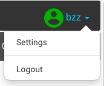
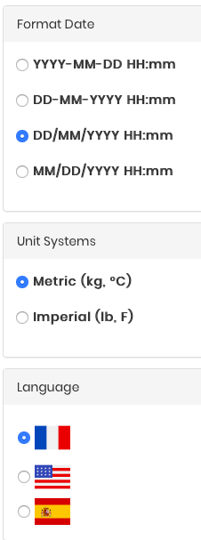
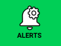
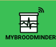

# Mellisphera.com 

## General overview 

Recent video in English: https://www.youtube.com/watch?v=pbCqpf8EY0s

## Mellisphera & BroodMinder

Mellisphera is integrated with BroodMinder. Therefore, you must create an account MyBroodMinder and set up your apiaries / hives on https://mybroodminder.com. This website enables you to assign the sensors to each of your hives and to visualize the measured data. 

You will always have a Mellisphera button on the left-hand menu. Simply click on it to get to Mellisphera. If you have recently logged in, you will be automatically connected without needing to enter your email and password. Otherwise, the email field will be auto-filled. 

Now begins your adventure https://bzz.mellisphera.com/login.

## Login page

On the login page, you have the possibility to connect to a demo apiary if you do not have an account, if you are curious or simply eager for something new. You can read about the relationship between BroodMinder and Mellisphera, and learn about what Mellisphera can get you. 

Regarding the login step, **you must use your BroodMinder IDs**. Once you are logged in, you will have access to the complete history of your sensors. You will have the opportunity to explore the past events and to see the evolution of the season from a completely new angle. The first time you log in, you will be warned that the entire history of your data is being loaded. Your missing data will be loaded at every new connection. 

Let's take a look of Mellisphera different features.

## Home screen 

Once you are connected to Mellisphera, you will access this interface, composed of three areas: 

You can select the apiary to display with the top bar. This is also where you can choose your preferences. On the left side, you can see the different environments of Mellisphera. We will explore them in the next chapters.  

Next to each feature, you will find tooltips. They detail the essential information in order to understand the data. 

## Account settings

In the top right corner of the app, you will have access to your account settings. 

This is where you can reset your password. Please note that this will only change the password for the Mellisphera app. 

You can also set some of your preferences:

- the unit system (metric or imperial)
- the format date
- the language (French, Spanish or English for the moment)
- the weather source

## Apiary overview 

This page is the starting point of Mellisphera. You can select the apiary to explore from the top drop-down menu and then navigate through the main information. 

Your navigation is contextualized on the apiary thanks to a picture that enables you to define the location of your hives. You can place "stickers" underneath, carrying the main information (name, weight, brood, etc.) in order to materialize your hives. 

#### Picture & location 

The first time you connect to the Mellisphera app, you will have the opportunity to add a picture of your apiary. You can drag/drop a file from your favourite file explorer or you can open the contextual menu represented by a camera icon (in the top right corner of the photo frame. 

#### Exporting data

On the picture, you also have an icon for exporting your data. It is an Excel document (csv or .xlx) of your apiary data (hives, sensors, battery, brood, weight) and your last notes. This is very useful during your visits to the apiary. 

#### Picture browsing

Your apiary picture - with its stickers - is associated with a set of buttons placed just above. This navigation bar enables you to visualize contextually some information:

You can activate the "name", "brood", "weight" and "device" buttons. This enables you to display respectively the name, the brood, the weight and the sensors of all your hives below the stickers, on the date displayed on the top right of the screen. The date of the previous day - which corresponds to the last day of data in general - is set by default. You can obviously change this date. 

#### Sensor status

What is special about the sensors is that you can see their status in real time with a color code (grey, red, orange) that determines the status and displays the problem. 

The battery level is systematically calculated. Regarding apiaries that are equipped with a Hub, the signal and connection information are also evaluated. Here is the colour code:

- Grey - everything is normal
- Orange - bad signal or battery to be replaced
- Red - sensor does not emit 

The battery threshold is by default set to 20% but you can modify it in the alert settings. 

The signal and connection information are based on the daily data reading frequency. The quantity and quality of this information is used to determine if there is a disconnection or a bad signal. The first alert is sent 24 hours after the problem started.

#### Coloured stickers

The stickers indicate the health status of each hive with a color code (black, red, orange, green). You can also hover the hive in order to see the message associated with its status. The health status is calculated every day, at the end of the day, by our BFit model. This is why you systematically visualize the day D-1. You can also navigate through the previous days with the date selector in the top right corner of the screen. 

Please note that hives which do not have sensors or those which have no data on day D-1 have a white sticker. 

For more information about our BFit model and how it calculates the hive health status, please refer to the "data interpretation" section. 

#### Apiary calendar of events

You have a specific calendar of events for each of your apiaries. This calendar enables you to track the tasks carried out at the level of the apiary as a whole and to display general observations. The calendar also includes alerts and notifications - we will see how to configure them later - at the apiary level. 

#### Apiary notes

In order to complete the apiary overview, you can write your apiary notes/observations/inspections. This would be placed just below the picture of your apiary. 

In order to add a note, just click on the "+" of the insert, it's very simple! 

You will directly see the note on the calendar of events with this icon: 

### Hive overview

In order to access the hive overview, you should click on its sticker or on its name. The sticker will be surrounded in pink and you will see on the right of the screen three new calendars corresponding to the selected hive.

The displayed data go from the last 5 weeks to the next 3 days - since we can predict 3-day events. 

#### Events

You will see a calendar of events - this time, specific to the selected hive. Apiary and hive events are different. For more precision, please go to the "data interpretation" section. 

#### Brood

You have a global vision of the daily brood evolution with a heatmap calendar. The colours vary from red to green and the percentage from 0 to 100%. For more details about the brood calculation model, please go to the "data interpreration" section. If you have several temperature sensors in your hive, you can check/uncheck the one you want to display. 

#### Productivity 

This calendar offers a global view of the daily weight gain in bubble form. The red color indicates a weight loss and the green color indicates a weight gain. The bubble size is proportional to the weight variation generated by the bees - we remove any possible manipulation of adding/removing material. We will therefore call this "hive productivity". For more details about our model for calculating productivity, please go the "data interpretation" section. You can choose to only display the gains or the losses on the calendar by checking/unchecking the boxes below the calendar. 

#### Notes

It is possible to make annotations on each hive. These notes are separated from your apiary notes and concern only the selected hive. In order to switch back to the apiary mode, just click on the apiary button on the grey navigation bar. 

## Exploring

The **apiary** overview gives an insight of the overall situation. In **explorer**, you can navigate through your data in more detail. You will see a new grey navigation bar with three sections: 'Hive', 'Brood' and 'Data'. By default, you will be in the 'Hive' mode. 

Please note that the data for the last month will be displayed by default. You can obviously change the date at the top right of the screen. You can change and customize this data period as you wish or use the arrows to move through the time period. 

### Hive mode

In the hive mode, you can choose among all the hives of all your apiaries, but please note that you can only select one hive at the time. Once you chose the hive, you will see three calendars. 

**The first calendar** summarizes your hive data. You can choose between different options: 
- Brood 
- Productivity
- Internal maximum temperature
- Internal minimum temperature
- Internal maximum humidity
- External maximum temperature
- External minimum temperature

**The second calendar** reports the events of your hive as well as the moon calendar. 
- Events, annotations and alerts
- Moon calendar

**The third calendar** shows the weather data of your apiary. This calendar is therefore identical for all of your hives that are in this apiary. You will have access to the general 'weather' data:
- External maximum temperature
- External minimum temperature
- External maximum humidity
- External minimum humidity
- Wind
- Precipitation

You also have access to weather forecasts for up to 15 days, depending on the model selected. 
If you do not have any weather data, please refer to the FAQ. For more details about the different models, please refer to the 'Data interpretation' section. 

So you can visualize and switch calendar modes as you wish. Here's an example:

### Brood mode

In the brood mode, you can, this time, **select as many hives as you wish**, even if these hives are situated in two different apiaries. This way you can compare apiaries or hives with each other.

By hovering over it, you will see information about your hives. 

It is  an extremely powerful tool for analysing data over long or short periods of time, on hives that are from the same apiary or from different ones because the analysis benefits from a great flexibility.

### Data mode

In the data mode, you will see your hive raw data: the internal temperature will be displayed at the top of the screen, the weight in the center and the humidity at the bottom (just like on mybroodminder). You can also select as many hives as you wish, even if these hives are situated in two different apiaries. This allows you to compare apiaries or hives between each other.

This tool is very easy to use. The small icons that are on the right side of the graph enable you to zoom in, select areas, move around, view listing data etc. 

## Alerts 

In this section, you will find the functions that enable you to implement a notification and alert service on each of your apiaries. You will also find a new navigation bar which displays the 3 types of alert: 'Hive', 'Weather', 'Sensor' and the 'Settings' button,dedicated to the configuration. 

In this tab, you can see all the alerts concerning your hives. These alert icons can also be found in your hive event calendar. 

You can turn the alerts on and off and change their thresholds thanks to the bar. By default, everything will be activated with auto-adjusted settings. 

You also have an 'i' icon for information. By hovering over it, you will find the alert information. 

### Weather

In this tab, you will see all weather alerts. These alert icons can also be found in your apiary events calendar. 

Here again, you can adjust, deactivate/activate the different alerts. By default, everything will be activated with auto-adjusted settings. 

### Devices

In this tab, you will see the alerts concerning your sensors status but also the stolen hive case. This time, these alert icons won't be displayed on your event calendars. But you can visualize them in 'My Apiary' section when selecting 'Sensor'. Likewise, if the email alerts (next section) is activated, you will be notified of your sensors status. 

Here again, you can adjust, deactivate/activate the different alerts. By default, everything will be activated with auto-adjusted settings. 

### Email settings

In this section, you can configure the email sendings. We strongly recommend you to activate these emails. If you have a Hub, we suggest you to select the daily sending. Otherwise the weekly sending may be sufficient. 

The sending is deactivated by default and your email address is written in the first box. You can add a second email address. In this case, emails will be sent to both addresses. To make sure that the tool is working, you can click on the 'Test email' button: an email will be instantly sent to the registered addresses. If you don't receive it in the next few minutes, please contact support@mellisphera.com. 

In these emails, you will have access to the following information:
- The received alerts since the last time data was sent
- The upcoming events (up to 3 days)
- Your hive status
- Your sensor status

Please note that deactivating an alert will make it disappear from the emails or calendars as from the deactivation date - this action is not retroactive. Likewise, if you modify the thresholds, this will only be effective for upcoming alerts. 

Here is a preview of the kind of email that you may receive:

## MyBroodMinder

If you click on the MyBroodMinder icon, this will redirect you to the MyBroodMinder.com platform. With a single click, you can switch from one platform to the other: on one side MyBroodMinder to manage your apiary / hive / sensor configurations, and on the other side Mellisphera to accurately analyze your data and to be informed in real time about what is happening on your hives.

Please remember that if you make changes to MyBroodMinder, they will be saved when you log in to mellisphera again. 

## Support

It is actually a link to send a message directly to our support team.

Do not hesitate to send us your questions, feedback, experience, improvement ideas and problems. 

You can also email us at: support@mellisphera.com.

## User guide

Click on this link to access the complete user guide: https://doc.mellisphera.com. 

This portal is entirely dedicated to the documentation of our whole system. It is structured in several areas as shown in the image below. 

1. Language choice
2. Documents available
3. Text body
4. Document chapters for quick access
5. Keyword search

Don't hesitate to use the **keyword search**: it is extremely efficient and gives you results on all available documentation.

Here is an example with the 'battery' keyword

