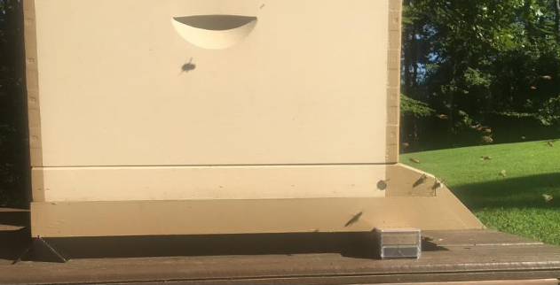
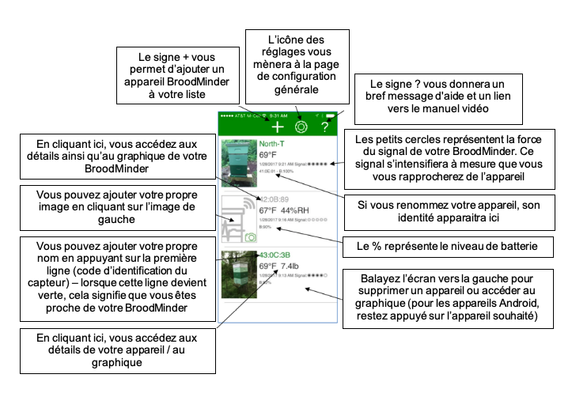
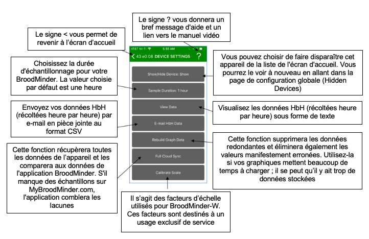
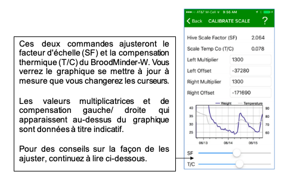
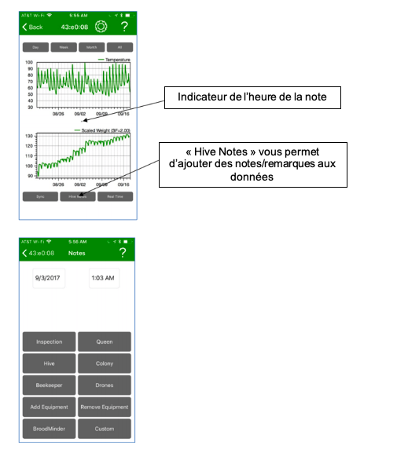
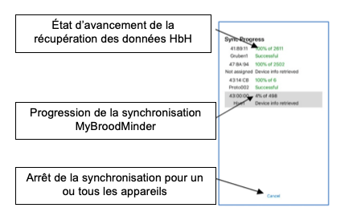
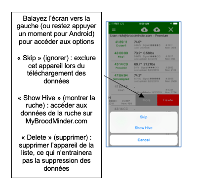
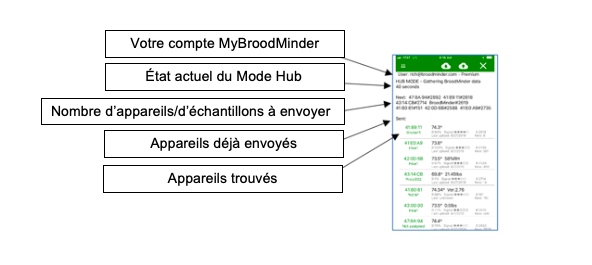
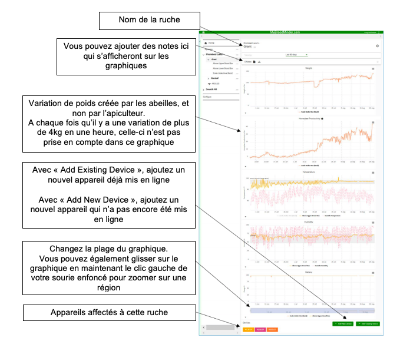

# Broodminder - Notice d'emploi
Septembre 2019 
Version 3.00

BroodMinder – Parce que chaque ruche compte 
## 1.Introduction
### 1.1 Bienvenue
Félicitations pour l’achat de votre produit BroodMinder. Nous sommes heureux que vous ayez rejoint notre mouvement pour améliorer la santé des abeilles et partager des données pour améliorer notre compréhension. Ce manuel est destiné́ à combler les lacunes afin de rendre votre expérience BroodMinder plus agréable et productive. 
Si vous avez encore des questions ou des suggestions, ou si vous voulez simplement discuter des abeilles, contactez-nous à support@broodminder.com . Nous sommes là pour aider. 

### 1.2 Quoi de neuf?
Dans cette mise à jour, vous trouverez de nombreux changements dans les applications ainsi que dans MyBroodMinder.
- L&#39;application BroodMinder – Standard
  - L&#39;ajout de « Whack-A-Mite ». Allez y jeter un coup d&#39;œil !
  - Le support pour BroodMinder-T2SwarmMinder (bientôt disponible)
- L&#39;application BroodMinder – Apiary
  - Toutes les informations disponibles à distance – l&#39;application fonctionne désormais avec ou sans connexion internet
  - Le mode Hub – vous pouvez utiliser tout appareil (iOS ou Android) connecté à internet pour envoyer des données toutes les 10 minutes depuis votre rucher
  - L&#39;activation de BroodMinder-CELL –dispositif qui peut être tiré d&#39;un profond sommeil
- Le site MyBroodMinder.com – en juillet 2019, nous vous avions présenté une nouvelle version du site avec
  - Une nouvelle expérience utilisateur
    - L&#39;ensemble des ressources BroodMinder, dont un manuel d&#39;aide sous forme d&#39;une vidéo sur la page d&#39;accueil
    - Une navigation entre les différentes ruches et ruchers améliorée
    - Un partage des ruchers simplifié
  - Des modes Texte/Ruche/Sommaire à échelle du rucher
  - Un puissant gestionnaire de configuration
    - Déplacement du dispositif entre les ruches facilité
    - Inventaire des visualisations et téléchargements
  - Un visualiseur de données / éditeur d&#39;anomalies
  - Une plateforme de surveillance
### 1.3 Démarrage rapide si vous envisagez de partager vos données (MERCI !) 
Nous avons fait de notre mieux pour rendre l&#39;installation et l&#39;utilisation de votre BroodMinder intuitive et facile. Voici les étapes de base que nous examinerons plus en détail ci-dessous.

**Visionnez le manuel d&#39;aide vidéo que vous trouverez ici** : MyBroodMinder.com

**Téléchargez l&#39;application BroodMinder – Apiary** sur votre téléphone portable ou votre tablette. Vous trouverez 3 différentes applications, choisissez « Apiary ». Vous trouverez la description des autres applications ci-dessous ainsi que dans le manuel d&#39;aide vidéo.

**Créez votre compte MyBroodMinder** en allant sur le site MyBroodMinder.com. Poursuivez en créant le(s) rucher(s) et ruche(s) si vous avez le temps (sinon, vous pourrez compléter cette étape une fois l&#39;installation terminée). Vous recevrez en retour une offre d&#39;essai gratuite de 30 jours à MyBroodMinder.com-Premium.

**Activez la pile** de votre appareil BroodMinder en tirant sur la languette (BroodMinder-TH) ou en l&#39;enfonçant (BroodMinder-W) ou encore en poussant le bouton (BroddMinder-T2)

**Installez votre BroodMinder** dans votre ruche.

a. Placez un BroodMinder-TH ou T2 au-dessus des cadres du corps inférieur de la ruche.

b. Placez un second BroodMinder TH au-dessus des cadres du corps supérieur de la ruche.

c. Placez votre BroodMinder-W sous l&#39;avant de la ruche avec un tasseau de 2x4cm sous l&#39;arrière (ou inversement). Placez le BroodMinder du côté ombragé afin que la lecture de la température extérieure ne soit pas affectée par le soleil.

**Ouvrez l&#39;application** et attendez que votre BroodMinder apparaisse.

a. Allez dans les réglages (icône d&#39;engrenage) et entrez vos informations MyBroodMinder.com.

b. Revenez sur la liste des appareils.

**Récupérez les données heure par heure (HbH)** après que BroodMinder ait fonctionné pendant quelques heures (si vous n&#39;avez pas de connexion internet, rendez-vous dans la section correspondante sur l&#39;application pour plus d&#39;informations).

a. Cliquez sur l&#39;icône du Cloud avec la flèche du haut, située dans le coin supérieur droit de votre écran.

b. L&#39;application vous présentera une page d&#39;état d&#39;avancement et commencera à collecter les données de vos BroodMinders. Vous pouvez tout à fait travailler sur vos ruches le temps de la synchronisation automatique de vos données.

**Partagez vos données avec le monde.**

a. Une fois la synchronisation terminée, vous serez invité à envoyer vos données sur le cloud. Nous espérons que vous le ferez car cela profitera à l&#39;ensemble de la communauté́ apicole.

b. La première fois, il vous sera demander un e-mail et un mot de passe. L&#39;application utilisera ces informations pour créer ou utiliser un identifiant MyBroodMinder.com existant.

c. Ensuite, vous identifierez le rucher / ZIP et la ruche dans lesquels se trouve l&#39;appareil.
d. Enfin, les données seront envoyées à MyBroodMinder.com. 

Notez que les étapes de a. à c. ne se produisent que la première fois que vous envoyez des données.

**Ça y est, vous faites maintenant partie de la solution !**

**Soyez sûr et partagez**
   vos données de ruche avec vos amis en utilisant notre visionneuse de domaine public sur **BeeCounted.org**
### 1.4 Démarrage rapide si vous envisagez de conserver vos données privées  
Nous avons fait de notre mieux pour rendre l&#39;installation et l&#39;utilisation de votre BroodMinder intuitive et facile. Voici les étapes de base que nous examinerons plus en détail ci-dessous.

**Visionnez le manuel d&#39;aide vidéo que vous trouverez ici** : MyBroodMinder.com

**Téléchargez l&#39;application BroodMinder – Standard** sur votre téléphone portable ou votre tablette. Vous trouverez 3 différentes applications. Si vous avez un appareil iOS (Apple), choisissez BroodMinder.For.  Si vous avez un appareil Android, choisissez BroodMinderLite. Ne choisissez pas BroodMinder Apiary ou BroodMinder Cell. Vous trouverez leur description ci-dessous.

**Créez votre compte MyBroodMinder** en allant sur le site MyBroodMinder.com. Poursuivez en créant le(s) rucher(s) et ruche(s) si vous avez le temps (sinon, vous pourrez compléter cette étape une fois l&#39;installation terminée). Vous recevrez en retour une offre d&#39;essai gratuite de 30 jours à MyBroodMinder.com-Premium.

**Activez la pile** de votre appareil BroodMinder en tirant sur la languette (BroodMinder-TH) ou en l&#39;enfonçant (BroodMinder-W) ou encore en poussant le bouton (BroddMinder-T2)

**Installez votre BroodMinder** dans votre ruche.

a. Placez un BroodMinder-TH ou T2 au-dessus des cadres du corps inférieur de la ruche.

b. Placez un second BroodMinder TH au-dessus des cadres du corps supérieur de la ruche

c. Placez votre BroodMinder-W sous l&#39;avant de la ruche avec un tasseau de 2x4cm sous l&#39;arrière (ou inversement). Placez le BroodMinder du côté ombragé afin que la lecture de la température extérieure ne soit pas affectée par le soleil.

**Ouvrez l&#39;application** et attendez que votre BroodMinder apparaisse.

**Récupérez les données heure par heure (HbH)** après que BroodMinder ait fonctionné pendant quelques heures.

a. Appuyez sur la partie texte pour afficher la page du graphique.

b. Appuyez sur SYNC pour récupérer les données.

c. Vous devriez voir les données sur le graphique.

Envoyez vos données par e-mail depuis la page réglages de l&#39;application (optionnel)
## 2. Installation de votre BroodMinder – Emplacements 
### 2.1 Emplacements des capteurs
Le pack Citizen Science contient deux dispositifs BroodMinder-TH (Température et Humidité) ou BroodMinder-T2 (Température seulement) ainsi qu’une balance de ruche BroodMinder-W. Voici où installer ces appareils : 

### 2.2 BroodMinder-TH  
Tous les appareils BroodMinder-TH ont un identifiant qui commence par 42 – ils devraient donc être faciles à reconnaitre. Le capteur est normalement placé au-dessus des cadres, près du centre du corps de la ruche qui vous intéresse. Cette position est choisie pour plusieurs raisons :

- La chaleur monte, donc le capteur sentira la chaleur de la couvée située en dessous
- La couvée tend vers le milieu de la ruche et l&#39;entoure de pollen et de miel. Placer le capteur de température à cet endroit optimise donc les chances de détecter le couvain
- L&#39;utilisation de cette position standardisée permet des croisements et comparaisons entre les ruches à travers le monde

Si vous êtes situé dans un territoire au climat froid et que mettez à l&#39;hivernage plus de deux essaims, vous pouvez alors remonter les capteurs. En effet, l&#39;essaim se déplaçant au-dessus d&#39;un capteur, ce dernier aura alors tendance à détecter la température extérieure (car la chaleur monte).

En plaçant le capteur BroodMinder-TH juste en-dessous du couvre-cadre, vous détecterez la chaleur de la ruche entière. En atteignant les 100%, la condensation devient très probable. Il serait alors intéressant d&#39;inspecter la ruche et de prendre les mesures appropriées si nécessaire.

Remarque : L&#39;humidité relative (HR) dépend à la fois de l&#39;humidité de l&#39;air et de la température. L&#39;humidité relative augmente à mesure que la température baisse. Par exemple, lorsque HR = 100%, il se forme alors de la rosée. Et il se passera la même chose dans votre ruche.

Si vous remontez le BroodMinder-TH, il serait alors judicieux de déplacer également l&#39;autre BroodMinder-TH juste en dessous corps supérieur de la ruche. De cette façon, vous verrez comme l&#39;essaim remonte.

Pour terminer, le BroodMinder-TH est suffisamment fin pour que vous puissiez le placer dans différentes positions (entre les cadres par exemple). Nous aimerions savoir comment cela fonctionne pour vous et ce que vous en apprenez.

Quelle que soit la position du capteur choisie, vous pouvez ajouter un marqueur aux données grâce à l&#39;application BroodMinder. Nous aborderons ce sujet dans un chapitre ultérieur.

La pile CR2032 est remplaçable en ouvrant l&#39;emballage. Elle dure en moyenne plus d&#39;un an mais nous recommandons un remplacement à chaque automne, avant les basses températures de l&#39;hiver.

### 2.3 BroodMinder-T2

Tous les appareils BroodMinder-T2 ont un identifiant qui commence par 41 – ils devraient donc être faciles à reconnaitre. Le BroodMinder-T2 ( **Température** ) est une version à prix réduit du BroodMinder-TH. Il détectera la température de la ruche qui indiquera le développement du couvain durant la saison ainsi que sa survie hivernale. Placez-le au-dessus de l&#39;endroit où vous pensez qu&#39;il y aura le plus de couvain. Durant l&#39;hiver, nous vous conseillons de le placer sur les cadres du corps supérieur de la ruche afin qu&#39;il puisse prendre toute la chaleur montante de l&#39;essaim.

Afin de mettre en marche le BroodMinder-T2, appuyez sur le bouton pendant 5 secondes. **La LED clignotera pendant une minute pour indiquer le succès de l&#39;opération. SI VOUS NE MAINTENEZ PAS LE BOUTON ASSEZ LONGTEMPS, VOTRE T2 S&#39;ETEINDRA AU BOUT DE 10 SECONDES ENVIRON.** Pour vous assurer que le T2 est en marche, appuyez une nouvelle fois sur le bouton et la LED se mettra à clignoter momentanément, ce qui indique le bon état de la pile ainsi que le fonctionnement de l&#39;appareil.

Pour changer la pile, coupez simplement le ruban adhésif sur trois côtés autour du circuit imprimé. Puis faites pivoter le circuit et remplacez la pile avec une nouvelle CR2032. Assurez-vous de bien resceller le circuit imprimé en utilisant du ruban adhésif.

Si vous souhaitez éteindre le T2, nous vous conseillons de le faire avec l&#39;application BroodMinder.

- Trouvez l&#39;appareil et sélectionner l&#39;écran du graphique
- Sélectionnez la page de configuration (icône d&#39;engrenage dans le coin supérieur droit de l&#39;écran)
- Sélectionnez Taux d&#39;Échantillonnage puis cliquez sur « éteindre ». Cette opération n&#39;est possible que pour les appareils T2
- Retournez au graphique et synchronisez l&#39;appareil. Une fois fini, le T2 sera éteint

### 2.4 BroodMinder-W

Le BroodMinder-W ( **Poids** ) se place sous la ruche. Il existe un rapport détaillé sur la façon dont on positionne la balance (annexe A). C&#39;est très intéressant à lire mais si vous manquez de temps, voici l&#39;essentiel.

La pile CR2032 est remplaçable. Elle dure en moyenne plus d&#39;un an mais nous recommandons un remplacement à chaque automne, avant les basses températures de l&#39;hiver.

Remarque : un support inadapté sous la balance constitue la source d&#39;erreur la plus commune. En effet, cela pourrait conduire à d&#39;étranges résultats dus à la flexibilité de la ruche qui s&#39;étend et se contracte sous les effets du soleil, de la pluie, des changements de températures, etc. Un support plat donnera de meilleurs résultats. Une solution simple consiste à placer une feuille de contreplaqué de 2cm d&#39;épaisseur (ou équivalent) sous la balance.

Remarque supplémentaire : si vous ne souhaitez surveiller que la miellée, un bon support sous la balance n&#39;est pas nécessaire. Il vous faudra simplement ignorer les variations quotidiennes. Vous serez toujours en mesure d&#39;observer l&#39;évolution générale du poids.

#### 2.4.1 Placer la balance à l&#39;ombre

Le BroodMinder-W dispose d&#39;un capteur de température à l&#39;intérieur duquel est lue la température locale. Pour que la température soit précise, la balance doit être placée à l&#39;abri du soleil direct. Cette prise de température est également utilisée pour compenser les capteurs de poids afin d&#39;éviter les pics de température créés par l&#39;ensoleillement direct et ainsi améliorer les performances.

Placer la balance à l&#39;ombre permettra également de prolonger la durée de vie de son emballage. Nous utilisons du plastique résistant aux UV, mais en plein soleil, même celui-ci se dégradera au fil du temps. Si cela se produit, il est possible de commander un nouvel emballage sur BroodMinder.com.

#### 2.4.2 Obtenir le niveau de BroodMinder-W

Même si nous avons fait de notre mieux pour simplifier au maximum l&#39;installation, vous devez tout de même rester attentif à quelques éléments :

Tout d&#39;abord, assurez-vous que la ruche soit de niveau. Pas forcément _parfaitement_ de niveau, mais si votre ruche ressemble à tour de Pise, alors vous n&#39;obtiendrez pas de bons résultats. Vos meilleurs alliés seront des cales en bois (d&#39;environ 4x9cm chacune). En les utilisant de manière adaptée, vous pourrez mettre n&#39;importe quoi de niveau ! Nous pouvons également constater que visser les cales entre elles permet d&#39;obtenir une meilleure stabilité.

Une fois le BroodMinder -W installé, regardez au bout de celui-ci. À travers le couvercle en plastique, (souvenez-vous... il faut l&#39;installer _avec_ le couvercle en plastique), vous pourrez voir la pièce supérieure en bois et la pièce inférieure en aluminium. Assurez-vous qu&#39;elles ne se touchent pas : cela permettra de garantir que l&#39;ensemble du poids repose sur les deux petits boutons situés au-dessus de la base en aluminium, et non ailleurs.

#### 2.4.3 Installation type (moins précise)

En utilisant l&#39;installation type, vous pourrez voir de petits changements dans la ruche, mais le degré de précision des résultats ne sera pas absolu. Afin d&#39;obtenir plus de précision, reportez-vous à la section suivante.

Le BroodMinder-W est conçu pour mesurer la moitié du poids de la ruche. Pour ce faire, vous devez surélever un côté de la ruche (à l&#39;avant ou à l&#39;arrière, du côté gauche ou du côté droit) à l&#39;aide d&#39;une cale (de 4x9cm ou équivalent). Nous vous recommandons toutefois d&#39;utiliser une cornière en aluminium de 50mm de profondeur. En la plaçant de façon à ce que l&#39;angle de la cornière pointe vers le haut, vous obtiendrez un point de pivotement très précis. Vous en trouverez facilement en magasin de bricolage ou en quincaillerie. L&#39;avantage de l&#39;aluminium est qu&#39;il ne rouille pas.

Le BroodMinder-W sera donc placé sous le côté opposé.

Vous trouverez une explication mathématique et physique plus détaillée dans l&#39;annexe A, mais elle se résume à ceci. Essayez de placer le support et la balance directement sous les parois du corps de la ruche : cela donnera de meilleurs résultats.

#### 2.4.4 Installation améliorée (plus précise)

Cette installation améliorée nécessitera d&#39;apporter quelques modifications au plateau du fond, notamment quelques petites coupes. Elles permettront de placer et de pouvoir replacer de façon répétée dans le temps la balance et son support avec précision.

Tout d&#39;abord, nous vous recommandons d&#39;utiliser une cornière en aluminium de 50mm de profondeur. En la plaçant de façon à ce que l&#39;angle de la cornière pointe vers le haut, vous obtiendrez un point de pivotement très précis. Vous en trouverez facilement en magasin de bricolage ou en quincaillerie.

Maintenant, passons aux coupes du plateau du fond. Pour cette installation, nous vous recommandons de placer les cales à l&#39;avant ou à l&#39;arrière plutôt que sur les côtés. C&#39;est maintenant à vous de décider de l&#39;emplacement du BroodMinder-W :  sous le devant ou sous l&#39;arrière de la ruche.

Il est préférable de placer le BroodMinder-W à l&#39;abri du soleil. En effet, le soleil fera chauffer la balance, qui vous donnera une lecture erronée de la température extérieure. Le placer du côté ombragé de la balance vous évitera ce problème et permettra également de préserver son emballage plus longtemps.

Ensuite, vous allez couper le plateau du fond. Pour le côté de la cornière aluminium, vous découperez une rainure de la largeur de votre lame de scie dans laquelle la pointe de l&#39;angle viendra s&#39;insérer. Pour le côté de la balance, vous découperez la paroi du corps de la ruche en faisant une entaille de 5cm de largeur (largeur de la balance) sur 0,25cm de profondeur afin que celle-ci puisse s&#39;emboiter facilement dans le corps de la ruche. Voir les images ci-dessous.

## 3. Entretien régulier
Nos appareils ne nécessitent pas beaucoup d&#39;entretien. Merci de noter que si vos piles durent moins de 6 mois, ceci est anormal. Dans ce cas, contactez-nous à [support@BroodMinder.com](mailto:support@BroodMinder.com) pour un remplacement ou une remise à neuf.

### 3.1 Au printemps

Une vidéo sur l&#39;entretien à effectuer au printemps est disponible sur mybroodminder.com/resources

Le printemps est le moment idéal pour nettoyer vos appareils. Pour cela, vous pouvez utiliser de l&#39;acool isopropylique ou éthylique à 95% et plus, qui n&#39;endommageront pas l&#39;électronique.

Vous pouvez placer les emballages au congélateur : la propolis se rompra plus facilement.

**Assurez-vous que l&#39;emballage de la balance n&#39;est pas fissuré. La pluie pourrait pénétrer à l&#39;intérieur et endommager les capteurs.** Vous pouvez sceller toute fissure à l&#39;aide de ruban adhésif.

Nous avons également des emballages de remplacement pour tous nos produits, disponibles sur notre site internet BroodMinder.com

### 3.2 A l&#39;automne

Avant l&#39;arrivée de l&#39;hiver, changez toutes les piles de vos BroodMinders. Vous pouvez en acheter facilement et à petit prix sur Amazon.com ou Digikey.com. Toutes les piles sont de type CR2032.

**Assurez-vous que l&#39;emballage de la balance n&#39;est pas fissuré. La pluie pourrait pénétrer à l&#39;intérieur et endommager les capteurs.** Vous pouvez sceller toute fissure à l&#39;aide de ruban adhésif ou commander un nouvel emballage sur BroodMinder.com.

## 4. Mises à jour des logiciels

Les mises à jour pour le Hub BroodMinder et les BroodMinder-T2 se font automatiquement par OTA (Over-The-Air, soit sans fil). Elles sont effectuées par l&#39;application Apiary ou l&#39;application Cell. Pour plus d&#39;informations, cliquez sur ce lien : mybroodminder.com/resources

## 5. L&#39;application BroodMinder

### 5.1 Compatibilité des appareils

Nous avons conçu l&#39;application BroodMinder pour fonctionner avec la plupart des appareils iOS (iPhone, iPad) et Android. Nous testons notre logiciel sur de nombreux appareils.

#### 5.1.1 Apple – iOS

L&#39;application BroodMinder fonctionne avec tous les appareils Apple dotés de la technologie Bluetooth Low Energy (BLE). Il fonctionnera avec les modèles iPhone 4 ou plus récents ainsi qu&#39;avec les iPads de 3ème génération ou plus récents.

#### 5.1.2 Android

Pour Android, c&#39;est un peu plus compliqué. Android a introduit le support BLE dans sa version 4.3 (Jelly Bean, juillet 2012). Les appareils plus anciens ne fonctionneront pas. La plupart des nouveaux appareils (2015 ou plus récents) fonctionnent. Cependant, il existe de nombreux modèles de téléphone et nous en avons trouvé́ quelques-uns qui posent problème. Si votre appareil ne fonctionne pas, contactez- nous à l&#39;adresse support@BroodMinder.com.

Une nouvelle fonctionnalité a été ajoutée à l&#39;application dans la version 2.97 dans le but d&#39;augmenter le « taux d&#39;annonce » de vos appareils BroodMinder. Tel qu&#39;expédié, le BroodMinder est programmé pour envoyer un message transmettant les données de température et de poids toutes les 5 secondes. La page de configuration générale est désormais dotée d&#39;une section de configuration Bluetooth qui vous permet de passer le taux d&#39;annonce à 1 message par seconde. Cela vous permettra d&#39;accélérer la connexion des appareils ainsi que la récupération des données. Cependant, cette manipulation réduira la durée de vie de la pile à 3-6 mois.

Nous avons également ajouté l&#39;option « Réinitialiser Bluetooth Android » en-dessous de la section de configuration Bluetooth. Cela permettra de réinitialiser la fonction Bluetooth. En effet, nous avons constaté que sur certains modèles de téléphone, cette manipulation aide à rétablir la communication.

Vous trouverez plus d&#39;informations sur MyBroodMinder.com/resources

### 5.2 Installation

L&#39;application BroodMinder est disponible sur l&#39;App Store d&#39;Apple, sur le Play Store Android ou encore sur le Play Store Amazon, en fonction de votre appareil. Si vous recherchez « BroodMinder » (BroodMinder Lite sur Android), vous le trouverez. Installez-le comme n&#39;importe quelle autre application.

Une fois installée, démarrez l&#39;application. Un message de bienvenue et de félicitations devrait apparaitre en ouvrant l&#39;application. Vous pouvez choisir de regarder notre Queen Bee, Laura Davis, vous faire une démonstration de l&#39;installation ou vous pouvez ignorer ce message et laisser l&#39;application faire son travail.

L&#39;application commencera à rechercher les appareils BroodMinder présents dans la zone et remplira automatiquement l&#39;écran avec tous ceux qu&#39;elle trouvera dans la zone.

Si aucun appareil n&#39;apparait :

- Assurez-vous que la languette de la pile a été retirée du BroodMinder-TH et que la pile est bien en place sur le BroodMinder-W.
- Assurez-vous que le Bluetooth est activé sur votre téléphone / tablette.
- Assurez-vous de vous tenir à une distance de 3 à 6 m de votre dispositif BroodMinder.

### 5.3 Écran d&#39;accueil de l&#39;application BroodMinder

BroodMinder-T affichera la température
BroodMinder-TH affichera la température et le taux d&#39;humidité
BoordMinder-W affichera la température et le poids

### 5.4 Détails / Graphique de l&#39;application BroodMinder

### 5.5 Page de configuration générale

### 5.6 Page de configuration de l&#39;appareil

### 5.7 Mode Temps Réel

Si vous souhaitez voir vos données en temps réel, vous pouvez utiliser le bouton « Real Time » sur l&#39;écran du graphique. En pressant ce bouton, le taux d&#39;échantillonnage passera à 5 secondes et vous verrez apparaitre des valeurs dans la partie inférieure de l&#39;écran.

B : niveau de la pile

T : température (actuellement uniquement disponible en Fahrenheit :1°F = -17°C)

H : humidité relative (en%)

L/R : équilibre entre les capteurs de droite et de gauche. S&#39;ajoute à 100% (balance BroodMinder-W uniquement)

W : poids total (actuellement uniquement disponible en livre : 1 livre = 453 g) (balance BroodMinder-W uniquement)

Delta : variation de poids depuis le lancement du temps réel (balance BroodMinder-W uniquement)

Ces données seront également enregistrées dans le fichier de suivi.

Ré-appuyer sur le bouton « Real Time » permettra de ce mode et fera repasser automatiquement le taux d&#39;échantillonnage à 1 heure.

### 5.8 Réglage du facteur d&#39;échelle BroodMinder-W

Par défaut, le facteur d&#39;échelle du BroodMinder-W est fixé à 2.0. Cela signifie que tout poids observé par le BroodMinder-W sera doublé afin de refléter le poids total de la ruche. En regardant les caractéristiques de la situation (annexe ci-dessous), nous savons qu&#39;il s&#39;agit d&#39;une approximation, qui n&#39;est donc pas totalement exacte. Dans la plupart des cas, elle est suffisamment proche de la réalité car de petits changements seront encore visibles et une erreur à 5-10% du poids total n&#39;est pas importante.

Un affichage plus précis du poids total peut être obtenu en ajustant le facteur d&#39;échelle pour tenir compte de la situation spécifique de la ruche.

Allez à l&#39;écran du graphique de l&#39;échelle et appuyez sur le bouton « Real Time ». En quelques secondes, l&#39;application affichera le relevé de la balance toutes les 5 secondes en bas de l&#39;écran. Vous pouvez également voir le % de charge sur chaque cellule de charge.

Ajoutez maintenant un poids (entre 4 et 10 kg) sur la ruche et centrez-le. Vous devriez voir le poids changer en fonction sur l&#39;application. Vous pouvez ensuite ajuster le facteur d&#39;échelle pour qu&#39;il corresponde exactement au changement de poids effectué.

**Exemple :**

| **Poids** | **Poids delta** | **Facteur d&#39;échelle** | **Notes** |
| --- | --- | --- | --- |
| 121.2 | 0.0 | 2.0 | Lancement du temps réel |
| 132.2 | 11.0 | 2.0 | Ajout du poidsChangement du facteur d&#39;échelle |
| 129.5 | 10.0 | 1.82 | Calibrage plus proche |
| 117.0 | 0.0 | 1.82 | Enlèvement du poidsPoids de la ruche plus précis |

### 5.9 Réglage de la compensation thermique du BroodMinder-W

Les capteurs présents dans le BroodMinder-W sont de très grande qualité et présentent peu d&#39;effet de la température. Cependant, il peut toujours y avoir des variations d&#39;une balance à l&#39;autre. C&#39;est pourquoi nous vous proposons un moyen d&#39;améliorer la précision des résultats grâce au réglage de la compensation thermique de la balance – « Scale TempCo ».

Pour ajuster le TempCo, choisissez une portion de votre graphique de poids pour laquelle vous savez qu&#39;il n&#39;y a que peu de changement en raison de l&#39;activité des abeilles. Un jour nuageux est le moment idéal car nous savons qu&#39;elles ne butinent pas. Il serait également intéressant de choisir un jour où la température extérieure varie d&#39;au moins 6°C au cours de la journée.

En apportant de petites modifications à la valeur TempCo, vous verrez le graphique s&#39;équilibrer pour donner un poids uniforme comme on pourrait s&#39;y attendre.

Si vous constatez des pics de poids même après ajustement, c&#39;est probablement parce que la balance est exposée au soleil. Le soleil peut chauffer la balance assez rapidement et de façon spectaculaire. Il sera donc très difficile pour le TempCo d&#39;être efficace.

### 5.10 Marquage des graphiques

En appuyant sur « Hive Notes », vous pourrez ajouter du texte à tout moment sur le graphique. C&#39;est particulièrement utile pour expliquer un brusque changement dans les données récoltées ou encore indiquer une inspection de la ruche.

Appuyer sur ce bouton fera apparaître un sous-menu composé de huit groupes d&#39;évènements ou d&#39;actions possibles. Sélectionnez le groupe le plus approprié à votre situation et choisissez la balise correspondante. Choisissez le groupe « Custom » (personnaliser) si les groupes de liste ne couvrent pas votre cas. Les sélections dans l&#39;application seront mises à jour au fil du temps pour refléter au mieux les balises les plus utilisées.

L&#39;heure indiquée dans la partie haute de l&#39;écran correspond à l&#39;heure actuelle si les graphiques n&#39;ont pas été déplacés par pincement ou balayage, avant d&#39;avoir appuyé sur le bouton &quot;Tag Graph&quot; n&#39;ait été enfoncé. Le temps peut être ajusté en cliquant simplement dessus.

Lorsque vous notez un évènement passé, il serait pertinent de déplacer le graphique pour aligner l&#39;heure de l&#39;évènement avec le « Note Time Indicator », avant d&#39;appuyer sur « Hive Notes ». Dans ce cas, l&#39;heure qui s&#39;affichera dans la partie haute de l&#39;écran correspondra à l&#39;heure du « Note Time Indicator » et non l&#39;heure actuelle.

Le bouton « Inspection » présente un intérêt particulier. En appuyant sur ce bouton, vous serez amené à répondre à six questions faciles sur l&#39;état de votre ruche. C&#39;est Dick Rogers qui nous a partagé́ ces questions et nous pensons que c&#39;est un moyen rapide et efficace de documenter la ruche.

## 6. L&#39;application BroodMinder – APIARY

Présentée en 2018, BroodMinder-APIARY est notre application la plus puissante. Cette dernière détecte tous vos appareils BroodMinder et télécharge les données récoltées de votre rucher directement dans MyBroodMinder avec une simple touche. Elle peut également être utilisée afin d&#39;envoyer automatiquement vos données en direct à MyBroodMinder.com toutes les 10 minutes.

Une fois vos données transférées, leur analyse et leur notation peuvent se faire directement sur MyBroodMinder.com. Nous vous le recommandons pour sa facilité d&#39;utilisation.

Veuillez noter que cette application stocke uniquement vos données récoltées heure par heure dans le cloud mais ne conserve pas une copie sur votre téléphone et/ou tablette.

De nouvelles fonctionnalités ont été ajoutées en 2019 :

  - Toutes les informations sont disponibles à distance – l&#39;application fonctionne désormais avec ou sans connexion internet
  - Le mode Hub – vous pouvez utiliser tout appareil (iOS ou Android) connecté à internet pour envoyer des données toutes les 10 minutes depuis votre rucher
  - L&#39;activation de BroodMinder-CELL –dispositif qui peut être tiré d&#39;un profond sommeil

Cette application, qui vous permet de gagner beaucoup de temps grâce à la collecte de données à partir de vos appareils, a tout de même une réserve. Vous devez posséder MyBroodMinder Premium pour pouvoir télécharger automatiquement les données de tous vos appareils et pour pouvoir utiliser le mode Hub. Afin de pouvoir tester toutes les fonctionnalités de la version Premium, vous avez la possibilité d&#39;utiliser l&#39;application gratuitement pendant 30 jours après la création de votre compte MyBroodMinder.

Nous avons décidé de rendre la version Premium payante afin d&#39;assurer un petit revenu à notre équipe informatique BroodMinder. En effet, ils travaillent très dur pour créer et gérer les sites internet MyBroodMinder et BeeCounted.org. L&#39;application BroodMinder – Standard restera toujours gratuite. De même, le téléchargement de données sur MyBroodMinder à partir de l&#39;application standard restera toujours gratuit.

Vous pouvez utiliser l&#39;application Apiary indéfiniment pour télécharger les données de vos appareils. Elle est très utile car il s&#39;agit d&#39;un logiciel plus récent, donc le processus de téléchargement est plus simple que dans l&#39;application originale.

L&#39;utilisation de l&#39;application est super simple :

1. Rendez-vous sur MyBroodMinder.com et créez votre compte gratuitement

2. Téléchargez BroodMinder-Apiary à partir de l&#39;app store

3. Lancez l&#39;application, cliquez sur l&#39;icône d&#39;engrenage (page de configuration) et entrez vos identifiants MyBroodMinder

4. Retournez à l&#39;écran de la liste et dans quelques secondes, tous les appareils BroodMinder présents dans la zone s&#39;afficheront automatiquement à l&#39;écran

5. Une fois que les identifiants de vos appareils BroodMinder sont devenus verts, cliquez sur l&#39;icône en forme de nuage située dans le coin supérieur droit de l&#39;écran pour commencer le téléchargement des données sur MyBroodMinder

6. L&#39;application vous montrera l&#39;état de progression du téléchargement. La ligne supérieure indique l&#39;état d&#39;avancement de la collecte des données. La ligne inférieure montre le transfert de ces dernières vers MyBroodMinder

7. Une fois que tous les appareils ont été enregistré et que toutes les données ont été téléchargées, un message apparaitra pour vous indiquer que le transfert est terminé

Une fois le transfert terminé, les données s&#39;afficheront dans MyBroodMinder. Si vous avez déjà configuré vos appareils, il vous suffit de regarder le résultat. S&#39;il s&#39;agit de nouveaux appareils, vous devrez les trouver sur MyBroodMinder « Device Inventory » (inventaire des appareils) et de les attribuer à un rucher puis à une ruche. Allez à la section suivante pour plus d&#39;informations à ce sujet.

**Écran de la liste des appareils**

**Écran de progression**

**Écran des détails de l&#39;appareil**

**Écran des options**

**Menu des paramètres**

**Menu de configuration générale**

- Vider manuellement la mémoire des appareils : si votre appareil BroodMinder fonctionne depuis longtemps (plus de 9 mois), il se peut que la mémoire soit pleine. Si c&#39;est le cas, l&#39;application Apiary se réinitialisera automatiquement afin de pouvoir stocker davantage de données. Si vous souhaitez contrôler cette étape manuellement, appuyez sur ce bouton

- Connexion rapide : ce bouton permettra d&#39;accélérer le temps de connexion en accélérant le « taux de collecte ». Cela signifie que l&#39;appareil BroodMinder enverra un signal toutes les secondes au lieu de toutes les 5 secondes. L&#39;inconvénient de cette option est qu&#39;elle réduit la durée de vie de la pile. Il est possible d&#39;accélérer la connexion durant l&#39;été et de la ralentir durant l&#39;hiver

- Synchronisation des appareils à distance : vous pouvez récupérer vos données même lorsqu&#39;il n&#39;y a pas de connexion internet ou de couverture cellulaire dans votre rucher.

    - Avant de vous rendre à votre rucher, allez sur l&#39;application à l&#39;écran de la liste des appareils et cliquez sur l&#39;icône de nuage flèche descendante. Cela permettra le téléchargement de la liste de tous vos appareils ainsi que des données récupérées lors de la dernière synchronisation. Si vous passez cette étape, c&#39;est l&#39;ensemble de vos données qui sera récupéré depuis votre BroodMinder : ça pourrait représenter une année entière de données !

    - Une fois sur le terrain, procédez à la synchronisation de vos appareils comme d&#39;habitude. Le téléchargement échouera mais c&#39;est normal vu que vous n&#39;avez pas d&#39;accès à internet

    - Lorsque vous revenez à la civilisation, relancez l&#39;application qui vous suggèrera de procéder au téléchargement vers le cloud. Faites-le et MyBroodMinder.com sera mis à jour.

- Mode Hub

Le mode Hub vous permet d&#39;utiliser un vieux modèle de téléphone/tablette pour l&#39;envoi automatique de vos données BroodMinder sur MyBroodMinder toutes les 10 minutes. De cette façon, vous pouvez suivre l&#39;état de vos abeilles 24/24h 7/7j depuis n&#39;importe où dans le monde.

Il vous suffit d&#39;autoriser le Mode Hub et de revenir à l&#39;écran de la liste de vos appareils :

## 7. Stockage dans le Cloud MyBroodMinder.com

Le véritable pouvoir du mouvement BroodMinder réside dans le regroupement et le stockage de données provenant de milliers de ruches à des fins publiques sur MyBroodMinder.com.

Nous avons fait de notre mieux pour rendre le transfert des données aussi simple que possible. **Depuis l&#39;application BroodMinder, il vous suffit d&#39;appuyer sur le bouton Sync et de répondre à quelques questions**. L&#39;application s&#39;occupera pour vous de créer un nouveau compte MyBroodMinder et de vous fournir tout le nécessaire pour démarrer. Après cette étape, les données seront transférées. _Vous n&#39;avez pas besoin de créer un compte MyBroodMinder avant d&#39;envoyer vos données._

Une fois que les données sont transférées sur MyBroodMinder.com, vous pouvez les voir et combiner les données de vos différents capteurs en un graphique facile à lire pour chacune de vos ruches.

Allez sur MyBroodMinder.com avec n&#39;importe quel navigateur. Vous devrez entrer votre nom d&#39;utilisateur (adresse électronique) et votre mot de passe. Après cela, un menu de ce type apparaitra :

En cliquant sur le nom d&#39;une ruche, vous pourrez visualiser un graphique qui combine tous les capteurs de la ruche sélectionnée en un seul rapport :

Utilisez le menu de configuration pour pouvoir effectuer tous les réglages de votre espace MyBroodMinder.com

Lorsque vous naviguez sur le menu des appareils, vous pourrez voir l&#39;historique des emplacements sur le graphique. Des balises « S » (pour start) et « E » (pour end) apparaitront sur le graphique pour indiquer les dates de début et de fin de présence dans chaque ruche. C&#39;est la fonction _Edit_ qui vous permet de changer ces dates. Si vous déplacez votre appareil vers une ruche nouvelle/différente, utilisez la fonction _Move_ afin d&#39;indiquer ce déplacement.
## 8. Base de données

Tout le monde aime les bases de données ! Nous le savons bien !

Il y a deux bases de données dans l&#39;application BroodMinder:

- La base de données des transactions : elle regroupe toutes les interactions entre vous (l&#39;opérateur) et vos appareils BroodMinder. Chaque fois que vous allez récupérer des données, cette base de données en gardera une trace.

- La base de données Heure par Heure (HbH) : elle regroupe toutes les données HbH que vous avez récupéré de votre appareil en utilisant le bouton Sync.

### 8.1 Fonctionnement de la base de données

A l&#39;aide de l&#39;application BroodMinder, vous pouvez faire plusieurs choses avec la base de données. En voici une courte liste que nous reprendrons plus en détails.

Certaines de ces opérations sont délicates à effectuer ! Si vous ne vous sentez pas capable de les faire, contactez-nous à [support@BroodMinder.com](mailto:support@BroodMinder.com), Mike ou Théo seront ravis de vous aider.

- Envoyer un fichier texte (format CSV) à vous-même (ou à d&#39;autres personnes) des deux bases de données (transactions et HbH)

- Envoyer un fichier SQLite à vous-même (ou à d&#39;autres personnes) – le fichier SQLite est la base de données principale utilisée par l&#39;application. Elle regroupe toutes les données en un seul fichier qui peut être lu et modifié en utilisant un programme compatible
- Importer un fichier HbH (format CSV) à partir d&#39;un e-mail – vous pouvez vous envoyer le fichier, le modifier et le relire
- Importer un fichier SQLite à partie d&#39;un e-mail – vous pouvez vous envoyer le fichier et le lire sur un autre appareil
- Reconstruire la base de données
  - Base de données des transactions : lorsque vous reconstruisez la base de données de transactions, cela signifie que vous la supprimez et que vous en créez une nouvelle en utilisant le point de données le plus récent de chaque appareil de la base de données HbH.

  - Base de données HbH : lorsque vous reconstruisez la base de données HbH, cela signifie que vous ajoutez les données de MyBroodMinder.com aux données HbH existantes de l&#39;appareil. Les points redondants seront supprimés ainsi que les valeurs clairement anormales.
- Supprimer la base de données
  - Supprimer un appareil : vous pouvez supprimez les données d&#39;un seul appareil

  - Tout supprimer : vous pouvez supprimer la totalité de la base de données et recommencer

### 8.2 Envoyer un fichier texte CSV (valeurs séparées par des virgules)

Le moyen le plus simple d&#39;accéder à vos données consiste à vous envoyer par e-mail un fichier CSV. Vous pouvez envoyer la base de données de transactions, qui contient tous les appareils et toutes les données observées lorsque vous visitez la ruche (mais pas les données HbH). Mais vous pouvez également envoyer les données HbH, qui correspondent à toutes les données d&#39;un appareil en particulier. Vous trouverez ces boutons dans le menu de configuration générale ainsi que dans le menu de configuration de l&#39;appareil en question. En appuyant sur l&#39;un de ces boutons, l&#39;application e-mail de votre téléphone/tablette devrait s&#39;ouvrir et générer automatiquement un e-mail avec une pièce jointe.

Cet e-mail sera envoyé à l&#39;adresse e-mail que vous avez indiquée dans le menu de configuration générale, mais vous pourrez également ajouter une autre adresse e-mail de votre choix.

Voici quelques définitions du contenu du fichier :

#### 8.2.1 Champs de la base de données des transactions

- **UUID** – Identifiant de l&#39;appareil inscrit sur le circuit imprimé

- **Model** – Modèle de l&#39;appareil et version du micro-logiciel.
Par exemple 42-2v56 : modèle 42, version 2.56 (modèle 41 : BroodMinder-T, modèle 42 : BroodMinder-TH, modèle 43 : BroodMinder-W, modèle 44 : BroodMinderCELL)
- **TimeStamp** – Horodatage de l&#39;échantillon en format texte lisible
- **Unix\_Time –** Horodatage de l&#39;échantillon au format UNIX
- **Sample –** Nombre de données de l&#39;échantillon du BroodMinder
- **Signal –** Force du signal Bluetooth du BroodMinder
- **Battery –** Tension de la pile (0-100%)
- **Metric –** 0 pour le système impérial, 1 pour le système métrique
- **Temperature –** Température du BroodMinder
- **Humidity –** Humidité relative du BroodMinder (0-100%)
- **Weight** – Poids total du BroodMinder (facteur d&#39;échelle compris)
- **Weight Scale Factor –** Facteur d&#39;échelle pris en compte dans le calcul du poids total
- **Hidden –** TRUE (vrai) si l&#39;option est activée, ce qui masque l&#39;appareil de l&#39;écran d&#39;accueil
- **Name –** Nom que vous avez donné au BroodMinder
- **Notes –** Notes diverses
- **SamplePeriod –** Durée d&#39;échantillonnage du BroodMinder en secondes (3600 par défaut)
(Remarque : si vous regardez directement dans la base de données SQLite, vous trouverez le temps indiqué en _ticks_. Pour convertir en temps sur Excel, vous pouvez utiliser l&#39;équation suivante = (A1\*POWER(10,-7) / 60 / 60 / 24)-693593 où A1 est en _ticks_)

#### 8.2.2 Champs de la base de données HbH

- **App Ver –** Version de l&#39;application BroodMinder qui a rédigé ce document

- **UUID –** Identifiant de l&#39;appareil inscrit sur le circuit imprimé
- **Model** – Modèle de l&#39;appareil et version du micro-logiciel.
Par exemple 42-2v56 : modèle 42, version 2.56 (modèle 41 : BroodMinder-T, modèle 42 : BroodMinder-TH, modèle 43 : BroodMinder-W, modèle 44 : BroodMinderCELL)
- **Record\_Type –** Type de données dans l&#39;enregistrement _Logged\_Data_ ou _Sample\_Period_ ou _Time\_Stamp_ ou _Note_
- **DownloadTimeStamp –** Heure UNIX à laquelle les données ont été synchronisées
- **TimeStamp** – Horodatage de l&#39;échantillon en format texte lisible
- **Local\_Excel\_Time** – Horodatage de l&#39;échantillon au format Excel
- **Unix\_Time –** Horodatage de l&#39;échantillon au format UNIX
- **Sample –** Nombre de données de l&#39;échantillon du BroodMinder
- **Metric –** 0 pour le système impérial, 1 pour le système métrique
- **Battery –** Tension de la pile (0-100%)
- **Temperature –** Température du BroodMinder
- **Humidity –** Humidité relative du BroodMinder (0-100%)
- **Scaled\_Weight** – Poids total du BroodMinder (facteur d&#39;échelle compris)
- **Weight Scale Factor –** Facteur d&#39;échelle pris en compte dans le Scaled\_Weight
- **Weight –** Poids non échelonné (poids = WeightL + WeightR)
- **WeightL** – Poids non échelonné du capteur gauche
(WeightL = ((WeightLRaw\*MULT) + OFFS) / 100,000 / 100
Les références MULT et OFFS sont inscrites sur l&#39;étiquette de la balance
- **WeightLRaw** – Valeur brute en ADC 24 bits du capteur gauche
- **WeightR** – Poids non échelonné du capteur droit
(WeightR = ((WeightRRaw\*MULT) + OFFS) / 100,000 / 100
Les références MULT et OFFS sont inscrites sur l&#39;étiquette de la balance
- **WeightRRaw** – Valeur brute en ADC 24 bits du capteur droit
- **Hive\_Name –** Nom que vous avez donné à la ruche ou identifiant UUID par défaut
- **Notes –** Notes diverses, balises comprises

### 8.3 Envoyer un fichier SQLite

Un fichier SQL s&#39;envoie de la même manière qu&#39;un fichier CSV. La grande différence réside dans le fait qu&#39;avant de s&#39;envoyer, un fichier SQL est compressé (fichier ZIP). Ce fichier contient la base de données des transactions et la base de données HbH de tous vos appareils.

Si vous souhaitez avoir accès au contenu du fichier, vous devez d&#39;abord le décompresser (vous pouvez utiliser le logiciel 7-zip pour cela). Il vous faut ensuite ajouter « .DB3 » à la fin du nom du fichier décompressé. Si vous comptez transférer le fichier sur un autre appareil équipé de l&#39;application BroodMinder, alors vous n&#39;avez rien à faire.

Vous pourrez trouver de bons lecteurs de fichiers (et gratuits) sur « DB Brower for SQLite » ([http://sqlitebrowser.org/](http://sqlitebrowser.org/)) pour PC et sur « SQLPro for SQLite Read-Only » ([http://sqlpro-sqlite-read-only-sql-and-coredata-managereditor.softwar.io/](http://sqlpro-sqlite-read-only-sql-and-coredata-managereditor.softwar.io/)) pour Mac.

L&#39;avantage de ce fichier est que vous pouvez transférer toutes vos informations vers un nouvel appareil ! Pour cela, voir la section suivante.

### 8.4 Importer un fichier HbH, CSV ou SQLite

Une fois que vous vous êtes envoyé́ le fichier SQLite par e-mail, voici comment le récupérer sur l&#39;application, que ce soit sur votre appareil normal ou sur un nouveau.

Lorsque vous installez l&#39;application BroodMinder, vous avez également la possibilité d&#39;importer des fichiers CSV et SQLite. Le processus d&#39;importation est similaire, mais c&#39;est ce qui se produit lors de l&#39;importation qui est différent. Parlons d&#39;abord du processus d&#39;importation.

Importer un fichier dans l&#39;application BroodMinder est assez facile. Le processus diffère légèrement selon que vous avez un(e) téléphone/tablette iOS ou Android.

Importer avec iOS

- Ouvrez votre application e-mail et sélectionnez l&#39;e-mail contenant le fichier CSV ou SQLite

- Cliquez sur l&#39;icône de la pièce jointe et maintenez votre doigt appuyé dessus, une liste d&#39;actions devrait apparaitre. Dans cette liste, vous devriez voir l&#39;action « Importer avec BroodMinder » avec le logo BroodMinder
- Choisissez cette action. L&#39;application BroodMinder s&#39;ouvrira avec plus d&#39;instructions

Importer avec Android

- Ouvrez votre application e-mail et sélectionnez l&#39;e-mail contenant le fichier CSV ou SQLite
- En cliquant sur la pièce jointe, le fichier se téléchargera automatiquement. Le fichier sera récupéré et placé dans votre dossier « Téléchargements »
- Ensuite, allez dans « Mes fichiers » et cliquez sur le fichier que vous venez de télécharger

- S&#39;il vous est demandé de choisir quelle application utiliser, sélectionnez BroodMinder. L&#39;application s&#39;ouvrira avec plus d&#39;instructions

### 8.5 Importer un fichier HbH CSV

Il est uniquement possible d&#39;importer les données HbH. Il n&#39;est pas possible d&#39;importer la base de données des transactions.

Notez que le fichier devrait être nommé &quot;BroodMinderHbHData.CSV&quot;.

Avant d&#39;importer le fichier CSV, vous pouvez modifier/supprimer les valeurs dans le fichier que vous vous êtes envoyé par e-mail. Cela signifie que vous pouvez supprimer des données qui ne devraient pas y figurer : par exemple, si vous avez démarré votre BroodMinder chez vous avant de le placer plus tard dans la ruche.

ATTENTION : lorsque vous importez un fichier CSV, l&#39;application s&#39;attend à retrouver les colonnes standard du fichier CSV exporté. Cela signifie que si vous pouvez modifier des valeurs et supprimer des lignes, vous ne devez surtout pas modifier les colonnes.

Veuillez noter que l&#39;importation utilise l&#39;horodatage au format UNIX comme heure d&#39;échantillonnage réelle. Les autres horodatages présents dans le fichier sont ajoutés uniquement pour plus de commodité. Ils ne seront pas utilisés par l&#39;application BroodMinder ni par MyBroodMinder.com.

Notez également que l&#39;application vous demandera si vous souhaitez AJOUTER les données aux données existantes ou REMPLACER la totalité de vos données HbH pour cet appareil. Attention, si vous continuez d&#39;ajouter vos données, vous pourriez obtenir plusieurs copies de données.
Vous pouvez résoudre ce problème en reconstruisant votre base de données HbH.

### 8.6 Importer un fichier SQLite

Lorsque vous importez un fichier SQLite, ce dernier remplacera la totalité de votre base de données dans votre appareil. Cependant, il ne remplacera pas les images. Vous devrez le faire manuellement.

Notez que le nom du fichier devrait être &quot;BroodMinder.gz&quot;.

ATTENTION : assurez-vous d&#39;exporter la base de données SQLite sur votre appareil avant de la remplacer par une nouvelle. L&#39;ancienne sera DETRUITE.

L&#39;avantage de pouvoir importer un fichier SQLite est que si vous rencontrez un problème, vous pouvez nous envoyer le fichier SQLite par e-mail. Nous pourrons ainsi résoudre le problème et vous envoyer une nouvelle base de données réparée. Cool hein ?

### 8.7 Reconstruire une base de données

Si vous souhaitez nettoyer votre base de données, vous pouvez essayer de la reconstruire. Ne le faites que si vous comprenez ce que vous êtes en train de faire. N&#39;hésitez pas à nous poser vos questions à Support@BroodMinder.com.

**Reconstruire la base de données des transactions -** Lorsque vous reconstruisez la base de données des transactions, elle est reconstruite à partir des données HbH présentes sur votre appareil. L&#39;ancienne base de données des transactions vous est envoyée par e-mail avant d&#39;être supprimée. Ensuite, l&#39;application passe en revue toutes vos données HbH et crée une rubrique pour chaque appareil trouvé. Enfin, elle prendra le point de données le plus récent de chaque appareil et l&#39;ajoutera à la nouvelle base de données des transactions.

**Reconstruire la base de données HbH -** La reconstruction de cette base de données est un peu différente. Lorsque vous démarrez la reconstruction, il vous sera demandé si vous souhaitez récupérer les données de MyBroodMinder.com. Si vous acceptez, les données seront fusionnées avec celles déjà présentes sur votre appareil. Une fois fusionnées, le programme cherchera parmi les données les points redondants et les supprimera. Il cherchera également la présence de valeurs anormales (par exemple, un poids négatif) et les supprimera. Une fois cela fait, les données HbH sur l&#39;appareil seront remplacées par les nouvelles données.

Veuillez noter que si vous souhaitez mettre à jour MyBroodMinder.com avec ces données-là, vous devriez d&#39;abord vous rendre sur le site web MyBroodMinder.com et supprimer l&#39;appareil en question. Vous pouvez le faire depuis le menu des paramètres de cet appareil sur le site web. Ensuite, sur l&#39;application BroodMinder, cliquez sur MyBroodMinder.com et envoyez les nouvelles données.

ATTENTION : Ne faites ces opérations que si vous avez parfaitement compris le processus. Envoyez un e-mail à [Support@BroodMinder.com](mailto:Support@BroodMinder.com) si vous avez besoin d&#39;aide.

### 8.8 Supprimer une base de données

Vous pouvez supprimer les bases de données. L&#39;opération se passe d&#39;explications. Attention, les données seront supprimées de manière définitive une fois que vous l&#39;aurez fait. Il n&#39;y a pas de possibilité de revenir en arrière.
## 9. BroodMinder-WIFI &amp; BroodMinder-CELL

BroodMinder-WIFI/CELL est un composant facultatif qui se place dans votre rucher et vous permet de transmettre les données depuis vos appareils BroodMinder directement sur Beekeeping.io par connexion wifi ou mobile. Nous avons conçu le BroodMinder-WIFI/CELL pour se mettre automatiquement en marche à la mise sous tension.

Pour de meilleurs résultats, regardez la vidéo de l&#39;installation sur BroodMinder.com/pages/videos

### 9.1 Instructions de démarrage rapide

IMPORTANT : synchronisez tous vos appareils et transférez vos données sur Beekeeping.io avant de démarrer votre appareil BroodMinder-WIFI/CELL

- Placer votre BroodMinder-WIFI/CELL dans le rucher avec le panneau solaire orienté vers le soleil

- Téléchargez l&#39;application BroodMinder-CELL (que vous ayez un appareil BroodMinder-CELL ou BroodMinder-WIFI)
- Lancez l&#39;application – votre appareil BroodMinder-WIFI/CELL devrait apparaitre dans la liste
- Cliquez sur « exit deep sleep » (tirer du sommeil profond)
- WIFI/CELL uniquement – entrer le nom de votre réseau wifi ou mobile ainsi que le mot de passe associé
- Vos données devraient apparaitre automatiquement sur beekeeping.io une heure après

### 9.2 Installation

Vous pouvez installer votre BroodMinder-WIFI/CELL avec de nombreuses configurations différentes selon les circonstances. Le support à l&#39;arrière du boîtier électronique peut être retournée comme on peut le voir sur quelques exemples.

Quelques remarques relatives à l&#39;installation :

- Le panneau solaire aura complètement chargé la batterie en 4 heures d&#39;ensoleillement direct

- La batterie devrait tenir 3-4 jours sans ensoleillement
- La réception sans fil est entravée par les arbres. Mais monter sur un arbre peut s&#39;avérer problématique si votre connexion est instable
- Pour les cas les plus extrêmes, nous vous suggérons d&#39;utiliser une antenne plus sensible (pour le réseau mobile uniquement). Contactez-nous sur [support@BroodMinder.com](mailto:support@BroodMinder.com) pour plus d&#39;informations
- Des colliers de serrage ou pour tuyaux peuvent être utilisés afin de sécuriser le système
- Ceux de 7cm que l&#39;on trouve dans les magasins de bricolage fonctionnent parfaitement. Ils ont des languettes qui peuvent être légèrement pliées pour permettre l&#39;insertion du BroodMinder-WIFI/CELL. Ensuite, un collier de serrage en bas permet de sécurise l&#39;installation

### 9.3 La batterie solaire en mode permanent

Nous vous envoyons le BroodMinder-WIFI/CELL avec la batterie en mode permanent (Always-On). Dans des conditions normales, vous n&#39;aurez pas besoin d&#39;ouvrir le boîtier électronique.

La batterie solaire est une batterie voltaïque 15V qui dispose de deux modes d&#39;alimentation :
- En mode permanent (_Always-On_), la batterie ne s&#39;éteint jamais

- En mode arrêt automatique (_Auto-Off_), la batterie s&#39;éteint automatiquement au bout de 20mn

Il est important de laisser la batterie en mode permanent afin que le BroodMinder-WIFI/CELL puisse fonctionner 24/24h.

Pour récapituler : nous vous envoyons le BroodMinder-WIFI/CELL avec la batterie en mode permanent. Si vous n&#39;avez pas maintenu le bouton d&#39;alimentation de la batterie solaire pendant plus de 5 secondes, vous n&#39;avez rien à changer.

Si vous avez maintenu le bouton d&#39;alimentation de la batterie pendant plus de 5 secondes, cela aura modifié le mode d&#39;alimentation. Cette action permet d&#39;alterner entre le mode permanent et le mode arrêt automatique mais il peut s&#39;avérer difficile de savoir sur quel mode vous êtes.

Pour faire la différence entre les deux modes, regardez la lumière de la batterie APRES les 3 flashs décrits ci-dessous :

- Bloquez le panneau solaire afin d&#39;avoir moins de confusion

- Appuyez sur le bouton d&#39;alimentation et maintenez-le enfoncé
- Au bout de 6 secondes, les LED de la batterie clignoteront 3 fois
- Si la lumière reste allumée pendant encore quelques secondes, cela signifie que la batterie est sur le mode permanent (_Always-On_). C&#39;est bon !
- Relâchez le bouton

Si après les 3 flashs, la lumière de la batterie s&#39;éteint, cela signifie qu&#39;elle est sur le mode arrêt automatique (_Auto-Off_). Recommencer la manipulation et la batterie devrait être sur le bon mode cette fois.

Vous trouverez plus d&#39;informations à ce sujet sur [https://www.voltaicsystems.com/always-on/](https://www.voltaicsystems.com/always-on/)

### 9.4 Les voyants lumineux WIFI/CELL

### 9.5 L&#39;application BroodMinder-WIFI/CELL

L&#39;application BroodMinder-WIFI/CELL vous permet de suivre de près l&#39;évolution de la situation. Parmi les éléments que vous pouvez contrôler :

- Mode sommeil profond (_Deep Sleep_) – voir ci-dessous

- État actuel du BroodMinder-WIFI/CELL (initialisation, délai jusqu&#39;au prochain transfert de données, connexion au WIFI, envoi de données)
- Nombre d&#39;appareils BroodMinder trouvés dans le rucher
- Force du signal du WIFI
- De nombreuses fonctions de diagnostic

Nous n&#39;entrerons pas dans les détails dans ce manuel car il n&#39;y a pas beaucoup d&#39;ajustements à faire sur l&#39;application. En effet, les seuls éléments que vous pouvez ajuster sont le moment et la fréquence de transferts de données sur beekeeping.io. Le reste de l&#39;application est destiné à aider notre équipe de support client à diagnostiquer des problèmes.

Lorsque vous recevez votre BroodMinder-WIFI/CELL, ce dernier devrait être en mode sommeil profond (_Deep Sleep_) afin d&#39;économiser la batterie pendant le transport. Vous aurez besoin de l&#39;application BroodMinder-CELL pour le sortir de ce sommeil profond.

Par défaut, le BroodMinder-WIFI/CELL transférera vos données toutes les heures.

### 9.6 Écran d&#39;accueil de l&#39;application WIFI/CELL

Remarque : si vous balayez l&#39;écran vers gauche, vous pouvez supprimer les appareils BroodMinder-WIFI/CELL non utilisés.

### 9.7 Écran de configuration de l&#39;application WIFI/CELL

### 9.8 Écran de diagnostic de l&#39;application WIFI/CELL

(Voir image)

### 9.9.Écran de réseau wifi/mobile de l&#39;application WIFI/CELL

(Voir image)

### 9.10 Écran de réseau cellulaire de l&#39;application WIFI/CELL

(Voir image)

Remarque : il s&#39;agit des commandes du modem mobile. Pour les commandes du modem wifi, rendez-vous à la page suivante. Si le modem n&#39;est pas allumé, l&#39;actionnement de toute commande entrainera son allumage. Attendez quelques secondes et actionnez de nouveau la commande souhaitée. Le résultat s&#39;affichera en bas de l&#39;écran.

### 9.11 Écran de réseau wifi/cellulaire de l&#39;application WIFI/CELL

(Voir image)
