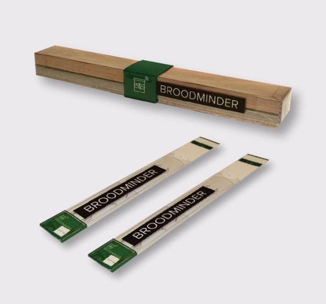

# Introduction

## Bienvenue à l'univers BroodMinder - Mellisphera !
Si vous lisez cela, c'est le début d'une aventure qui s'annonce. Vous faites maintenant partie de la communauté d'apiculteurs de précision. Une communauté qui croit en l'utilisation de l'information pour améliorer la santé des abeilles. Mais également pour améliorer la pratique de chacun, grâce à une connaissance plus approfondie du comportement des colonies et de leurs écosystèmes.

## Bref apperçu du système
Le système Broodminder-Mellisphera est composé de plusieurs elements. Dans l'ensemble il est très modulaire, il vous permet de démarrer simplement avec ou sans capteurs puis d'élargir l'utilisation selon vos besoins.

Voici en quelques mots les composantes principales du système

### La gamme de capteurs BroodMinder
Des capteurs de poids, de température, d'humidité.. Une gamme complète et au même temps modulaire de dispositifs qui permettent d'équiper vos ruches selon vos besoins. 

### L'application Apiary pour la collecte de données
Tous les capteurs transmettent les informations en BlueTooth et bien entendu vous pouvez utiliser votre smartphone pour recueillir ces données. Il sufffit de telecharger l'App BroodMinder Apiary à partir de votre store préféré Apple ou Android.

### Le transmetteur de données Cell
Pour ceux qui souhaitent disposer de données en temps réel, le Transmetteur de données Cell est la solution.  Ce boitier autonome s'installe au milieu du rucher et releve automatiquement les informations de tous les capteurs. Il les transmet ensuite via le réseau cellulaire 3G/4G ou WiFI vers le cloud où elles sont traitées.

### MyBroodMinder.com
Les données transmises par votre teléphone ou par le Cell arrivent sur le portail [Mybroodminder.com](https://mybroodminder.com). Dans cet espace vous pouvez configurer votre rucher, vos ruches et leur affecter vos capteurs. Il permet également de visualiser les données brutes sur des graphiques fluides et interactifs.

### Bzz.mellisphera.com 
Le portail [bzz.mellisphera.com](https://bzz.mellisphera.com) est directement connecté avec MyBroodminder. Il récupere les données brutes pour les analyser et les traduire en informations directement utilisables par l'apiculteur. Santé des colonies, miellées, détection d'événements multiples... Nous mettons en oeuvre des algorithmes qui analysent ce qu'il se passe sur le rucher pour informer l'apiculteur au bon moment grace au système d'alertes intégré.

Nous espérons que ce premier tout vous donne envie de poursuivre à la découverte de tout le potentiel du système. Chaque brique qui le compose dispose de fonctionalités propres et vous pourrez les approfondir au fur et à mesure.