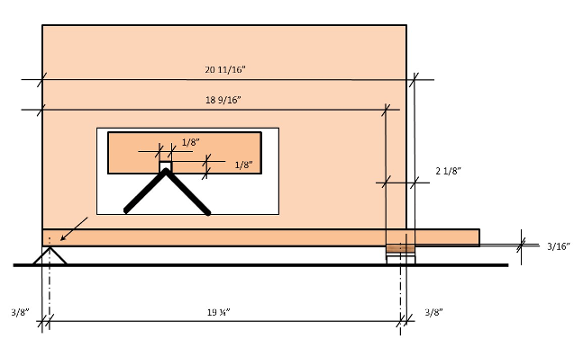
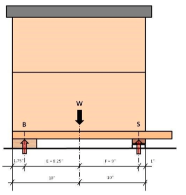
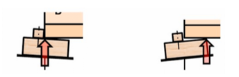
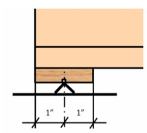
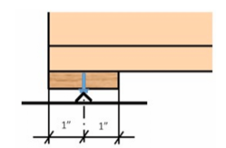
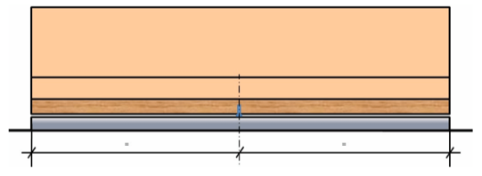
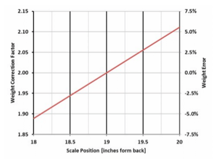
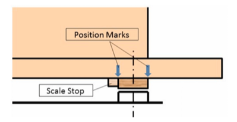

# Capteurs

## Installation des capteurs BroodMinder
### 2.1 Position des capteurs
Le pack Citizen Science contient deux dispositifs BroodMinder-TH (Température et Humidité) ou BroodMinder-T2 (Température seulement) ainsi qu’une balance BroodMinder-W. Voici où installer ces appareils : 

### 2.2 BroodMinder-TH

Tous les appareils BroodMinder-TH ont un identifiant qui commence par 42 – ils devraient donc être faciles à reconnaitre. Le capteur est normalement placé au-dessus des cadres, près du centre du corps de la ruche qui vous intéresse. Cette position est choisie pour plusieurs raisons :

- La chaleur monte, donc le capteur sentira la chaleur de la couvée située en dessous
- La couvée tend vers le milieu de la ruche et l'entoure de pollen et de miel. Placer le capteur de température à cet endroit optimise donc les chances de détecter le couvain
- L'utilisation de cette position standardisée permet des croisements et comparaisons entre les ruches à travers le monde

Si vous êtes situé dans un territoire au climat froid et que mettez à l'hivernage plus de deux essaims, vous pouvez alors remonter les capteurs. En effet, l'essaim se déplaçant au-dessus d'un capteur, ce dernier aura alors tendance à détecter la température extérieure (car la chaleur monte).

En plaçant le capteur BroodMinder-TH juste en-dessous du couvre-cadre, vous détecterez la chaleur de la ruche entière. En atteignant les 100%, la condensation devient très probable. Il serait alors intéressant d'inspecter la ruche et de prendre les mesures appropriées si nécessaire.

Remarque : L'humidité relative (HR) dépend à la fois de l'humidité de l'air et de la température. L'humidité relative augmente à mesure que la température baisse. Par exemple, lorsque HR = 100%, il se forme alors de la rosée. Et il se passera la même chose dans votre ruche.

Si vous remontez le BroodMinder-TH, il serait alors judicieux de déplacer également l'autre BroodMinder-TH juste en dessous corps supérieur de la ruche. De cette façon, vous verrez comme l'essaim remonte.

Pour terminer, le BroodMinder-TH est suffisamment fin pour que vous puissiez le placer dans différentes positions (entre les cadres par exemple). Nous aimerions savoir comment cela fonctionne pour vous et ce que vous en apprenez.

Quelle que soit la position du capteur choisie, vous pouvez ajouter un marqueur aux données grâce à l'application BroodMinder. Nous aborderons ce sujet dans un chapitre ultérieur.

La pile CR2032 est remplaçable en ouvrant l'emballage. Elle dure en moyenne plus d'un an mais nous recommandons un remplacement à chaque automne, avant les basses températures de l'hiver.

### 2.3 BroodMinder-T2
 

Tous les appareils BroodMinder-T2 ont un identifiant qui commence par 41 – ils devraient donc être faciles à reconnaitre. Le BroodMinder-T2 (**Température**) est une version à prix réduit du BroodMinder-TH. Il détectera la température de la ruche qui indiquera le développement du couvain durant la saison ainsi que sa survie hivernale. Placez-le au-dessus de l'endroit où vous pensez qu'il y aura le plus de couvain. Durant l'hiver, nous vous conseillons de le placer sur les cadres du corps supérieur de la ruche afin qu'il puisse prendre toute la chaleur montante de l'essaim.

Afin de mettre en marche le BroodMinder-T2, appuyez sur le bouton pendant 5 secondes. 

**La LED clignotera pendant une minute pour indiquer le succès de l'opération. SI VOUS NE MAINTENEZ PAS LE BOUTON ASSEZ LONGTEMPS, VOTRE T2 S'ETEINDRA AU BOUT DE 10 SECONDES ENVIRON.** 

Pour vous assurer que le T2 est en marche, appuyez une nouvelle fois sur le bouton et la LED se mettra à clignoter momentanément, ce qui indique le bon état de la pile ainsi que le fonctionnement de l'appareil.

Pour changer la pile, coupez simplement le ruban adhésif sur trois côtés autour du circuit imprimé. Puis faites pivoter le circuit et remplacez la pile avec une nouvelle CR2032. Assurez-vous de bien resceller le circuit imprimé en utilisant du ruban adhésif.

Si vous souhaitez éteindre le T2, nous vous conseillons de le faire avec l'application BroodMinder.

- Trouvez l'appareil et sélectionner l'écran du graphique
- Sélectionnez la page de configuration (icône d'engrenage dans le coin supérieur droit de l'écran)
- Sélectionnez Taux d'Échantillonnage puis cliquez sur « éteindre ». Cette opération n'est possible que pour les appareils T2
- Retournez au graphique et synchronisez l'appareil. Une fois fini, le T2 sera éteint

### 2.4 BroodMinder-W

Le BroodMinder-W (**Poids**) se place sous la ruche. Il existe un rapport détaillé sur la façon dont on positionne la balance (annexe A). C'est très intéressant à lire mais si vous manquez de temps, voici l'essentiel.

La pile CR2032 est remplaçable. Elle dure en moyenne plus d'un an mais nous recommandons un remplacement à chaque automne, avant les basses températures de l'hiver.

*Remarque : un support inadapté sous la balance constitue la source d'erreur la plus commune. En effet, cela pourrait conduire à d'étranges résultats dus à la flexibilité de la ruche qui s'étend et se contracte sous les effets du soleil, de la pluie, des changements de températures, etc. Un support plat donnera de meilleurs résultats. Une solution simple consiste à placer une feuille de contreplaqué de 2cm d'épaisseur (ou équivalent) sous la balance.*

*Remarque supplémentaire : si vous ne souhaitez surveiller que la miellée, un bon support sous la balance n'est pas nécessaire. Il vous faudra simplement ignorer les variations quotidiennes. Vous serez toujours en mesure d'observer l'évolution générale du poids.*

#### 2.4.1 Placer la balance à l'ombre

Le BroodMinder-W dispose d'un capteur de température à l'intérieur duquel est lue la température locale. Pour que la température soit précise, la balance doit être placée à l'abri du soleil direct. Cette prise de température est également utilisée pour compenser les capteurs de poids afin d'éviter les pics de température créés par l'ensoleillement direct et ainsi améliorer les performances.

Placer la balance à l'ombre permettra également de prolonger la durée de vie de son emballage. Nous utilisons du plastique résistant aux UV, mais en plein soleil, même celui-ci se dégradera au fil du temps. Si cela se produit, il est possible de commander un nouvel emballage sur BroodMinder.com.

#### 2.4.2 Faire le niveau du BroodMinder-W

Même si nous avons fait de notre mieux pour simplifier au maximum l'installation, vous devez tout de même rester attentif à quelques éléments :

Tout d'abord, assurez-vous que la ruche soit de niveau. Pas forcément _parfaitement_ à niveau, mais si votre ruche ressemble à tour de Pise, alors vous n'obtiendrez pas de bons résultats. Vos meilleurs alliés seront des cales en bois (d'environ 4x9cm chacune). En les utilisant de manière adaptée, vous pourrez mettre n'importe quoi de niveau ! Nous pouvons également constater que visser les cales entre elles permet d'obtenir une meilleure stabilité.

Une fois le BroodMinder-W installé, regardez au bout de celui-ci. À travers le couvercle en plastique, (souvenez-vous... il faut l'installer _avec_ le couvercle en plastique), vous pourrez voir la pièce supérieure en bois et la pièce inférieure en aluminium. Assurez-vous qu'elles ne se touchent pas : cela permettra de garantir que l'ensemble du poids repose sur les deux petits boutons situés au-dessus de la base en aluminium, et non ailleurs.

#### 2.4.3 Installation classique

En utilisant l'installation type, vous pourrez voir de petits changements dans la ruche, mais le degré de précision des résultats ne sera pas absolu. Afin d'obtenir plus de précision, reportez-vous à la section suivante.

Le BroodMinder-W est conçu pour mesurer la moitié du poids de la ruche. Pour ce faire, vous devez surélever un côté de la ruche (à l'avant ou à l'arrière, du côté gauche ou du côté droit) à l'aide d'une cale (de 4x9cm ou équivalent). Nous vous recommandons toutefois d'utiliser une cornière en aluminium de 50mm de profondeur. En la plaçant de façon à ce que l'angle de la cornière pointe vers le haut, vous obtiendrez un point de pivotement très précis. Vous en trouverez facilement en magasin de bricolage ou en quincaillerie. L'avantage de l'aluminium est qu'il ne rouille pas.

Le BroodMinder-W sera donc placé sous le côté opposé.

Vous trouverez une explication mathématique et physique plus détaillée dans l'annexe A, mais elle se résume à ceci. Essayez de placer le support et la balance directement sous les parois du corps de la ruche : cela donnera de meilleurs résultats.

#### 2.4.4 Installation améliorée

Cette installation améliorée nécessitera d'apporter quelques modifications au plateau du fond, notamment quelques petites coupes. Elles permettront de placer et de pouvoir replacer de façon répétée dans le temps la balance et son support avec précision.

Tout d'abord, nous vous recommandons d'utiliser une cornière en aluminium de 50mm de profondeur. En la plaçant de façon à ce que l'angle de la cornière pointe vers le haut, vous obtiendrez un point de pivotement très précis. Vous en trouverez facilement en magasin de bricolage ou en quincaillerie.

Maintenant, passons aux coupes du plateau du fond. Pour cette installation, nous vous recommandons de placer les cales à l'avant ou à l'arrière plutôt que sur les côtés. C'est maintenant à vous de décider de l'emplacement du BroodMinder-W :  sous le devant ou sous l'arrière de la ruche.

Il est préférable de placer le BroodMinder-W à l'abri du soleil. En effet, le soleil fera chauffer la balance, qui vous donnera une lecture erronée de la température extérieure. Le placer du côté ombragé de la balance vous évitera ce problème et permettra également de préserver son emballage plus longtemps.

Ensuite, vous allez couper le plateau du fond. Pour le côté de la cornière aluminium, vous découperez une rainure de la largeur de votre lame de scie dans laquelle la pointe de l'angle viendra s'insérer. Pour le côté de la balance, vous découperez la paroi du corps de la ruche en faisant une entaille de 5cm de largeur (largeur de la balance) sur 0,25cm de profondeur afin que celle-ci puisse s'emboiter facilement dans le corps de la ruche. Voir les images ci-dessous.

## 3. Entretien régulier
Nos appareils ne nécessitent pas beaucoup d'entretien. Merci de noter que si vos piles durent moins de 6 mois, ceci est anormal. Dans ce cas, contactez-nous à [support@BroodMinder.com](mailto:support@BroodMinder.com) pour un remplacement ou une remise à neuf.

### 3.1 Au printemps

Une vidéo sur l'entretien à effectuer au printemps est disponible sur mybroodminder.com/resources

Le printemps est le moment idéal pour nettoyer vos appareils. Pour cela, vous pouvez utiliser de l'acool isopropylique ou éthylique à 95% et plus, qui n'endommageront pas l'électronique.

Vous pouvez placer les emballages au congélateur : la propolis se rompra plus facilement.

**Assurez-vous que l'emballage de la balance n'est pas fissuré. La pluie pourrait pénétrer à l'intérieur et endommager les capteurs.** Vous pouvez sceller toute fissure à l'aide de ruban adhésif.

Nous avons également des emballages de remplacement pour tous nos produits, disponibles sur notre site internet BroodMinder.com

### 3.2 A l'automne

Avant l'arrivée de l'hiver, changez toutes les piles de vos BroodMinders. Vous pouvez en acheter facilement et à petit prix sur Amazon.com ou Digikey.com. Toutes les piles sont de type CR2032.

**Assurez-vous que l'emballage de la balance n'est pas fissuré. La pluie pourrait pénétrer à l'intérieur et endommager les capteurs.** Vous pouvez sceller toute fissure à l'aide de ruban adhésif ou commander un nouvel emballage sur BroodMinder.com.

## 4. Mises à jour des micro-logiciels (firmware)

Les mises à jour pour le Hub BroodMinder et les BroodMinder-T2 se font automatiquement par OTA (Over-The-Air, soit sans fil). Elles sont effectuées par l'application Apiary ou l'application Cell. Pour plus d'informations, cliquez sur ce lien : mybroodminder.com/resources

## Annexe A – Les caractéristiques du BroodMinder-W

Il existe de nombreuses façons d’utiliser la balance de ruche BroodMinder. Comme cette dernière ne mesure qu’une portion du poids total de la ruche, la conception et l’emplacement du support auxiliaire tout comme la position de la balance elle-même font partie intégrante du système de mesure du poids total de la ruche. En général, plus on fait d’efforts sur cette partie, meilleurs sont les résultats obtenus. Les systèmes de support de la ruche montrés ci-dessous vont du plus facile au plus sophistiqué, avec un taux d’incertitude du plus faible au plus élevé. Le choix du système revient à l’utilisateur.

*Remarque : un support inadapté sous la balance constitue la source d’erreur la plus commune. En effet, cela pourrait conduire à d’étranges résultats dus à la flexibilité de la ruche qui s’étend et se contracte sous les effets du soleil, de la pluie, des changements de températures, etc. Un support plat donnera de meilleurs résultats. Une solution simple consiste à placer une feuille de contreplaqué de 2cm d’épaisseur (ou équivalent) sous la balance.* 

*Remarque supplémentaire : si vous ne souhaitez surveiller que la miellée, un bon support sous la balance n’est pas nécessaire. Il vous faudra simplement ignorer les variations quotidiennes. Vous serez toujours en mesure d’observer l’évolution générale du poids.*

**1) Correction des défauts**

Voici la correction des défauts avec la balance positionnée à l’avant de la ruche ainsi qu’un support auxiliaire (point d’appui) de 2x4cm placé à l’arrière : 

Voici maintenant les calculs de cette mise en place :

Supposons que le poids de la ruche (W) est réparti de manière égale et que le centre de gravité se situe au centre de la ruche. Pour plus de simplicité, on ne tiendra pas compte le surplomb du plateau du fond. Supposons également que le poids de la ruche est de 100%. 

Calculs du

-	Poids de la balance (S):

- Poids du support arrière (B):

En utilisant comme support auxiliaire un morceau de bois standard de 2x4cm et en l’alignant avec l’arrière de la ruche, le poids total de la ruche (W) peut être calculé à partir du poids de la balance (S) : 

Par conséquent, indiquez 2.09 comme facteur d’échelle de la ruche par défaut sur l’application si vous utilisez cette configuration. On pourra évidemment affiner ce chiffre une fois que des mesures de poids seront possibles. 

Le graphique ci-dessous montre le facteur de correction d’échelle pour différentes dispositions de la balance et du support. L’axe X représente la position du support (en pouces) à partir de l’arrière de la ruche. Les différentes lignes représentent la position centrale de la balance (en pouces) à partir de l’arrière de la ruche. Les flèches montrent l’exemple donné ci-dessus.

*La croix rouge sur le graphique représente les positions idéales du support et de la balance (facteur de correction d’échelle = 2.0).*

**2) Autre disposition n°1**

Compte tenu de ce que l’on vient de voir, le support auxiliaire devrait être placé à 25mm (1 pouce) de l’arrière de la ruche. Il est recommandé d’ajouter une pièce sur le support auxiliaire comme indiqué sur le schéma afin de pouvoir le positionner avec plus de précision. 

Nous avons désormais les segments E et F de même longueur et le facteur de correction d’échelle de la ruche est de 2.0 (soit la valeur par défaut sur l’application mobile). Cependant, il existe d'autres facteurs d'influence qui ne doivent pas être négligés. Le véritable point d’appui du support auxiliaire se situe quelque part entre l’arrière de la ruche et le devant du support, à cause des variations de niveau du support ainsi qu’une éventuelle déformation du support lui-même. 

Compte-tenu de l’incertitude introduite qui est assez importante, le facteur de correction d’échelle est compris entre 1.90 et 2.13 (ou entre -5% et +6.5%).

**3) Autre disposition n°2**

Il y a un autre système de support qui peut être utilisé, qui a un point d’appui défini et qui n’est pas affecté par l’alignement de la structure de support. 

Prenez un morceau de bois (pin ou chêne) d’à peu près 20mm d’épaisseur et 50mm de largeur. La longueur du morceau doit être égale à la largeur de la ruche. Découpez-y une petite entaille : elle doit être aussi profonde que la largeur de la lame de votre scie. Fixez ce morceau en-dessous du plateau de fond de la ruche. Alignez-le avec l’arrière de la ruche. Prenez maintenant une cornière en aluminium (6061 ou 6063) de 25x3mm, de la même longueur que le morceau de bois. Placez-la sous ce dernier afin de soutenir la ruche. L’angle de la cornière en aluminium doit reposer dans l’entaille. La hauteur totale de ce dispositif (cornière en aluminium + morceau de bois) doit être égale ou légèrement plus élevée que la haute de la ruche. En effet, il faut s’assurer que la ruche est de niveau voir légèrement inclinée vers l’avant afin d’éloigner l’écoulement de l’eau de l’entrée de la ruche.

Cela permet de définir un point d’appui précis qui ne bougera pas et ne sera pas non plus affecté par un support dont la structure est inégale. 

**4) Équilibrage latéral**

Tous les systèmes de support vus ci-dessus sont plus ou moins affectés par un déplacement latéral et indéfini de poids puisque la ruche repose sur plus de trois points. Il y a les deux points d’appui à l’avant situés dans la balance de la ruche, et puis le support linéaire à l’arrière de la ruche. Cela pourrait entraîner une surcharge de l’une des cellules de charge de la balance. Par conséquent, un équilibrage latéral est généralement nécessaire si le système de support sous la ruche n’est pas une plateforme continue, c’est-à-dire s’il s’agit de deux blocs séparés pour l’avant et pour l’arrière de la ruche. 

Relevez le poids de chaque cellule de charge de manière individuelle en passant à l’affiche en temps réel sur l’application. Avec ce mode, le poids sur la balance est divisé en x% à gauche et x% à droite. Le côté droit de la balance est le côté qui porte le sticker d’identification de l’appareil. Aucune autre mesure n’est requise si la différence gauche/droite est inférieure à 10%. 

Sinon, calez la balance du côté où le % est le plus faible jusqu’à ce que les valeurs de poids correspondent. De la même façon, le calage peut se faire au niveau du support arrière, du côté opposé du % le plus faible. 

**5) Support de ruche sur trois points**

Il existe un moyen d’alléger ce besoin d’équilibrage latéral en mettant en place un véritable système de support sur trois points. Les morceaux nécessaires sont similaires à ceux utilisés dans la disposition n°2, sauf qu’au lieu d’utiliser une cornière en aluminium de 25mm, vous aurez besoin ici d’une cornière de 20mm. Percez un trou de 5mm au centre du morceau (au lieu d’une entaille). Une vis à métaux 6x12mm est utilisée comme support central. La fente de la tête de vis est alignée de manière à ce que l’angle de la cornière en aluminium puisse s’y emboiter en un seul point sans glisser. 

Il y aura un léger écart entre la cornière en aluminium et la planche de bois. Assurez-vous que cet écart soit de largeur égale tout le long de la ruche. La vis placée au centre doit être l’unique point de contact, ce qui garantira que le poids mesuré est correct. Elle fait également office de « filet de sécurité » qui protège la ruche de la chute si le poids est réparti de manière trop inégale ou irrégulière – lors d’inspections de la ruche par exemple. 

**6) Position de la balance BroodMinder**

La plupart des éléments ci-dessus concernaient le support auxiliaire. Concentrons-nous maintenant sur la position de la balance.

Comme indiqué dans les sections précédentes, il est préférable que la partie avant de la balance soit alignée avec la partie avant du corps de la ruche. Décaler la balance plus vers l’intérieur de la ruche apporterait plus de précision dans les résultats au détriment de la stabilité de la ruche. La décaler plus vers l’extérieur réduirait la précision des résultats sans pour autant améliorer la stabilité de la ruche. 

Ce graphique montre l’influence de la position de la balance sur le facteur de correction d’échelle et sur l’erreur de poids, introduite par un positionnement inexact de la balance. L’influence est de 5,6% par pouce (soit 25mm). 

Il est conseillé de marquer la position de la balance sur le plateau de fond de la ruche ou de fixer une butée mécanique. Cela permettrait de pouvoir remettre la balance exactement au même endroit si elle venait à être enlevée pour changer la pile ou pour toute autre raison. 