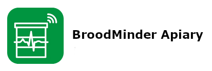
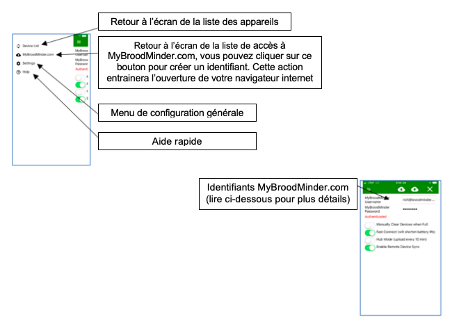
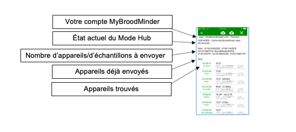
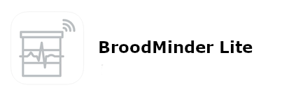
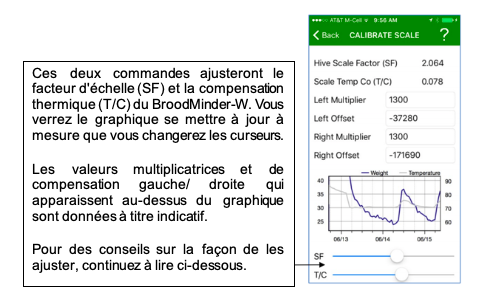
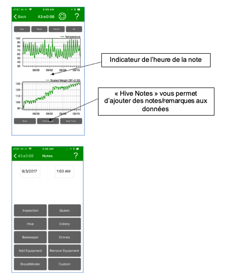

# Apps BroodMinder

Vous avez le choix entre deux Apps pour relever les données de cos capteurs Broodminder-Lite et Broodminder-Apiary. Pourquoi deux apps? c'est un peu l'héritage mais aussi qu'elles n'offrent pas les mêmes fonctions. 

Nous vous conseillons d'utiliser **Broodminder APIARY**

## 5. BroodMinder – APIARY

Présentée en 2018, BroodMinder-APIARY est notre application la plus puissante. Cette dernière détecte tous vos appareils BroodMinder et télécharge les données récoltées de votre rucher directement dans MyBroodMinder avec une simple touche. Elle peut également être utilisée afin d'envoyer automatiquement vos données en direct à MyBroodMinder.com toutes les 10 minutes.

Une fois vos données transférées, leur analyse et leur notation peuvent se faire directement sur MyBroodMinder.com. Nous vous le recommandons pour sa facilité d'utilisation.

Veuillez noter que cette application stocke uniquement vos données récoltées heure par heure dans le cloud mais ne conserve pas une copie sur votre téléphone et/ou tablette.

De nouvelles fonctionnalités ont été ajoutées en 2019 :

  - Toutes les informations sont disponibles à distance – l'application fonctionne désormais avec ou sans connexion internet
  - Le mode Hub – vous pouvez utiliser tout appareil (iOS ou Android) connecté à internet pour envoyer des données toutes les 10 minutes depuis votre rucher
  - L'activation de BroodMinder-CELL –dispositif qui peut être tiré d'un profond sommeil

Cette application, qui vous permet de gagner beaucoup de temps grâce à la collecte de données à partir de vos appareils, a tout de même une réserve. Vous devez posséder MyBroodMinder Premium pour pouvoir télécharger automatiquement les données de tous vos appareils et pour pouvoir utiliser le mode Hub. Afin de pouvoir tester toutes les fonctionnalités de la version Premium, vous avez la possibilité d'utiliser l'application gratuitement pendant 30 jours après la création de votre compte MyBroodMinder.

Nous avons décidé de rendre la version Premium payante afin d'assurer un petit revenu à notre équipe informatique BroodMinder. En effet, ils travaillent très dur pour créer et gérer les sites internet MyBroodMinder et BeeCounted.org. L'application BroodMinder – Standard restera toujours gratuite. De même, le téléchargement de données sur MyBroodMinder à partir de l'application standard restera toujours gratuit.

Vous pouvez utiliser l'application Apiary indéfiniment pour télécharger les données de vos appareils. Elle est très utile car il s'agit d'un logiciel plus récent, donc le processus de téléchargement est plus simple que dans l'application originale.

L'utilisation de l'application est super simple :

1. Rendez-vous sur MyBroodMinder.com et créez votre compte gratuitement

2. Téléchargez BroodMinder-Apiary à partir de l'app store

3. Lancez l'application, cliquez sur l'icône d'engrenage (page de configuration) et entrez vos identifiants MyBroodMinder

4. Retournez à l'écran de la liste et dans quelques secondes, tous les appareils BroodMinder présents dans la zone s'afficheront automatiquement à l'écran

5. Une fois que les identifiants de vos appareils BroodMinder sont devenus verts, cliquez sur l'icône  pour commencer le téléchargement des données sur MyBroodMinder

6. L'application vous montrera l'état de progression du téléchargement. La ligne supérieure indique l'état d'avancement de la collecte des données. La ligne inférieure montre le transfert de ces dernières vers MyBroodMinder

7. Une fois que tous les appareils ont été enregistré et que toutes les données ont été téléchargées, un message apparaitra pour vous indiquer que le transfert est terminé

Une fois le transfert terminé, les données s'afficheront dans MyBroodMinder. Si vous avez déjà configuré vos appareils, il vous suffit de regarder le résultat. S'il s'agit de nouveaux appareils, vous devrez les trouver sur MyBroodMinder « Device Inventory » (inventaire des appareils) et de les attribuer à un rucher puis à une ruche. Allez à la section suivante pour plus d'informations à ce sujet.

### 5.1 Écran de la liste des appareils

### 5.2 Écran de progression

### 5.3 Écran des détails du capteur

### 5.4 Écran des options

### 5.5 Menu des paramètres

### 5.6 Menu de configuration générale**

- Vider manuellement la mémoire des appareils : si votre appareil BroodMinder fonctionne depuis longtemps (plus de 9 mois), il se peut que la mémoire soit pleine. Si c'est le cas, l'application Apiary se réinitialisera automatiquement afin de pouvoir stocker davantage de données. Si vous souhaitez contrôler cette étape manuellement, appuyez sur ce bouton

- Connexion rapide : ce bouton permettra d'accélérer le temps de connexion en accélérant le « taux de collecte ». Cela signifie que l'appareil BroodMinder enverra un signal toutes les secondes au lieu de toutes les 5 secondes. L'inconvénient de cette option est qu'elle réduit la durée de vie de la pile. Il est possible d'accélérer la connexion durant l'été et de la ralentir durant l'hiver

- Synchronisation des appareils à distance : vous pouvez récupérer vos données même lorsqu'il n'y a pas de connexion internet ou de couverture cellulaire dans votre rucher.

    - Avant de vous rendre à votre rucher, allez sur l'application à l'écran de la liste des appareils et cliquez sur l'icône . Cela permettra le téléchargement de la liste de tous vos appareils ainsi que des données récupérées lors de la dernière synchronisation. Si vous passez cette étape, c'est l'ensemble de vos données qui sera récupéré depuis votre BroodMinder : ça pourrait représenter une année entière de données !

    - Une fois sur le terrain, procédez à la synchronisation de vos appareils comme d'habitude. Le téléchargement échouera mais c'est normal vu que vous n'avez pas d'accès à internet

    - Lorsque vous revenez à la civilisation, relancez l'application qui vous suggèrera de procéder au téléchargement vers le cloud. Faites-le et MyBroodMinder.com sera mis à jour.

- Mode Hub

Le mode Hub vous permet d'utiliser un vieux modèle de téléphone/tablette pour l'envoi automatique de vos données BroodMinder sur MyBroodMinder toutes les 10 minutes. De cette façon, vous pouvez suivre l'état de vos abeilles 24/24h 7/7j depuis n'importe où dans le monde.

Il vous suffit d'autoriser le Mode Hub et de revenir à l'écran de la liste de vos appareils :

## 6. BroodMinder - LITE

### 6.2 Installation

L'application BroodMinder est disponible sur l'App Store d'Apple, sur le Play Store Android ou encore sur le Play Store Amazon, en fonction de votre appareil. Si vous recherchez « BroodMinder » (BroodMinder Lite sur Android), vous le trouverez. Installez-le comme n'importe quelle autre application.

Une fois installée, démarrez l'application. Un message de bienvenue et de félicitations devrait apparaitre en ouvrant l'application. Vous pouvez choisir de regarder notre Queen Bee, Laura Davis, vous faire une démonstration de l'installation ou vous pouvez ignorer ce message et laisser l'application faire son travail.

L'application commencera à rechercher les appareils BroodMinder présents dans la zone et remplira automatiquement l'écran avec tous ceux qu'elle trouvera dans la zone.

Si aucun appareil n'apparait :

- Assurez-vous que la languette de la pile a été retirée du BroodMinder-TH et que la pile est bien en place sur le BroodMinder-W.
- Assurez-vous que le Bluetooth est activé sur votre téléphone / tablette.
- Assurez-vous de vous tenir à une distance de 3 à 6 m de votre dispositif BroodMinder.

### 6.3 Écran d'accueil de l'application BroodMinder

BroodMinder-T affichera la température
BroodMinder-TH affichera la température et le taux d'humidité
BoordMinder-W affichera la température et le poids

### 6.4 Détails / Graphique de l'application BroodMinder

### 6.5 Page de configuration générale

### 6.6 Page de configuration de l'appareil

### 6.7 Mode Temps Réel

Si vous souhaitez voir vos données en temps réel, vous pouvez utiliser le bouton « Real Time » sur l'écran du graphique. En pressant ce bouton, le taux d'échantillonnage passera à 5 secondes et vous verrez apparaitre des valeurs dans la partie inférieure de l'écran.

**B** : niveau de la pile  
**T** : température (actuellement uniquement disponible en Fahrenheit :1°F = -17°C) 
**H** : humidité relative (en%) 
**L/R** : équilibre entre les capteurs de droite et de gauche. S'ajoute à 100% (balance BroodMinder-W uniquement) 
**W** : poids total (actuellement uniquement disponible en livre : 1 livre = 453 g) (balance BroodMinder-W uniquement) 
**Delta** : variation de poids depuis le lancement du temps réel (balance BroodMinder-W uniquement) 

Ces données seront également enregistrées dans le fichier de suivi. 

Ré-appuyer sur le bouton « *Real Time* » permettra de ce mode et fera repasser automatiquement le taux d'échantillonnage à 1 heure.

### 6.8 Réglage du facteur d'échelle BroodMinder-W

Par défaut, le facteur d'échelle du BroodMinder-W est fixé à 2.0. Cela signifie que tout poids observé par le BroodMinder-W sera doublé afin de refléter le poids total de la ruche. En regardant les caractéristiques de la situation (annexe ci-dessous), nous savons qu'il s'agit d'une approximation, qui n'est donc pas totalement exacte. Dans la plupart des cas, elle est suffisamment proche de la réalité car de petits changements seront encore visibles et une erreur à 5-10% du poids total n'est pas importante.

Un affichage plus précis du poids total peut être obtenu en ajustant le facteur d'échelle pour tenir compte de la situation spécifique de la ruche.

Allez à l'écran du graphique de l'échelle et appuyez sur le bouton « Real Time ». En quelques secondes, l'application affichera le relevé de la balance toutes les 5 secondes en bas de l'écran. Vous pouvez également voir le % de charge sur chaque cellule de charge.

Ajoutez maintenant un poids (entre 4 et 10 kg) sur la ruche et centrez-le. Vous devriez voir le poids changer en fonction sur l'application. Vous pouvez ensuite ajuster le facteur d'échelle pour qu'il corresponde exactement au changement de poids effectué.

**Exemple :**

| **Poids** | **Poids delta** | **Facteur d'échelle** | **Notes** |
| --- | --- | --- | --- |
| 121.2 | 0.0 | 2.0 | Lancement du temps réel |
| 132.2 | 11.0 | 2.0 | Ajout du poidsChangement du facteur d'échelle |
| 129.5 | 10.0 | 1.82 | Calibrage plus proche |
| 117.0 | 0.0 | 1.82 | Enlèvement du poidsPoids de la ruche plus précis |

### 6.9 Réglage de la compensation thermique du BroodMinder-W

Les capteurs présents dans le BroodMinder-W sont de très grande qualité et présentent peu d'effet de la température. Cependant, il peut toujours y avoir des variations d'une balance à l'autre. C'est pourquoi nous vous proposons un moyen d'améliorer la précision des résultats grâce au réglage de la compensation thermique de la balance – « Scale TempCo ».

Pour ajuster le TempCo, choisissez une portion de votre graphique de poids pour laquelle vous savez qu'il n'y a que peu de changement en raison de l'activité des abeilles. Un jour nuageux est le moment idéal car nous savons qu'elles ne butinent pas. Il serait également intéressant de choisir un jour où la température extérieure varie d'au moins 6°C au cours de la journée.

En apportant de petites modifications à la valeur TempCo, vous verrez le graphique s'équilibrer pour donner un poids uniforme comme on pourrait s'y attendre.

Si vous constatez des pics de poids même après ajustement, c'est probablement parce que la balance est exposée au soleil. Le soleil peut chauffer la balance assez rapidement et de façon spectaculaire. Il sera donc très difficile pour le TempCo d'être efficace.

### 6.10 Marquage des graphiques

En appuyant sur « *Hive Notes* », vous pourrez ajouter du texte à tout moment sur le graphique. C'est particulièrement utile pour expliquer un brusque changement dans les données récoltées ou encore indiquer une inspection de la ruche.

Appuyer sur ce bouton fera apparaître un sous-menu composé de huit groupes d'évènements ou d'actions possibles. Sélectionnez le groupe le plus approprié à votre situation et choisissez la balise correspondante. Choisissez le groupe « *Custom* » (personnaliser) si les groupes de liste ne couvrent pas votre cas. Les sélections dans l'application seront mises à jour au fil du temps pour refléter au mieux les balises les plus utilisées.

L'heure indiquée dans la partie haute de l'écran correspond à l'heure actuelle si les graphiques n'ont pas été déplacés par pincement ou balayage, avant d'avoir appuyé sur le bouton « *Tag Graph* » n'ait été enfoncé. Le temps peut être ajusté en cliquant simplement dessus.

Lorsque vous notez un évènement passé, il serait pertinent de déplacer le graphique pour aligner l'heure de l'évènement avec le « *Note Time Indicator* », avant d'appuyer sur « *Hive Notes* ». Dans ce cas, l'heure qui s'affichera dans la partie haute de l'écran correspondra à l'heure du « *Note Time Indicator* » et non l'heure actuelle.

Le bouton « *Inspection* » présente un intérêt particulier. En appuyant sur ce bouton, vous serez amené à répondre à six questions faciles sur l'état de votre ruche. C'est Dick Rogers qui nous a partagé́ ces questions et nous pensons que c'est un moyen rapide et efficace de documenter la ruche.

## 7.1 Compatibilité des appareils

Nous avons conçu l'application BroodMinder pour fonctionner avec la plupart des appareils iOS (iPhone, iPad) et Android. Nous testons notre logiciel sur de nombreux appareils.

### 7.1 Apple – iOS

L'application BroodMinder fonctionne avec tous les appareils Apple dotés de la technologie Bluetooth Low Energy (BLE). Il fonctionnera avec les modèles iPhone 4 ou plus récents ainsi qu'avec les iPads de 3ème génération ou plus récents.

### 7.2 Android

Pour Android, c'est un peu plus compliqué. Android a introduit le support BLE dans sa version 4.3 (Jelly Bean, juillet 2012). Les appareils plus anciens ne fonctionneront pas. La plupart des nouveaux appareils (2015 ou plus récents) fonctionnent. Cependant, il existe de nombreux modèles de téléphone et nous en avons trouvé́ quelques-uns qui posent problème. Si votre appareil ne fonctionne pas, contactez- nous à l'adresse support@BroodMinder.com.

Une nouvelle fonctionnalité a été ajoutée à l'application dans la version 2.97 dans le but d'augmenter le « taux d'annonce » de vos appareils BroodMinder. Tel qu'expédié, le BroodMinder est programmé pour envoyer un message transmettant les données de température et de poids toutes les 5 secondes. La page de configuration générale est désormais dotée d'une section de configuration Bluetooth qui vous permet de passer le taux d'annonce à 1 message par seconde. Cela vous permettra d'accélérer la connexion des appareils ainsi que la récupération des données. Cependant, cette manipulation réduira la durée de vie de la pile à 3-6 mois.

Nous avons également ajouté l'option « Réinitialiser Bluetooth Android » en-dessous de la section de configuration Bluetooth. Cela permettra de réinitialiser la fonction Bluetooth. En effet, nous avons constaté que sur certains modèles de téléphone, cette manipulation aide à rétablir la communication.

Vous trouverez plus d'informations sur MyBroodMinder.com/resources