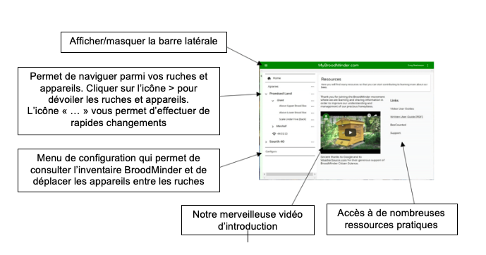
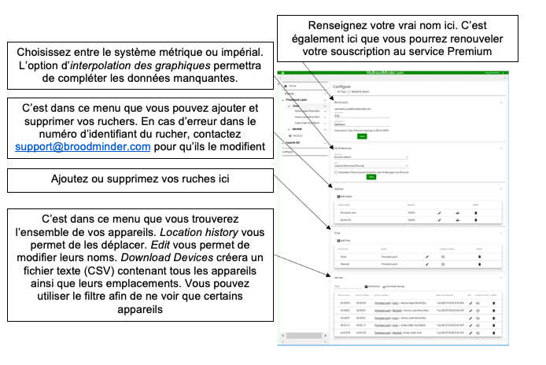
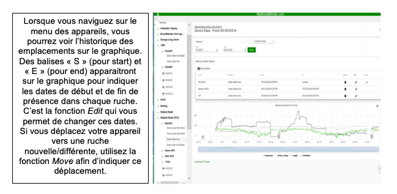

# MyBroodminder.com

## 7. Stockage dans le Cloud MyBroodMinder.com

Le véritable pouvoir du mouvement BroodMinder réside dans le regroupement et le stockage de données provenant de milliers de ruches à des fins publiques sur MyBroodMinder.com.

Nous avons fait de notre mieux pour rendre le transfert des données aussi simple que possible. **Depuis l'application BroodMinder, il vous suffit d'appuyer sur le bouton Sync et de répondre à quelques questions**. L'application s'occupera pour vous de créer un nouveau compte MyBroodMinder et de vous fournir tout le nécessaire pour démarrer. Après cette étape, les données seront transférées. _Vous n'avez pas besoin de créer un compte MyBroodMinder avant d'envoyer vos données._

Une fois que les données sont transférées sur MyBroodMinder.com, vous pouvez les voir et combiner les données de vos différents capteurs en un graphique facile à lire pour chacune de vos ruches.

Allez sur MyBroodMinder.com avec n'importe quel navigateur. Vous devrez entrer votre nom d'utilisateur (adresse électronique) et votre mot de passe. Après cela, un menu de ce type apparaitra :

En cliquant sur le nom d'une ruche, vous pourrez visualiser un graphique qui combine tous les capteurs de la ruche sélectionnée en un seul rapport :

Utilisez le menu de configuration pour pouvoir effectuer tous les réglages de votre espace MyBroodMinder.com

