# Mellisphera.com

## Présentation générale 

Vidéo ancienne en français : https://www.youtube.com/watch?v=Nqh_R37O8IE 

Vidéo récente en anglais : https://www.youtube.com/watch?v=pbCqpf8EY0s

## Mellisphera & BroodMinder

Mellisphera est intégré à BroodMinder. Ainsi, vous devez créer un compte MyBroodMinder et configurer vos ruchers, ruches et capteurs sur leur plateforme : https://mybroodminder.com/app. Vous verrez la liste de vos capteurs, il s'agira de les placer dans vos ruches et ruchers que vos configurerez comme bon vous le semble. 

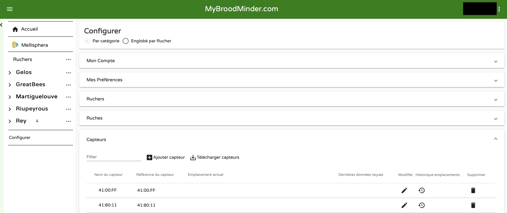

Un bouton Mellisphera sera toujours visible sur menu de gauche, il suffit de cliquer sur celui-ci pour vous rendre sur notre plateforme. Si vous vous êtes connectés récemment à notre plateforme, la connexion se fera sans que vous ayez besoin de rentrer votre email et votre mot de passe. Dans le cas contraire, le champ de l'email sera auto rempli. 

Votre aventure commence donc maintenant https://bzz.mellisphera.com/login.

## Page de connexion 

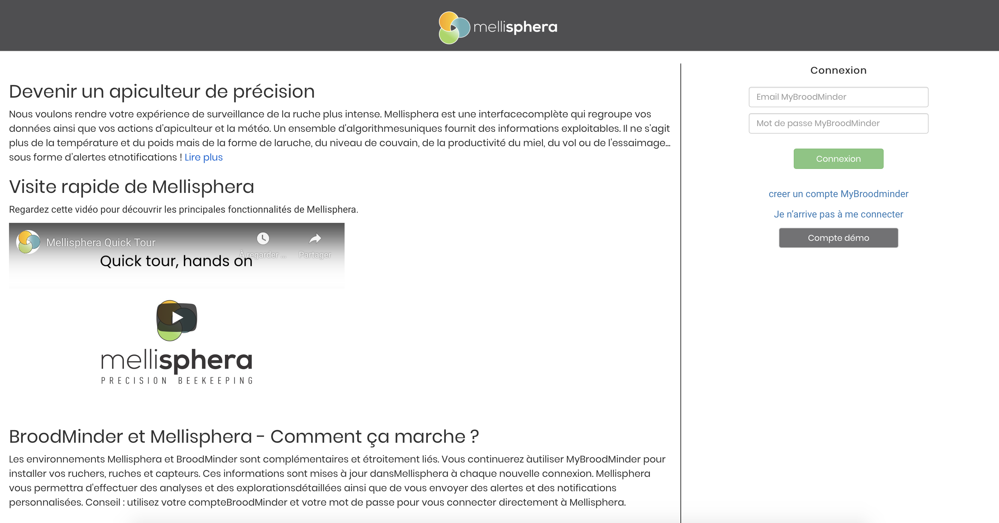

Sur la page de connexion, vous avez la possibilité de vous connecter à un rucher démo si vous ne possédez aucun compte ou que vous êtes avare de nouveauté ou de curiosité. Vous pouvez lire les informations qui vous en apprendront davantage sur la relation entre BroodMinder et Mellisphera et sur ce que Mellisphera peut vous apporter.

Passons à l'étape de la connexion. Il faut donc que vous utilisiez vos identifiants BroodMinder. Une fois connecté, vous hériterez de l'historique complet de vos capteurs. Vous pourrez explorer les événements passés et lire l'évolution de la saison sous un angle complètement nouveau. Lors de la première connexion, vous êtes averti que le chargement de l'ensemble de l'historique de vos données est en cours de chargement. A chaque nouvelle connexion, nous chargons vos données manquantes.

Nous allons faire un tour ensemble des différents aspects de notre plateforme.

## Paramètres de compte

En haut à droite sur l'app Mellisphera, vous avec accès à vos paramètres de compte. 

Vous pouvez réinitialiser votre mot de passe. Attention, cela ne modifie le mot de passe que pour la plateforme Mellisphera. 

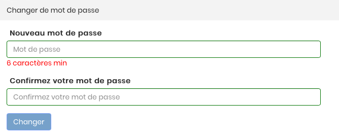

Vous pouvez également changer votre système d’unité (métrique ou impérial). Vous pouvez également changer le format de la date à votre guise ou encore la langue (Français, Espagnol ou Anglais pour le moment). Une dernière possibilité s’offre à vous, celle du choix de la source météo. Selon votre préférence et vos retours, vous pourrez choisir votre source préférée. 

## Infobulles

Sur chaque fonctionnalité, photo, calendrier ou page, vous verrez apparaître des infobulles vous détaillant des informations essentielles à la compréhension des données.

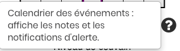

## Page d'accueil

### Vue Rucher

Vous devriez arriver sur cette interface.

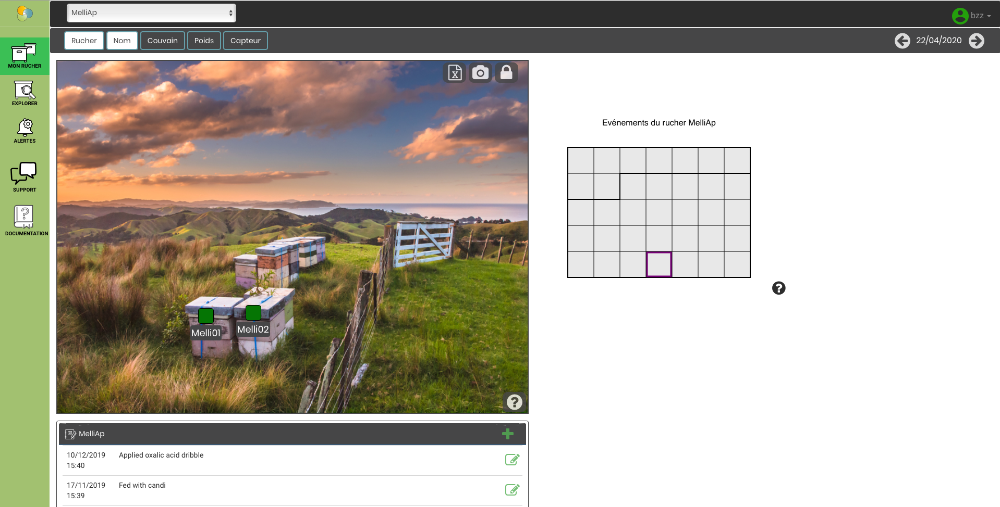

#### Photo et placement

Si c'est votre première connexion, vous n'aurez pas de photo et vos pastilles ne seront pas placées. Vous pouvez déplacer les pastilles avec le cadenas et ajouter une photo avec l'appareil photo. 

#### Export des données 

Sur l'image, vous avez également un icône pour l'export de vos données. C'est un export excel (csv ou .xlx) des données de vos ruchers (ruches, capteurs, batterie, couvain, poids) et de vos dernières notes. Cela peut être intéressant si vous devez vous rendre au rucher.

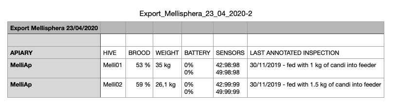

#### Naviguation photo

Vous avez sur cette page d'accueil, une barre de navigation grise. 

Les boutons 'Nom', 'Couvain', 'Poids', et 'Capteur' sont activables. Cela permet d'afficher sur la photo en dessous des pastilles respestivement le nom, le couvain, le poids et les capteurs de l'ensemble des ruches de votre rucher à la date affichée en haut à droite. Par défaut, c'est la date de la veille (qui correspond au dernier jour de données en général). Vous pouvez bien entendu changer de date. 

#### Etat des capteurs

Petite particularité pour les capteurs, vous avez leur état en temps réel par une couleur (Grise, Rouge, Orange) qui détermine l'état et un affichage au survol du problème. Pour plus de détails, vous pouvez vous réferrer à la section 'Interprétation des données'. 

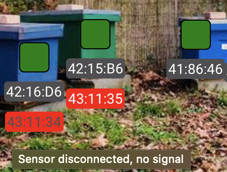

#### Pastilles de couleur

Vous aurez également remarqué que les pastilles ont des couleurs (Noir, Rouge, Orange, Vert) qui correspondent à l'état de vos ruches. Vous pouvez également regarder au survol le message indiquant l'état. Si votre pastille est blanche, veuillez vous diriger vers la FAQ, nous traitons vos problèmes de données. Pour le détail du modèle calculant l'état de vos ruches, je vous retourne vers la section 'Interprétation des données'. 

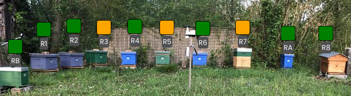

#### Calendrier des événements du rucher

Vous disposez d'un calendrier d'événements propre à votre rucher dont les paramètres sont réglables dans l'onglet 'Alertes'. Chaque icône a une signification et vous pouvez voir au survol des précisions sur les alertes.
Nous y revriendrons un peu plus loin et le détails des alertes est donné dans la section 'Interprétation des données'. 

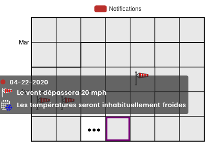

#### Notes de rucher

Pour terminer la vue rucher, vous pouvez inscrire des notes/inspections de rucher. Cela se situe juste en dessous de la photo de votre rucher.

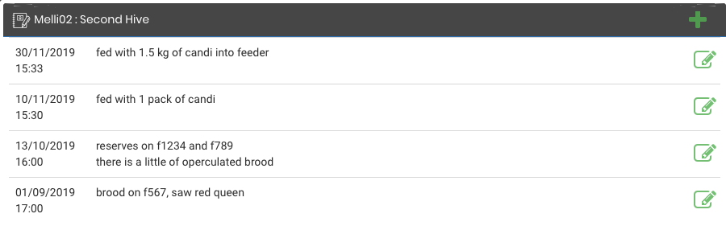

Pour écrire une nouvelle note, il suffit de cliquer sur le '+' de l'encart, c'est très simple. 

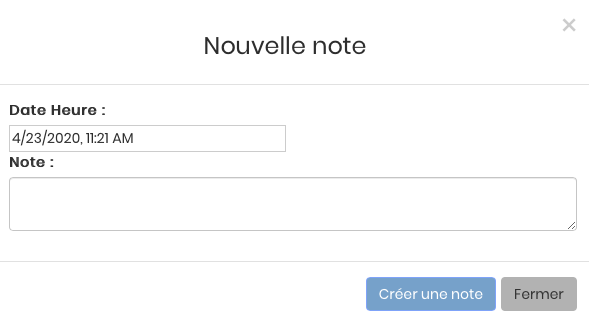

Vous verrez apapraître la note directement sur le calendrier des événements avec l'icône suivant.

### Vue Ruche

Pour accéder à la vue d'une ruche, vous devez cliquer sur sa pastille ou son nom. Vous verrez l'apparition de nouveaux calendriers sur la droite. Vous verrez apparaître sur la photo la ruche sélectionnée. 

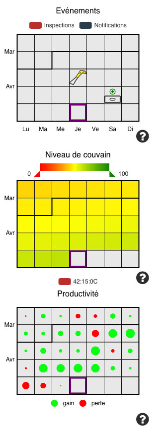

Les données affichées sont des données issues des 5 dernières semaines ainsi que des 3 prochains jours puisque nous pouvons prédire des événements à 3 jours. 

#### Evénements

Vous retrouvez le calendrier d'événenements qui est cette fois-ci propre à votre ruche. Les événements de ruchers er de ruches sont différents. Pour plus de précision, aller dans la section 'Interprétation des données'.

#### Couvain

Vous avez une vision globale de l'évolution du couvain journalier sous forme de calendrier heatmap. Les couleurs varient de rouge à vert et le pourcentage de 0 à 100%. Pour plus de détails quant au model de calcul du couvain, il faut se rendre dans la section 'Interprétation des données'. Si vous possédez plusieurs capteurs de température sur votre ruche, vous pouvez cocher ou décocher celui que vous voulez afficher.

#### Productivité

Vous avez une vision globale de l'apport de poids journalier sous forme de calendrier bulle. Les couleurs sont rouge pour une perte et vert pour un gain. La taille des bulles est proportionnel à la quantité de poids relevé. Nous appelerons donc cela la productivité de la ruche. Pour plus de détails quant au model de calcul de la productivité, il faut se rendre dans la section 'Interprétation des données'. Vous pouvez afficher uniquement les gains ou les pertes sur le calendrier en cochant/décochant les cases en dessous du calendrier. 

#### Notes

Vous aurez également remarqué que l'encart des notes n'est pas le même que lors de la vue rucher. En effet, vous avez également la possibilité d'écrire des notes pour vos ruches au même endroit que précédemment. Ce sont des notes distinctes de vos notes de rucher et ne concerne que la ruche sélectionnée. Pour repasser en mode rucher, il suffit de cliquer sur le bouton 'Rucher' de la barre de naviguation.

## Explorer

Dans cette partie de l'application, vous pourrez naviguer avec une nouvelle barre entre 'Ruche', 'Couvain', 'Données'. Par défaut, vous arrivez sur le mode 'Ruche'. 
De plus, les données du dernier mois s'afficheront par défaut. Vous pouvez modifier la date en haut à droite. Vous pouvez modifier et personnaliser cette période de données à votre guise ou en utilisant les flèches pour vous déplacez dans le temps de période en période. 

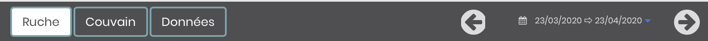

### Ruche

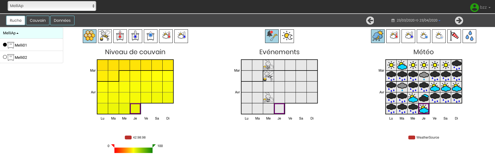

Dans le mode ruche, vous pouvez choisir entre toutes les ruches de tous vos ruchers mais vous ne pouvez sélectionner qu'une seule ruche à la fois. Vous avez une vue de trois calendriers. 

Le premier calendrier récapitule les données de votre ruche, vous pouvez choisir entre les différentes options 'Couvain', 'Productivité', 'Température interne Maximum', 'Température interne minimum', 'Humidité interne maximum', 'Température externe maximum' et 'Température externe minimum'. 

Le calendrier du milieu fait état des événements de votre ruche et du calendrier lunaire. 

Le dernier calendrier présente les données météo de votre rucher. Il est donc identique à toutes les ruches d'un même rucher. Vous aurez accès aux données générales 'Météo', 'Température externe maximum', 'Température externe minimum', 'Humidité externe maximum', 'Humidité externe minimum', 'Vent' et 'Précipitations'. Vous pouvez aussi visualiser des prévisions météo jusqu'à 5 à 15 jours en fonction du modèle sélectionné. 
Si vous n'avez aucune donnée météo, veuillez vous référer à la FAQ. 

Pour avoir des détails sur les différents modèles, il faut se rendre dans la section 'Interprétation des données'. 

Vous pouvez donc visualiser et échanger les modes du calendrier comme vous le souhaitez. Voici un exemple :

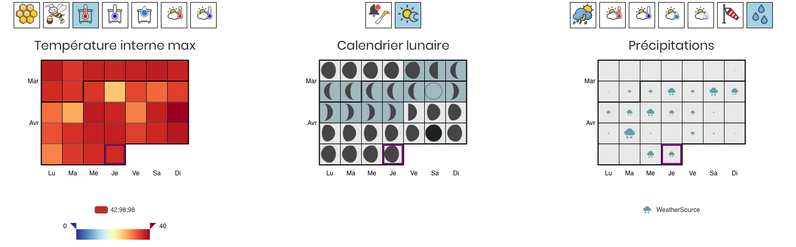

### Couvain

Dans le mode Couvain, vous povuez cette fois-ci sélectionner autant de ruches que vous le souhaitez et même si ces ruches sont dans deux ruchers différents. Cela vous permet de comparer des ruchers ou des ruches entre elles.

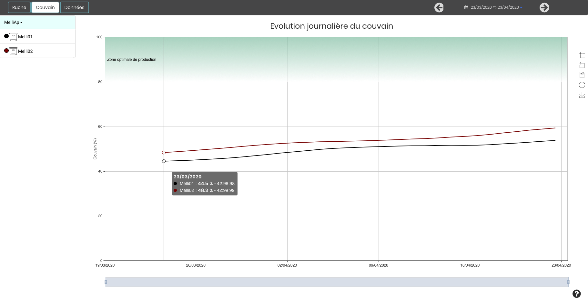

Au survol, vous pouvez voir les informations relatives aux ruches. 

### Données 

Dans le mode Données, vous povuez également sélectionner autant de ruches que vous le souhaitez et même si ces ruches sont dans deux ruchers différents. Cela vous permet de comparer des ruchers ou des ruches entre elles.

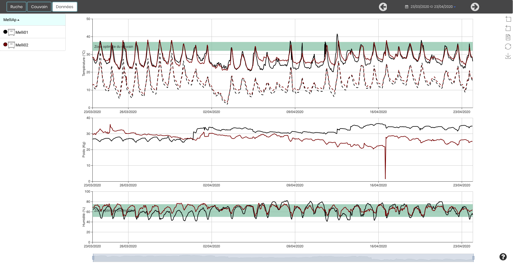

Vous visualiserez les données brutes de vos ruches avec la température interne en haut, le poids au centre et l'humidité en bas. En vert, vous aurez les zones optimales pour le couvain et l'humidité. 
Il est très facile de se servir de l’outil, vous pouvez zoomer, sélectionner des zones, vous déplacer, etc. 

## Alertes

Dans cette partie de l'application, vous pourrez naviguer avec une nouvelle barre entre 'Ruche', 'Météo', 'Capteur' et 'Paramètres'. Par défaut, vous arrivez sur le mode 'Ruche'. 

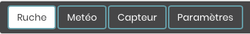

### Ruche

Dans cet onglet, vous pouvez voir toutes les alertes concernant vos ruches. Ces icônes d'alertes pourront se retrouver dans votre calendrier d'événements de ruches. 

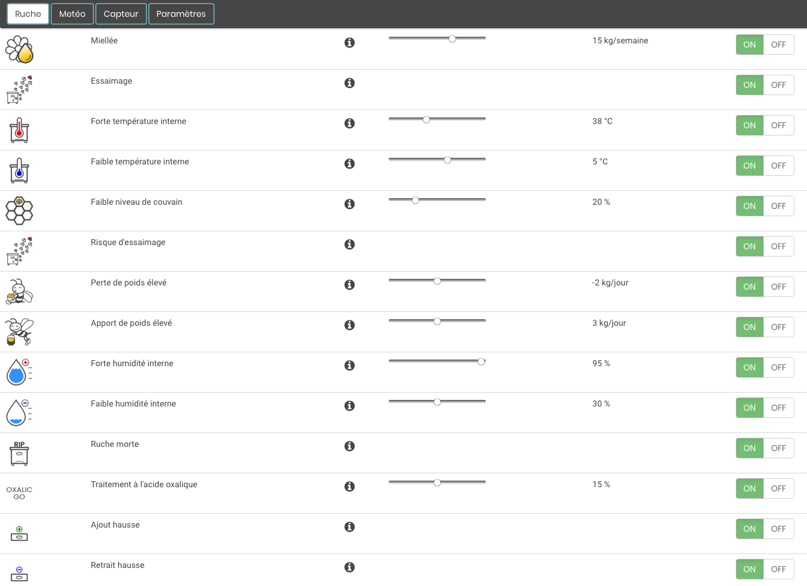

Vous pouvez les activer et désactiver 'ON/OFF' et modifier les seuils de certaines alertes avec la barre. Par défaut, tout est activé avec des paramètres auto ajustés. 

Vous avez également un icône 'i' d'information. Au survol, vous retrouverez un descriptif de l'alerte. 

### Météo 

Dans cet onglet, vous pouvez voir toutes les alertes concernant vos données de météo. Ces icônes d'alertes pourront se retrouver dans votre calendrier d'événements de rucher. Vous pouvez une nouvelle fois ajuster et désactiver/activer les différentes alertes. Par défaut, tout est activé avec des paramètres auto ajustés. 

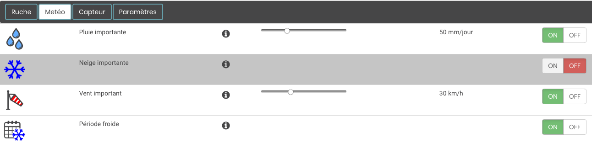

### Capteurs

Dans cet onglet, vous pouvez voir toutes les alertes concernant l'état de vos capteurs et le cas de la ruche volée. Ces icônes d'alertes ne se retrouveront pas dans vos calendriers d'événements. Vous pouvez visualiser ces états dans la partie 'Mon Rucher' lorsque vous sélectionner 'Capteur'. De même, si vous avez activé les emails d'alertes (prochaine partie), vous serez averti des états de vos capteurs. 

Vous pouvez une nouvelle fois ajuster et désactiver/activer les différentes alertes. Par défaut, tout est activé avec des paramètres auto ajustés. 

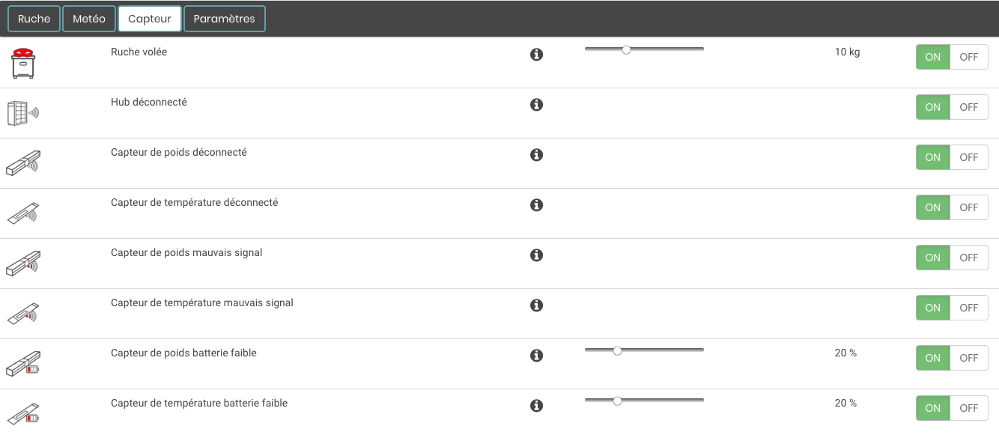

### Paramètres d'email

C'est dans cet onglet que vous pouvez configurer les envois par email. Nous vous conseillons fortement d'activer ces emails. Si vous avez un Hub, il est conseillé de sélectionner l'envoi journalier. Dans les autres cas, une semaine peut être suffisant. 

Par défaut, l'envoi est OFF et votre adresse mail est inscrite dans la première case. Vous pouvez ajouter jusqu'à deux adresses, les emails seront envoyés aux deux adresses. Pour tester que l'outil fonctionne, vous povuez cliquer sur le bouton 'Tester email', un email sera instantanément envoyer vers les adresses enregistrées. Si vous ne recevez rien dans les minutes suivantes, veuillez contacter support@mellisphera.com. 

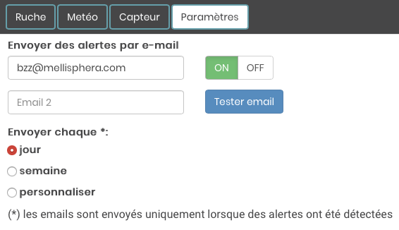

Dans ces emails, vous aurez accès à quatre informations :
- Les alertes obtenues depuis le dernier envoi de l'ensemble de vos ruches et ruchers
- Les événements à venir jusqu'à 3 jours
- L'état de vos ruches 
- L'état de vos capteurs 

Attention, lorsque vous désactivez une alerte, elle n'apparaitra plus dans les emails ni dans les calendriers à partir de la date de la désactivation, ce n'est pas rétroactif. De même, si vous effectuez un changement dans les seuils, cela s'effectuera uniquement pour les nouvelles alertes. 

Voici un aperçu d'un mail que vous pourrez recevoir :

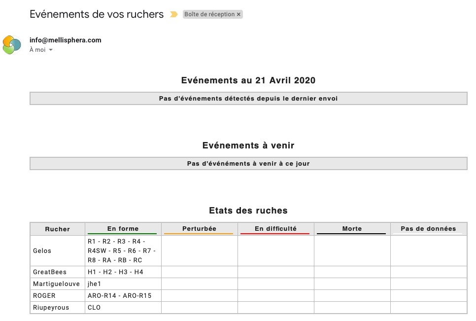
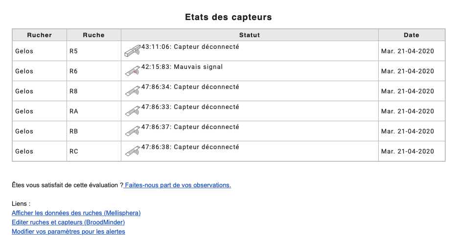

## MyBroodMinder

Vous serez redirigé vers la plateforme MyBroodMinder.com en cliquant sur l'icône de MyBroodMinder. En un seul clic vous pouvez passer d'une plateforme à l'autre, d'un côté sur MyBroodMinder pour gérer vos configurations de ruchers, ruches, capteurs et de l'autre sur Mellisphera pour analyser vos données avec précision et être informé en temps réel de ce qu'il se passe sur vos ruches.

## Support

C'est en réalité un lien pour envoyer un message vers notre support.

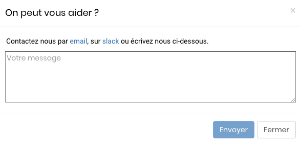

Envoyez nous vos questions, vos retours, votre expérience, vos idées d'améliorations et vos problèmes. Tout est bon à prendre. Dans tous les cas, une seule adresse : support@mellisphera.com.

## Documentation 

Ce bouton vous renvoie sur ce guide : https://doc.mellisphera.com. Il est utile pour comprendre le fonctionnement de la plateforme Mellisphera et en cas de nécessité. 