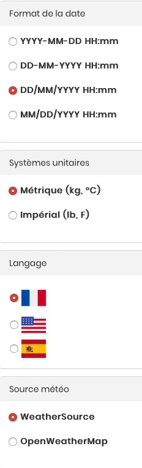
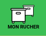
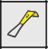
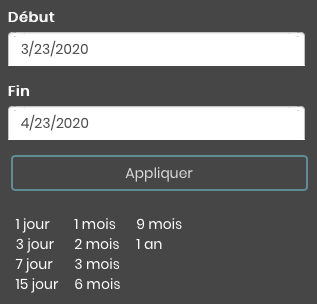

# Mellisphera.com

## Présentation générale 

Vidéo ancienne en français : https://www.youtube.com/watch?v=Nqh_R37O8IE 

Vidéo récente en anglais : https://www.youtube.com/watch?v=pbCqpf8EY0s

## Mellisphera & BroodMinder

Mellisphera est intégrée avec BroodMinder. Ainsi, vous devez créer un compte MyBroodMinder et configurer vos ruchers / ruches sur https://mybroodminder.com. Le site vous permet d'affecter les capteurs à chaque ruche et de visualiser les données mesurées. 

Un bouton Mellisphera sera toujours visible sur le menu de gauche, il suffit de cliquer sur celui-ci pour y accéder. Si vous vous êtes connectés récemment, la connexion se fera sans que vous ayez besoin de rentrer votre email et votre mot de passe. Dans le cas contraire, le champ de l'email sera auto rempli. 

Votre aventure commence donc maintenant https://bzz.mellisphera.com/login.

## Page de connexion 

Sur la page de connexion, vous avez la possibilité de vous connecter à un rucher démo si vous ne possédez aucun compte ou si vous êtes curieux et avide de nouveauté. Vous pouvez lire les informations qui vous en apprendront davantage sur la relation entre BroodMinder et Mellisphera et sur ce que Mellisphera peut vous apporter.

Passons à l'étape de la connexion. **Il faut que vous utilisiez vos identifiants BroodMinder**. Une fois connecté, vous hériterez de l'historique complet de vos capteurs. Vous pourrez explorer les événements passés et suivre l'évolution de la saison sous un angle complètement nouveau. Lors de la première connexion, vous êtes averti que le chargement de l'ensemble de l'historique de vos données est lancé. A chaque nouvelle connexion, nous chargeons vos données manquantes.

Nous allons faire un tour ensemble des différentes fonctionnalités de Mellisphera.

## Ecran d'accueil

Une fois connecté à Mellisphera vous devriez arriver sur cette interface. Elle se décompose en trois zones:

La barre d'en haut vous permet de sélectionner le rucher à visualiser. Un peu plus loin se trouvent vos préférences. Sur le côté gauche se trouvent les différents environnements de Mellisphera. Nous allons explorer chacun de ces espaces dans les prochains chapitres. 

Des infobulles sont également positionnées à côté de chaque fonctionnalité. Elles détaillent les informations essentielles à la compréhension des données.

## Paramètres de compte

En haut à droite sur l'app Mellisphera, vous avec accès à vos paramètres de compte. 

Vous pouvez réinitialiser votre mot de passe. Attention, cela ne modifie le mot de passe que pour la plateforme Mellisphera. 

Vous pouvez également définir quelques préférences: 
- le système d’unité (métrique ou impérial)
- le format de la date 
- la langue (français, espagnol ou anglais pour le moment)
- la source météo

## Vue du rucher

Cette page est le point de départ de Mellisphera. Sélectionnez le rucher à explorer sur le menu déroulant tout en haut et ensuite naviguez visuellement parmi les principales informations.

Cette navigation est contextualisée sur le rucher à l'aide d'une photo qui vous permet de situer l'emplacement de vos ruches. Par dessous vous pourrez positionner des "pastilles" qui matérialisent la ruche et portent les informations associées (nom, poids, couvain etc).

#### Photo et placement

Lors de votre première connexion, vous pourrez ajouter une photo de votre rucher. Soit par glisser/déposer d'un fichier depuis votre explorateur de fichiers préféré, soit en ouvrant le menu contextuel matérialisé par une icone "appareil photo" en haut à droite du cadre de la photo.

#### Export des données 

Sur l'image, vous avez également un icône pour l'export de vos données. C'est un export excel (csv ou .xlx) des données de vos ruchers (ruches, capteurs, batterie, couvain, poids) et de vos dernières notes. Cela s'avère très utile lors de vos visites au rucher.

#### Navigation photo

L'image du rucher et les pastilles, sont associées à un ensemble de boutons positionnés juste au dessus. Cette barre de navigation vous permet de visualiser contextuellement diverses informations: 

Les boutons 'Nom', 'Couvain', 'Poids', et 'Capteur' sont activables. Cela permet d'afficher sur la photo en dessous des pastilles respectivement le nom, le couvain, le poids et les capteurs de l'ensemble des ruches de votre rucher à la date affichée en haut à droite. Par défaut, c'est la date de la veille (qui correspond au dernier jour de données en général). Vous pouvez bien entendu changer de date. 

#### Etat des capteurs

Petite particularité pour les capteurs, vous visualisez leur état en temps réel par une couleur (grise, rouge, orange) qui détermine l'état et un affichage au survol du problème. Pour plus de détails, vous pouvez vous réferrer à la section 'Interprétation des données'. 

#### Pastilles de couleur

Les pastilles indiquent l'état de chaque ruche avec un code couleur (noir, rouge, orange, vert). Vous pouvez également regarder au survol le message associé à chaque état. L'état est calculé à une fréquence journalière en fin de journée par le modèle BFit. C'est pour cela que vous visualisez systématiquement le jours j-1. Avec le sélecteur de date en haut à droite, vous pouvez naviguer parmi les jours précédents également. 

Notez que les ruches non équipées de capteurs ou celles qui n'ont pas de données au jour j-1 présentent une pastille blanche. 

Pour plus d'information à propos du modèle BFit calculant l'état des ruches, vous pouvez consulter la section 'Interprétation des données'. 

#### Calendrier des événements du rucher

Vous disposez d'un calendrier d'événements propre à chaque rucher. Ce calendrier vous permet de tracer les interventions réalisées au niveau de l'ensemble du rucher, ou des observations générales. 
Le calendrier affiche également les alertes et notifications (nous verrons comment les configurer plus loin) au niveau du rucher. 

#### Notes de rucher

Pour terminer la vue rucher, vous pouvez saisir vos notes/inspections de rucher. Cela se situe juste en dessous de la photo de votre rucher.

Pour écrire une nouvelle note, il suffit de cliquer sur le '+' de l'encart, c'est très simple. 

Vous verrez apapraître la note directement sur le calendrier des événements avec l'icône suivante.

### Vue de la ruche

Pour accéder à la vue d'une ruche, vous devez cliquer sur sa pastille ou son nom. La pastille s'entoure en rose et trois nouveaux calendriers correspondant à la ruche selectionnée apparaissent sur la droite. 

Les données affichées sont des données issues des 5 dernières semaines ainsi que des 3 prochains jours puisque nous pouvons prédire des événements à 3 jours. 

#### Evénements

Vous retrouvez le calendrier d'événenements qui est cette fois-ci propre à la ruche selectionnée. Les événements de ruchers et de ruches sont différents. Pour plus de précision, aller dans la section 'Interprétation des données'.

#### Couvain

Vous avez une vision globale de l'évolution du couvain journalier sous forme de calendrier heatmap. Les couleurs varient de rouge à vert et le pourcentage de 0 à 100%. Pour plus de détails quant au model de calcul du couvain, il faut se rendre dans la section 'Interprétation des données'. Si vous possédez plusieurs capteurs de température sur votre ruche, vous pouvez cocher ou décocher celui que vous voulez afficher.

#### Productivité

Ce calendrier offre une vue globale de l'apport de poids journalier sous forme de bulle. Les couleurs sont rouge pour une perte et vert pour un gain. La taille des bulles est proportionnelle à la variation de poids générée par les abeilles (nous soustrayons toute éventuelle manipulation d'ajout ou suppression de matériel). Nous appelerons donc cela la productivité de la ruche. Pour plus de détails quant au modèle de calcul de la productivité, il faut se rendre dans la section 'Interprétation des données'. Vous pouvez afficher uniquement les gains ou les pertes sur le calendrier en cochant/décochant les cases en dessous du calendrier. 

#### Notes

Il est possible de prendre des annotations au niveau de chaque ruche. Ce sont des notes distinctes de vos notes de rucher et qui ne concernent que la ruche sélectionnée. Pour repasser en mode rucher, il suffit de cliquer sur le bouton 'Rucher' de la barre de naviguation grise.

## Explorer

La vue **Rucher** donne un aperçu global de la situation. Dans **Explorer**, vous pourrez naviguer parmi vos données de façon plus approfondie. Une nouvelle barre grise apparait avec trois nouveaux espaces : 'Ruche', 'Couvain', 'Données'. Par défaut, vous arrivez sur le mode 'Ruche'. 
De plus, les données du dernier mois s'afficheront par défaut. Vous pouvez modifier la date en haut à droite. Vous pouvez modifier et personnaliser cette période de données à votre guise ou en utilisant les flèches pour vous déplacer dans le temps de période en période. 

### Ruche

Dans le mode ruche, vous pouvez choisir entre toutes les ruches de tous vos ruchers mais vous ne pouvez sélectionner qu'une seule ruche à la fois. Vous avez une vue de trois calendriers. 

**Le premier calendrier** récapitule les données de votre ruche, vous pouvez choisir entre les différentes options 
- Couvain 
- Productivité
- Température interne maximum
- Température interne minimum
- Humidité interne maximum
- Température externe maximum
- Température externe minimum

**Le deuxième calendrier** fait état des événements de votre ruche et du calendrier lunaire. 
- événements, annotations et alertes
- calendrier lunaire

**Le troisième calendrier** présente les données météo de votre rucher. Il est donc identique à toutes les ruches d'un même rucher. Vous aurez accès aux données générales 'Météo', 
- Température externe maximum
- Température externe minimum
- Humidité externe maximum
- Humidité externe minimum
- Vent
- Précipitations

Vous pouvez aussi visualiser des prévisions météo jusqu'à 5 à 15 jours en fonction du modèle sélectionné. 
Si vous n'avez aucune donnée météo, veuillez vous référer à la FAQ. Pour avoir des détails sur les différents modèles, il faut se rendre dans la section 'Interprétation des données'. 

Vous pouvez donc visualiser et échanger les modes du calendrier comme vous le souhaitez. Voici un exemple :

### Couvain

Dans le mode Couvain, vous pouvez, cette fois-ci, **sélectionner autant de ruches que vous le souhaitez** et ce, même si ces ruches sont dans deux ruchers différents. Cela vous permet de comparer des ruchers ou des ruches entre elles.

Au survol, vous pourrez voir les informations relatives aux ruches. 

Cet outil est extrêmement performant pour analyser des données sur des longues ou courtes périodes de temps, sur des ruches d'un même rucher ou de différents ruchers. Il donne une énorme flexibilité pour l'analyse.

### Données 

Dans le mode Données, vous visualiserez les données brutes de vos ruches avec la température interne en haut, le poids au centre et l'humidité en bas (un peu comme sur mybroodminder). En vert, vous aurez les zones optimales pour le couvain et l'humidité.  vous pouvez également sélectionner autant de ruches que vous le souhaitez et ce, même si ces ruches sont dans deux ruchers différents. Cela vous permet de comparer des ruchers ou des ruches entre elles.

Il est très facile de se servir de l’outil. Les petites icones sur la droite du graphique vous permettent de zoomer, sélectionner des zones, vous déplacer, voir les données en listing, etc. 

## Alertes

Dans cet espace vous trouverez toutes les fonctions pour mettre en oeuvre un service de notifications et alertes sur chacun de vos ruchers. Ici aussi vous trouverez une nouvelle barre de navigation qui est en fait un classement dy type d'alertes selon 3 catégories: 'Ruche', 'Météo', 'Capteur' plus le bouton 'Paramètres' qui est dédié à la configuration 

### Ruche

Dans cet onglet, vous pouvez voir toutes les alertes concernant vos ruches. Ces icônes d'alertes pourront se retrouver dans votre calendrier d'événements de ruches. 

Vous pouvez les activer et désactiver 'ON/OFF' et modifier les seuils de certaines alertes avec la barre. Par défaut, tout est activé avec des paramètres auto ajustés. 

Vous avez également une icône 'i' d'information. Au survol, vous retrouverez un descriptif de l'alerte. 

### Météo 

Dans cet onglet, vous pourrez voir toutes les alertes concernant la météo. Ces icônes d'alertes pourront se retrouver dans votre calendrier d'événements de rucher. Vous pouvez une nouvelle fois ajuster et désactiver/activer les différentes alertes. Par défaut, tout est activé avec des paramètres auto ajustés. 

### Capteurs

Dans cet onglet, vous pourrez voir toutes les alertes concernant l'état de vos capteurs et le cas de la ruche volée. Ces icônes d'alertes ne se retrouveront pas dans vos calendriers d'événements. Vous pouvez visualiser ces états dans la partie 'Mon Rucher' lorsque vous sélectionner 'Capteur'. De même, si vous avez activé les emails d'alertes (prochaine partie), vous serez averti des états de vos capteurs. 

Vous pouvez une nouvelle fois ajuster et désactiver/activer les différentes alertes. Par défaut, tout est activé avec des paramètres auto ajustés. 

### Paramètres d'email

C'est dans cet onglet que vous pourrez configurer les envois par email. Nous vous conseillons fortement d'activer ces emails. Si vous avez un Hub, il est conseillé de sélectionner l'envoi journalier. Dans les autres cas, une semaine peut être suffisant. 

Par défaut, l'envoi est OFF et votre adresse mail est inscrite dans la première case. Vous pouvez ajouter une deuxième adresse. Les emails seront envoyés aux deux adresses. Pour vérifier que l'outil fonctionne, vous pouvez cliquer sur le bouton 'Tester email', un email sera instantanément envoyer vers les adresses enregistrées. Si vous ne recevez rien dans les minutes suivantes, veuillez contacter support@mellisphera.com. 

Dans ces emails, vous aurez accès à quatre informations :
- Les alertes obtenues depuis le dernier envoi de l'ensemble de vos ruches et ruchers
- Les événements à venir jusqu'à 3 jours
- L'état de vos ruches 
- L'état de vos capteurs 

Attention, lorsque vous désactivez une alerte, elle n'apparaitra plus dans les emails ni dans les calendriers à partir de la date de la désactivation, ce n'est pas rétroactif. De même, si vous effectuez un changement dans les seuils, cela s'effectuera uniquement pour les nouvelles alertes. 

Voici un aperçu d'un mail que vous pourrez recevoir :

## MyBroodMinder

Vous serez redirigé vers la plateforme MyBroodMinder.com en cliquant sur l'icône de MyBroodMinder. En un seul clic vous pouvez passer d'une plateforme à l'autre, d'un côté sur MyBroodMinder pour gérer vos configurations de ruchers, ruches, capteurs et de l'autre sur Mellisphera pour analyser vos données avec précision et être informé en temps réel de ce qu'il se passe sur vos ruches.

Rappelez-vous que les modifications effectuées sur MyBroodMinder seront récupérées lorsque vous vous connecterez à nouveau sur mellisphera. 

## Support

C'est en réalité un lien pour envoyer un message vers notre support.

Envoyez nous vos questions, vos retours, votre expérience, vos idées d'améliorations et vos problèmes. Tout est bon à prendre. 
Vous pouvez également nous écrire par email à l'adresse : support@mellisphera.com.

## Documentation 

Ce bouton vous renvoie sur l'ensemble de la documentation utilisateur : https://doc.mellisphera.com. 

Ce portail, entièrement dédié à la documentation de l'ensemble du système, est structuré en plusieurs zones comme indiqué dans l'image ci-dessous. 

1. Choix de la langue de la documentation
2. Documents disponibles
3. Corps du document
4. Chapitres du document sélectionné permettant un accès rapide
5. Recherche par mot clé

N'hésitez pas à utiliser la **recherche par mot clé**: elle est extremement puissante et vous fournit des résultats sur l'ensemble de la documentation disponible

Un exemple ici avec le mot clé "batterie"

