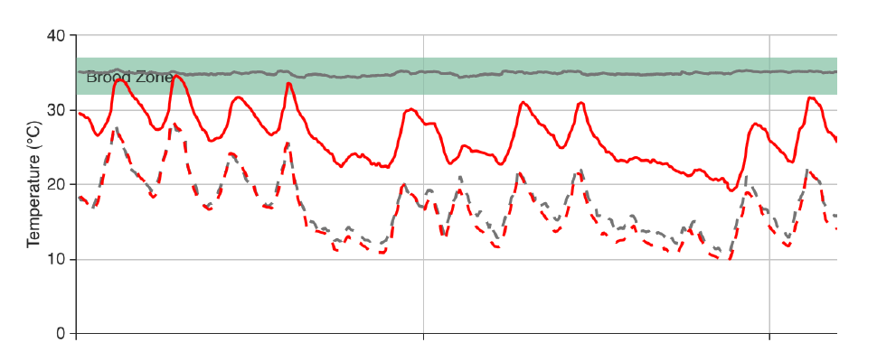

# Interprétation des données

##	Hive Weight Profiles    
## Swarm Detection with a BroodMinder TH Device in a Top Bar Hive  
## Avoiding Excessive Heat in the Hive During Summer Months 
## Detection of Cluster/Queen Movement and Spring Brood Buildup 
## Pull the Supers When the Dearth Hits 
## Promising Citizen Science Project Observations 
## Using BroodMinder Data to Optimize Hive Preparation for Winter 
qegqsggs

# Modèles

Dans cette partie sont abordés les aspects plus techniques du fonctionnement de Mellisphera. On y présente les différents modèles BFIT, BFORCE, BWEIGHT ainsi que les sources METEO et les ALERTES.

## Etat des ruches - BFit
BFIT comme _Bee Fitness_ est l'algorithme qui informe l’apiculteur de l'état de chaque ruche. Nous utilisons des repères comme la période de la saison et l’état des ruches environnantes pour définir un état « nominal » de la ruche. Ensuite, nous positionnons chaque ruche par rapport à cette référence.

Le rendu est très visuel avec des pastilles de couleurs pour indiquer leur état. Pour compléter l'information une infobulle (au survol) précise la nature de la situation.

Le code couleur est le suivant :

| couleur | signification|
|---|---|
| Noir | Votre ruche est déclarée morte|
|Rouge | Votre ruche est en difficulté |
|Orange | Votre ruche est perturbée (en déclin ou présente des événements anormaux) |
|Vert | Tout va bien pour votre ruche |
|Blanc | Pas de données sur votre ruche (ou pas de météo) |

En activant l'envoi d'alertes dans Mellisphera vous recevrez par email un tableau récapitulatif avec l'ensemble des informations :

BFit repose sur les algorithmes qui collectent les événements. L’algorithme ‘Learning’ apprend des événements précédents pour conserver, ou non, les événements futurs. Il y a, par la suite, une classification entre les événements détectés ayant une incidence sur l’état de la ruche et les autres. 

BFit prend aussi en compte les résultats fournis par BForce. De cette façon il est capable de déterminer l’écart entre la dynamique actuelle de la ruche et une dynamique du couvain théorique en constante évolution. Cette dynamique théorique est régulièrement actualisée. Elle prend également en compte les diférentes régions du monde pour fournir des informations pertinentes selon la latitude ou le climat. 

## Niveau de couvain - BForce

Le développement du couvain est un facteur clé pour les colonies d'abeilles. L'objectif de BForce est de fournir une indication du niveau de couvain dans la ruche sur une échelle de 0 à 100%. 

Lorsque la colonie est à plein régime elle atteint un état stable à 35°C. Cet état est associé au 100% de couvain. La ruche est forte. 
Au contraire lorsqu'elle n'a pas de couvain, les abeilles n'ont pas besoin de réguler la température de la grappe. Dans ce cas la température interne de la ruche suivra peu ou prou la température ambiante. Dans ce cas on aura 0% de couvain.

Entre ces deux points extrèmes on peut imaginer toutes les situations intermédiaires. 

Pour illustrer ces propos, voici les mesures horaires sur deux ruches du même rucher. La première est représentée en rouge et la deuxième en gris. Chacune présente un état bien différent. La rouge possède une température interne avoisinant les 25°C/30°C suivant les mêmes fluctuations que la température extérieure (en pointillés), tandis que la grise, est constante autour des 35°C dans la fameuse ‘Zone optimale de couvain' ou 'Brood zone'.

Dans cet exemple la ruche grise a une grande proportion de couvain alors que la rouge n’en a que très peu. **BForce met en équation cete caractéristique des colonies et traduit la mesure brute de température en une information standardisée et compréhensible**. Le modèle prend en compte un certain nombre de paramètres pour estimer au mieux le niveau de couvain.

- température interne de la ruche
- température ambiante
- évolution des colonies voisines
- saison, latitude et climat
- autres évenements identifiés dans la ruche
- type de ruche

BForce est également un **outil de renforcement dans la détection d’essaimage** puisque lorsqu’un essaimage a déjà été détecté par un autre de nos outils de Machine Learning, le couvain s’en voit impacté par la perte de la reine et donc l’arrêt de la ponte. Cela nous permet donc également de classifier nos différents essaimages détectés. 

**Résultats complets**

Les calendriers et graphiques du couvain affichent la progression journalière du couvain de chaque ruche. Les valeurs sont graduées de 0% (pas de couvain) à 100% (couvain complet). En règle générale, 10% est un cadre de couvain, 40% 4 cadres, etc. Selon votre pratique et le modèle de ruche utilisé (Langstroth, Dadant) vous devez ajuster ces relations. Ainsi, **en général les ruches dont le niveau de couvain est supérieur à 80% produisent du miel**. 

En un coup d’oeil il est possible de visualiser l’historique de la saison. Les arrêts et reprise de ponte étant clairement repérables.

<i>Calendrier de couvain</i>

Il est également possible de comparer plusieurs ruches entre elles, quel que soit leur rucher.

<i>La même ruche avec le couvain annuel comparée à deux autres ruches</i>

Avec l'habitude on arrive à identifier plusieurs évenements sur ces courbes. Il est possible de repérer débuts et arrets de ponte certes. Mais aussi essaimages, périodes de mauvaise météo qui ont impacté la production de couvain, effet des frelons asiatiques, etc, etc. 

<i>Trajectoire de deux ruches sur une saison avec quelques evenements</i>

## Productivité - BWeight
Avoir des fleurs n’implique pas nécessairement l’existence de nectar, donc de ressources pour les abeilles. En effet, nombreux facteurs conditionnent l’existence d’une miellée : la température et l'humidité ambiantes, les dernières pluies et leur intensité, la profondeur des racines pour des plantes comme le colza ou le tournesol. La miellée n’est donc pas acquise ni aisée à identifier. Pourtant comprendre les miellées est un besoin élémentaire pour chaque apiculteur 

Un capteur de poids installé sous la ruche fournit des informations détaillées de gain et perte de poids. Toutefois ces informations prennent en compte plusieurs aspects qui ne sont pas en lien avec la productivité.

En premier lieu, dans la journée les variations de poids dépendent des ressources apportées ou consommées, mais aussi du déplacement des abeilles qui, en journée, sortent butiner plus ou moins nombreuses. 

<i>Sortie des abeilles butineuses et retour avec du nectar</i>

C'est pour cette raison que les courbes de poids de la ruche présentent des "bosses". Une chaque jour comme dans le graphique ci dessous. Sur le graphique on voit également des variations soudaines de poids qui sont liées aux interventions de l'apiculteur.

<i>Historique de poids avec interventions de l'apiculteur</i>

Avec ces constats on voit que **pour bien évaluer la productivité il faut considérer uniquement les variations de poids provenant exclusivement de la production des abeilles**. De cette façon il faut négliger les événements extérieurs : nourrissement, essaimage, ajout/retrait de hausse, interventions de l'apiculteur, perte ou augmentation inexpliquée. L'algorithme BWeight permet de repérer facilement ces événements bien distincts et de les écarter du calcul de productivité. 

Le résultat est une information journalière de gain ou perte de poids. La représentation graphique sur le calendrier permet de bien repérer la miellée dans la saison ainsi que son intensité.

<i>Excellente miellée de tilleul fin juin !</i>

En prenant une échelle de temps plus large, au niveau de la saison, il est facile de relever et comparer le déroulement des différentes miellées.

<i>Calendrier des miellées d'une ruche transhumante en 2018</i>

# Environnement des colonies
La Météo et les saisons sont des facteurs clé en apiculture. Avec Mellisphera nous rapprochons ces infromations avec celles des colonies et des apiculteurs pour fournir la vue la plus complète des évenements.

## Météorologie
Deux sources météo sont disponibleqs dans Mellisphera

- WeatherSource (recommandée)
- Open WeatherMaps

La météo est associée au rucher, et pourtant à la ruche. Chaque ruche a un registre météo qui lui est propre. C'est à dire que deux ruches qui à un instant t se trouvent sur le même rucher vont partager la même méteo sur cette période. Mais l'une d'elles part en transhumance c'est la météo de chaque rucher qu'elle visitera qui sera enregistrée.

**Prévision à 7 jours**
Avec WeatherSource il est également possible de visualiser la prévision météo. Le jour J est systématiquyement repéré avec un carré violet comme dans l'image ci dessous.

<i>Météo moyenne du mois et prévision à J+7</i>

## Astronomie
Le calendrier astronomique présente très visuellement les phases de la lune. Mais également la durée du jour avec les heures de lever et coucher du soleil selon votre zone géographique.

<i>Au survol du calendrier lunaire on obtient aussi les informations du soleil</i>

## Système d'alertes

### Alertes de la ruche
| **Pictogramme** | **Alerte** | **Fréquence** | **Description** | 
|- |-- | -- | -- |
|  | Miellée | hebdo | l'alerte miellée se déclenche lorsque l'apport de poids net dans la ruche dépasse le seuil indiqué. Par défaut il est défini à 15kg/semaine.| 
|  | Essaimage | ??? | Alerte des essaimages en **temps réel** mais aussi **passés** dans le cas d'une synchro manuelle. Cette allerte fonctionne sur ruches équipées de capteurs de température.   Si une balance est présente ce sera encore plus précis mais ce n'est pas indispensable.   Nous pouvons ajuster les essaimages détectés en fonction de vos retours, n'hésitez pas à nous signaler des incohérences ou des oublis !
|  | Risque d'essaimage | ??? | En partant d'un certain nombre de paramètres on évalue le risque d'essaimage à 3 jours.   Cette alerte en cours de mise au point.| 
|  | Sur-Temperature | ??? | Certaines colonies n'arrivent pas à gérer leur température interne. Souvent il s'agit de divisions petittes populations. Mais parfois c'est la météo qui e un effet majeur à cause d'un défaut d'exposition   Dans ce cas le couvain de la ruche est mis a l'epreuve, car les températures peuvent ateindre les 40°C.| 
|  | Froid extrème | ??? | En hiver la grappe se resserre et maintient la temperature très localement. Etant loin du capteur. Pour cela l'indication de "basse température" ne peut être que informative. En focntion du contexte il faudra peut êter agir, ou pas.| 
|  | Faible couvain | hebdo | En pleine saison, une ruche qui présente des niveaux de couvain en dessous de 30% est une anomalie ou une division/essaim. Cette alerte permet d'identifier les colonies qui décrochent. | 
|  | Perte de poids | journée | Une consomation excessive/soudaine signifie souvent pillage de la ruche par une autre colonie.| 
|  | Gain de poids | journée | Alerte journalière qui informe d'un gain de poids lié aux apports des abeilles. Certainement à associer avec l'alerte miellée hebdo.| 
|  | Forte humidité | journée | En hiver l'humidité dans la ruche peut atteindre 80% de façon naturelle. Toutefois si le seuil est encore plus haut il faut penser à intervenir.   Cette alerte est uniquement opérationnelle avec les ruches équipées de capteurs TH| 
|  | Faible humidité | journée | En saison la zone optimale d'humidité se situe entre 50 et 75%.| 
|  | Ruche morte | journée | Si vous voyez arriver cette alerte, c'est trop tard. Cela signifie qu'il n'y a plus de signal de vie dans la ruche.| 
|  | Traiter varroa | journée | Cette alerte se déclenche lorsque le couvain moyen du rucher descend en dessous du seuil fixe (defaut à 15%). C'est le moment de planifier un traitement anti-varroa à l'acide Oxalique.| 
|  | Ajout hausse | journée | Pour les ruches équipées de balance, cette action est automatiquement détectée et afichée sur le calendrier.| 
|  | Retrait hausse | journée | Pour les ruches équipées de balance, cette action est automatiquement détectée et afichée sur le calendrier.| 
|  | Ruche volée | ??? | Les capteurs ne disposent pas d'une géolocalisation. Cependant, pour les ruches disposant d'un capteur de poids cette alerte prévient d'un poids anormalement faible, déclencheur possible d'un vol..| 

### Alertes Météo
L'ensemble des alertes météo ne sont que des alertes de prédiction à J+7 maximum. 
Elles sont évolutives. Si un événement est prévu à J+7 et que le lendemain cet événement n'a plus lieu d'être il n'est plus affiché.
Les alertes concernent majoritairement des évenements forts à extrèmes.

| **Pictogramme** | **Alerte** | **Fréquence** | **Description** | 
|- |-- | -- | -- |
|  | Pluie | jour | Forte pluie.  valeur par défaut à 50 mm/j  | 
|  | Neige | jour | Neige importante.  valeur par défaut à 15cm/j   | 
|  | Vent | jour | Vents forts.  valeur par défaut pour des raffales à 30 km/h   Dans certaines régions, il est conseillé d'augmenter le seuil par défaut si les alertes sont trop régulières.| 
|  | Froid | jour | Cette alerte est déclenchée en pleine saison lorsqu'il est prévu une période dite 'froide'. Cela inclut des journées ou des nuits jugées fraiches par rapport aux normales de saison. Nous fixons les paramètres nous-mêmes.| 

