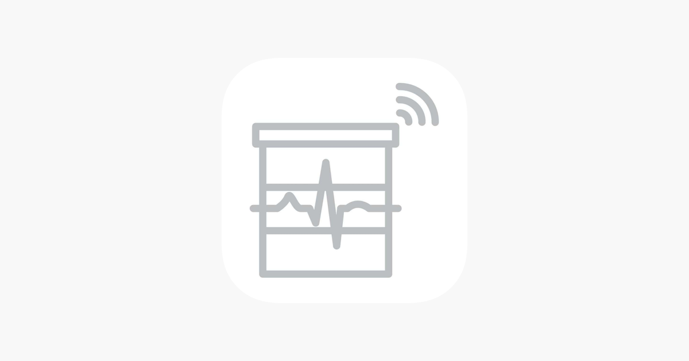
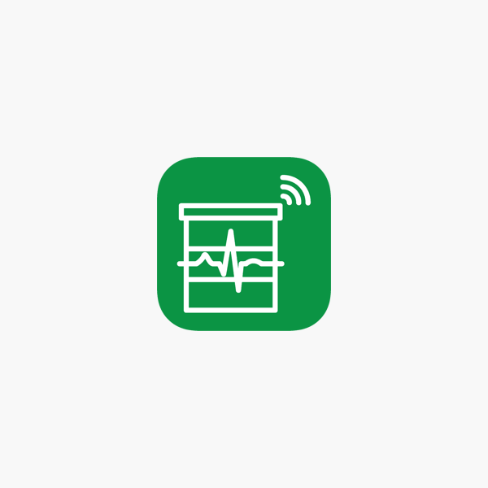
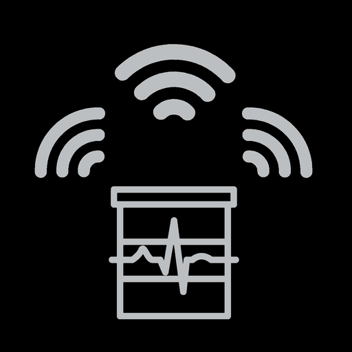
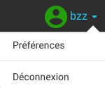
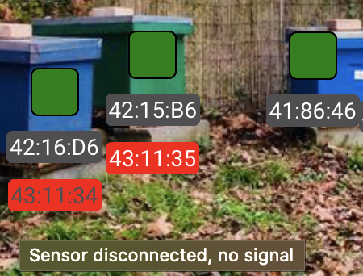

# FAQ

## Capteurs et logiciels 

### Quelles sont les différentes applications téléphone de BroodMinder ?

L'application BroodMinder (ou BroodMinder Lite) sont les applications gratuites de base. Elles vous permettent de lire vos appareils, de vous envoyer des données par courrier électronique, de voir des graphiques de données et d'annoter les données.
 

BroodMinder Apiary vous permet de télécharger les données de tous vos appareils BroodMinder directement dans MyBroodMinder en appuyant sur un seul bouton. C'est un excellent gain de temps pour les utilisateurs disposant de nombreux capteurs. L'application nécessite le MyBroodMinder-Premium qui est de 75 $/an. 

BroodMinder Cell est l'application qui permet de contrôler les Hub.

### Hub et synchronisation

#### Comment fonctionne un Hub ? Quelle portée ?

Avec le Hub, vous bénéficiez d’un suivi en temps réel. Vous avez accès à l’ensemble des alertes et vous pouvez anticiper les travaux sur votre rucher avant même de vous y déplacer. Il existe deux déclinaisons, Wifi ou GSM selon votre connectivité.
Ce transmetteur se place au milieu de votre rucher. Il récoltera et vous transmettra les données de façon automatique que vous ayez un seul ou des dizaines de capteurs sur un rayon de 20 à 30 mètres. 

Vous pouvez aller visionner la vidéo suivante pour avoir un visuel : 

#### Comment puis-je synchroniser mes données autrement ?

Vous devez vous rendre sur votre rucher avec un appareil possédant les applications BroodMinder et suivre les indications dans le guide des Apps BroodMinder.

#### Je n'arrive pas à synchroniser mes ruches, comment faire ?

La portée du Bluetooth dépend de nombreux facteurs. Sur certaines ruches, la portée est faible. Positionnez vous au plus près de la ruche et essayez de nouveau en suivant les instructions. Si un nouvel échec apparaît, contactez support@mellisphera.com. 

### Batterie 

#### La pile est-elle remplaçable ?

Oui.

#### Combien de temps la batterie durera-t-elle ?

Elle est conçue pour durer bien plus d'un an. Il est recommandé de la remplacer pendant la récolte d'automne. On vous avertit lorsqu'il est temps de remplacer la batterie.

#### Les capteurs BroodMinder dureront-t-il plus d'un an ?

Une fois la pile remplacée, ne vous inquiétez pas, les capteurs resteront utilisables pendant de très nombreuses années.

## Connexion et paramètres

### Je n'arrive pas à me connecter à Mellisphera, comment faire ?

Contactez-nous grâce au lien situé en dessous de la connexion. Nous tacherons de résoudre votre problème le plus rapidement possible. 

### Je suis un curieux sans ruches ou un apiculteur sans capteurs. Comment me connecter à plateforme sans compte et comment voir si l'application Mellisphera pourra m'apporter un intérêt ?

Dans tous les cas, vous pouvez utiliser le compte démo à votre guise. Ce compte possède les données de quelques ruches afin de vous montrez ce que nous proposons.

### Paramètres du compte

#### Où puisje changer la langue, le format des dates, l'unité du système ou encore mon modèle météo ?

En haut à droite sur l'app Mellisphera, vous avec accès à vos paramètres de compte. 

Vous pouvez changer votre système d’unité (métrique ou impérial). Vous pouvez également changer le format de la date à votre guise ou encore la langue (Français, Espagnol ou Anglais pour le moment). Une dernière possibilité s’offre à vous, celle du choix de la source météo. Selon votre préférence et vos retours, vous pourrez choisir votre source préférée. 

## Données

### Je n'ai aucune donnée à ma connexion, pourquoi ? 

Vos données se chargent à chaque nouvelle connexion. Lors de votre première connexion, il se peut que le processus soit long si vous disposez d’un nombre conséquent de capteurs. Soyez patient, cela peut prendre plusieurs dizaines de minutes lors de votre toute première connexion.

### Déplacer un capteur ou une ruche

#### Comment déplacer mon capteur de ruche ou ma ruche de rucher ?

Dans le cas où vous souhaiter changer votre capteur de ruche ou la ruche de rucher, vous devez vous rendre sur MyBroodMinder.com pour l’indiquer. Dans la section ‘Configurer’, vous devez cliquer sur 'Historique emplacements' pour le capteur concernée ou 'Historiques ruchers' pour la ruche concerné. 

Sur cette page, vous pouvez voir l’historique des positions de vos capteurs dans vos différentes ruches, et également l'historique de vos ruchers pour vos ruches. Vous pouvez donc modifier ou ajouter une nouvelle localisation pour votre capteur ou votre ruche. N’oubliez pas de bien préciser les dates de début et de fin pour toutes les localisations si cela est nécessaire. 
Vous pourrez voir les changements sur Mellisphera à votre prochaine connexion, l’historique de vos données est conservée sur la ruche précédente et les nouvelles données arriveront dorénavant sur la ruche mentionnée dans la nouvelle localisation. 

#### J'ai une ruche morte, puis-je la déclarer morte et ne plus la voir apparaître au sein de l'application ?

Oui ! Il faut se rendre sur MyBroodMinder.com dans 'Configurer'. Dans le menu 'Ruches', vous pouvez 'désactiver' la ruche souhaitée. A votre reconnexion sur Mellisphera, vous ne la verrez plus. 

Attention, cette action est irréversible. Vous ne pourrez plus activer de nouveau cette ruche mais vous pourrez toutefois créer une nouvelle ruche sous le même nom.

#### Mon calendrier lunaire ainsi que les calendriers associés à la météo sont toujours vides, comment remédier à cela ?

Vos calendriers sont vides si vous n’avez pas rempli les champs ‘Code Postal’ et ‘Code Pays’ à la création de votre rucher. Si c’est le cas, nous vous conseillons de vérifier ces paramètres sur BroodMinder (dans Configurer puis Ruchers). 

Sans cela, nous ne pouvons pas calculer vos données lunaires et météorologiques.
Vos calendriers devraient ressembler à cela si vos paramètres sont corrects :

#### La météo de mon rucher signifie qu’il a beaucoup plu hier alors que ce n’est pas vrai, pourquoi ?

Il est bon de savoir que la météo se base sur des modèles et une localisation pas toujours précise. Dans certains cas, les données peuvent être légèrement différentes de la réalité. Si les résultats ne vous conviennent pas, vous avez la possibilité de changer de source météo dans les paramètres de compte Mellisphera (voir plus haut dans la section des paramètres).

#### Ma ruche a perdu énormément de poids hier suite au retrait d’une hausse mais le calendrier des variations de poids prétexte le contraire, pourquoi ? 

Notre calendrier de poids affiche la productivité journalière de vos ruches équipées. Chaque jour, nous calculons les apports de poids ou les consommations de vos abeilles. Cela insinue donc que nous ne prenons pas en compte les opérations de l’apiculteur (alimentation, retrait ou ajout de hausse, etc.) ou les variations excessives de poids dû à un essaimage par exemple.

#### J’ai plusieurs relevés de poids chaque jour, je ne comprends pas la signification.

Cela signifie que vous possédez plusieurs capteurs de poids qui sont assignés à votre ruche. Vérifier les assignations de vos capteurs sur MyBroodMinder.com. Si cela est voulu, vous pouvez cocher ou décocher en haut du calendrier le capteur que vous souhaitez afficher comme le montre l'image suivante. Par défaut, on affiche l'ensemble des capteurs de poids.

#### Pourquoi ai-je des pastilles blanches sur la photo de mon rucher? 

Lorsqu’une pastille est blanche (sans couleur) c’est qu’il n’y a pas de données associées à ce capteur à la date choisie. Les raisons peuvent être multiples mais la cause principale est un capteur défectueux ou des données non synchronisées.

#### Je ne veux plus voir les alertes de météo sur mon calendrier, est-ce possible ?

Oui ! Vous pouvez modifier les alertes comme vous le souhaitez. Elles sont même personnalisables. Il suffit de vous rendre dans les paramètres d’alertes. 

Cependant, ce n'est pas rétroactif, cela sera actif à partir de l'instant où vous changez les paramètres, nous ne revenons pas sur l'historique des alertes.
Les modifications effectuées ne concernent donc que les nouvelles alertes. Prenez garde, le message affiché au survol des alertes dépend uniquement de vos paramètres actuels. Les modifications sont effectives immédiatement dans vos calendriers d’événements.

#### Je ne reçois aucun email pour les alertes, pourquoi ?

Par défaut, l’envoi d’email est désactivé. Vous devez vous rendre dans les paramètres des alertes (bouton suivant) puis dans les paramètres (voir ci-dessous).

Vous activez simplement en cliquant sur ‘ON’. Par défaut, votre email de connexion est inscrit dans l’encart ‘Email 1’, vous pouvez le modifier ou en ajouter un deuxième. Les emails s’envoient sur les deux adresses si vous choisissiez d’en inscrire deux. Vous pouvez tester que cela est bien fonctionnel en appuyant sur le bouton de test, un email vous sera envoyé instantanément. Enfin, vous pouvez régler la fréquence d’envoi comme vous le souhaitez. Dans cet email, vous retrouverez un récapitulatif des événements à venir et passés mais également un récapitualitf de l'état de vos ruches et capteurs.

#### Un de mes capteurs est affiché en rouge, qu’est-ce que cela veut dire ?

En effet, dans la partie ‘Mon Rucher’ de Mellisphera, l’onglet ‘Capteur’ vous permet également de connaître l’état de vos capteurs. Ici, il s’agit en fait d’un problème sur votre capteur. Si votre capteur est affiché orange ou rouge, nous vous conseillons d’aller vérifier votre capteur. Le message affiché au survol de la souris peut vous donner des indications (voir ci-contre). Cela peut-être aussi bien la batterie qui est faible ou bien si vous êtes équipé d’un Hub, cela signifie que votre capteur a un problème de signal. Dans tous les cas, nous vous conseillons d’aller vérifier votre appareil. 
Mellisphera possède un système d’alertes qui vous prévient de ce type d’événement sur votre ruche. On pourra donc vous informer par email (à condition que vous ayez activé le système) de l'état de vos capteurs.

## Partage

#### Y a-t-il un moyen de partager mes données avec la communauté ?

Oui ! Allez sur MyBroodMinder.com et créez un compte. Vous pourrez alors télécharger vos données BroodMinder et les stocker sur ce site. Une fois que vous les avez envoyées, elles deviennent des données du domaine public et seront partagées avec tous ceux qui veulent les analyser. Il est très facile à partager avec vos amis.

#### Les gens sauront-ils où se trouve ma ruche ?

Non. Nous ne conservons les données de localisation que par code postal.

#### Puis-je voir ces données publiques ?

Oui, vous pouvez les voir. Allez sur BeeCounted.org et vous pourrez voir les données en direct.

#### Puis-je partager mes ruchers à mes amis apiculteurs ?

Cela sera bientôt possible et visible sur Mellisphera ! En attendant, vous le pouvez sur MyBroodMinder.com, il suffit de se rendre dans les paramètres de configurer, de sélectionner un rucher et de cliquer sur Partager. Il ne vous faut connaître uniquement le nom d’utilisateur de vos amis, c’est très simple. Une fois partagé à vos amis, votre rucher sera visible de leur propre compte.  

## Contact – Autres questions

Si elle concerne Mellisphera, envoyez-là à support@mellisphera.com et nous tacherons d'y répondre.
