# Quick Start Guide

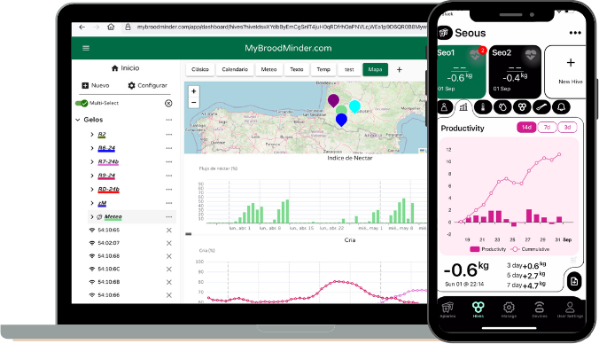{ style="display: block; margin: 0 auto" }

We've done our best to make the installation and use of your BroodMinders intuitive and easy. Follow the process below to get to grips with all aspects of the solution (Sensors, App and Web...) and you'll have every chance of success.

---

<table style="width:100%; background:#eaf6ff; border:1px solid #b8def5; border-radius:12px; padding:16px; margin:24px 0;">
  <tr>
    <td colspan="2" style="text-align:center; padding:12px;">
      <h2 style="margin:0;">🎥 Watch the Quick Start Videos First</h2>
      

        The fastest way to get started: Step 1 at home, then Step 2 in the apiary.
      

    </td>
  </tr>

  <tr>
    <td style="width:50%; text-align:center; vertical-align:top; padding:12px;">
      <h3>Step 1 — Set up your system at home</h3>

      <!-- i18n:video
      locale: en | video_id: 6WicH4_l2FQ | thumb: /assets/20_quick_start_guide.assets/videos/EN_Onboarding_Video_Cover_500.png
      locale: fr | video_id: 8eHAg2DPtsc | thumb: /assets/20_quick_start_guide.assets/videos/FR_Onboarding_Video_Cover_500.png
      locale: es | video_id: FWj4MrT_zg8 | thumb: /assets/20_quick_start_guide.assets/videos/ES_Onboarding_Video_Cover_500.png
      default: en
      -->

      

        
      

    </td>

    <td style="width:50%; text-align:center; vertical-align:top; padding:12px;">
      <h3>Step 2 — Install in the apiary</h3>

      <!-- i18n:video
      locale: en | video_id: zrxAc6mLiI4 | thumb: /assets/20_quick_start_guide.assets/videos/EN_Apiary_Install_Video_Cover_500.png
      locale: fr | video_id: sBLD9ZcWuao | thumb: /assets/20_quick_start_guide.assets/videos/FR_Apiary_Install_Video_Cover_500.png
      locale: es | video_id: X2a5zjWweMM | thumb: /assets/20_quick_start_guide.assets/videos/ES_Apiary_Install_Video_Cover_500.png
      default: en
      -->

      

        
      

    </td>
  </tr>
</table>

---

## Before you start
Take note of the following best practices:

!!! info "Set-up everything AT HOME"
    Verify that everything is working correctly before placing the devices in the apiary. Once installed in or under a hive, diagnosing and resolving issues becomes much less convenient.

!!! info "Tag your hives"
    Do what it takes to identify your hives, it will make things easier.
    1, 2, 3 ..... A, B, C ... K254.

!!! tip "Need help?"
    You can always contact us at [support@broodminder.com](mailto:support@broodminder.com).

-----

## Read the doc 📖

Each step is described in detail later in this document.

| AT HOME   |  | | | 
| -- | -- | -- | -- |
| 1. |   | [Install Bees App](#1-install-broodminder-bees-app) | 
| 2. |   | [Create your account](#2-create-your-account) | 
| 3. |   | [Power your devices](#3-activate-your-devices) | 
| 4. |   | [Claim & Assign to a hive](#4-claim-assign-devices-to-hives) | 
| 5. | 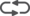  | [Make your first sync](#5-make-your-first-sync) | 
| 6. |   | [Power on Hub](#6-power-on-your-hub) | 

| AT YOUR APIARY |  | | |
| -- | -- | -- | -- |
| 7. |   | [Install devices in hive](#7-install-devices-in-hives) | 
| 8. |   | [Install your hub](#8-install-your-hub) | 
| 9. |   | [Update starting dates](#9-update-start-datetime) | 
| 10.|   | [View and explore](#10-explore-and-discover) | 

## 🏠 START AT HOME

### Watch the video

<!-- i18n:video
locale: en | video_id: 6WicH4_l2FQ | thumb: /assets/20_quick_start_guide.assets/videos/EN_Onboarding_Video_Cover_500.png
locale: fr | video_id: 8eHAg2DPtsc | thumb: /assets/20_quick_start_guide.assets/videos/FR_Onboarding_Video_Cover_500.png
locale: es | video_id: FWj4MrT_zg8 | thumb: /assets/20_quick_start_guide.assets/videos/ES_Onboarding_Video_Cover_500.png
default: en
-->

  

    
  

---

###  1. Install BroodMinder Bees App

Download [Broodminder Bees](https://mybroodminder.com/beesapp) from your AppStore or PlayStore. clic [HERE](https://mybroodminder.com/beesapp) or scan the QR-code to start :

###  2. Create your account

Create your account in the Bees App. One account gives you access to everything: the App and MyBroodMinder Web.

In Bees you have several tabs that we will navigate :

Move to `Manage` tab and create your first apiary with `... > New apiary` and then create your first hive with `... > New hive`

We can now move on to assign sensors to this newly created hive. But first we have to power on devices.

###  3. Activate your devices
In general all BroodMinder devices have a pull strip.
Older models (T2 <2019) might have a push button.

  
  
  
  

!!! warning "Depending on the device, some of the points below may apply:"
    
    - Pulling the battery tab should make the board blink. If no blink occurs, gently push the batteries toward the **+** contact. In some cases (mostly AA battery holders), the holder can be stiff and prevent the spring from making proper contact.

    - Do not discard any plastic parts. Keep all pieces in place.

    - Before closing the circuit board enclosure, verify that the sealing rubber is correctly positioned.

    - When applicable, check that cable glands are properly tightened.

When they are powered, the devices should appear in Bees App under the `Devices`tab with a green Bluetooth logo indicating "Nearby". It means your phone is "seeing" the device. In the example below device 49:06:27 is not in Bluetooth range (unavailable) and belongs to a third party account while 49:06:39 is in range and not yet claimed.

!!! tip "Understand device model"
    All BroodMinder sensors have a 6-digit reference number in the form XX:XX:XX. The first two digits of this reference define the model:
  
    - 41, 47 : T
    - 42, 56 : TH
    - 43, 57 : W, W5
    - 49 : W3, W4
    - 51 : BeeTV
    - 52 : SubHub
    - 54 : Hub
    - 58 : DIY
    - 63 : BeeDar

###  4. Claim & Assign devices to hives

!!! info "Why claim a device?"
    Claiming a device links it permanently to your MyBroodMinder account.

    Devices are shipped in an unassigned state because users often have not yet created their MyBroodMinder account at the time of shipment. For this reason, device claiming (also referred to as commissioning) is performed by the end user upon receipt.

!!! warning "Enable Location on Android"
    Android needs location services turned on to detect Bluetooth devices.  
    If you don’t see any devices, make sure location is enabled in your settings.

First you need to claim the device by clicking on the green `Claim Device` button found in the `Devices` tab. This operation will associate each device you claim to your account. 
You will then be asked to assign the sensor to a hive. You can proceed or cancel and come back later via the menu `...`

Assign the newly claimed device to a hive. To do so, you’ll need three pieces of information: the **apiary**, the **hive**, and the **device location** within that hive. The dropdown menus also allow you to create new apiaries and hives on the fly, keeping the entire setup process in one place.

  
  
  

Available hive locations are:

| Position | typical use |
|-- | -- |
| Lower brood | TH or T into the lower brood box |
| Upper brood | TH or T into the upper brood box |
| Inner cover | TH or T under the cover |
| Scale under hive  | full weight scales like W3, W4 |
| Scale under hive (back) | half weight (bar) scales like W and W5|
| Beecounter | Beedar |
| BeeTV | BeeTV |
| Outside Hive | beekeeper's choice |
| Other| beekeeper's choice |
| Custom [1-7]| for research purposes (multiple devices) |

!!! info "Device location is important"
    Carefully select in-hive position for internal sensors. Some metrics like brood are only computed if the device is assigned to the lower/upper-brood location. Productivity is also computed on scale positions only.
 

Once you have assigned all your devices, the `Manage` tab should display your hives and devices in a tree structure like that: 

Now you are ready to perform the first sync.

###  5. Make your first sync

Syncing a device means connecting to it with your smartphone and retrieving all the data it has collected since it was powered on or since its last synchronization. During the sync process, the data is downloaded to your phone and simultaneously uploaded to the cloud on MyBroodMinder.

The data remains stored in the device memory and is not erased unless you explicitly choose to clear it.

!!! Warning "First sync is important!"
    **The first sync sets the device’s date and time**, ensuring that all recorded measurements are accurately timestamped. If you skip the sync when powering on the device, future syncs will still add timestamps, but earlier data may be shifted when calculated retroactively. For this reason, it’s best practice to sync the device every time you power it on—such as after a battery change.

!!! Tip
    You can only sync devices within bluetooth range (appearing in green) 

Using BroodMinder Bees App there are multiple ways of syncing: 

- `Sync-All` is at the top of the screen in the `Manage` tab. This syncs all devices at once and is a Premium feature.
- `Single Sync`is within the 3dots `...`menus, either in `Devices`or in `Manage` tab

Now look to your data. This can be done in different places:

- at the device level (either in `Manage`or in `Devices` tabs) with `... > Show Details``
- at the hive level in `Manage` tab with `... > View Chart` 
- at the apiary level in the `Hives` tab.  

Below are three views of the same data: at the **device level** (left), the **hive level** from the *Manage* tab (center), and the **apiary level** from the *Hives* tab (right).

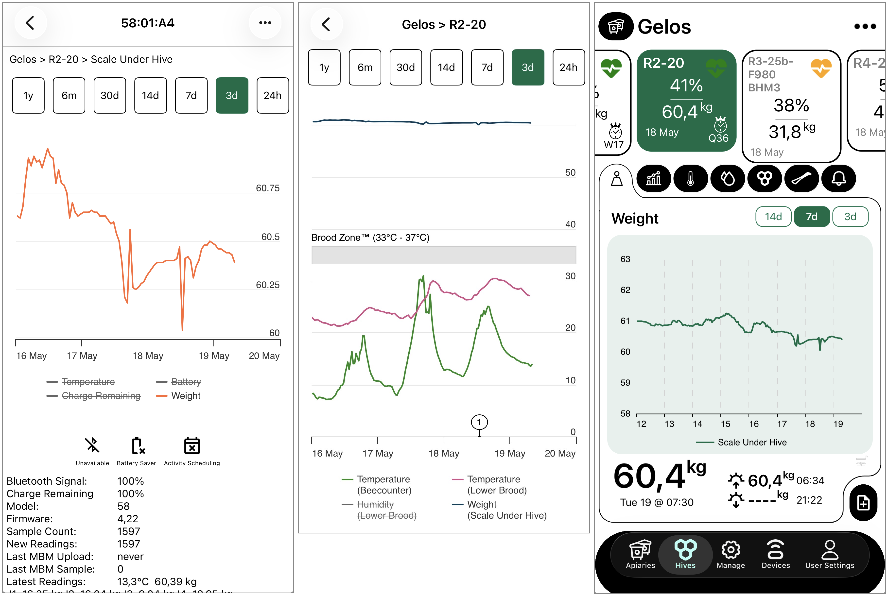

!!! info
    On your first sync you probably do not see much data since there is only one or two samples recorded.

###  6. Power-On your Hub

This stage is intended for those owning a Hub for real time monitoring.
If you do not have a Hub, move to the [next chapter](#7-install-devices-in-hives)

Remember from [Hubs page](./60_hubs.md) that there are several hub versions: 

- Broodminder-T91 Cellular Hub [solar, weather, naked]
- BroodMinder-LoRa Hub
- BroodMinder-Wifi Hub
- BroodMinder-Sub-Hub

#### 6.1 T91 Weather hub
- Power on the hub using the small black switch. 

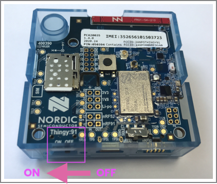

- The LED light will blink green, then turn solid blue for 5 seconds, and finally return to blinking green.
- Check on Bees App that transmission has been established. Go to `Devices tab > Hub ID > ... > Show details` last upload shall display current date/time.

!!! tip 
    On the Hub Details screen, the bottom black section shows the device’s boot process and current status in real time. Under normal conditions, it alternates between **Status 10 (tick)** and **Status 11 (tock)**. Other possible statuses include `Booting`, `starting modem`, `connecting to AWS` or `Start BLE scan`, among others. 

- Install the velvet protective bag, making sure the power switch remains accessible through the opening.

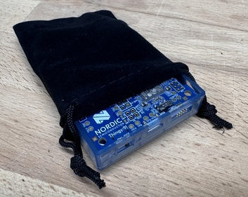

!!! warning "The velvet bag is important!"
    The velvet bag serves two key purposes:
    
    1. It prevents insects and bugs from nesting in your hub — the electronics are warm and they love it.
    2. It protects the electronics from direct sunlight, improving durability while still allowing airflow for temperature and humidity measurements.

- Insert the T91 within the weather shield .

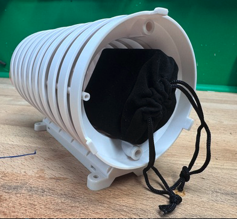

- Install the hub in your apiary using one of the available mounting options: tie wraps, screws, or an optional magnet.

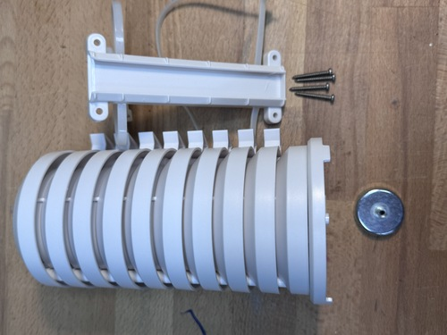

#### 6.2 T91 Solar hub version
Follow the same process as above, with the difference that you will have to plug in the USB to the battery (we ship unpluged to avoid battery discharge during transport)

1. Unscrew the cover lid.
2. Insert the USB plug into the battery
3. Slide the power switch to the right

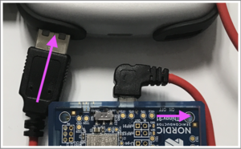

4. Hub will start and you can check data transmission using Bees App as described above.

---

## 🐝 NOW MOVE TO THE APIARY

Watch the video to get started

<!-- i18n:video
locale: en | video_id: zrxAc6mLiI4 | thumb: /assets/20_quick_start_guide.assets/videos/EN_Apiary_Install_Video_Cover_500.png
locale: fr | video_id: sBLD9ZcWuao | thumb: /assets/20_quick_start_guide.assets/videos/FR_Apiary_Install_Video_Cover_500.png
locale: es | video_id: X2a5zjWweMM | thumb: /assets/20_quick_start_guide.assets/videos/ES_Apiary_Install_Video_Cover_500.png
default: en
-->

  

    
    
    
  

###  7. Install devices in hives

#### Internal sensors

Install BroodMinder-T (model 47) and -TH (model 56) on the middle frame (usually no. 5), starting on the left-hand side as seen from the front of the hive. The identifier at the end of the tab should protrude so as to be visible from the front of the hive.

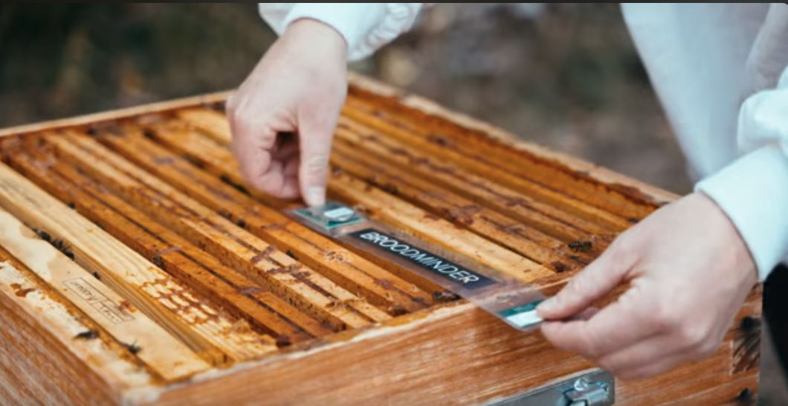

#### Scales
Place your BroodMinder-W and W5 scales preferably **at the back** of the hive. Make sure the hive is as level as possible. 
BroodMinder-W3 and W4 scales do not require precise levelling.

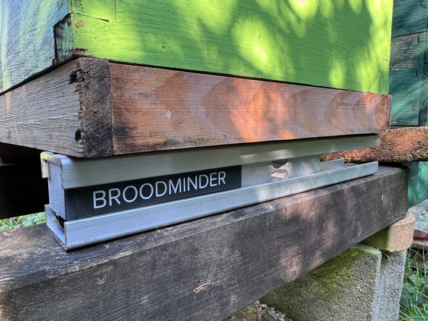

#### Beedar
The BeeDar is mounted on the front of the hive, centered on the hive axis. The height from the flight deck is just right to allow you to handle the entrance reducers without worry. Typically 5 to 7 cm above the floor.

For more details about beedar installation go to the [Beedar page](./35_sensors_Beedar.md)

###  8. Install your hub

This step is optional and only applies to users with a Hub for real-time monitoring.

!!! Important "About hub range and position"
    As a general rule for any kind of hub you should know that:

    - overall range for Hub <=> internal devices is ~ 10 meters (~30ft)
    - overall range for Hub <=> external devices is ~ 30-40 m (~100ft)
    - hubs should be installed at **1.5m (5ft) height from the ground** (Cellular and Wifi reception damps A LOT when close to the ground)

The best practice is to place the hub on a pod in the 10m range of your hives 

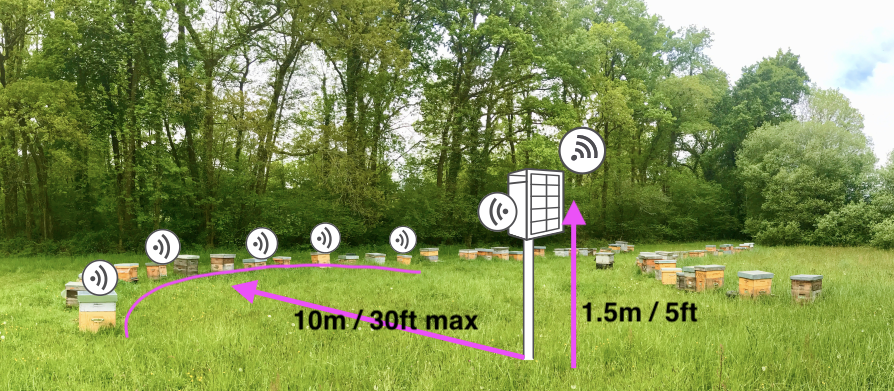

An example using the weather shield magnet directly on a hive roof

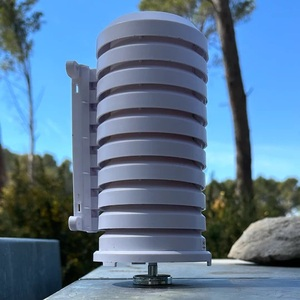

Some examples with the solar version: on a pod, mural or even on hive

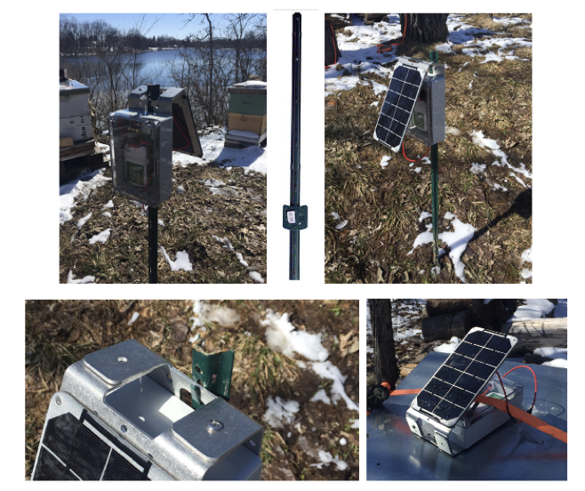

Once the hub is installed in it's final location check again the connectivity

- Check hub connectivity with Bees App (in the `Devices Tab > hub ID > ... > Show details`)
- You should have a "tick/tock" status.

###  9. Update start date/time

To avoid mixing your hive data with measurements collected from your living room coffee table 🛋️🐝, update the sensor start date once the devices are actually installed in the hive.

To do so, go to `Manage > unfold the hives to see the devices > ... > Move Device`.

Then edit the `start date/time` and set it to the moment the device was installed in the hive.

###  10. Explore and discover

Now you can also go to [MyBroodMinder.com](https://mybroodminder.com) and explore your data. Sign in with the same account you created on the Bees App.

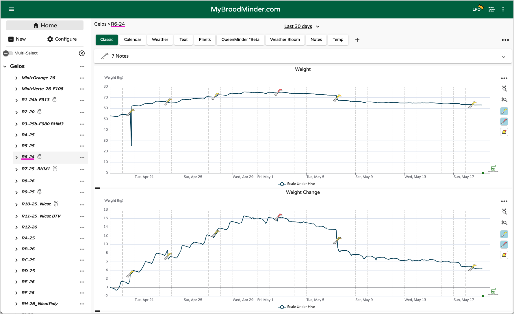

In this interface you will be able to create your own dashboards, track brood levels, the weight gains and losses, configure your alerts or even the past and forecasted weather as well as the nectar-flow indexes and much more!

!!! info
    Attention: Some data is computed daily and you will begin to see it from D+3 (D1 does not count because partial data, D2 will be the first complete day which will be posted the following day => D3)

--- 

## Congratulations!

!!! success "🎉 You made it!"
    We hope everything went smoothly up to this point. If you've made it here, congratulations — your system is up and running, your bees are connected, and officially... you're a hero now 🦸🐝

    But this is only the beginning. BroodMinder has many more capabilities waiting to be explored.

    ### Continue your journey

    🚀 **Unlock the full power of MyBroodMinder**  
    [Learn about dashboards, analytics, alerts, sharing, and advanced tools](../50_mybroodminder_v5.md)

    🔧 **Dive deeper into sensor features**  
    [Explore device-specific capabilities and installation tips](../30_sensors.md)

    📡 **Learn more about Hubs**  
    [Understand real-time connectivity, Cell, WiFi and LoRa systems](../60_hubs.md)

    Happy beekeeping — and welcome to the connected apiary world.

