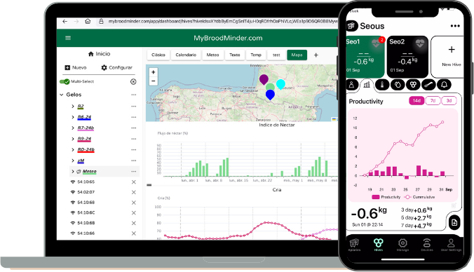
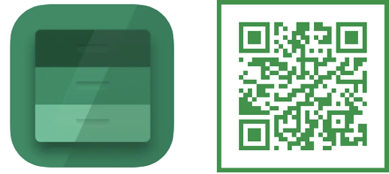
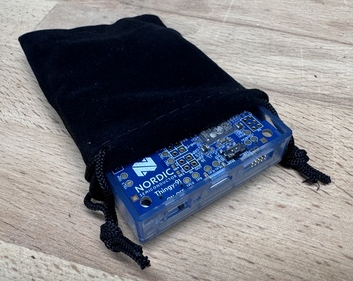
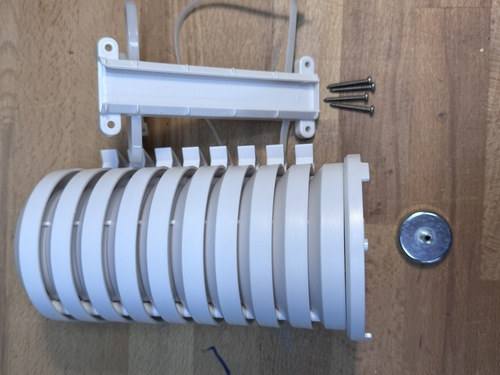
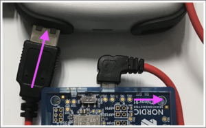
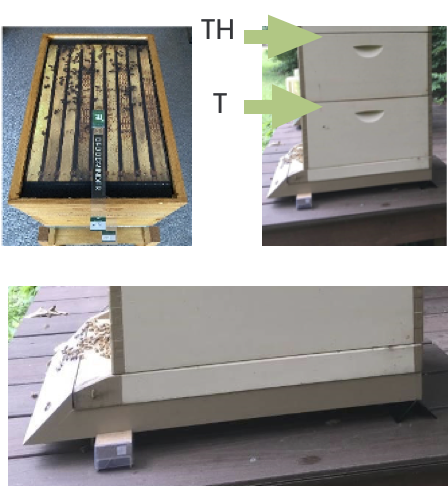
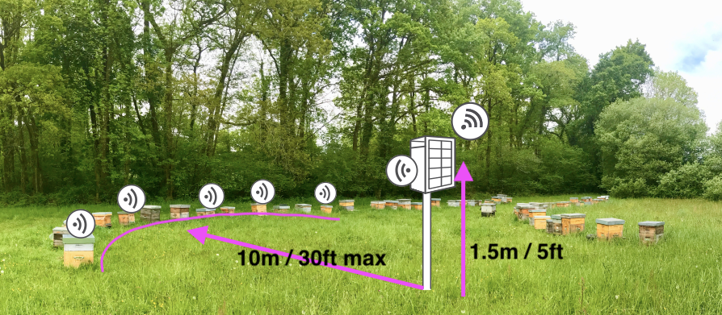
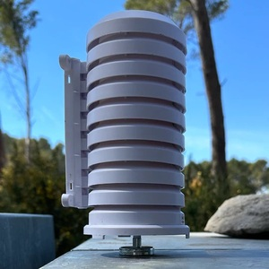
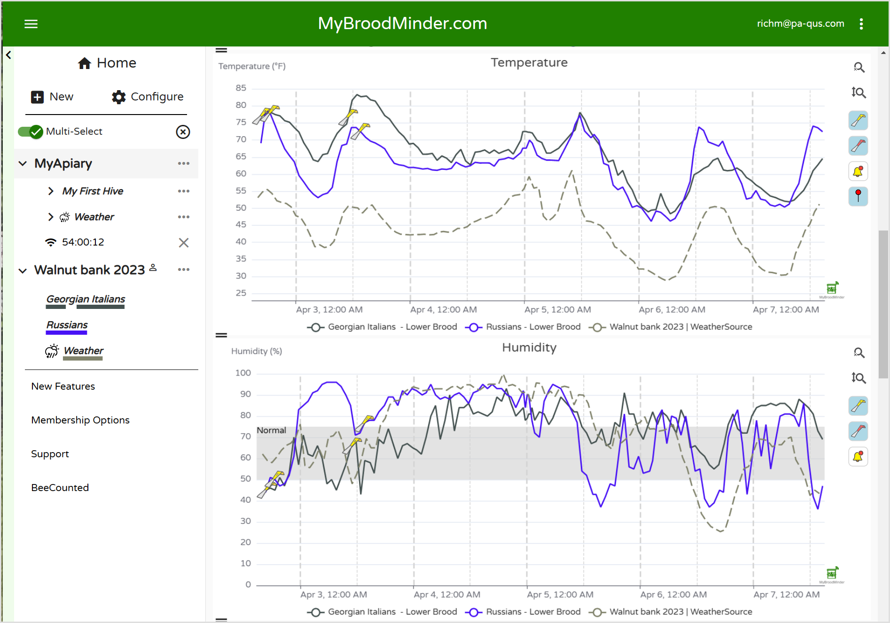

# Quick Start Guide

{ style="display: block; margin: 0 auto" }

We've done our best to make the installation and use of your BroodMinders intuitive and easy. Follow the process below to get to grips with all aspects of the solution (Sensors, App and Web...) and you'll have every chance of success.

---
## Watch the videos 🎥

| 🇺🇸 English | 🇪🇸 Spanish | 🇫🇷 French |
|:---------------------:|:---------------------:|:--------------------:|
| 
  
 | 
  
 | 
  
 |

## Read the doc 📖

Each step is described in detail later in this document.

| AT HOME   |  | | | 
| -- | -- | -- | -- |
| 1. |   | [Install the App](#1-install-broodminder-bees) | 
| 2. |   | [Create your account](#2-create-your-account) | 
| 3. |   | [Power your devices](#3-activate-your-devices) | 
| 4. |   | [Assign to a hive](#4-assign-devices-to-hives) | 
| 5. |   | [Make your first sync](#5-make-your-first-sync) | 
| 6. |   | [Power on Hub](#6-power-on-your-hub) | 

| AT YOUR APIARY |  | | |
| -- | -- | -- | -- |
| 7. |   | [Install devices in hive](#7-install-devices-in-hives) | 
| 8. |   | [Install your hub](#8-install-your-hub) | 
| 9. |   | [Update starting dates](#9-update-start-datetime) | 
| 10.|   | [View and explore](#10-explore-and-discover) | 

## Before you start
Take note of the following best practices:

!!! info "Set-up everything AT HOME"
    Make sure the system is functional before installing it in the apiary, then it will be less easy to set up.

!!! info "Tag your hives"
    Do what it takes to identify your hives, it will be much better.
    1, 2, 3 ..... A, B, C ... K254.

!!! tip "Need help?"
    You can always contact us at [support@broodminder.com](mailto:support@broodminder.com).

-----

## 🏠 START AT HOME
###  1. Install BroodMinder Bees App

Download [Broodminder Bees](https://mybroodminder.com/beesapp) from your AppStore or PlayStore. 

Scan this QR code to be headed to it :

###  2. Create your account

Create your account into the Bees App. A single account for everything : App and Web MyBroodminder.

In BeesApp, on the Apiary tab, create your first *apiary* and your first *hive*, they will be needed for the next steps.

In Bees you have several tabs that we will navigate :

<!-- Now move to the **Apiaries** Tab:

 -->

Create your first apiary with `... > New apiary`

Create your first hive with `Hives > New hive`

We can now move on to assign sensors to this newly created hive. But first we have to power on devices.

###  3. Activate your devices
In general all our devices have a pull strip.
Older models (T2) might have a push button.

!!! warning "Take care of this:"
    With any device, pulling the tab should make the board blink. If you do not see any blink, push the batteries against the + contact. Sometimes the battery holder can be stiff and avoid the spring to push them through. (mostly for AA batteries)

    Do not discard any plastic part. Keep them all in place.
    
    Check that all seals are properly installed.
    
    Verify that cable glands are tight too when appropriate.

!!! tip "Understand device model"
    All BroodMinder sensors have a 6-digit reference number in the form XX:XX:XX. The first two digits of this reference define the model:
  
    - 41, 47 : T
    - 42, 56 : TH
    - 43, 57 : W 
    - 49 : W3 et W4
    - 52 : SubHub
    - 54 : Hub
    - 58 : DIY
    - 63 : BeeDar

###  4. Assign devices to hives

!!! warning "Enable Location on Android"
    Android needs location services turned on to detect Bluetooth devices.  
    If you don’t see any devices, make sure location is enabled in your settings.

First you need to claim the device by clicking on the green `Claim` button found in the `Devices` tab. This operation will associate each sensor you claim to your account . 
You will then be asked to attach the sensor to a hive. You can proceed or cancel and come back later via the menu `...`. 

Attach each device to a hive. 

Available device positions are

| Position | typical use |
|-- | -- |
| Lower brood | TH or T into the lower brood box |
| Upper brood | TH or T into the upper brood box |
| Inner cover | TH or T under the cover |
| Scale under hive  | full weight scales like W3, W4 |
| Scale under hive (back) | half weight (bar) scales like W and W5|
| Beecounter | Beedar |
| Outside Hive | beekeeper's choice |
| Other| beekeeper's choice |
| Custom [1-7]| for research purposes (multiple devices) |

!!! info "Device location is important"
    Carefully select position for internal sensors. Some metrics like brood are only computed if the device is assigned to the brood location.
 

Now return to the **Apiaries** tab to perform the first sync.

###  5. Make your first sync

!!! Warning "First sync is important!"
    The first sync sets the device’s date and time, ensuring that all recorded measurements are accurately timestamped. If you skip the sync when powering on the device, future syncs will still add timestamps, but earlier data may be shifted when calculated retroactively. For this reason, it’s best practice to sync the device every time you power it on—such as after a battery change.

Using BroodMinder Bees App there are multiple ways of syncing: 

- `Multi-Sync` is at the top of the screen in the `Apiaries` tab. This syncs all devices at once and is a Premium feature.
- `Single Sync`is within the 3dots `...`menus, either in `Devices`or in `Apiaries` tab

!!! Tip
    You can only sync devices within bluetooth range (appearing in green) 

Now look to your data using `... > Show Graph` or `... > Show Details`.

!!! info
    On your first sync you probably do not see much data since there is only one or two samples.

###  6. Power-On your Hub

This stage is intended for those owning a Hub for real time monitoring.
If you do not have a Hub, move to the [next chapter](#7-install-devices-in-hives)

Remember from [Hubs page](./60_hubs.md) that there are several hub versions: 

- Broodminder-T91 Cellular Hub [solar, weather, naked]
- BroodMinder-LoRa Hub
- BroodMinder-Wifi Hub
- BroodMinder-Sub-Hub

#### 6.1 T91 Weather hub
- Turn on the hub using the small black switch. 

- The LED light will blink green, then turn solid blue for 5 seconds, and finally return to blinking green.
- Check on Bees App that transmission has been established. Go to `Devices tab > Hub ID > Show details > MBM last upload ` shall display current date/time.

!!! tip 
    On the Hub Details screen, the bottom black section shows the device’s boot process and current status in real time. Under normal conditions, it alternates between **Status 10 (tick)** and **Status 11 (tock)**. Other possible statuses include `Booting`, `starting modem`, `connecting to AWS` or `Start BLE scan`, among others. 

- Install the velvet protective bag, making sure the power switch remains accessible through the opening.

!!! warning "The velvet bag is important!"
    The velvet bag serves two key purposes:
    
    1. It prevents insects and bugs from nesting in your hub — the electronics are warm and can attract them.
    2. It protects the electronics from direct sunlight, improving durability while still allowing airflow for temperature and humidity measurements.

- Insert the T91 within the weather shield .

- Install the hub in your apiary using one of the available mounting options: tie wraps, screws, or an optional magnet.

#### 6.2 T91 Solar hub version
Follow the same process as above, with the difference that you will have to plug in the USB to the battery (we ship unpluged to avoid battery discharge during transport)

1. Unscrew the cover lid.
2. Insert the USB plug into the battery
3. Slide the power switch to the right

4. Hub will start and you can check data transmission using Bees App as described above.

## 🐝 NOW MOVE TO THE APIARY

###  7. Install devices in hives

#### Internal sensors

Install BroodMinder-T (model 47) and -TH (model 56) on the middle frame (usually no. 5), starting on the left-hand side as seen from the front of the hive. The identifier at the end of the tab should protrude so as to be visible from the front of the hive.

#### Scales
Place your BroodMinder-W scale preferably **at the back** of the hive. Make sure the hive is as level as possible. 
BroodMinder-W3 and W4 scales do not require precise levelling.

#### Beedar
The BeeDar is mounted on the front of the hive, centered on the hive axis. The height from the flight deck is just right to allow you to handle the entrance reducers without worry. Typically 5 to 7 cm above the floor.

Beedar has a horizontal "view" angle of 85° and a vertical angle of 30°.
You can hang it with two 4mm-diameter screws.

###  8. Install your hub

This step is optional and only applies to users with a Hub for real-time monitoring.

!!! Important "About hub range and position"
    As a general rule for any kind of hub you should know that:

    - overall range for Hub <=> internal devices is ~ 10 meters (~30ft)
    - overall range for Hub <=> external devices is ~ 30-40 m (~100ft)
    - hubs should be installed at **1.5m (5ft) height from the ground** (Cellular and Wifi reception damps A LOT when close to the ground)

The best practice is to place the hub on a pod in the 10m range of your hives 

An example using the weather shield magnet directly on a hive roof

Some examples with the solar version: on a pod, mural or even on hive

Once the hub is installed in it's final location check again the connectivity

- Check hub connectivity with Bees App (in the `devices Tab > hub ID > ... > Show details`)
- You should have a "tick/tock" status.

###  9. Update start date/time

To avoid having measurements from outside the hive, change the start date of the sensors.
To do so, go to `BeesApp > Apiaries > unfold the hives to see the sensors > "..." > Change the current position`. 
Edit the `start date/time`.

###  10. Explore and discover

Now you can also go to [MyBroodMinder.com](https://mybroodminder.com) and explore your data.

Sign in with the same account you created on the Bees App.

In this interface you will be able to follow the brood levels, the weight gains and losses, configure your alerts or even the past and forecasted weather as well as the nectar-flow indexes  and much more!

!!! info
    Attention: Some data is computed daily and you will begin to see it from D+3 (D1 does not count because partial data, D2 will be the first complete day which will be posted the following day => D3)

