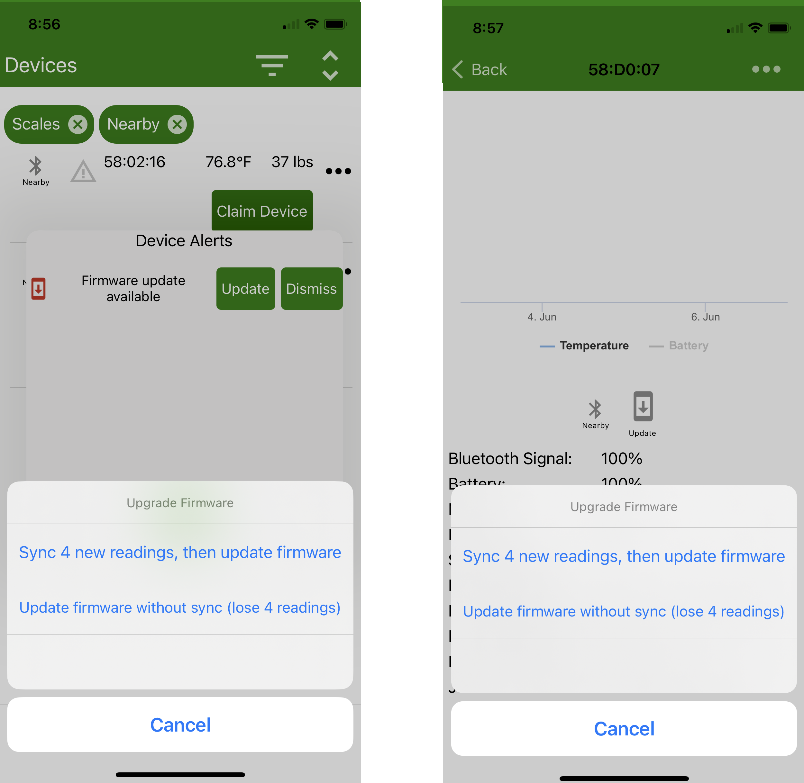

# Sensors

## Sensor range

Before getting started let's get familiar with the different devices we will deal with. 
Every device has a specific ID like for example '56:01:3f' the first two figures (56) are the model ID. In this case 56 corresponds to a Broodminder-TH device.

 

| **Product** | **Model** | **Name** | **Description** |
|-            |----          |--        |-                 |
|  |47 | Internal sensor T | Small sensor, big benefits. The best tool for monitoring hive dynamics. |
|  |56 | Internal sensor TH | Temperature and humidity, all in one. |
|  |57, 43 | Scale W | Ideal scale for hobby beekeeping Best value for money. |
|  |49 | Scale W4 | Scale for migratory beekeeping, adaptable to a wide range of supports. Tough as nails |
|  |49 | Scale DIY | A do-it-yourself kit for DIY beekeepers. |
|  |63 | BeeDar | A Radar to track bee activity during the day. |
|  |52 | SubHub | The subHub is both a data hub and a transmission relay. |
|  |60 | Hub Wifi | Ideal if your hives are close to a Wifi network. |
|  |54 | Hub 4G | Optimal connectivity with multi-operator SIM card. |
|  |54 | Hub 4G Weather | Two in one: Data transmission AND weather station (temperature, humidity and pressure) |
|  |54 | Hub 4G Solar | Endless autonomy with this version boosted with a solar kit. |

## Installing your BroodMinder

The Citizen Science Package contains two Broodminder-TH (temperature and humidity) or T2 (temperature only) Devices and a Broodminder-W hive scale. Here is where you install these devices:

## Routine Maintenance

There is not much routine maintenance that is required. Please note that if your batteries are lasting less than 6 months, something is wrong and you should contact [support@broodminder.com](mailto:support@broodminder.com) for replacement or refurbishment.

### Spring

We have a video talking about spring maintenance on the support page at 
<a href="https://mybroodminder.com/app/resources" target="_blank">mybroodminder.com/resources</a>.
In the spring, it is a good time to clean up your devices. You can use 91% or better Isopropyl or Ethyl Alcohol, it will not harm the electronics.

You can place the wrappers in the freezer and then propolis will break off more easily.

**Ensure that the scale wrapper is not cracked, that will allow rain to harm the sensors.** You can seal any cracks with packing tape.

We also have replacem ent wrappers for all the devices on our website at Broodminder.com.

We also offer Refresh service where we replace the housings and batteries and test the devices. This is a very good option every couple of years to ensure that your devices are operating properly. There is more information at <a 
href="https://broodminder.com/collections/service-warranty/products/refresh-broodminder-t2" target="_blank">broodminder.com/collections/service-warranty/products/refresh-broodminder-t2</a>

### Winter Service check-list

For peace of mind and greater efficiency, we recommend servicing all of your devices at the end of each season. 
Starting the next season with empty memory devices, loaded batteries and updated firmware will put all the chances on your side.

If you would like us to do this for you go to [BroodMinder-Refresh](https://broodminder.com/collections/service-warranty/products/refresh-broodminder-t2) at BroodMinder.com. We will clean, test, add new batteries and housings. If something fails testing, then we will contact you and offer you a refurbished device at 50% the cost of a new device.

#### Prepare hardware

- [ ] Order some CR2032 batteries to have enough stock

!!! note 
    Forget your supermarket and low cost sites where you won't have any quality guarantee. Order a batch of batteries in dedicated shops to get a fair price (about 0,50€).
    [Farnell](https://fr.farnell.com/renata/cr-2032-mfr-1bl/pile-bouton-3v/dp/1823479?st=cr2032)        

- [ ] Collect all your devices and bring them at home, you want to work comfortable
- [ ] Make a full sync of all your devices with the Apiary App to catch any sample that the hub eventually missed  (leave your phone syncing and charging and go for a coffee or two)

#### T2 Maintenance

- [ ] Change the battery as described in the <a href="https://img.youtube.com/vi/alaZtXpn-g4/0.jpg)](https://www.youtube.com/watch?v=alaZtXpn-g4" target="_blank">video</a>

- [ ] <a href="https://img.youtube.com/vi/tN9xUTq_bSc/0.jpg)](https://www.youtube.com/watch?v=tN9xUTq_bSc" target="_blank">Start the device</a>

- [ ] <a href="https://img.youtube.com/vi/zK4vYvpur1E/0.jpg)](https://www.youtube.com/watch?v=zK4vYvpur1E" target="_blank">upgrade firmware as needed</a>

#### TH Maintenance

- [ ] <a href="https://img.youtube.com/vi/tJTuL12vjps/0.jpg)](https://www.youtube.com/watch?v=tJTuL12vjps" target="_blank">Change the battery as described in the video</a>

-  [ ] Upgrade firmware as needed (see above)

#### W Maintenance

- [ ] <a href="https://img.youtube.com/vi/UBwJP61q2o4/0.jpg)](https://www.youtube.com/watch?v=UBwJP61q2o4" target="_blank">change the battery as described in the video using the provided tool to remove the battery</a>

!!! warning
    Pull the battery carefully from one side of the holder while pushing the circuit board against the wooden part. This will avoid tou also pull the board out of the scale or breake the holder under too much pressure

!!! warning
    Once you're done place the small tool carefully into its original location and avoid any interference if it hosts between the two amovible parts of the scale.

#### Hub Maintenance

- [ ] Charge the battery to its maximum using a phone charger with a micro-usb cable

- [ ] Install any available firmware updates (Broodminder Cell App will tell you)
- [ ] After upgrading the Cell Hub check you have the right APN either `hologram` or `matooma.m2m` (into `Configure > Diagnostics > Cell Network > Custom APN`)

!!! warning
    <a href="https://img.youtube.com/vi/geVp0FDxm3U/0.jpg)](https://www.youtube.com/watch?v=geVp0FDxm3U" target="_blank">Remember the battery (older white style, not the new silver battery) has two modes **Always on** and **Auto off** : in the apiary it has to be **Always on**.</a>

## Device Firmware Updates

From time to time we make updates to improve the operation of our sensors. BroodMinder devices use OTA (Over The Air) firmware updates and are very simple to perform. 

This procedure works with the following models (model is the first 2 characters of the ID, for example 47:12:34 is model 47)

Model 47,49, 51, 52, 56, 57, 58, 59, 60, & 63

### Basic Process

- Update Bees App
- Find and select Update Icon for the device in Bees App
- Press "Update Firmware" or "Sync and Update Firmware"
- Wait and watch for 2-3 minutes
- Verify

### Bees App Update

Before beginning the firmware update, be certain to visit the Android Play Store or Apple App Store and update your Bees App. The app will contain the most current version of firmware for all of our devices.

### Notification Icon

When you open the Bees App, you may see a symbol beside you device or in the details page. We will show both locations in the images below.

### Updating the device

Press the symbol and you will be presented with an update page shown below.

Now you have a choice. There is backup data stored on your BroodMinder device. Updating firmware will place the device in "Factory New" state which removes any backup data. Note: All data that you have already retrieved is safe.

1) If all of you data is up to date on MyBroodMinder, you can "Update firmware without sync".
2) If you are not certain, you can sync and then update. This will take longer since we read the entire data log before updating.

The update process will take 2-3 minutes.

### Verify

Once complete, you should see the firmware update icon is removed and the current version is updated. 

If it did not update correctly, remove the batteries for 1 minute, replace the batteries and retry the update.

If you are still having difficulty contact us at [support@broodminder.com](mailto:support@broodminder.com).

