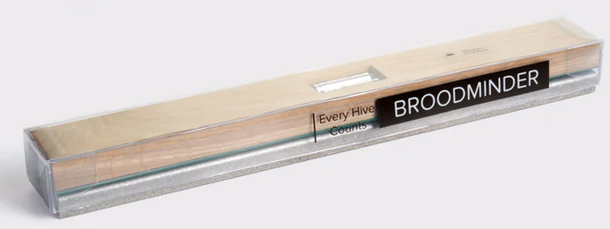

{ style="display: block; margin: 0 auto" }

## Broodminder-W (57)

The Broodminder-W ( **W**eight) is a single-bar hive scale that goes under the hive. It is an excellent tool to track nectar flows as for following winther ressource consumption.

The first W was released in 2017, it was model 43 and lasted for 5 years unitil in 2022 was released the W+ scale under model 57 improving bluetooth range and battery life.

### Installation

There is an extensive writeup about positioning the scale in appendix A. That is a good thing to read, but if you are in a hurry, here are the basics.

!!! WARNING
    the most typical error source is inadequate support under the scale. This can result in strange behavior as the hive flexes as it expands and contracts due to sun, rain, temperature, etc. Providing a flat support will improve results. An easy fix is to place a ¾" plywood sheet (or equivalent) under the scales.

!!! NOTE "ADDITIONAL NOTE" 
    If all you want to see is honey flow, good support is not required. You will just have to ignore the daily fluctuations. You will still be able to observe the overall change in weight.

#### Place the scale in the shade

The Broodminder-W has a temperature sensor inside which reads the local temperature. For the temperature to be accurate, it should be shaded from direct sun. This temperature is also used to compensate the weight sensors so avoiding the temperature spike created by direct sunshine will improve performance.

Being in the shade will also extend the housing life. We use UV resistant plastic, but in the direct sun even that will become degraded. If this happens, you can order a new housing on Broodminder.com.

#### Get the Broodminder-W level

We have done our best to make installation simple. However, you need to pay attention to a couple of things.

Make sure the hive is level. This doesn't mean "crazy level" but if your hive looks like the Leaning Tower of Pisa, then you won't get good results. 2x4's and shims are your friends. By using a few 2x4's and shims creatively, you can level almost anything! We also find that screwing the 2x4's together makes life better and more stable.

After you install the Broodminder -W, look at the end of it. Through the plastic cover, (remember… install it _with_ the plastic cover), you will see the upper wooden piece and the lower aluminum piece. Make sure that they do not touch. This will ensure that all the weight is sitting on the two little buttons on top of the aluminum base and not somewhere else.

#### Typical installation, not as accurate

Using the typical installation, you will see small changes to the hive however, the absolute accuracy will not be as good. For improved accuracy, see the recommendations of the next section.

The Broodminder-W is designed to measure ½ of the hive weight. To do this, we want you to support one side of the hive (front or back, left or right) with a 2x4 or similar However, we recommend that you use a piece of 2" angle for the support. By orienting it so that the point of the angle iron is up, it gives a very precise pivot point. You should be able get this at your local hardware store. Aluminum is extra nice because it won't rust. A great place to get just what you need for less than $5 each is  <a href="https://www.speedymetals.com/pc-2186-8344-2-x-2-angle-6061-t6-aluminum-extruded.aspx" target="_blank">Speedy Metals</a> (1/8" {A} x 2" {B} x 2" {C} Angle 6061-T6 Aluminum, Extruded).]

The Broodminder-W is placed under the opposite side.

There is a nice explanation of the math and physics involved in Appendix A, however it boils down to this. **Do your best to place the support and the scale directly under the wall of the hive body.** That will give good results.

#### Better installation, more accurate 

A better way to install will require a few modifications to your bottom board. You will make a couple of small cuts that will be used to accommodate precise and repeatable placement of the scale and support.

First off, we recommend that you use a piece of 2" angle for the support. By orienting it so that the point of the angle iron is up, it gives a very precise pivot point. You should be able get this at your local hardware store. Aluminum is extra nice because it won't rust. A great place to get just what you need for less than $5 each is <a href="https://www.speedymetals.com/pc-2186-8344-2-x-2-angle-6061-t6-aluminum-extruded.aspx" target="_blank">Speedy Metals</a>  (1/8" {A} x 2" {B} x 2" {C} Angle 6061-T6 Aluminum, Extruded).

Now we want to make the cuts in the bottom board. For this setup we recommend using front and back supports and not side to side. That given, you must choose whether to place the Broodminder-W under the front of the hive, or the back of the hive.

In general, it is better to place the Broodminder-W out of the sun. This is because the sun will heat the scale and give you a false reading of the outside temperature. Placing it in the shady side of the scale avoids this problem. It will also make the housing last longer.

Next you will cut the bottom board. For the angle iron side, you will cut a groove the width of your saw blade that the point of the angle will fit in. For the scale side, you will cut a notch 3/16" deep that ends 1" inside the center of the hive body wall. See the images below.

### Maintenance

Model 43 : 

The CR2032 battery is replaceable. It should last more than a year and we recommend replacement each fall before the low temperatures of winter.

If you find that your scale sucks the batteries, contact support. There is maybe a workarround you can make yourself.

Model 57 : 
You will have to replace the two AAA batteries. They should last about 2 years.

!!! Info 
    You can order a new housing on Broodminder.com.
