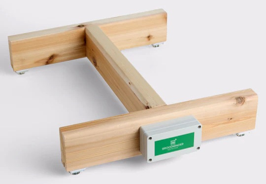

{ style="display: block; margin: 0 auto" }

Broodminder-W3 (49)
This scale is a full hive scale that you can build yourself. It is the entry point to the DIY (Do It Yourself) in Broodminder. 

It is available in 3 versions

1. Fully assembled
2. Partially-assembled & calibrated
3. Parts kit

The BroodMinder-W3 uses 4 force sensors to weigh the entire hive and sits on top of the bottom board for fast, convenient installation.

- 200kg (400lb) total hive weight measurement
- 0.01 pound (5 gram) resolution
- 4 Temperature compensated weight sensors. (4 @ 70cm (30") lead length)
- Stores weight once per hour for 5 years (user configurable)
- Replaceable 2xAA batteries last 5 years
- 16.5” x 20” x 2.25” Pine construction (assembled version only)

The "Fully assembled scale" is ready to place under the hive.

The "Partially assembled, calibrated, fixed feet" version contains all of the parts needed to assemble a hive scale except for the 2x4 support pieces. All of the soldering and electronics are assembled and calibrated in our workshops in Wisconsin/France.

Also a swivel foot version of that kit "Partially assembled, calibrated, wooden support, swivel feet" 

We now have a "Partially assembled, calibrated, Apimaye swivel feet" version which works well for Apimaye hives. Watch the video here to understand the differences.

The "Parts kit, unassembled, uncalibrated" version contains all of the parts needed to assemble a hive scale except for the 2x4 support pieces. Soldering and calibration are required as described in the following user guide sections. 

1. [Board Assembly](./33a_sensors_W3_boardAssembly.md)
2. [Mechanical Assembly](./33b_sensors_W3_assembly.md)
3. [Scale calibration](./33c_sensors_W3_calibration.md)

We know this can raise questions, feel free to reach out.

If you are thinking on another scale architecture that would better fit your needs, check the [BroodMinder-DIY section](./36_sensors_DIY_intro.md) for deeper considerations. 