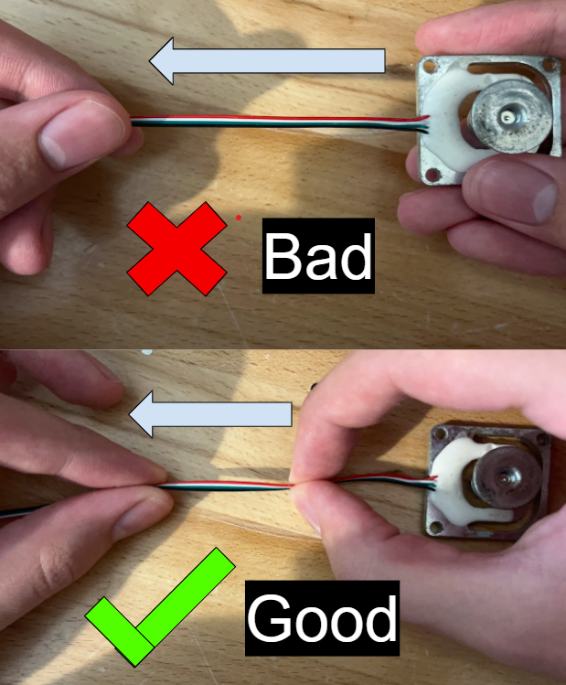
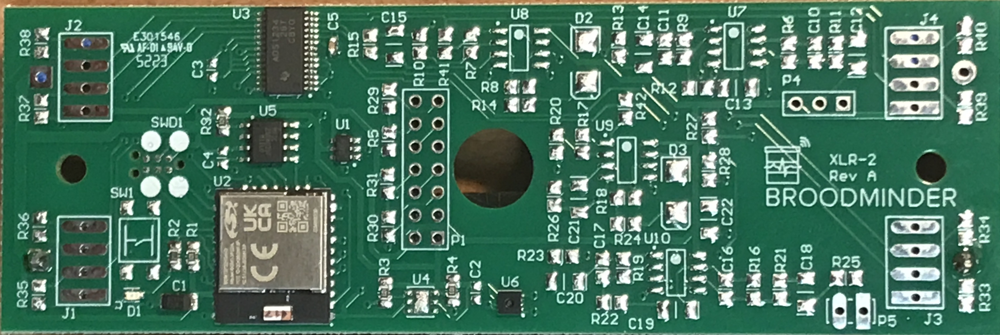
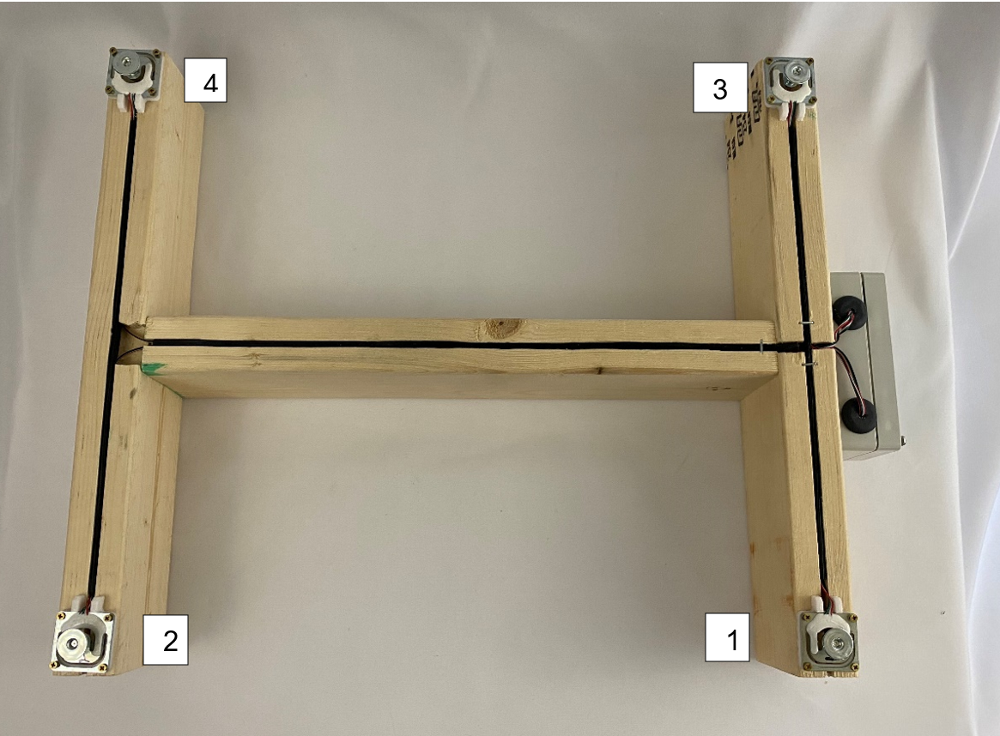

# W3 and DIY circuit board assembly

What follows explains how to assemble the hive scale boards wheter if they are for the BroodMinder-W3 model or for the BroodMinder-DIY.

!!! Important

    If you purchased a **W3 Unassembled-Calibrated** scale, all your electronics work is already done and you can jump straight to the next section : [Scale Assembly](http://doc.mybroodminder.com/en/33b_sensors_W3_assembly/)

!!! Warning

    During the assembly process it is important to avoid putting any strain on the connections of the wires to the sensors directly, as if the connection breaks the sensors become UNREPAIRABLE. If it ends up being the case that the connections are broken you will have to request a new sensor(s) to be shipped to you. 

    When working with the wires, it is recommended to use two points of contact as shown in the pictures below to avoid the connections being strained directly.

    This is the most common problem with this kit, so please keep this in the front of your mind when constructing this kit.

## Get started with the circuit board
We are working here with the XLR2-L board. This is a multi purpose board and that's why there are so many components missing. Although for scales you only need the "-L" version shown below. 

## Prepare the board

- tin all 16 pads on a flat surface

- solder the battery holder on the BAT2 slot (+ goes with the square pad)

## Prepare the load cells

Now with a permanent marker note the load cell position : J1, J2, J3, J4. 

Remember :

| | Left | Right |
|----|----|----|
| Rear | J4 | J2 |
| Front | J3 | J1 |

Now cut a slit on the rubber grummit. tape the 4 wires together for each sensor and pull them with a hemostat or pliers.

​  

Drill a hole in the box with a 1/2in (12mm) bit.
Route the wires through the hole and solder on the board pads following the color order Black-Green-White-Red as shown in the picture below

!!! note

    Make sure that before you solder the connections onto the board that the wires have been pulled through the grummit and that the grummit has been slotted into the electronics box. 
    
    If you solder the connections before the grummit has been slotted into the electronics box then you will have to un-solder all the connections otherwise the electronics box will not close correctly.

!!! note

    Take care to associate each loadcell with its coresponding pad J[1-4] (This will be printed on the board in small text next to each pad).

## Mount the scale feet

To mount the feet, simply take the screw so that it is orientated as in the image below then screw on the top piece until tight.

!!! note

    Be sure to use Loctite or a similar product on the screws to prevent them from coming loose over time. If this step is skipped it can cause the feet to become loose and cause the sensor to read inaccurate data.

## Mount the scale structure

Go to next chapter : [W3 Scale Assembly](http://doc.mybroodminder.com/en/33b_sensors_W3_assembly/)
