# W3 and DIY circuit board assembly

What follow will explain you how to assemble the hive scale boards wheter if they are for the BroodMinder-W3 model or for the BroodMinder-DIY

!!! Important

    If you purchased a **W3 Unassembled-Calibrated** scale, all your electronics work is already done and you can jump straight to the next section : [Scale Assembly](http://doc.mybroodminder.com/en/33b_sensors_W3_assembly/)

## Get started with the circuit board.
The XLR2 is a multi purpose board and the first thing you'll have to do is remove two resistors with your soldering iron : `R41` and `R42` as depicted in the scheme below

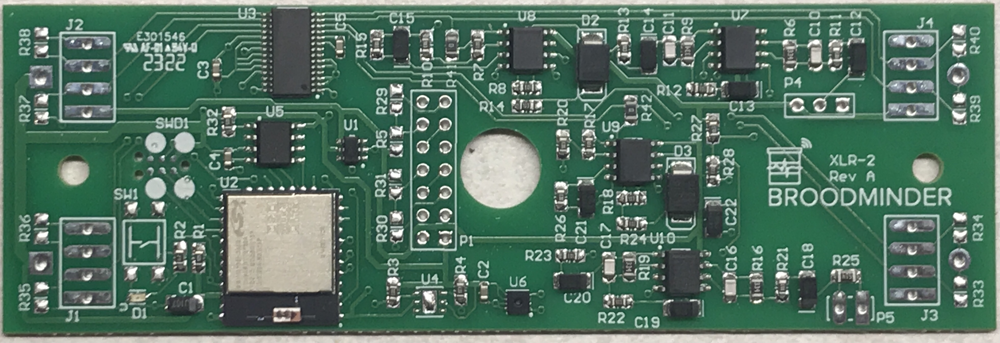

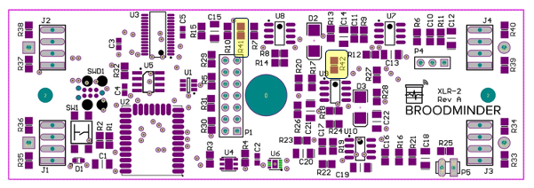

Now apply labels as shown (in the BAT1 slot)

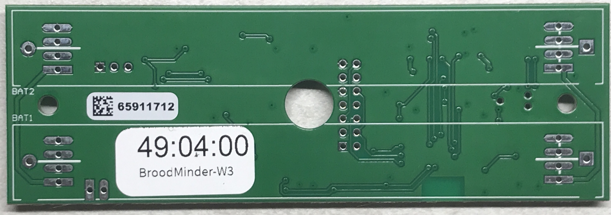

## Program the board

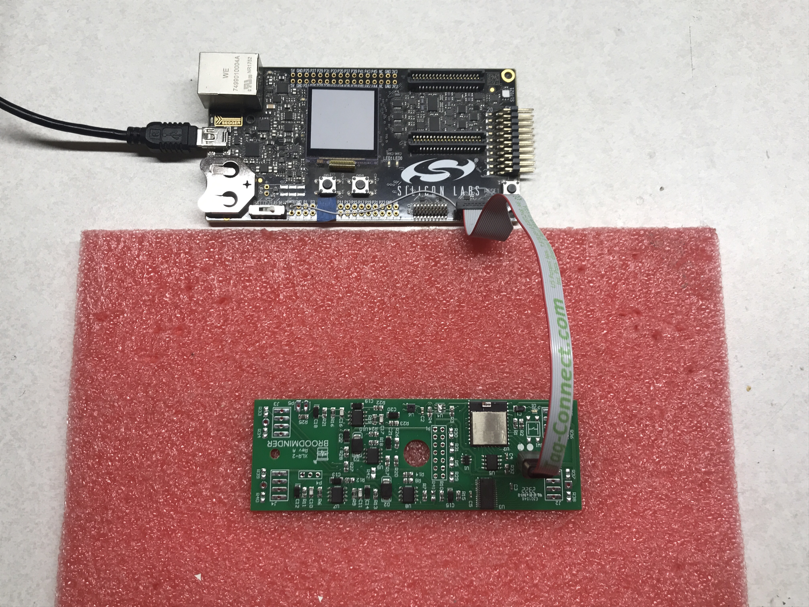

Use the pink foam to set the board.

!!! note

    Programing is only done internally at BroodMinder HQ. If you acquired a DIY or a W3 kit, the programming is already done.

## Prepare the board

- tin all 16 pads on a flat surface

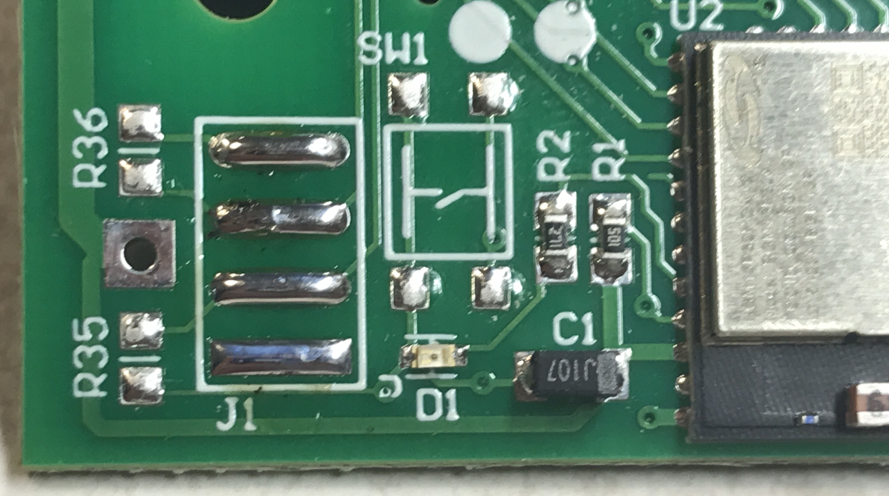

- solder the battery holder on the BAT2 slot (+ goes with the square pad)

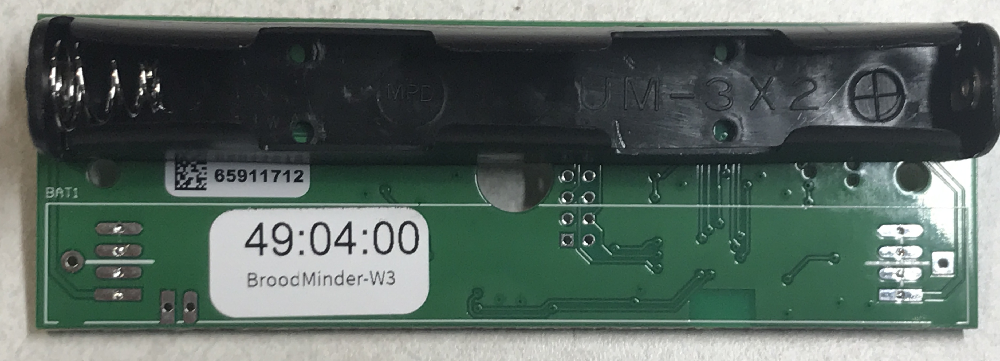

## Prepare the load cells

Now with a permanent marker note the load cell position : J1, J2, J3, J4. 

Remember :

| | Left | Right |
|----|----|----|
| Rear | J4 | J2 |
| Front | J3 | J1 |

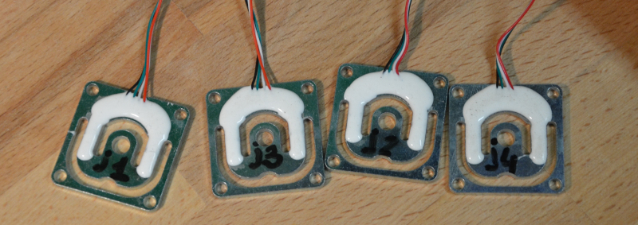

Now cut a slit on the rubber grummit. tape 4 wires together and pull them with a hemostat or pliers.
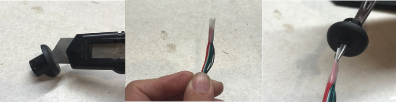
​  

Drill a hole in the box with a 1/2in (12mm) bit.
Route the wires through the hole and solder on the board pads following the color order Black-Green-White-Red as shown in the picture below

!!! note

    Take care to associate each loadcell with its coresponding pad J[1-4]

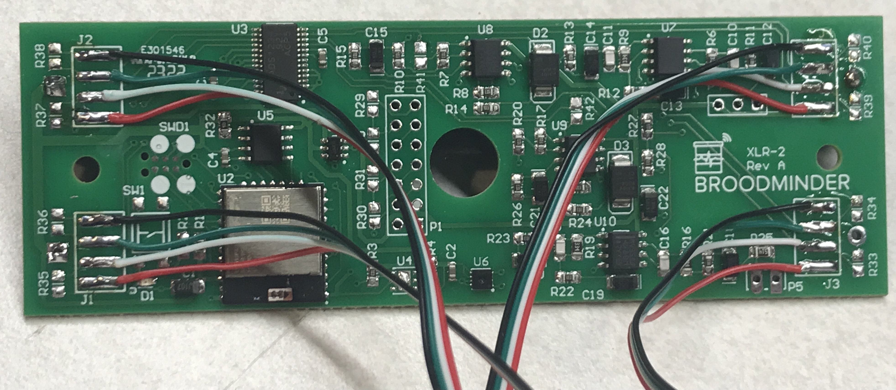

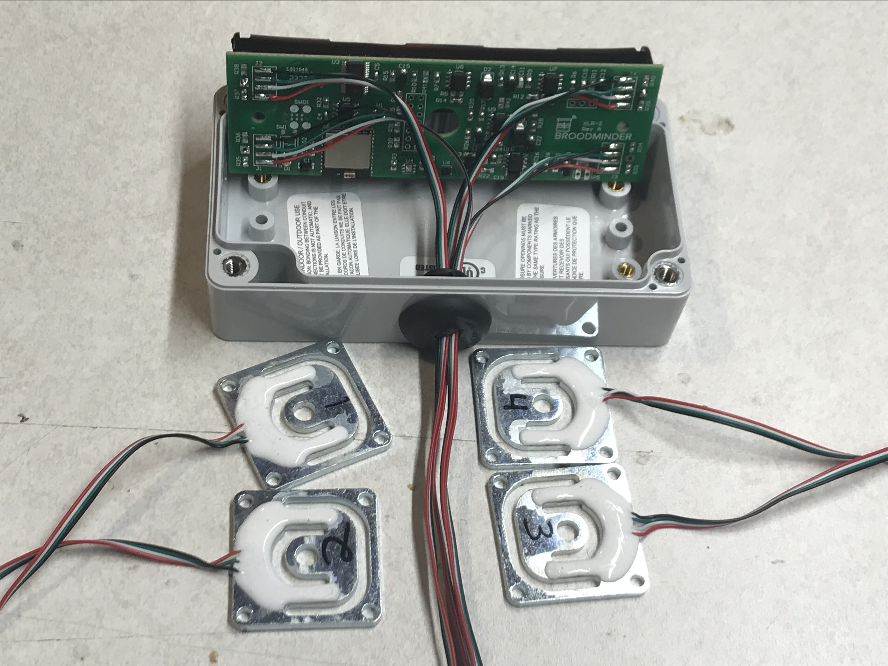

## Mount the scale feet

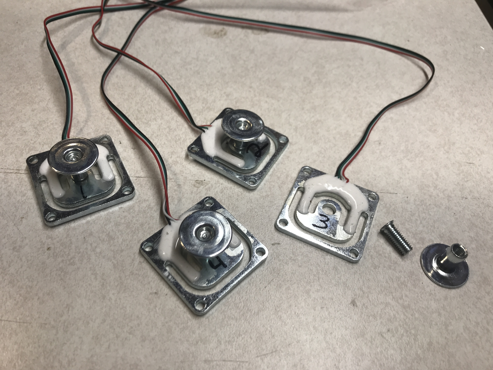

## Mount the scale structure

Go to next chapter : [W3 Scale Assembly](http://doc.mybroodminder.com/en/33b_sensors_W3_assembly/)
