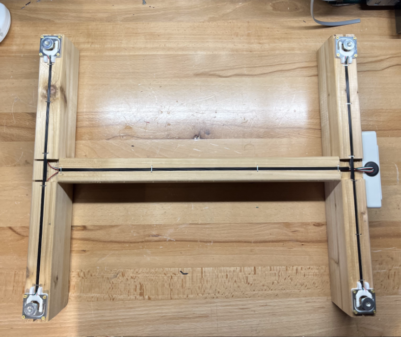
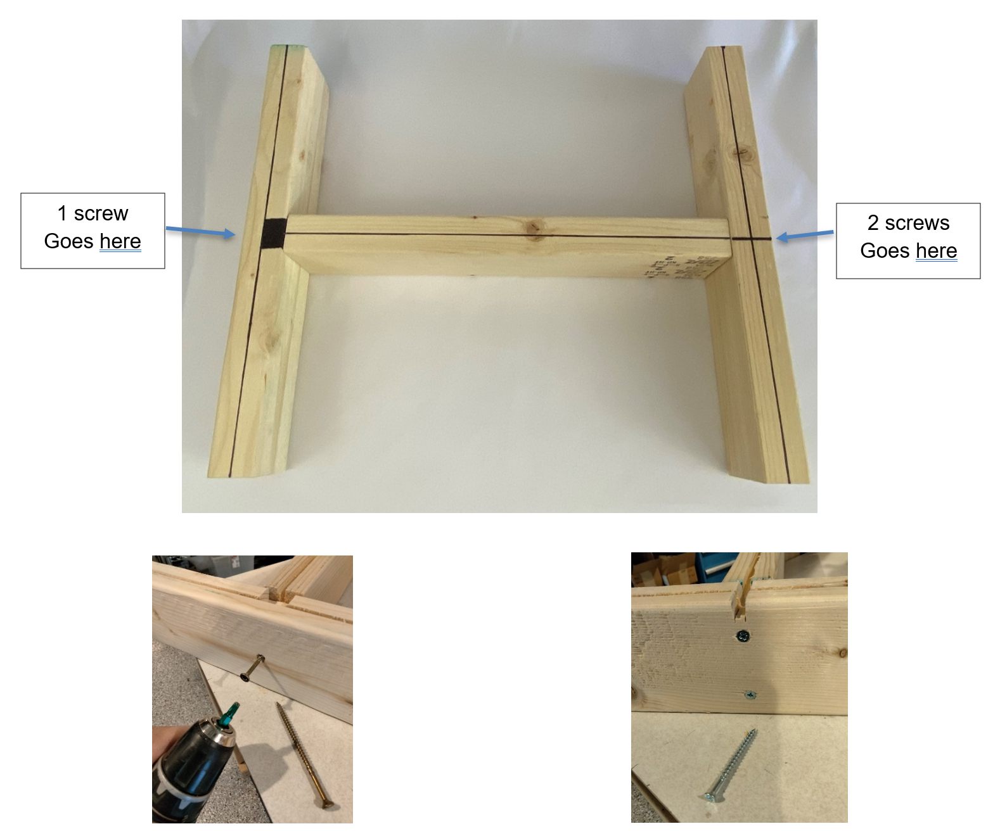
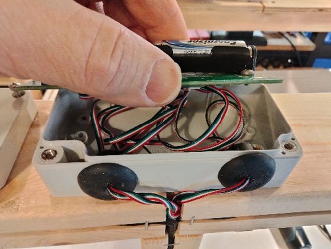

# BroodMinder-W3 Kit Guide

## Overview

!!! tip

    If you acquired a W3 uncalibrated-unassembled model you should first start with the [Circuit board assembly](http://doc.mybroodminder.com/en/33a_sensors_W3_boardAssembly/) about how to assemble (solder) board with loadcells.

!!! tip

    We suggest that you watch the videos from Section DIY/W3 in the [video Library](http://doc.mybroodminder.com/en/86_video_library/).

    
 The first section of this document demonstrates the **fixed feet** version followed by the **swivel feet** version. There is also an appendix to explain modification for Fixed to Swivel W3.

## BroodMinder-W3 Assembly - FIXED FEET

### Hardware

| Reference | **Item Description**                     | **Qty** | **Metric (mm)** |
| ----------|----------------------------------------- | ------- |  ----- |
| A | Phillips Flat Head # 7 x 5/8"                    | 2       | 3x20   |
| B | #8x4" Drywall Screw (W3PA &  W3UA)               | 3       | 4x70   |
| C | #3 3/4 Phil Brass Flat Wood Screw                | 16      | 3x20   |
| D | Load Cell Custom Support                         | 4       |        |
| E | Spline Material                                  | 1       |        |
| F | Electronics Assembly                             | 1       |        |
| user provided |16.5 Inch Pine 2x4 (adjust for hive width)   | 2       | 430x40x60 |
| user provided |15-16 Inch Pine 2x4                   | 1       | 420x40x60 |

### Prepare the frame members

- Cut your 2x4s to length. 
  - The length of the end boards should be enough to span the width of your beehive. We typically make them about 16.25”-16.50" long for a typical 10 frame Langstroth hive. The length of the connecting board is not critical but should be around 16”. 
- Cut saw kerfs (1,2,3) as shown in the picture below. They should be around 0.4” -0.75” deep. These will hold the wires from the sensors.
- Cut kerf 4 for the wires to reach the electronics box. (see picture farther down). 
- Test fit the spline and widen the kerfs if necessary.
- Remove the broad area (marked 5) with a chisel so that when the 2x4 tips it does not pinch the wire.

Screw together the frame (Fixed Feet)

Once you’re sure everything is where it needs to be, use 3 letter B screws to secure the boards together.

!!! note

    It is recommended to use a 5/32th drill bit or similar for making the pilot holes before drilling in the nails. A 1/8th drill bit or smaller may result in stripping the nail when drilling and prevent the nail from being fully drilled into the board.

To assemble your frame, make sure you have a flat surface and ensure your pieces are square. Follow the picture above for the correct orientation of the boards. 

Make sure not to completely drill in the side with one screw so that the board can pivot.

### Attach the electronics box

Make sure the box is located center in the frame with the hole opening as shown. There should be a slight gap between the edge of the frame and the box as shown. Use (2) “A” screws which screw into the top right and bottom left of the electronics box.

### Sensor Mounting

Position sensors marked 1-4 as shown with mounts “D” as shown.

Use 4 “C” screws per sensor. Make sure that before you drill in the sensors to the wood that you put the load cell custom support () between the sensor and the wood to allow for the sensor to read correctly. If the mount is not installed, it can cause the sensors to record incorrect information.

***IMPORTANT: Do not fully tighten these screws. Bending the senor will create a measurement error. Tighten then back off ½ turn.***

### Wire Routing

Once the sensors have been mounted, you can run the wires through the groves cut in the wood.

To deal with any extra wire:
- Unmount the circuit board from the electronics box by removing the two screws on either end of the board.
- Pull the slack wire through the grummit and fold it so that it sits behind the circuit board.
  - Remember not to put any stress directly on the connections for the wires if possible, as that has a high chance to cause the connections to come loose or disconnect entirely.
- Remount the circuit board to the electronics box with the same two screws.

Once the wiring has been routed properly and any slack has been pulled into the back of the electronics box, you can secure/protect the wires using the spline material "E". 

It is recommended to use a flat object to gently push the spline material into the groves so that they do not stick out (this does not take much force, gently tapping with a hammer works well). Once the spline material is in place, it can then be secured to the wood using staples to ensure it doesnt come loose or fall out in the future.

!!! note

    Be careful when stapling not to have a staple go directly through the spline material as that may cut the wires to the sensors. 

### Finish and Enjoy

Now you can remove the battery tab and replace the lid on the electronics box and enjoy your new BroodMinder beehive scale.

## BroodMinder-W3 Assembly - SWIVEL FEET

### Hardware

| **Item Description**                                         | **Qty** |
| ------------------------------------------------------------ | ------- |
| (Picture A) Phillips Flat Head # 7 x 5/8"                    | 2       |
| (Picture B) #8x4" Drywall Screw (W3PA & W3UA)                | 3       |
| (Picture C) #10 ¾” SS Round Head Screw                       | 4       |
| (Picture D) Load Cell Custom Support                         | 4       |
| (Picture E) Swivel Feet                                      | 4       |
| (Picture F) Spline Material                                  | 1       |
| (Picture G) Electronics Assembly                             | 1       |
| 16.5 Inch Pine 2x4 (User provided)   (16.5 inch or adjust for hive width) | 2       |
| 15-16 Inch Pine 2x4 (User provided)                          | 1       |

### Prepare the frame members

- Cut your 2x4s to length. 
  - The length of the end boards should be enough to span the width of your beehive. We typically make them about 16.25”-16.50" long for a typical 10 frame Langstroth hive. The length of the connecting board is not critical but should be around 16”. 
- Cut saw kerfs (1,2,3) as shown in the picture below. They should be around 0.4” -0.75” deep. These will hold the wires from the sensors.
- Cut kerf 4 for the wires to reach the electronics box. (see picture farther down). 
- Test fit the spline and widen the kerfs if necessary.
- Remove the broad area (marked 5) with a chisel so that when the 2x4 tips it does not pinch the wire.
- Drill qty 4, ¾” holes. The centers should be ¾” from the edge and ¾” deep

### Screw together the frame

Once you’re sure everything is where it needs to be, use 3 letter B screws to secure the boards together.

To assemble your frame, make sure you have a flat surface and ensure your pieces are square. Follow the picture above for the correct orientation of the boards. 

Leave the side with 1 screw very slightly loose so that the board may pivot.

### Attach the electronics box

Make sure the box is located center in the frame with the hole opening as shown. There should be a slight gap between the edge of the frame and the box as shown. Use (2) “A” screws.

### Sensor Mounting

Use 1 “C” screws per sensor.

### Wire Routing 

Tuck the wires into grooves and secure with spline material “E”. To secure spline material press into groove with flat object, this allows wires to move in the bottom of groove. Do not create stress on the wires. Remove (2) circuit board mounting screws. Pull the slack wire into electronics box and fold wire behind circuit board, reinstall mounting screws. Secure spline material with staples.

### Finish and Enjoy

Now you can remove the battery tab and replace the lid on the electronics box and enjoy your new BroodMinder beehive scale.

!!! tip

    If you acquired a W3 uncalibrated-unassembled model you still need to calibrate your scale. Jump to the [Scale calibration](http://doc.mybroodminder.com/en/33c_sensors_W3_calibration/) section

## Appendix: Update fixed feet W3 scales to swivel feet

If you have an Apimaye hive, you may want to upgrade your W3 to include the swivel feet mounting.

 This is quite easy except for one step. Removing the fixed feet from the W3 kit is quite difficult because there is no screw head to grab and the feet are fixed with permanent Loctite.

 We have tried removing them here at Bees on Main and boy… they are difficult.

 Therefore, we recommend modifying the load cell holder and using the load cells with fixed feet. The modification is needed so that the foot reaches the ground.

 All that you must do is remove the skirt that captures the swivel foot.

## Appendix: W3 Unassembled-Uncalibrated parts

Here are all the parts for a W3 scale H model type : 

(only missing the Spline material)

)