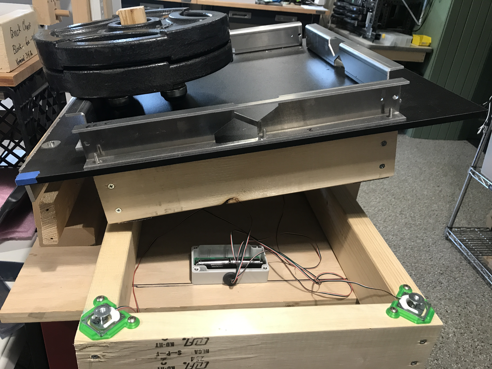
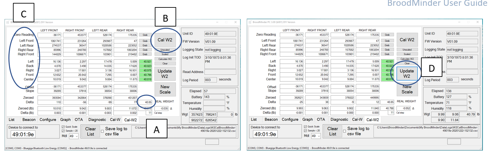

# W3 and DIY circuit board calibration

What follow will explain you how to calibrate the hive scales BroodMinder-W3 model or for the BroodMinder-DIY

### Calibration (DIY and W3UA Only)

You can calibrate your scale in two ways:

1. with the Bees App (android, iOS) is the easy way
2. with the PC App

Watch the video to get you started :

The excel sheet for calibration is available here :
[https://docs.google.com/spreadsheets/d/1yNMxpkNxwFt1J_uJ8xHo6vfJbq1KBUc7IOpyQM6JVI4/edit](https://docs.google.com/spreadsheets/d/1yNMxpkNxwFt1J_uJ8xHo6vfJbq1KBUc7IOpyQM6JVI4/edit)
You will need to make a copy in your own drive (`File > make a copy`)

## Calibration (Internal)

Use the jig to calibrate the scale

### Four-sensor scale

If you are using 4 sensors together, then you should use the Cal-W3 tab as explained next.

 
A.  Enter the true weight (in lbs) that you will use for calibration in the A zone. Be sure to include anything that will load the sensors (e.g. any extra boards that you use). Here we flip the scale on it’s back and move the weight around on a piece of plywood sitting on the feet.

B.  Remove all the weight from the load cells and press `Cal W3`. The first thing it will do is zero the system. You will see the raw ADC values show up in the zeroed row. After this step, you will see approximate weights shown in (lb) rows. This is based on the slope in the slope row. We use a default value for the -W2 sensors. You can play around with this to get close for your sensors.

C.  Next you should move the calibration weight as directed on region C above. The program automatically advances when it sees a weight > 5 pounds on the appropriate sensor. After the 4 corners are complete, the program calculates the slope for each sensor and updates the Slope line. The next 5 positions are used to verify the scale. If the value is within 0.5 the box lights up Green. ALTERNATIVELY you can press the “Grab” buttons to force the program to grab a weight. This might be necessary depending on the weight you are using.

D.  After you are satisfied with the calibration, press `Update W3` and it will write the values to the circuit board. You know it is complete when the Weight (Wgt) values switch back to pounds.