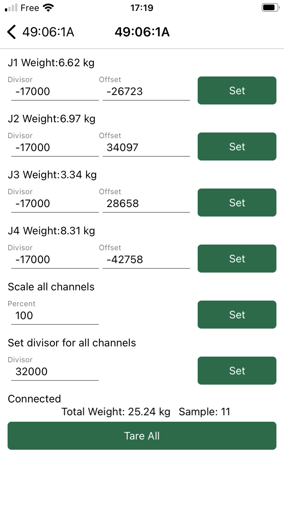

# W3 and DIY circuit board calibration

What follow will explain you how to calibrate the hive scales BroodMinder-W3 model or for the BroodMinder-DIY

### Calibration (DIY and W3UA Only)

You will now calibrate your scale using the Bees App.

Watch the video to get you started :

The excel sheet for calibration is available [here](https://docs.google.com/spreadsheets/d/1yNMxpkNxwFt1J_uJ8xHo6vfJbq1KBUc7IOpyQM6JVI4/edit).
You will need to make a copy in your own drive (`File > make a copy`)

You will find the calibration screen in the Bees App at ` Devices Tab > [Device name] > ... > Show details > ... > Troubleshooting > Calibrate Scale`

Your objective is to find the actual four Divisors. Offsets are not concerned (automatic).
A good divisor starting point is 
- 32000 for 50kg load cells
- -17000 for 100kg load cells
- -9000 for 200kg load cells