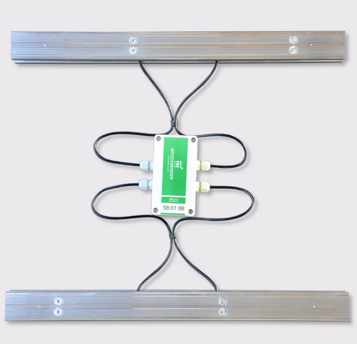
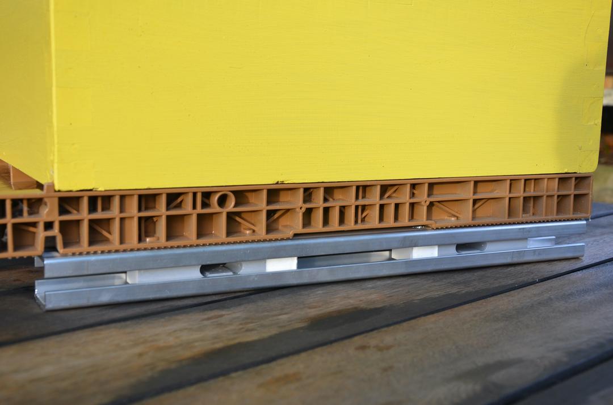
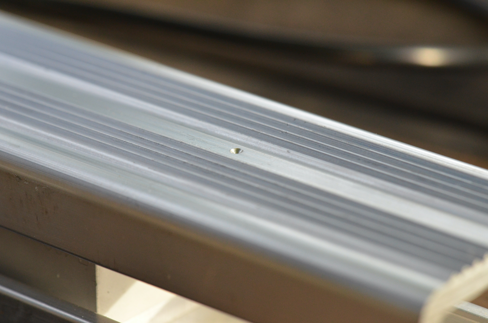
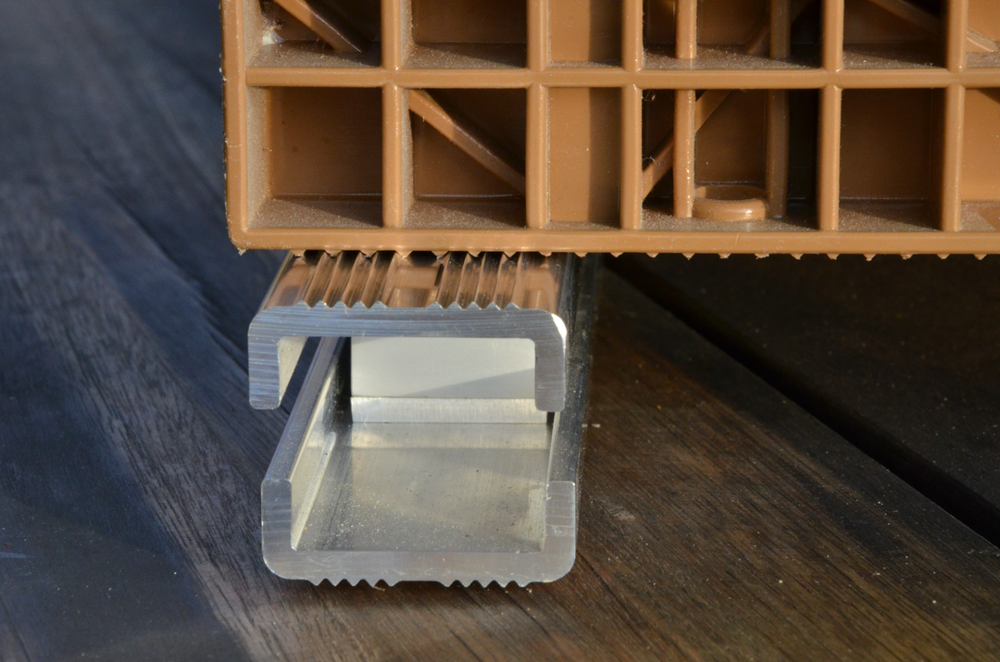
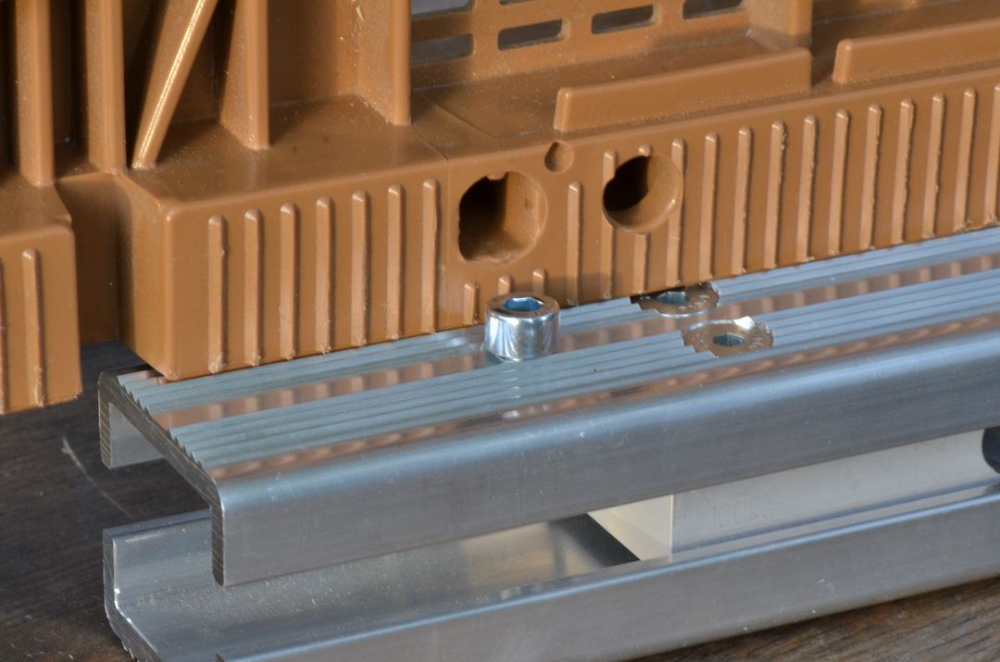
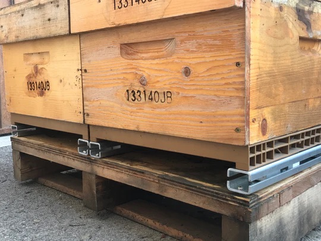
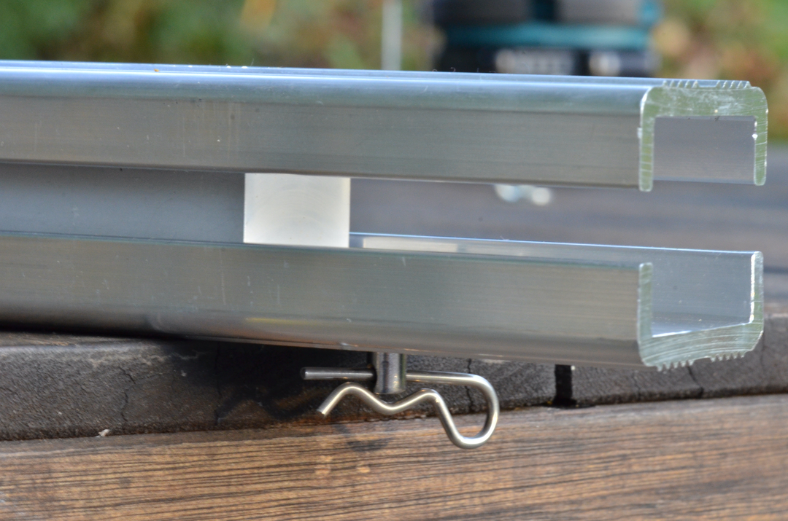
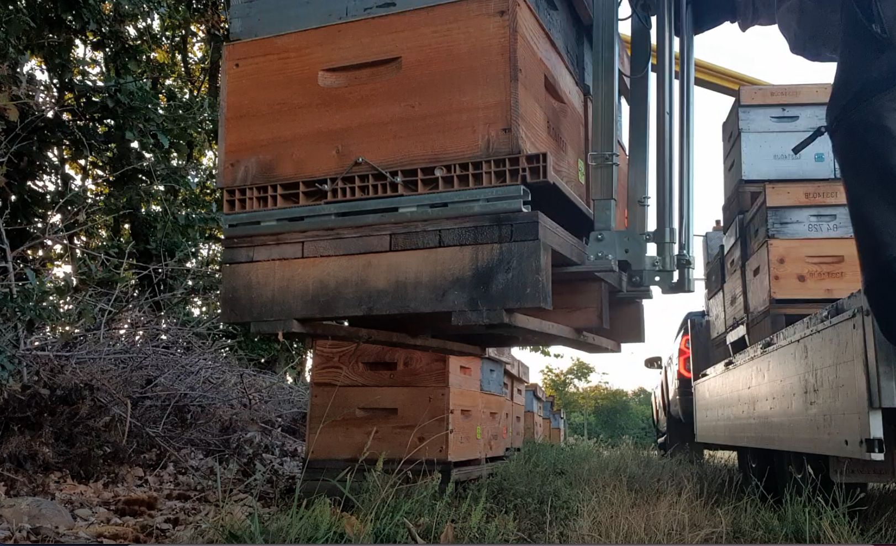
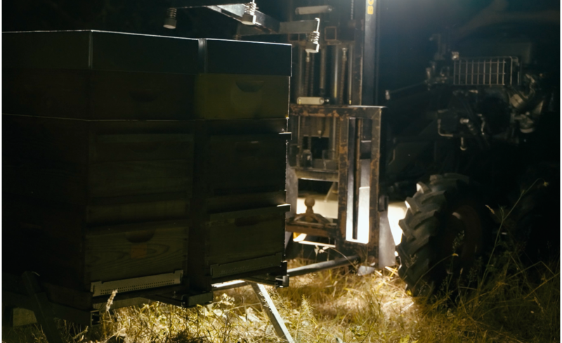
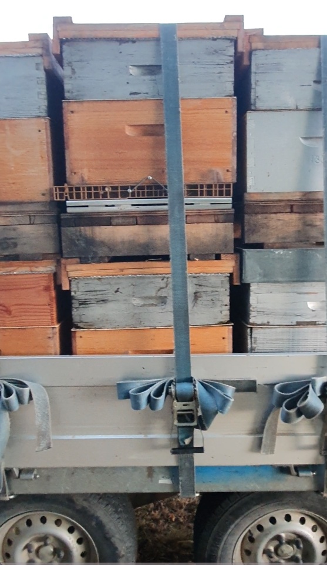

{ style="display: block; margin: 0 auto" }

## Broodminder-W4 (49)
!!! note
    W4 scale is only available in Europe.
    
    
BroodMinder-W4 is a professional grade hive scale specially designed for migratory beekeeping. It is a rugged, lightweight and high precision scale that can be installed in any kind of configuration. Insensitive to hive leveling or centering with its 4 x 100kg high precision load cells, it mounts easily on wooden or metal pallets.

As for any other of our hive scale models, W4 will accurately measure the slightest changes in beehive weight, allowing to detect nectar-flow startup and intensity. It also improves colony overwintering and spring growth management and gives precise description of foragers activity during the day.

Recommended for migratory beekeepers to improve colony management while reducing time spent and transportation costs.

### Installation

The W4 bars are 50cm long. You tipically can mount them longitudinal to the hive (left/right) but also transversal (front/rear). It all depends on your preferences and constraints. The acuracy remains unchanged.

This scale is specially designed for migratory beekeepers. The aluminum structure is 4 mm thick and features grooved surfaces on the top and bottom to prevent the hive from slipping.

For those using Nicot(r) bottoms, the scale takes advantage of their features. The grooves are fitting the bottom, actually holding the hive from any slip. 

Theres also the possibility to mount centering pins on the scale using the pre-positionned mark for drilling (see picture above).

#### Mounting on pallets

If you are migrating your hives, you do not even need to remove the hive, you can let it installed. For this you will have to attach the scale to your pallets. 

* On wooden pallets simply drill two holes on thhe bottom bar and screw them to the pallet 

* on metal pallets, you can drill and use a pin 

Then you can securely handle and lift your pallets.

Once on your truck, you can strap without fear. The maximum nominal weight for this scale is 400kg. Straping will raise the load to 150-200 kg.

