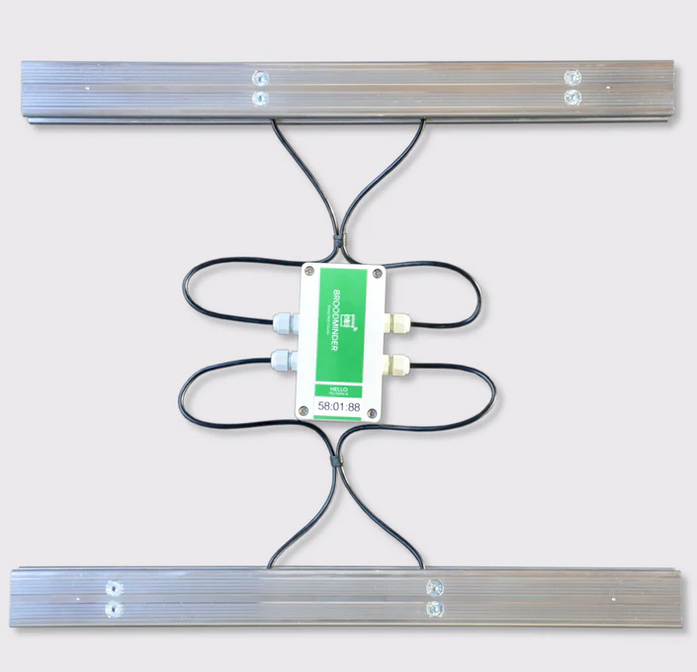
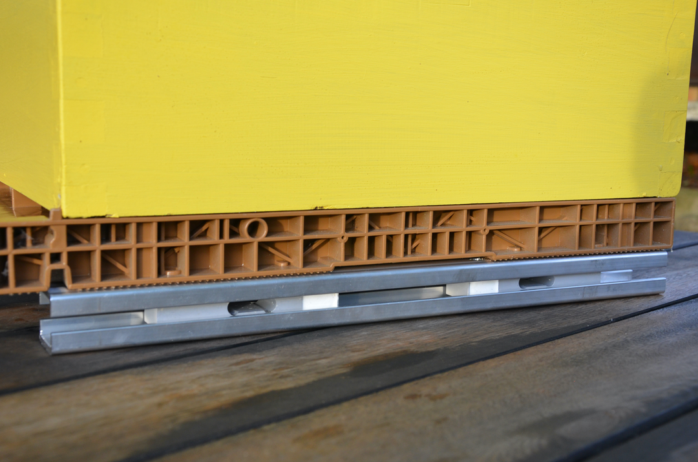
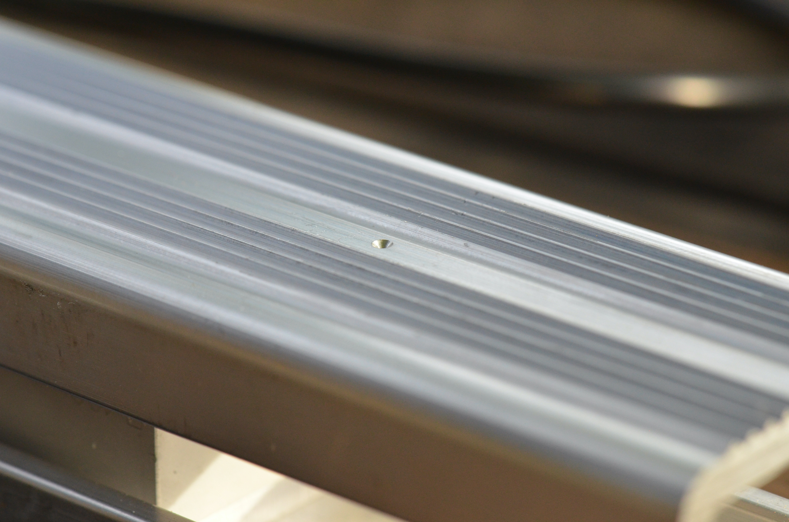
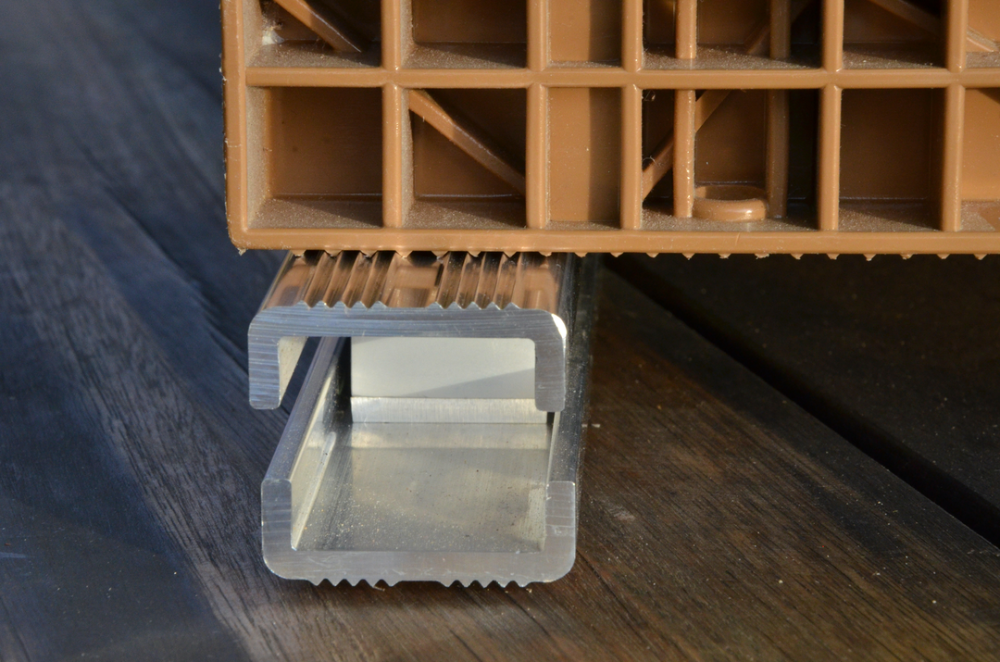
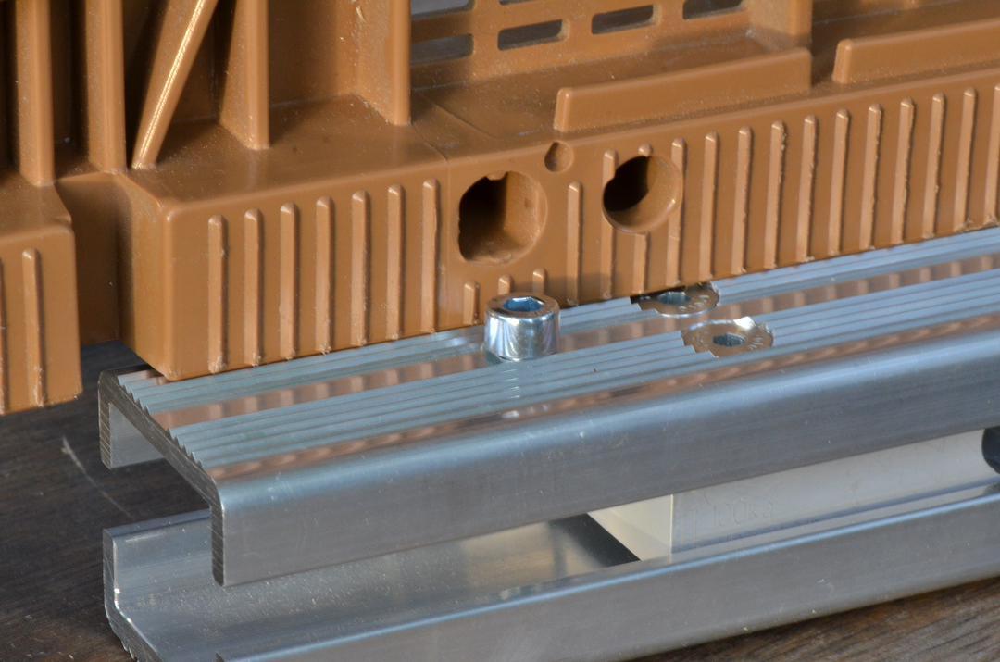
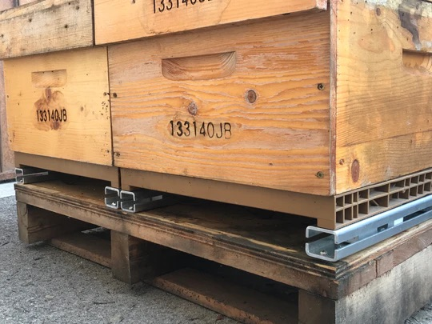
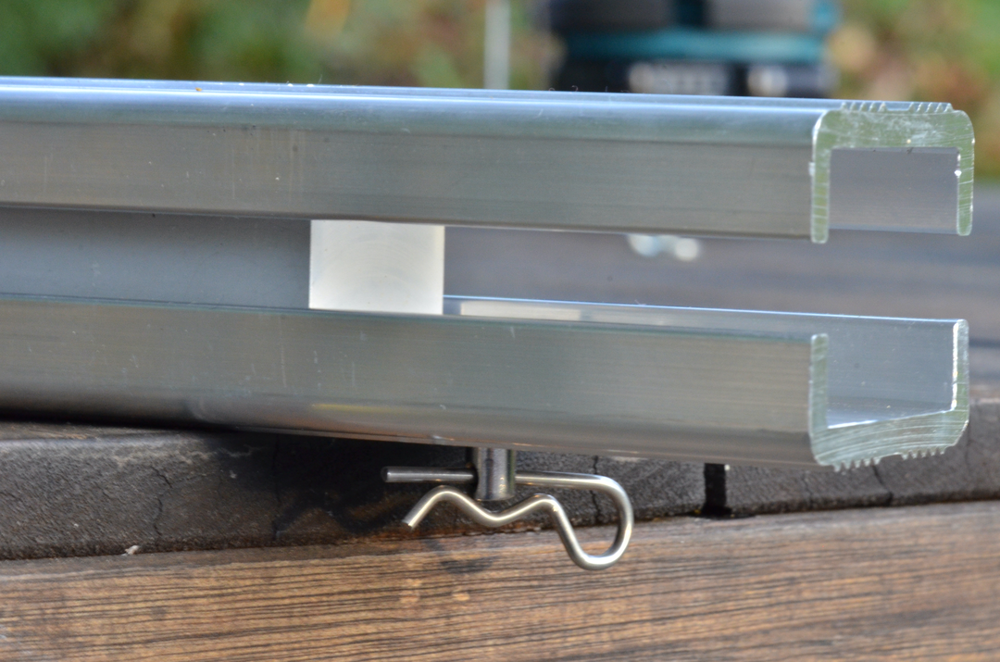
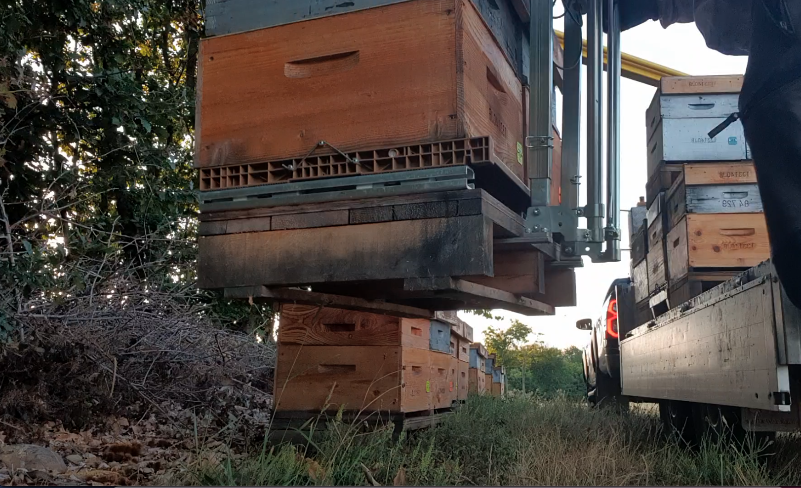
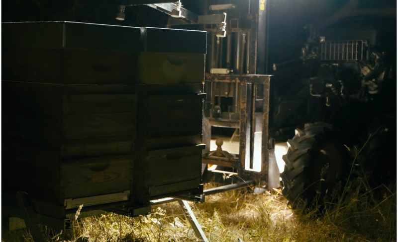

{ style="display: block; margin: 0 auto" }

!!! note
    W4 scale is only available in Europe.
    
    
BroodMinder-W4 is a professional grade hive scale specially designed for migratory beekeeping. It is a rugged, lightweight and high precision scale that can be installed in any kind of configuration. Insensitive to hive leveling or centering with its 4 x 100kg high precision load cells, it mounts easily on wooden or metal pallets.

As for any other of our hive scale models, W4 will accurately measure the slightest changes in beehive weight, allowing to detect nectar-flow startup and intensity. It also improves colony overwintering and spring growth management and gives precise description of foragers activity during the day.

Recommended for migratory beekeepers to improve colony management while reducing time spent and transportation costs.

### Installation

The W4 bars are 50cm long. You tipically can mount them longitudinal to the hive (left/right) but also transversal (front/rear). It all depends on your preferences and constraints. The acuracy remains unchanged.

This scale is specially designed for migratory beekeepers. The aluminum structure is 4 mm thick and features grooved surfaces on the top and bottom to prevent the hive from slipping.

For those using Nicot(r) bottoms, the scale takes advantage of their features. The grooves are fitting the bottom, actually holding the hive from any slip. 

Theres also the possibility to mount centering pins on the scale using the pre-positionned mark for drilling (see picture above).

#### Mounting on pallets

If you are migrating your hives, you do not even need to remove the hive, you can let it installed. For this you will have to attach the scale to your pallets. 

* On wooden pallets simply drill two holes on thhe bottom bar and screw them to the pallet 

* on metal pallets, you can drill and use a pin 

Then you can securely handle and lift your pallets.

Once on your truck, you can strap without fear. The maximum nominal weight for this scale is 400kg. Straping will raise the load to 150-200 kg.

### Maintenance

The **BroodMinder-W4** requires very little maintenance. It is powered by **two AA alkaline batteries**, which typically last **4 to 5 years** when using the default hourly logging rate.

To replace the batteries, simply open the enclosure and remove them from the battery holder.

When new batteries are installed, you should see the device LED blinking. Since the LED is located on the reverse side of the circuit board, its light will be visible as a reflection on the bottom of the enclosure.

As part of annual maintenance, ideally before the beekeeping season starts, we recommend:

- checking that the enclosure seals remain in good condition;
- verifying that the cable glands are properly tightened.

#### Troubleshooting

If you need to troubleshoot the scale, the easiest approach is to place the device in **Real Time View** mode and manually apply pressure to each load cell while observing the measurements.

You can also place a known weight on the scale to verify that readings are accurate.

Navigate to:

`Bees > Devices > ... > Show Details > ... > View Real Time`

#### Taring and Calibration

You can also **re-tare** or **re-calibrate** the scale if necessary. This is rarely required under normal operating conditions, but these features have been integrated into the **Bees App** to simplify field service and remote support.

The complete calibration procedure is described [here](./33c_sensors_W3_calibration.md).
### Measurement Rate

By default, the **BroodMinder-W4** records one measurement every hour. You can increase the logging frequency to **15, or 5 minutes** if required.

Higher measurement rates are particularly useful for research projects or when studying specific events in detail. For standard beekeeping applications, however, we recommend keeping the default **1-hour interval**. This maximizes battery life while still allowing you to capture unexpected events thanks to the **WeightMinder** feature.

To change the logging interval:

`Bees > Devices > ... > Show Details > ... > Set Rate`

### WeightMinder

There are several discrete events that can significantly affect hive weight, such as inspections, strong nectar flows, or swarming events. When analyzing these events, having only hourly measurements is often insufficient to properly characterize what happened.

One option would be to increase the measurement frequency permanently. However, this comes at the cost of a much larger volume of data—most of it unnecessary—as well as reduced battery life, which is a critical factor when trying to capture relatively infrequent events.

To address this, we developed **WeightMinder**, an adaptive feature integrated directly into the firmware. The algorithm continuously monitors hive weight changes and automatically increases the logging frequency when significant variations are detected.

#### how it works

When a weight gain or loss exceeds **1 kg**, the logger switches from the standard **1-hour interval** to a **30-minute interval**. Once in this mode, measurements continue every 30 minutes as long as consecutive weight changes exceed **0.5 kg**. When weight variations stabilize below this threshold, the system automatically returns to the standard hourly logging rate.

WeightMinder ensures that, while maintaining a low default logging rate, detailed information is still captured during significant events, with minimal impact on battery life and data storage.

#### Typical use-cases

- Hive inspections
- Swarm events
- Periods of exceptionally strong nectar flow

!!! note

    This feature is available on XLR firmware version **4.64** and later.

    WeightMinder is only active when the logger is configured with a **1-hour logging interval**. If any other logging interval is selected, the feature is disabled.

### Auto Time Correction

Starting with **firmware version 4.64**, all **XLR-based devices**, including models **49, 57, 58, and 63**, support **Automatic Time Synchronization**.

This firmware introduces the ability for XLR devices to periodically synchronize their internal clock with accurate network time.

Historically, device clocks relied solely on the microcontroller's internal oscillator. While sufficiently accurate for most beekeeping applications, these clocks naturally drift over time. On average, we observed a drift up to one minute per month. Until now, the only way to correct this drift was to manually synchronize the device, as each synchronization updated the internal clock with the current time.

With firmware **4.64**, devices can automatically receive updated network time every **7 days**, effectively eliminating long-term clock drift.

#### How It Works

This feature operates in conjunction with a **BroodMinder-T91 Cellular Hub** installed at the apiary.

The hub periodically broadcasts accurate network time obtained from the cellular network. Nearby XLR devices, such as scales and BeeDars, receive this information and update their internal clock approximately every seven days.

As a result, any accumulated drift is automatically corrected without user intervention.

#### Additional Improvements

Besides maintaining accurate date and time information, this update also improves measurement scheduling.

Previously:

- Devices required an initial synchronization after battery installation.
- Measurement times depended on the exact moment batteries were inserted.
- Devices could gradually drift away from exact hourly boundaries.

With firmware **4.64**:

- Devices maintain highly accurate time continuously.
- Time drift is automatically corrected every seven days.
- Devices configured with an hourly logging interval now perform measurements precisely at the top of the hour.
- Multiple devices operating together remain synchronized.

This is particularly beneficial for applications involving several sensors monitoring the same hive, such as tandem **W5** scale installations.

#### Should You Care?

For most beekeepers, this change will have little visible impact on day-to-day operations. Your hive data will continue to work exactly as before.

However, improved timestamp accuracy can be particularly valuable if you:

- Conduct research;
- Analyze bee activity in detail;
- Study swarming events;
- Monitor departures and returns of foragers;
- Compare data across multiple sensors.

In short, this update quietly improves the precision of the BroodMinder ecosystem while requiring no action on your part.

#### How to Upgrade

Firmware upgrades can be performed directly in the field using the **Bees App**.

1. Open **User Settings**.
2. Enable **Show Available Firmware Upgrades**.
3. Navigate to the **Devices** tab.
4. Devices with available updates will display a yellow warning indicator ⚠️.
5. Tap the device and follow the prompts to start the upgrade.

Before upgrading, ensure that all data stored on the device has already been synchronized to the cloud. If necessary, perform a manual synchronization first to avoid losing unsynchronized measurements.

!!! note

    Automatic time synchronization requires a **BroodMinder-T91 Cellular Hub** running firmware version **3.55** or later.The hub broadcasts accurate network time, allowing nearby XLR devices to periodically correct their internal clock drift.

    **Be sure to upgrade your hub together with your devices!**

