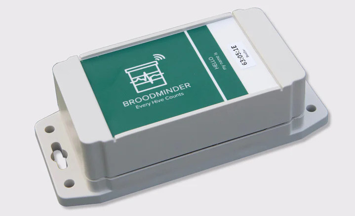

New in 2023, the BroodMinder-BeeDar is an activity monitor for your hive. 

- Radar is used to detect the number of flying bees. The radar emits from the square, green and gold sensor. This should be approximately over the entrance.
- Audio is used to detect the overall sound level of the hive. The audio sensor is mounted to the back of the box and couples to your beehive by screwing the BroodMinder-BeeDar to your hive box which then acts a bit like a guitar.

## Background

The BeeDar was invented by Dr. Herb Aumann from the University of Maine and Main Biosensors LLC. There is a nice academic paper about it here.

<a href="https://www.researchgate.net/publication/349017653_Janus_A_Combined_Radar_and_Vibration_Sensor_for_Beehive_Monitoring" target="_blank">https://www.researchgate.net/publication/349017653_Janus_A_Combined_Radar_and_Vibration_Sensor_for_Beehive_Monitoring</a>

The BeeDar senses motion and is tuned to be particularly sensitive to bees. When it collects data, it will record the motion for 30 seconds and then take the average. By default this will happen every 15 minutes. Data is transferred to MyBroodMinder just like every other BroodMinder device.

## Installation

- Remove the BeeDar lid and remove the 2 loose flat screws.
- Pull out the "Remove Before Use" tag. The LED on the circuit board should flash for several seconds. If it doesn't, then you might need to remove the one screw which holds the circuit board, take out the board and check the batteries. (Sometimes a part of the tag can rip and remain under the battery terminal.)
- Screw the BeeDar to your hive using the flat head screws and the holes that are in the upper right and lower left of the BeeDar.
- Replace the lid and tighten the screws making certain that the gasket is in place correctly.

The sensitivity of the BeeDar is a fan beam emanating from the radar sensor. The box should be mounded level and do not point it up by tipping the box backwards (such as on an angled landing board). This will do a good job of sensing rain falling which is not the goal.

!!! Note
    The BeeDar Audio will not work as well with a plastic hive as with a wooden hive due to the acoustic properties of plastic.
