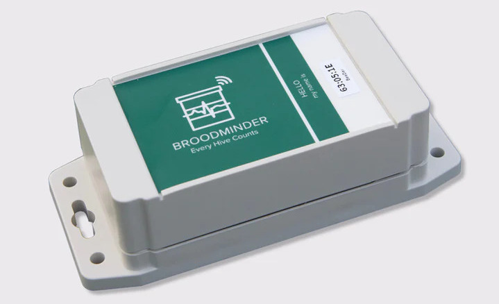
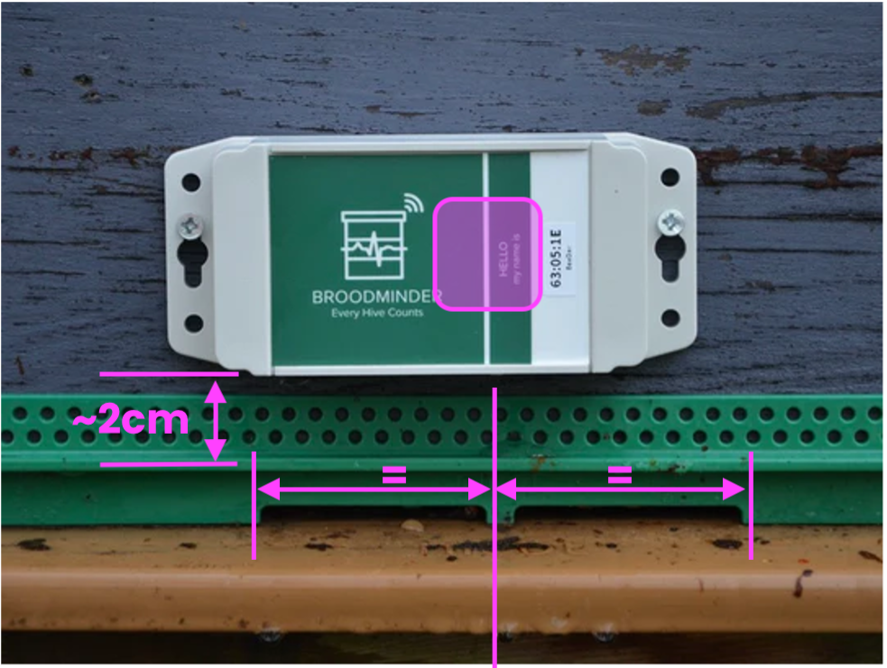
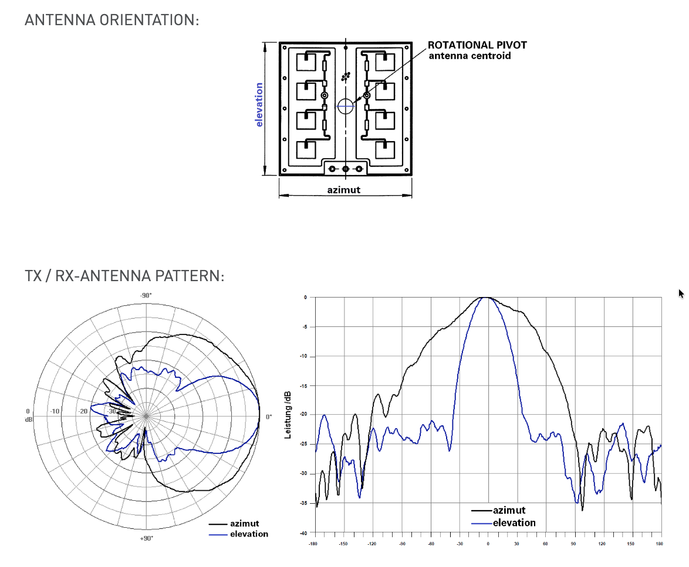
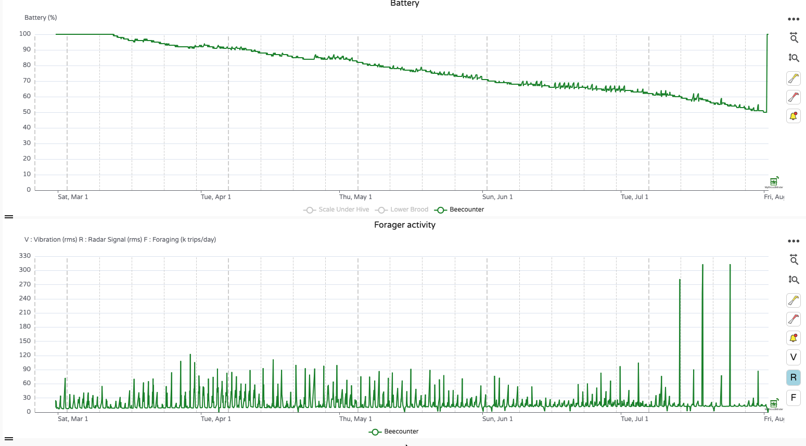

{ style="display: block; margin: 0 auto" }

New in 2023, the BroodMinder-BeeDar is a **forager activity monitor** for your hive. It uses radar to measure the level of flying activity at the entrance over time — it cannot count individual bees or determine their direction (in or out), but it provides an excellent measure of overall forager activity. Combined with MyBroodMinder algorithms, we can deduce the number of forager trips over the course of a day with good accuracy. See [MyBroodMinder > foraging](./50_mybroodminder_v5e_foraging.md) for details.

Beyond hobbyist beekeeping, the BeeDar is being widely used in **agriculture and pollination trials** as a reliable tool to monitor pollination activity in the field. Its accuracy, low power consumption, and unobtrusive form factor make it well suited for research and commercial deployments alike fitting literally in any hive.

What makes it particularly elegant is what it *doesn't* need: no camera, no optical access, no sound pollution. The Doppler radar technique is efficient and discreet — running on just 4 AA batteries for up to 5 months.

The BeeDar also captures vibration to measure the overall sound level around the hive.

- **Radar** — emitted from the square, green and gold sensor, which should be positioned approximately over the entrance.
- **Vibration** — the sensor is mounted to the back of the box and couples acoustically to the hive when the BeeDar is screwed directly to the hive body, which then acts a bit like a guitar.

## Background

The BeeDar was invented by Dr. Herb Aumann of the *University of Maine* and *Maine Biosensors LLC*. His original research is described in the following paper:

<a href="https://www.researchgate.net/publication/349017653_Janus_A_Combined_Radar_and_Vibration_Sensor_for_Beehive_Monitoring" target="_blank">Janus: A Combined Radar and Vibration Sensor for Beehive Monitoring</a>

The BeeDar senses motion and is tuned to be particularly sensitive to bees. Each measurement samples motion over 30 seconds and records the average, with readings taken every 15 minutes by default. Data is transferred to MyBroodMinder like any other BroodMinder device. For more on how it works and its accuracy, see [MyBroodMinder > foraging](./50_mybroodminder_v5e_foraging/).

## BeeDar Installation

### Before You Start

Make sure you have the following items ready:

- BeeDar unit
- 2 4×20mm wood screws (included)
- Philips Screwdriver

---

### Step 1 — Power On

1. Remove the BeeDar lid.
2. Pull out both **Remove Before Use** tags.
3. The LED on the circuit board should flash for several seconds, confirming the unit is active.

> **Note:** The LED faces inward. You will see its light reflected on the bottom of the box — this is normal.

---

### Step 2 — Position the BeeDar

Getting placement right is critical for accurate readings. There are two axes to consider.

#### Horizontal alignment

The radar antenna is located directly behind the **vertical white line** on the front sticker. Align this line with the **centre axis of your hive entrance** so the sensor captures bees coming from both sides equally.

#### Vertical alignment

Mount the BeeDar **just above the entrance**, leaving approximately **2 cm of wood visible below it**.

> **Important:** Do not mount it too high. The radar has a vertical beam of ±30°. If the unit is positioned too far above the entrance, bees flying close to the landing board will fall outside the detection zone.

---

### Step 3 — Mount the Unit

1. Hold the BeeDar in the chosen position.
2. Use the **central mounting holes** — these are designed to let you hang the unit easily before tightening.
3. Drive the four M20mm screws. **Do not overtighten** — snug is sufficient to avoid damaging the housing.

---

### Understanding the Detection Zone

The BeeDar's sensitivity pattern is a **fan-shaped beam** radiating from the radar sensor:

| Axis | Beam width |
|---|---|
| Elevation (vertical) | ±30° |
| Azimuth (horizontal) | ±80° |

!!! tip "Tip : For best results"

    - Mount the unit **level**. Do not tilt it backwards, for example on an angled landing board, as this points the beam upward and away from the entrance.
    - Keep a **1 m clear zone** in front of the hive. Weeds, grass, or plants within this distance will generate false movement signals, especially in windy conditions.
    - Once installed, the BeeDar must remain **stationary**. Any vibration of the unit itself can be picked up as a signal unrelated to bee activity.

---

### Battery Life

The BeeDar runs on **4 alkaline AA batteries**. At the default sampling rate of 15 minutes, expect approximately **5 months** of operation under normal conditions.

A few things to keep in mind:

- Battery readings below **53%** will still return a signal, but the values will no longer be physically meaningful. Plan to replace batteries before reaching this threshold.
- You will receive an **email alert** when the 53% threshold is reached.

The chart below shows an example of power consumption and signal activity over a full 5-month cycle.

