# Do It Yourself Guide

## Why DIY ?
We realize that many of our users are curious and want to invent things. Our DIY kit allows that creativity without the need to write 8 years of software. 

The DIY is the raw circuit board that we use in the BroodMinder-W2. We hope that this board allows many home crafters to create wonderful devices to monitor the hives. Be sure to share your designs with us and we will share them with the world. 

- Proven design
- 5-year battery life
- **No software to write**
- Works with most standard load cells
- Integrates into the vast BroodMinder ecosystem
- Utilizes a 4 channel 24-bit load cell IC (TI ADS1234)
- Data is available by BLE advertising
- Stored data is readable by BroodMinder apps

In order to utilize the BroodMinder-DIY, you will need to add your own load cells. The board should work with most load cell available, but beware, there are many bad choices. For example, if you try to use normal “bathroom scales” load cells, you will find that they have tremendous “creep”. Under load, the output values can change 50% overnight.

Theo and Lorenzo have also created some examples which we have included in our [public dropbox folder](https://www.dropbox.com/sh/nmhfpuy9s5x086f/AADkyDIcJrfsqsd9yUJ-7Lr6a?dl=0) (https://www.dropbox.com/sh/nmhfpuy9s5x086f/AADkyDIcJrfsqsd9yUJ-7Lr6a?dl=0) . We will be posting many details including bills of materials and 3d models.

The metal hive stand is available from BetterBee: https://www.betterbee.com/wooden-hive-equipment-10-frame/LYHE4033.asp


Weather is your enemy, so you will also want a box and cable glands, we recommend the following available from Digikey.com

- Bud Industries PN-1322-CMB‎ $11.20
- Waterproof box - Hammond 1554N2GYCL $22.83
- Smaller Hammond, fits circuit board nicely 1554C $10.00
- Not quite waterproof, but good size with ears - Hammond 1591CSFLBK $5.50
- Bud Industries cable gland IPG-2227 $0.50

Here is the Hammond 1554N2GYCL box installed on the Betterbee hive stand


The board does not sport much in the way of electrical protection. We have found that in our configuration this is fine and we want to save as much cost as possible for our users. You may need or want to add additional protection circuits. We leave that to you.

!!! warning
    THE ABSOLUTE MAXIMUM VOLTAGE FOR THE DIY BOARD IS 3.8 VOLTS DC!


Digikey.com (or Silabs.com or TI.com) is a good place to start for gather the datasheets if you want to dig in deeper. 

A final note, (stepping up on soap box), I (Rich Morris) hate connectors. They are almost always the first thing to fail. Personally, I try to solder everything but your milage may vary. (stepping down now)

 

!!! note
    On the next page you will find our circuitry. You may wonder why we share this... The truth is, the circuit doesn’t get you very far. It requires lots and lots (and lots) of software to hold this all together. We hope the circuit helps you if you need it or want to learn more. 

 
​


​

Here are two types of load cells (also called strain gauges). We are happy to provide you with either type. If you get your own, be sure that they are temperature compensated and have very low creep. The resistance of the 200KG load cell is roughly 300 ohms per leg. For the 50KG load cells it is around 750 ohms.

Most load cells seem to use this color scheme for the wires. If that is the case, then wire them like this.

Black, Green, White, Red (from top to bottom). 

!!! tip
    red wire (+) always hooks to the Square pad.


The outputs are in the middle. If things are mixed up, usually it will be corrected during calibration.


​       

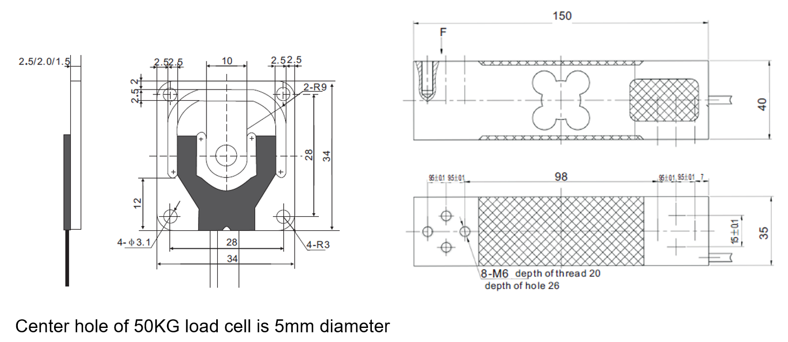

## Calibration 

!!! tip
    We have now built new features into the Bees app for doing calibration. See the video [here]( https://youtu.be/g8QUoGfgbbw) for more information.

Once you have your scale built, you will want to calibrate it. You do this by setting the offset and the scale factor for each ADC channel which are stored in flash memory in the processor. We are providing our in-house PC app to do this. Sorry, it is not available for Apple. However, it will run on a quite inexpensive PC. The PC App is available in our[ public Dropbox folder](https://www.dropbox.com/sh/vj621467gak5bd7/AAAitrIE_vKsw07AGnlgopxha?dl=0) (https://www.dropbox.com/sh/nmhfpuy9s5x086f/AADkyDIcJrfsqsd9yUJ-7Lr6a?dl=0 ) .

!!! info
    For BLE (Bluetooth Low Energy) communication you must have a Silicon Labs BLE112 dongle (Digikey 1446-1030-ND)

Many of the controls are explained by hovering the mouse over the control. This app was not designed for external use, so you must forgive us for the ugly nature of it. It does work, we have calibrated thousands of scales with it.

!!! note
    you don’t need to execute the next page if you are using a 4-sensor setup. That is, 4 sensors on one hive, one on each corner. You should go to the “CAL-W3” tab of the program.

!!! warning "check the board model!"
   
    The DIY board is a model 58. If you have something different (e.g. 57:xx:xx) call us and we will work it out. The ID should start with 58!

### Single-sensor scale

1. Start the app and see that the BroodMinder-DIY shows up on the advertising list.
2. Make sure the ID (58:xx:xx) is in the “Device to connect to” box
3. Select the configure tab, the BRM-58 should connect automatically.
4. At the start, the log period is 3600 seconds. Set the log period to 3 seconds and click `update log period`.
5. Press `Start real time`, you should see the logging start and “Elapsed” increase every 3 seconds.
6. With your load cells unloaded, press `Tare XLR` (XLR is our name for the board). All sensors should read 0.0 pounds after this.
7. Put a known weight on the scale.
8. Adjust the divisor for each channel and press the `Cal Jx Weight` buttons to transfer and store the scale factor.
9. Write down your divisor factors. At the current time, they can not be read from the BRM-58.

!!! Note

    if you are not using a channel, set the divisor to 0 and it will always read 0 weight.

The divisors are the values that convert the raw readings of the ADC to weight. 31,000 is a good starting place for the small load cells. The large one is more like 11,000. The readings that you see in this program are in pounds (with apologies to the MKS crowd). It is a simple matter to set the divisor to a value, then do a test weight. And then adjust the divisor appropriately. For example:

Real Weight = 30.0 pounds, Divisor = 31,000, BRM-58 readout is 20.0 pounds

Change the divisor to 31000 * 20.0 / 30.0 = 20,666 and the weight should correctly read 30.0

All offsets should remain 0 for BRM-58

​          

There are many other controls and features that we will not go into here. Feel free to explore.

That’s it, you are done unless you are using 4 x 50KG sensors in one scale. For that we have to get a bit more exotic.

### Four-sensor scale

If you are using 4 sensors together, then you should use the Cal-W3 tab as explained next.


 
A.  Enter the true weight (in lbs) that you will use for calibration in the A zone. Be sure to include anything that will load the sensors (e.g. any extra boards that you use). Here we flip the scale on it’s back and move the weight around on a piece of plywood sitting on the feet.

B.  Remove all the weight from the load cells and press `Cal W3`. The first thing it will do is zero the system. You will see the raw ADC values show up in the zeroed row. After this step, you will see approximate weights shown in (lb) rows. This is based on the slope in the slope row. We use a default value for the -W2 sensors. You can play around with this to get close for your sensors.

C.  Next you should move the calibration weight as directed on region C above. The program automatically advances when it sees a weight > 5 pounds on the appropriate sensor. After the 4 corners are complete, the program calculates the slope for each sensor and updates the Slope line. The next 5 positions are used to verify the scale. If the value is within 0.5 the box lights up Green. ALTERNATIVELY you can press the “Grab” buttons to force the program to grab a weight. This might be necessary depending on the weight you are using.

D.  After you are satisfied with the calibration, press `Update W3` and it will write the values to the circuit board. You know it is complete when the Weight (Wgt) values switch back to pounds.

!!! tip 
   
    Basically what is happening here is we are using linear algebra to solve the simultaneous equations generated by the first 5 positions. After zeroing the sensors, there 4 weights and 4 variables (slopes). Through the magic of mathematics, we get the answers.

- You may want to use this board to run 4 hives, that is fine with us. If you use connectors, be certain that they are really good and weather resistant. They usually are the point of failure.

- Try to avoid anything that will result in friction or stiction. It is remarkable how a tiny rub will have a big impact. Do not use hinges, they are awful. Even ball bearings will result in significant errors. Pivots are good.

This is a very brief outline of how to proceed, I hope it is enough. If you need some more help or have additions we should add to this manual for the next user, contact Rich at [Rich@BroodMinder.com](mailto:Rich@BroodMinder.com).


## Converting a broken hive scale using DIY

It is easy to take an old broken hive scale and convert it to a BroodMinder enable scale. Here is an example. NOTE: This is not the same wiring as our load cells (colors are different).


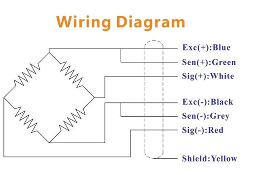

1. Cut the load cell wire to length
2. Carefully tin the leads. Old wire may be difficult to tin, use plenty of flux if this is the case.
3. Determine the wiring. In our example, this is the wiring of the load cell 
4. Connect to the board. In our case, from the top
```
​               a.   Green – Exc - J1(1)

​               b.   Red – Sig(-) – J1(2)

​               c.   White – Sig(+) – J1(3)

​               d.   Black + Shield – Gnd – J1(4) or J2(4)
```


5. Connect pins 2, 3, & 4 of the unused channels (Gnd)

   

6. I do not recommend using a connector. I tried and the corrosion was a big problem. It worked for a while and then the calibration was way off.

7. Stabilize the wire with a tie wrap and cut a hole in the case (Bud Industries PN-1322-CMB‎ $11.20 or Hammond 1591CSFLBK $5.50 )

8. Ensure the box is sealed, silicone caulk works well if you use the cheaper Hammond box.

   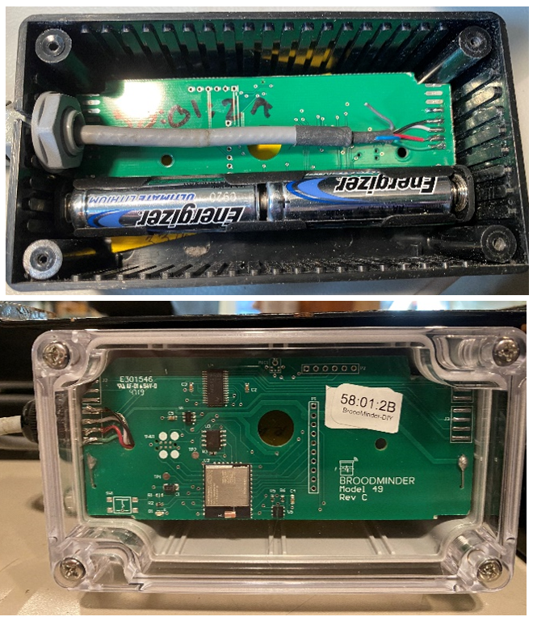

9. If the box is tucked up in good spot, you might be able to get away with mounting without sealing the cable entry. Be certain to have a drip loop so that rain doesn’t drip inside.

   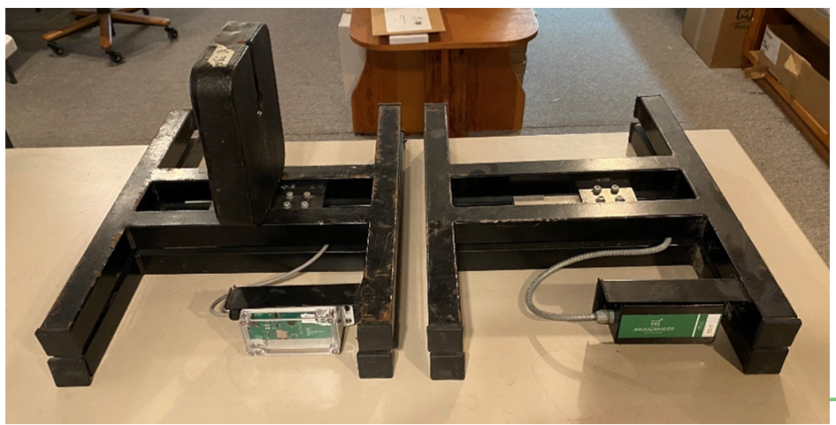

10. The BLE chip will work better if it is oriented so the circuit board is away from the metal frame.

 Good luck, let us know how it goes.

## Retrofit "Label-Abeille" Hive Scale
Follow these instructions to bring to life again the hive scales from "Label-Abeille".
The objective is to replace the old board with a BroodMinder-XLR board

### Mechanical part

Put the scale upside down and rmove the lower yellow cover
Then open the "head" black box placed on the Loadcell screws side (reference "S" in te picture below).

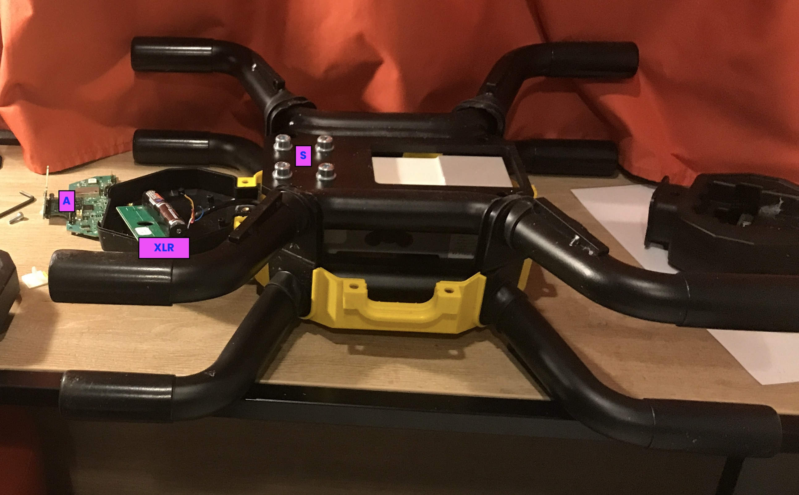

In the box remove the "A" board and the "B" harness. Unscrew the "C" harness from the board. This is the one coming from the load-cell to be soldered on the new XLR board.

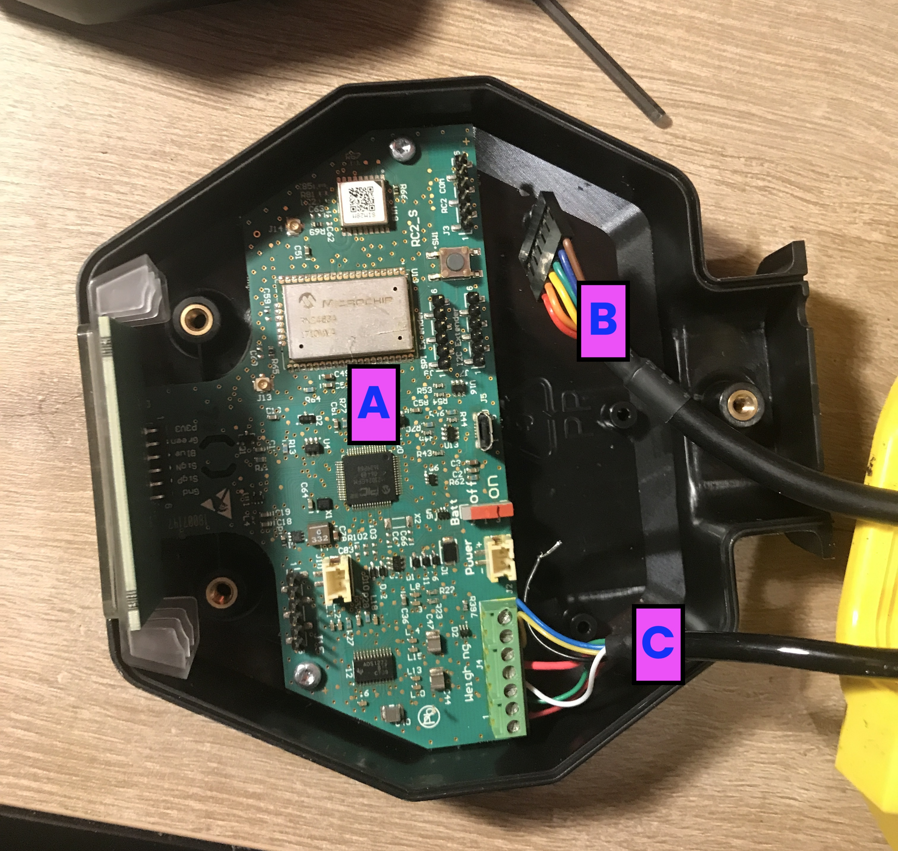

Now cut the central plot with a cutter to leave space to the XLR board


Like this
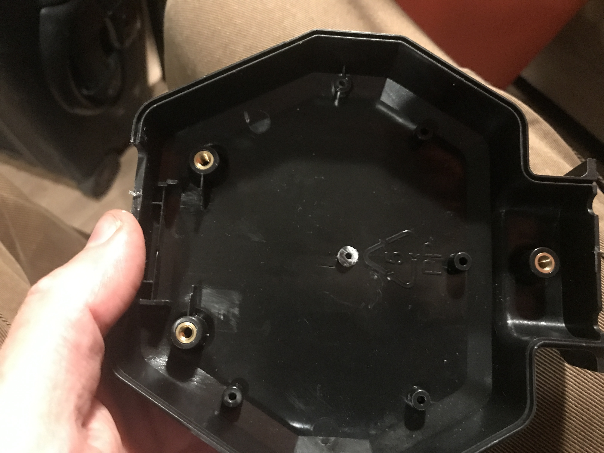

Now prepare the XLR board. We will only use chanel J3. Therefore we bridge channels J1,J2 and J4 

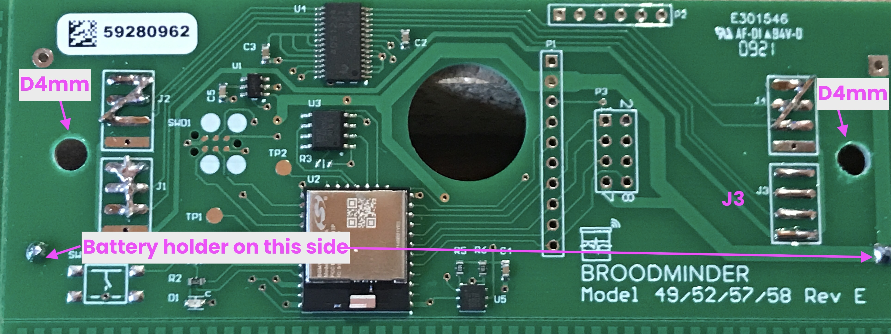

Solder the battery holder on this side (side is important to be able to have the batteries accessible once the casing will be mounted again.)  


Now solder the cables on the J3 channel. 

- The sequence is Black-Green-White-Red 
- RED goes onto the square pad.
- Big Black is the shield wire. You can hook it to the scale structure if you wish.
- This loadcell has two other cables (yellow/blue) for voltage feedback (long wiring for industrial applications) : they are not needed here.

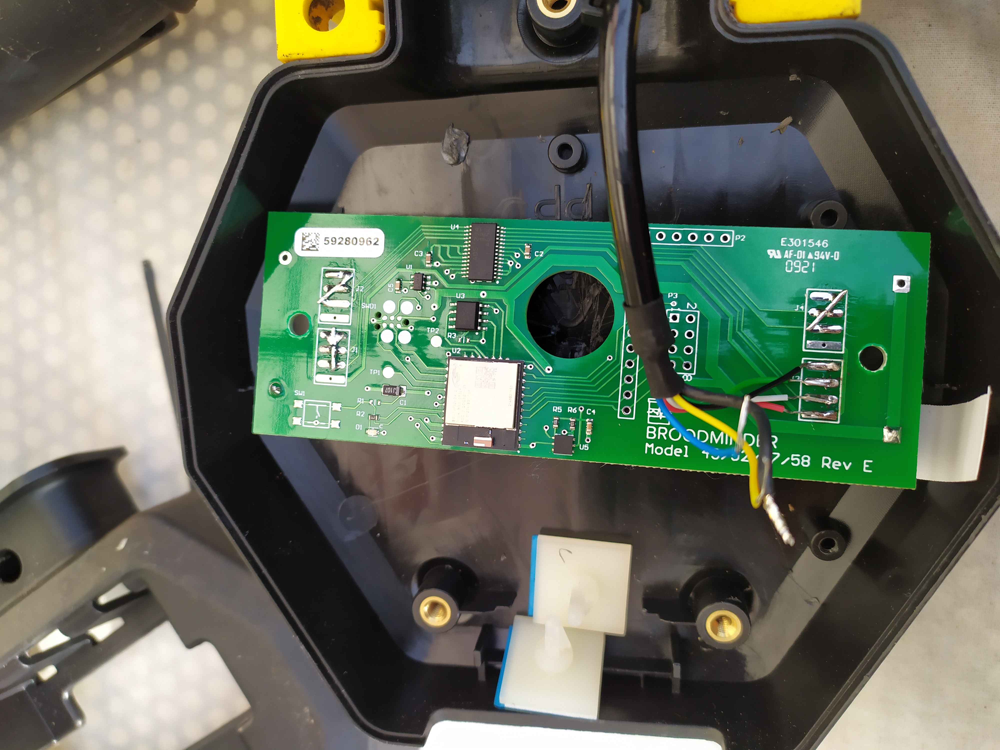

Now install batteries. You should see a blinking led.

Add the sticky supports


Now you can place it in the box as shown
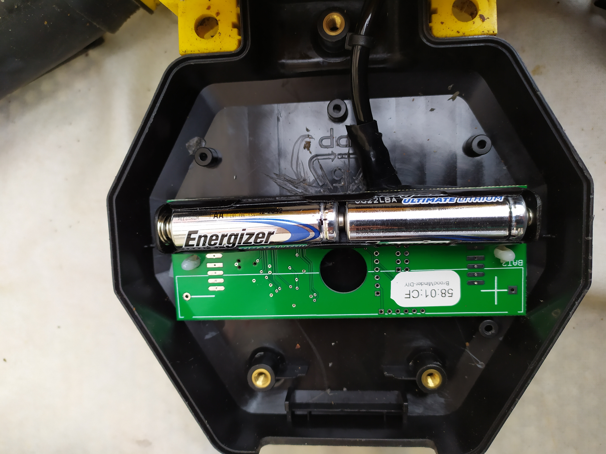

Take care batteries end up aligned with the box opening!

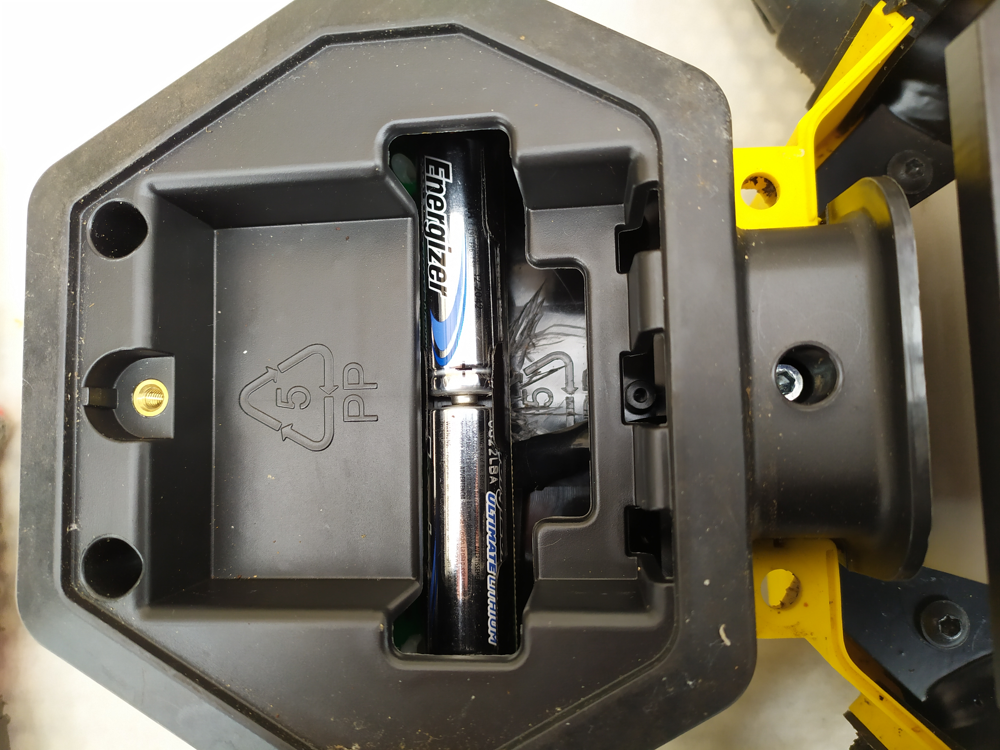


Now open BroodMinder-Bees on your phone and go to the `Devices` tab to find the scale. Check battery level, etc.

And you're done with the mechanical part! 
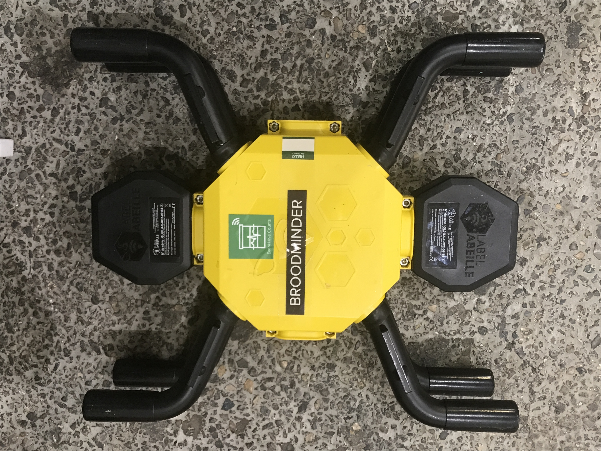


Now let's move to calibration 

### Calibration
To calibrate the scale follow the process below. If you need help, you'll find more details in [this page](http://doc.mybroodminder.com/en/33c_sensors_W3_calibration/)

Open Bees App, move to ` Devices tab > locate the scale ID > ... > show details > ... (top right) > Troubleshooting > Calibrate scale` 


Now follow the process :

1. Place the scale on the up-right position.
2. With empty scale weight: Hit the button `Tare Scale` (bottom button)
2. Now insert `Divisor = 0 for ALL chanels` (bottom of the screen)
3. Now enter `Divisor = -9000 for chanel J3` (NEGATIVE starting value)
4. NOTE : you **do not** have to worry about Offsets

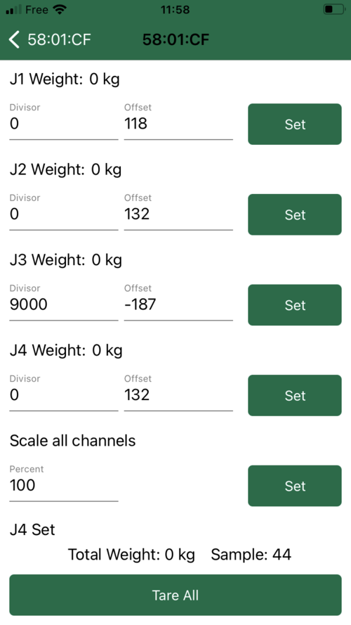


4. Place a known weight on the scale > check "J3 Weight" displayed on the app > modify the divisor iteratively to find the actual weight on the display
5. Once you found the right divisor save and quit this interface


You are done, congratulations !


## Troubleshooting

More often than not, the problem is simply wiring. Start by measuring between the load cell leads. You should see hundreds of ohms, not 0 and not infinity. Also be aware that we use plated through holes. If you drill them out (like Lorenzo did), the pads will no longer conduct from the top of the board to the bottom. You can solve this by solder jumper wires with the schematic as a guide.
