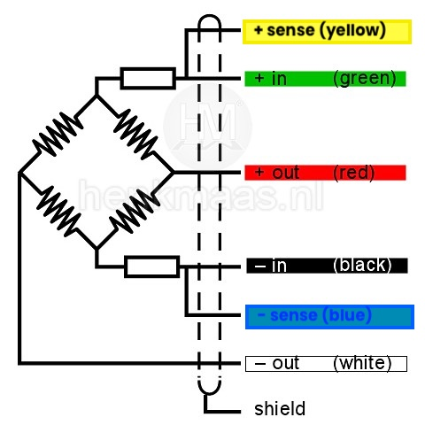

# Retrofit a Capaz scale

{ style="display: block; margin: 0 auto" }

Here is how to retrofit a Capaz scale with the Broodminder DIY board. It's super easy, just take care with the wires.

1. Cut the load cell wire to length
2. Carefully tin the leads. Old wire may be difficult to tin, use plenty of flux if this is the case.
3. Determine the wiring. In our example, this is the wiring of the load cell 
4. Connect to the board J1 slot in the following order
      - a.   Black+blue
      - b.   Red
      - c.   White
      - d.   Green+yellow

5. Connect pins 2, 3, & 4 of the unused channels J2,J3,J4 (Gnd) or jump with solder pads R33,34,37,38,39,40  

6. Nicely fold it into a hammond box, take care of the seal

10. The BLE chip will work better if it is oriented so the circuit board is away from the metal frame.

 Good luck, let us know how it goes.
