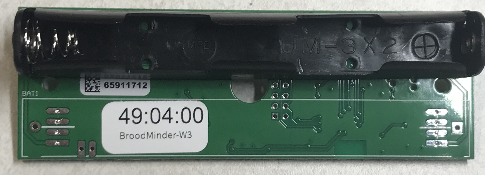
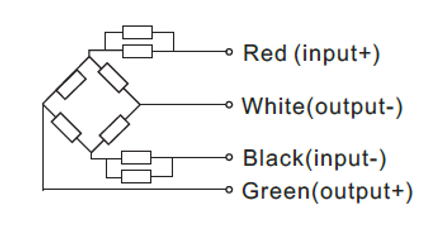

# BroodMinder Do It Yourself Guide

## Why DIY ?
We realize that many of our users are curious and want to invent things. Our DIY kit allows that creativity without the need to write 8 years of software. 

The DIY is the raw circuit board that we use in the BroodMinder-W2. We hope that this board allows many home crafters to create wonderful devices to monitor the hives. Be sure to share your designs with us and we will share them with the world. 

- Proven design
- 5-year battery life
- **No software to write**
- Works with most standard load cells
- Integrates into the vast BroodMinder ecosystem
- Utilizes a 4 channel 24-bit load cell IC (TI ADS1234)
- Data is available by BLE advertising
- Stored data is readable by BroodMinder apps

In order to utilize the BroodMinder-DIY, you will need to add your own load cells. The board should work with most load cell available, but beware, there are many bad choices. For example, if you try to use normal “bathroom scales” load cells, you will find that they have tremendous “creep”. Under load, the output values can change 50% overnight.

We are offering you here some proven concepts that you could adopt or inspire from. There are different categories you can explore

### Multiscales

Multiscales are architectures of a single scale for multiple hives.

Multiscale1 and Multiscale2 are single and double loadcell architectures that allow for 4 scales onto a single board.

### Retrofit
Retrofit cases for those that would own an old scale or from other vendor, that is not working anymore and are willing to bring it back to life into the BroodMinder ecosystem.

## Getting started

### Hardware
The starting point is getting a BroodMinder board. Here the choice is straight forward : there's a unique model of board for scales and we call it XLR:

Then you'll need a set of loadcells you have a choice of your loadcells depending on the architecture you target : 50, 100 and 200kg are the most common. On the display below you have the 'flat' 50kg side by side with the 'beam' 200kg type.

We are happy to provide you with either type. If you get your own, be sure that they are temperature compensated and have very low creep. The resistance of the 200KG load cell is roughly 300 ohms per leg. For the 50KG load cells it is around 750 ohms.

Then you will be assembling the boards and the loadcells into the architecture of your choice (more about this further). Achieving that point, weather is your enemy, so you will also want a box and cable glands. we recommend the following available from Digikey.com

- Hammond 1554C, fits circuit board nicely  $10.00
- Hammond 1555C, with ears fits circuit board nicely  $10.00
- Jacob Gmbh 50.007 PA7035 cable gland PG-7 $0.70

### Electronics & Wiring

​

Most load cells seem to use this color scheme for the wires. If that is the case, then wire them like this.

Black, Green, White, Red (from top to bottom). 

!!! tip
    red wire (+) always hooks to the Square pad.

The outputs are in the middle. If things are mixed up, usually it will be corrected during calibration.

​       

!!! note
    The board does not sport much in the way of electrical protection. We have found that in our configuration this is fine and we want to save as much cost as possible for our users. You may need or want to add additional protection circuits. We leave that to you.

!!! warning
    THE ABSOLUTE MAXIMUM VOLTAGE FOR THE DIY BOARD IS 3.8 VOLTS DC!

A final note, (stepping up on soap box), I (Rich Morris) hate connectors. They are almost always the first thing to fail. Personally, I try to solder everything but your milage may vary. (stepping down now)

​

!!! note
    On the next figure you will find our circuitry. You may wonder why we share this... The truth is, the circuit doesn’t get you very far. It requires lots and lots (and lots) of software to hold this all together. We hope the circuit helps you if you need it or want to learn more. 

 
 

### Calibration 

Once you have your scale built, you will want to calibrate it. You do this by setting the scale factor for each ADC channel which are stored in flash memory in the processor. 

We have now built new features into the Bees app for doing calibration. See the video [here]( https://youtu.be/g8QUoGfgbbw) for more information.

!!! warning "check the board model!"
   
    The DIY board is a model 58. If you have something different (e.g. 57:xx:xx) call us and we will work it out. The ID should start with 58!

#### Single-loadcell scale

1. Open the Bees App calibration screen `Devices Tab > [Device name] > ... > Show details > ... > Troubleshooting > Calibrate Scale`

2. Enter a starting point Divisors in the channels you're willing to calibrate (eg. -9000)

3. Push on the `Tare` button to set the weight to zero

4. Load the scale with a known weight and read the output on the screen.

The divisors are the values that convert the raw readings of the ADC to weight. 31,000 is a good starting place for the small load cells. The larger ones are more like 11,000. It is a simple matter to set the divisor to a value, then do a test weight. And then adjust the divisor appropriately. 

!!! example

    Real Weight = 30.0, Divisor = 31,000, BRM-58 readout is 20.0  
    Change the divisor to 31000 * 20.0 / 30.0 = 20,666 and the weight should correctly read 30.0

!!! tip

    if you are NOT using a channel, set the divisor to 0 and it will always read 0 weight.

#### Four-loadcell scale

If you are using 4 loadcells together into a single scale, then you should follow the same procedure as for W3 Calibration described [here](https://doc.mybroodminder.com/33c_sensors_W3_calibration/) 

