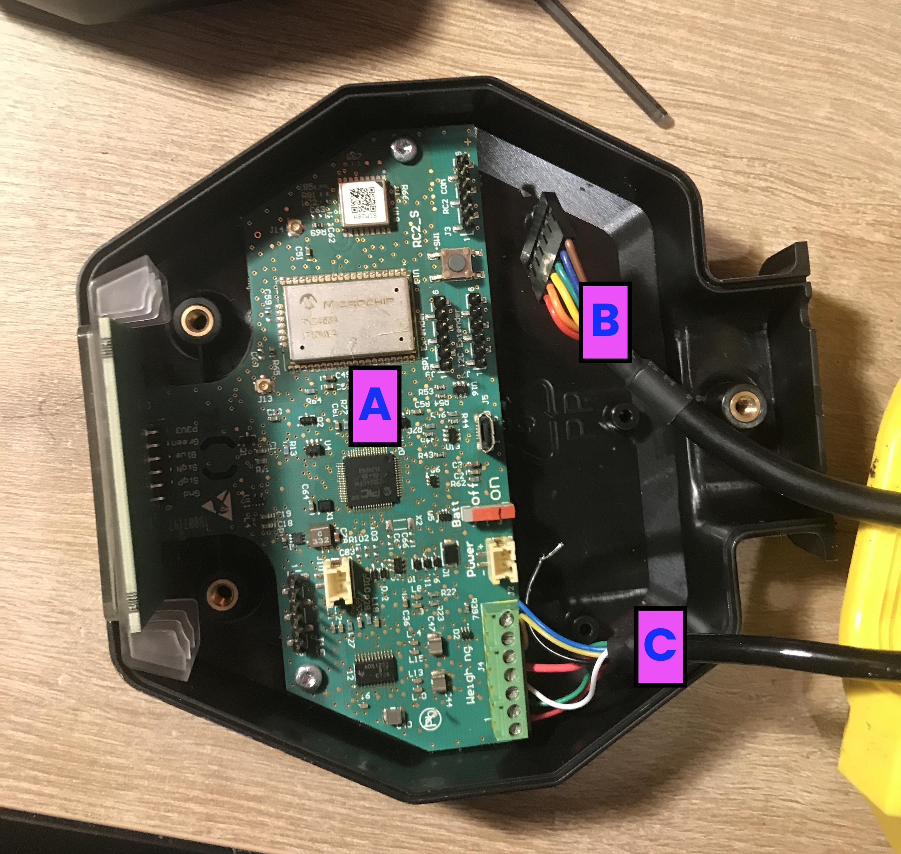
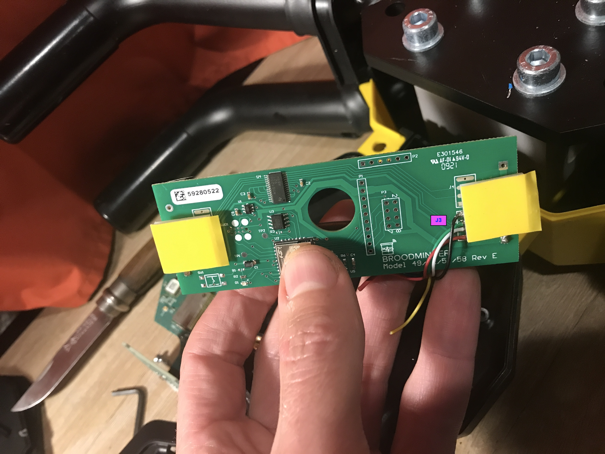

# Retrofit a "Label-Abeille" Scale

{ style="display: block; margin: 0 auto" }

Follow these instructions to bring back to life the hive scales from "Label-Abeille&reg;".
The objective is to replace the old board with a BroodMinder-XLR board.

## Mechanical part

Put the scale upside down and rmove the lower yellow cover
Then open the "head" black box placed on the Loadcell screws side (reference "S" in te picture below).

In the box remove the "A" board and the "B" harness. Unscrew the "C" harness from the board. This is the one coming from the load-cell to be soldered on the new XLR board.

Now cut the central plot with a cutter to leave space to the XLR board

Like this

Now prepare the XLR board. We will only use chanel J3. Therefore we bridge channels J1,J2 and J4 

Solder the battery holder on this side (side is important to be able to have the batteries accessible once the casing will be mounted again.)  

Now solder the cables on the J3 channel. 

- The sequence is Black-Green-White-Red 
- RED goes onto the square pad.
- Big Black is the shield wire. You can hook it to the scale structure if you wish.
- This loadcell has two other cables (yellow/blue) for voltage feedback (long wiring for industrial applications) : they are not needed here.

Now install batteries. You should see a blinking led.

Add the sticky supports

Now you can place it in the box as shown

Take care batteries end up aligned with the box opening!

Now open BroodMinder-Bees on your phone and go to the `Devices` tab to find the scale. Check battery level, etc.

And you're done with the mechanical part! 

Now let's move to calibration 

## Calibration
To calibrate the scale follow the process below. If you need help, you'll find more details in [this page](http://doc.mybroodminder.com/en/33c_sensors_W3_calibration/)

Open Bees App, move to ` Devices tab > locate the scale ID > ... > show details > ... (top right) > Troubleshooting > Calibrate scale` 

Now follow the process :

1. Place the scale on the up-right position.
2. With empty scale weight: Hit the button `Tare Scale` (bottom button)
2. Now insert `Divisor = 0 for ALL chanels` (bottom of the screen)
3. Now enter `Divisor = -9000 for chanel J3` (NEGATIVE starting value)
4. NOTE : you **do not** have to worry about Offsets

4. Place a known weight on the scale > check "J3 Weight" displayed on the app > modify the divisor iteratively to find the actual weight on the display
5. Once you found the right divisor save and quit this interface

You are done, congratulations !

## Troubleshooting

More often than not, the problem is simply wiring. Start by measuring between the load cell leads. You should see hundreds of ohms, not 0 and not infinity. Also be aware that we use plated through holes. If you drill them out (like Lorenzo did), the pads will no longer conduct from the top of the board to the bottom. You can solve this by solder jumper wires with the schematic as a guide.
