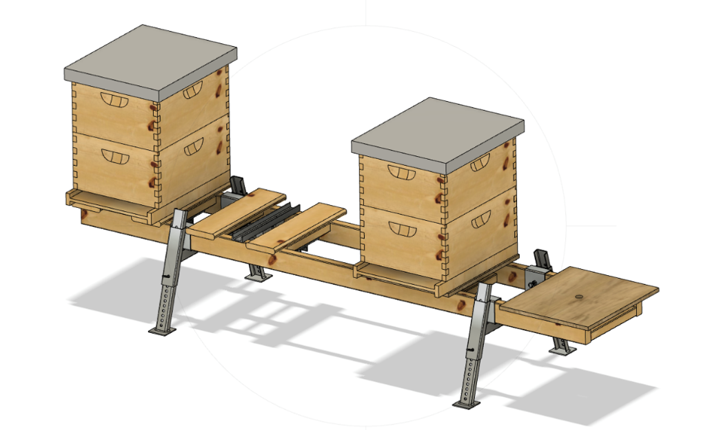

# Build your custom Multiscale-1

Multiscale-1 is a multi hive scale that uses single load cells for each hive. The classical setup is a 4-hive stand with combined with 4x200kg loadcells and a single XLR board.

Above is an example build on a hive stand is available from [BetterBee](https://www.betterbee.com/wooden-hive-equipment-10-frame/LYHE4033.asp)

Another similar set-up consisting on a 3 hive slots with single 200kg loadcell and plywood plate is described in the pictures below

| Model         | Pros               | Cons  |
|---------------|--------------------|------------|
| **Multiscale1** | Most accurate architecture, a single load cell is individually calibrated on a dedicated circuit board channel. | It rocks and it rolls. Having a single path to transfer all the stresses, results in an architecture that is not extremely stable. Once you touch the hive, it all starts to roll.  Some bees do not like it and get agressive. |
