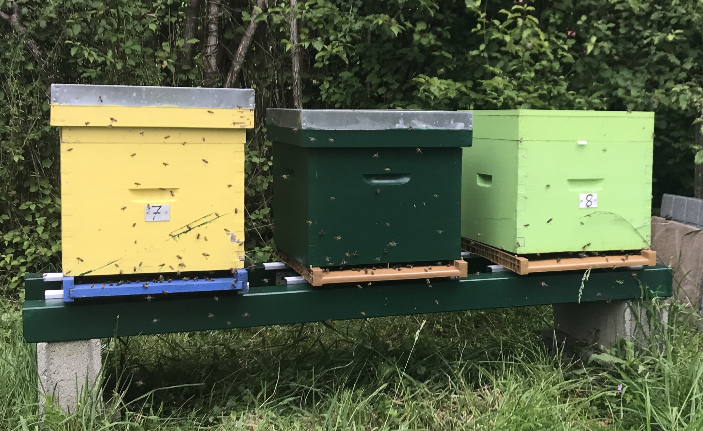
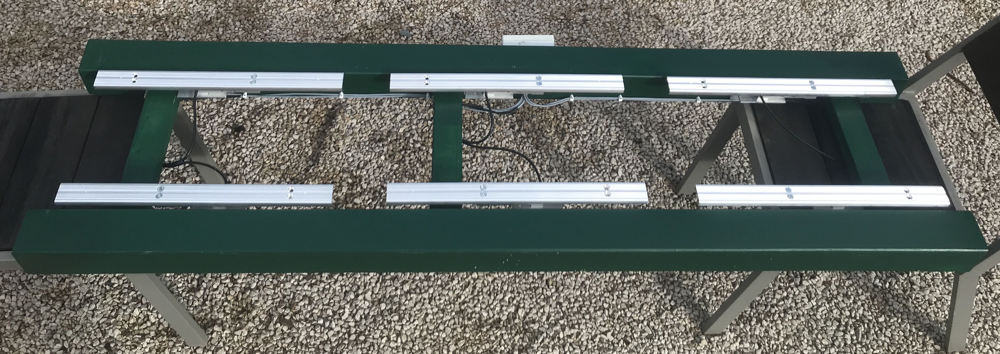
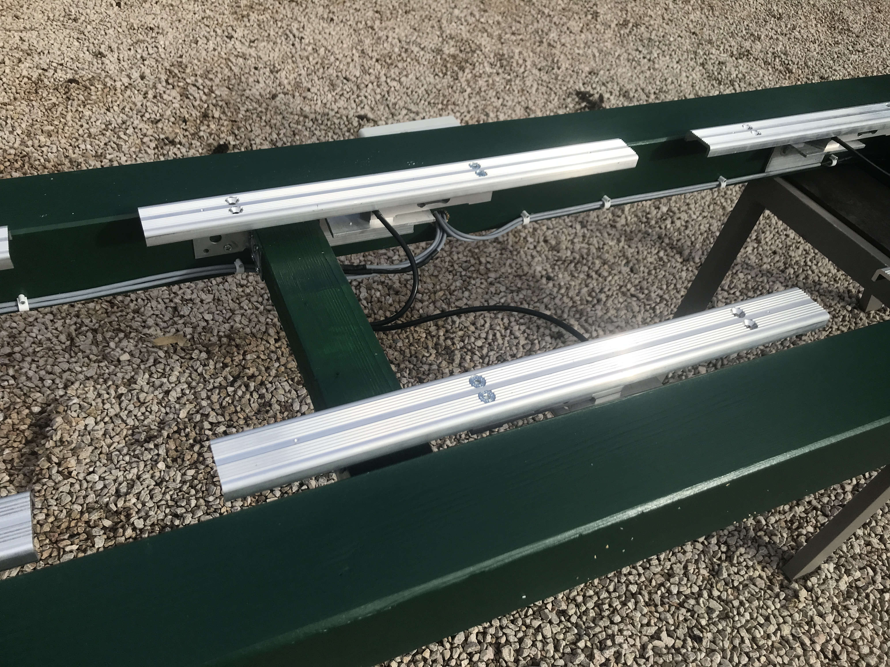

# Build your custom Multiscale-2

The Multiscale2 system utilizes a single XLR board and two 100 kg load cells per hive, enabling independent weight measurement for up to four hives.

This cost-effective design benefits from using a single electronics board, with one channel allocated per hive (up to four). Compared to the Multiscale 1, this setup offers a more stable structure with significantly less rocking. However, because the two load cells are combined into a single channel, every twin cells are calibrated as a whole rather than calibrating each cell individually. While this could slightly reduce accuracy, our experience shows that the results remain highly accurate while gaining on stand stability compared to single-load cell structures.

## Mechanical part

In the example below we're displaying a 3-hive scale stand.

We're using W4 bars as top support and 100kg loadcells (one at the front and another at the rear). They are hooked to the wooden structure with an L shaped 5mm aluminium profile.

The rounting of the cables to the board needs an extra lead that is soldered using a Control line, 4 x 0.14 mm², shielded, 25 m coil.

| Model         | Pros               | Cons  |
|---------------|--------------------|------------|
| **Multiscale2** | A very good compromise among accuracy and stability | Two load cells sharing a single channel result in a slight loss of accuracy, but using high-quality load cells helps minimize these differences.  |

