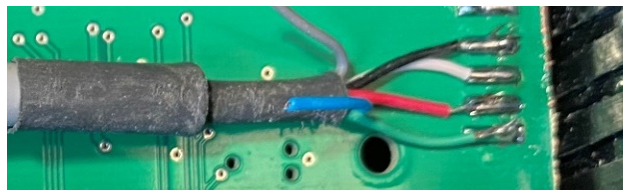

# Retrofit a SolutionBee scale

{ style="display: block; margin: 0 auto" }

It is easy to take an old broken hive scale and convert it to a BroodMinder enable scale. Here is an example. 

!!! note
    This is not the same wiring as our load cells (colors are different). 

1. Cut the load cell wire to length
2. Carefully tin the leads. Old wire may be difficult to tin, use plenty of flux if this is the case.
3. Determine the wiring. In our example, this is the wiring of the load cell 
4. Connect to the board. In our case, from the top
      - a.   Green – Exc - J1(1) 
      - b.   Red – Sig(-) – J1(2)
      - c.   White – Sig(+) – J1(3)
      - d.   Black + Shield – Gnd – J1(4) or J2(4)

      - 

5. Connect pins 2, 3, & 4 of the unused channels (Gnd)

      - 

6. I do not recommend using a connector. I tried and the corrosion was a big problem. It worked for a while and then the calibration was way off.

7. Stabilize the wire with a tie wrap and cut a hole in the case (Bud Industries PN-1322-CMB‎ $11.20 or Hammond 1591CSFLBK $5.50 )

8. Ensure the box is sealed, silicone caulk works well if you use the cheaper Hammond box.

      - 

9. If the box is tucked up in good spot, you might be able to get away with mounting without sealing the cable entry. Be certain to have a drip loop so that rain doesn’t drip inside.

      - 

10. The BLE chip will work better if it is oriented so the circuit board is away from the metal frame.

 Good luck, let us know how it goes.
