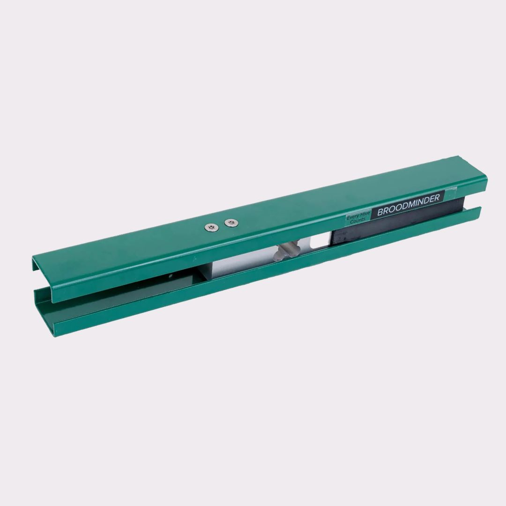
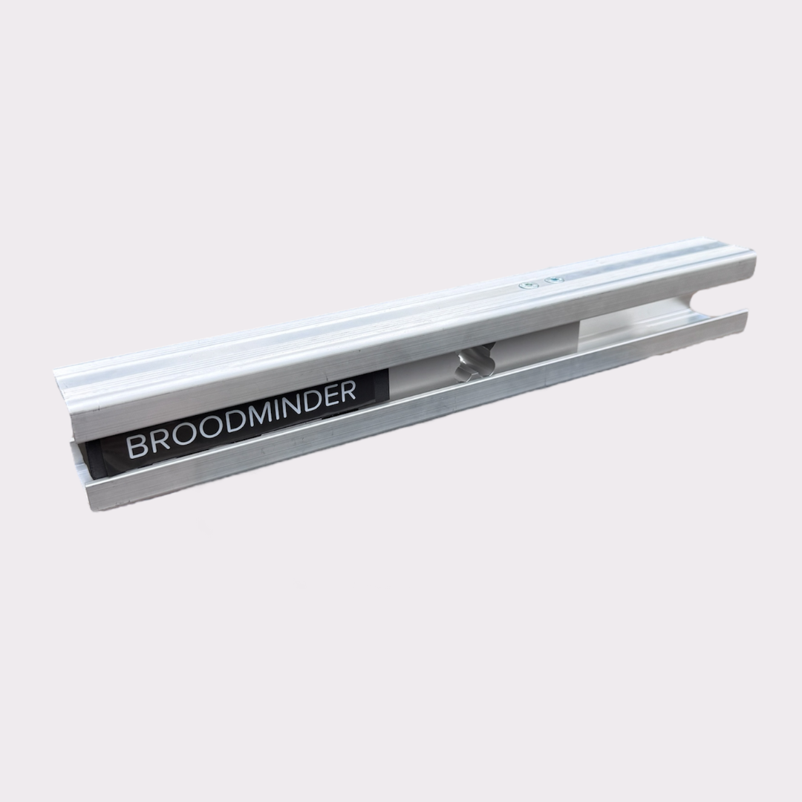

  
  

Released in **October 2025**, the **BroodMinder-W5** is the successor to the original W hive scale. It was designed to provide a rugged, simple, and reliable weighing solution for beekeepers operating static apiaries.

The W5 continuously tracks hive weight without disturbing the colony, allowing you to monitor nectar flows, colony development, honey production, feeding events, and winter consumption over long periods of time.

### Design

The W5 is built around a **single 200 kg load cell**, providing a recommended hive capacity of up to **400 kg (880 lb)**.

Using a single load cell simplifies installation while maintaining the accuracy required for long-term hive monitoring.

Due to supply chain considerations, the W5 is manufactured in steel in North America and aluminum in Europe; both versions offer equivalent performance, accuracy, and durability.

### Connectivity

The W5 operates like all other devices in the BroodMinder ecosystem.

It communicates using Bluetooth Low Energy (BLE) and can:

- Sync directly with the Bees App when you visit the apiary.
- Automatically upload data through a BroodMinder Hub.
- Integrate seamlessly into MyBroodMinder.

No special configuration is required beyond the normal device claiming and installation process.

### Installation

For best results:

- Install the scale preferably on the shaded side of the hive (often at the rear)
- Raise the opposite side of the hive using a wooden spacer approximately **55 × 55 mm** (about **2.2 × 2.2 inches**).
- Ensure the hive remains stable and level from side to side.
- Place the scale on firm ground or a stable hive stand.

This configuration provides excellent weighing accuracy while keeping installation simple and unobtrusive.
