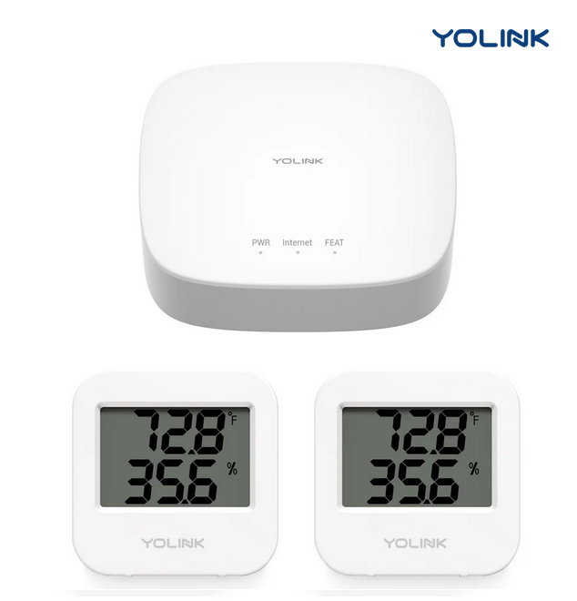

{ style="display: block; margin: 0 auto" }

# Yolik devices
You can attach devices from [Yolink](https://shop.yosmart.com) to MyBroodMinder.com

The only think you'll need to do in order to hook them is to enter the device ID number in `Mybroodminder > Configure > Third party devices`

