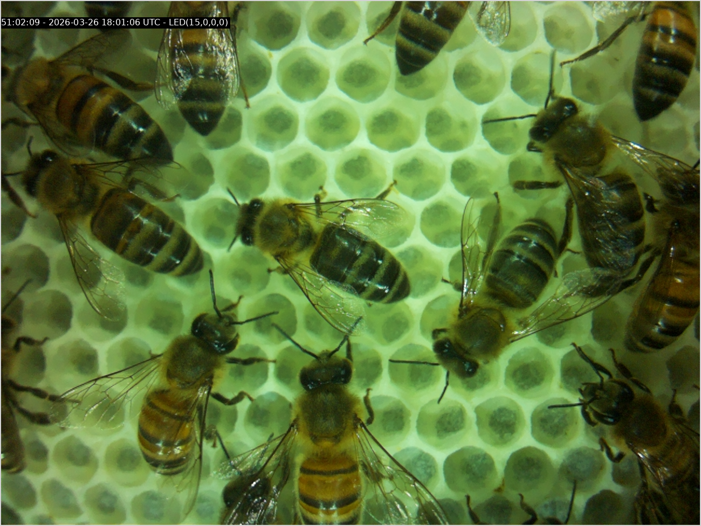
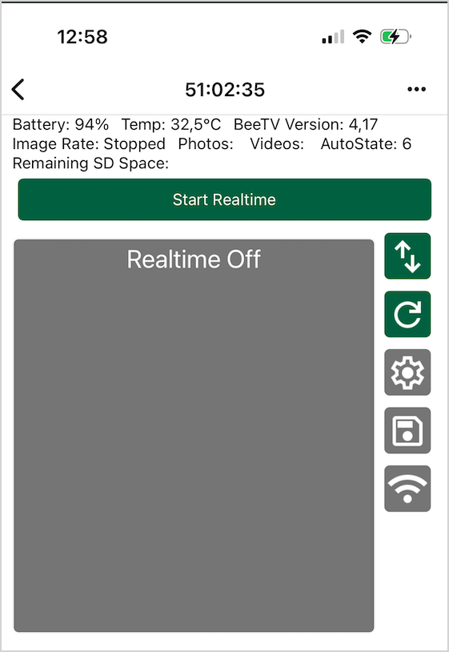
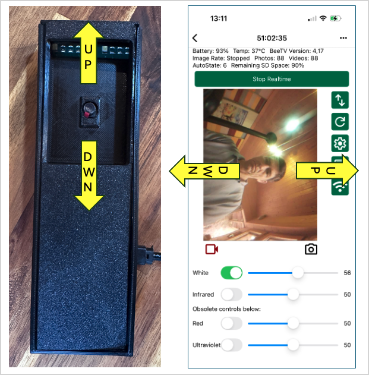
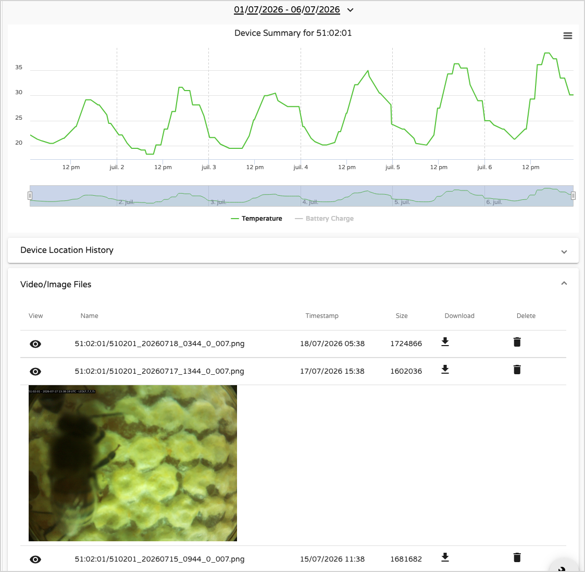
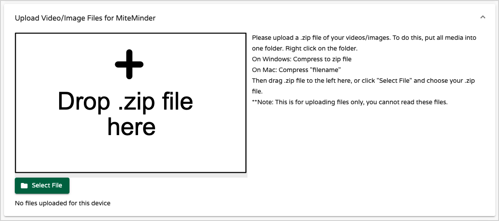
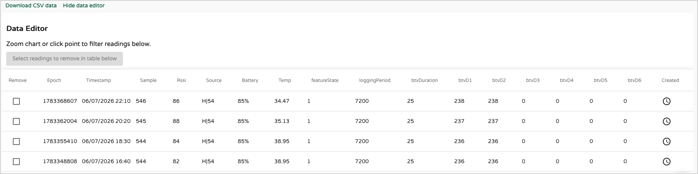
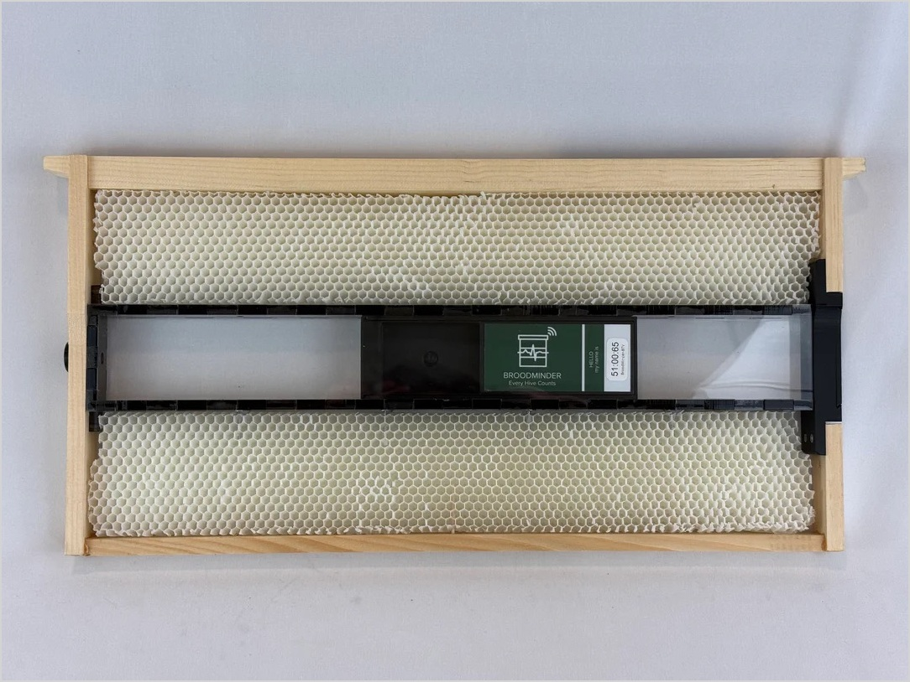
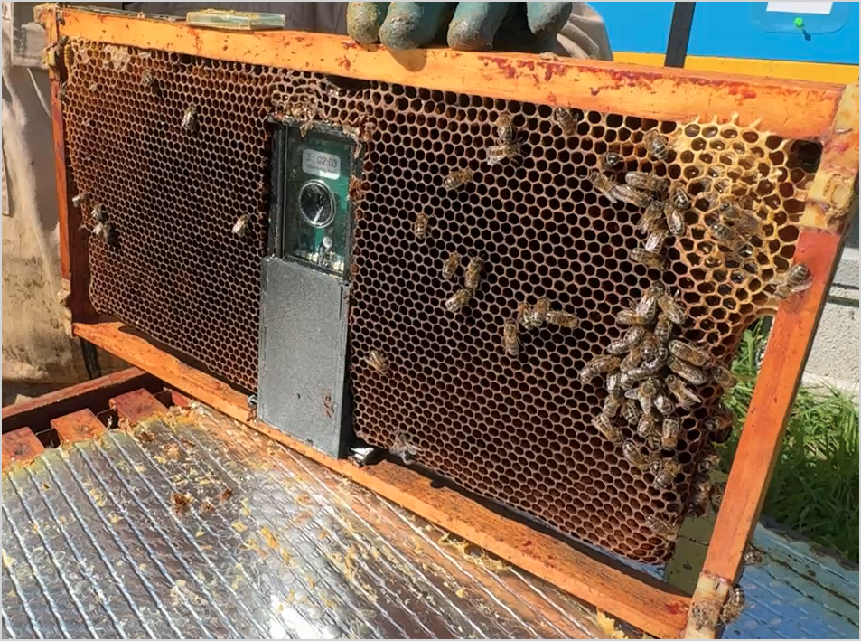

{ style="display: block; margin: 0 auto" }


---

## Overview

BeeTV is a compact camera designed to operate inside a beehive, capturing high-quality photos and videos from just a few centimeters away from the bees. It is intended for:

- Colony observation
- Bee research
- Queen and brood studies
- Field trials
- Education and demonstrations
- Any application where observing bees in their natural environment is valuable

Like all BroodMinder devices, BeeTV integrates seamlessly into the BroodMinder ecosystem and is configured using the **Bees App**.

Unlike other BroodMinder sensors, BeeTV generates large image and video files. These media files **cannot be synchronised over Blootooth nor be transferred through a BroodMinder Hub**. Instead, they are either:

- stored locally on the internal SD card,
- downloaded directly to your smartphone or a USB drive,
- or uploaded automatically through your local WiFi network to MyBroodMinder.

## Quick Start

<section id="quick-start"
         style="background:#f3fbf3; border:1px solid #cfe8cf; border-radius:10px; padding:1.5em; margin:1.5em 0;">

  <p>
    <strong>Your BTV arrives idle and ready to launch.</strong>
    There is no battery to insert and no power switch to turn on.
  </p>

  <h2>1. Open the Bees app</h2>

  <p>
    Launch the <strong>Bees app</strong> on your phone or tablet.
  </p>

  <h2>2. Open the device details</h2>

  <ol>
    <li>Go to the <strong>Devices</strong> tab.</li>
    <li>Find your BTV in the device list.</li>
    <li>Select <code>…</code>, then choose <code>Show details</code>.</li>
  </ol>

  <p>You should see the following screen:</p>

  <figure>
    
    <figcaption>BTV device details screen</figcaption>
  </figure>

  <p>
    Press <code>Start Realtime</code>. Within a few seconds, your BTV will start
    streaming live images to the screen.
  </p>

</section>

---

## How BeeTV Works

BeeTV uses three different wireless connections, each serving a specific purpose.

| Connection | Purpose |
|------------|---------|
| **Bluetooth (BLE)** | Device discovery, pairing, and basic control from the Bees App. |
| **BeeTV WiFi hotspot** | Created by BeeTV during Live View. Your smartphone connects directly to this network for live video, camera configuration, and manual file downloads. |
| **Your local WiFi network** | Used by BeeTV to upload photos and videos automatically to MyBroodMinder. |

These three connections are independent.

When you start Live View, your phone temporarily disconnects from its current WiFi network and connects directly to BeeTV's own WiFi hotspot. This direct connection provides the bandwidth needed for real-time video streaming and file transfers.

Once BeeTV has been configured with your local WiFi credentials, it automatically reconnects to your network whenever it needs to upload newly captured media.

---
## Connecting to BeeTV

BeeTV arrives **fully charged and ready to use**. There is no battery to install and no power switch to turn on.

To maximize battery life during storage and shipping, BeeTV is **not configured to record** when it leaves the factory. Before deploying it in a hive, you must create a recording schedule.

The first time you use BeeTV, you will:

1. Connect to the camera and verify the live image.
2. Configure a recording schedule.
3. *(Optional)* Connect BeeTV to your local WiFi network for automatic photo uploads.

### 1. Claim your BeeTV

1. Open the **Bees App**.
2. Go to **Devices**.
3. Wait for your BeeTV to appear (its ID usually begins with **51:**).
4. Tap **Claim**.
5. Select **Assign to a hive later**.


### 2. Start the camera

1. Return to the **Devices** list.
2. Select **... → Show Details**.
3. Press **Start Realtime**.


BeeTV will start in a few seconds. The status progresses through the following stages:

```text
Bluetooth Connected
        ↓
BeeTV Booting
        ↓
BeeTV Initializing
        ↓
BeeTV Running
```

### 3. Join the BeeTV WiFi network

When BeeTV is running, your phone will display a system message asking permission to connect to the camera's WiFi network.

> **"Bees App would like to connect to the 'BeeTV' WiFi network."**

Tap **Join**.


### 4. Verify the live view

After a few seconds, the live camera image should appear.


Congratulations! Your BeeTV is now connected and ready to configure.


### Adjusting the Focus

BeeTV features a manually adjustable lens, allowing you to optimize the focus for different observation distances inside the hive.


A focus adjustment tool is included with every BeeTV. It allows you to set the focus for five typical observation ranges:

- Infinity (general testing)
- Eggs/larva
- Comb
- Bees
- Mites


Before adjusting the focus, remove the protective film from the camera lens.

To set the focus:

1. Turn the focus tool **clockwise ↻** until it reaches its stop. Do **not** force it. This is the **infinity** focus position. At this setting, distant objects (for example, your face) should appear sharp.
2. Place the supplied focus probe at the distance corresponding to the subject you want to observe.
3. While viewing the live image, slowly turn the focus tool **counter-clockwise ↺** until the image on the probe becomes sharp.

Typical focus positions are:

| Subject | Approx. distance from objective | Approximate adjustment |
|---------|-------------------------------:|-----------------------:|
| Infinity | ∞ | Fully clockwise ↻ - Starting point |
| Eggs / larva | 14 mm | ~0.5 turns counter-clockwise ↺ |
| Comb | 20 mm | ~0.8 turn counter-clockwise ↺ |
| Bees | 24 mm | ~1.0 turn counter-clockwise ↺ |
| Mites | 34 mm | ~1.5 turns counter-clockwise ↺ |

!!! tip
    The number of turns is provided as a guide only. Small variations between lenses are normal, so always make the final adjustment by observing the live image.

!!! tip
    You can zoom the image with your two fingers on the smartphone screen to check nittidity


### Camera Orientation

The camera sensor is mounted in portrait orientation. As a result:

- A vertically installed BeeTV produces a standard horizontal 16:9 image on your phone.



You can now capture photos and videos using the buttons below the live image.

---

### Live View Toolbar

The toolbar on the right provides quick access to BeeTV functions.

| Icon | Function |
|------|----------|
| ↔ | Flip the image horizontally or vertically |
| Refresh | Refresh the video stream |
| Gear | Configure recording settings |
| Floppy disk | Browse and download stored media |
| WiFi | Configure the local WiFi connection |

You're now connected to BeeTV and viewing the live camera feed.

> **Keep the WiFi connection active** for the next steps, as camera settings can only be modified while connected to BeeTV's WiFi hotspot.

---

## Configuring Recording

Open the **Settings** menu using the gear icon.

Here you can configure:

- Photo or video capture
- Recording duration
- White or infrared illumination
- LED intensity
- Capture interval
- Other acquisition parameters


For example, in the above display BeeTV is configured to record:

- one photo,
- followed by one 10-second video,
- every 2 hours
- in white light @ 10% intensity .


!!! reminder
    Recording settings can only be modified while your smartphone is connected to BeeTV's WiFi hotspot.


!!! warning
    Live View is intended only for setup and inspection.

    While streaming live video, BeeTV keeps Bluetooth, WiFi, and the camera continuously active, resulting in significantly higher power consumption. Exit Live View when you are finished to maximize battery life.
---

## Retrieving Photos and Videos

BeeTV supports three methods for retrieving photos and videos:

1. Automatic upload through your local WiFi network
2. Manual download to your smartphone
3. Manual download to a USB drive

---

### Automatic Upload via WiFi

To enable automatic uploads:

1. Press the **WiFi** button.
2. Enter the SSID and password of your local WiFi network.
3. Save the settings.


BeeTV stores these credentials and automatically connects to your WiFi network whenever it wakes up to upload new media.

Once uploaded, your photos and videos automatically become available in MyBroodMinder.

When you're finished configuring the camera, press **Stop Realtime** to conserve battery power.


---

### Download to Your Smartphone

To download media manually:

1. Connect to BeeTV in Live View mode.
2. Open the **Floppy Disk** icon.

The BeeTV storage directory is displayed.

From there you can:

- download individual files,
- or download the complete contents of the SD card over WiFi.


---

### Download to a USB Drive

The storage browser also allows you to copy photos and videos directly to a USB thumb drive, without first downloading them to your smartphone.

To do this:

- Connect a USB thumb drive to your phone using a USB OTG adapter (USB-C or Micro-USB, depending on your phone).
- Open the storage browser and select the **USB Download** option.


!!! tip
    We recommend connecting BeeTV to a USB power source while transferring files. Copying large numbers of photos and videos can take several minutes and increases power consumption. An external power supply ensures the transfer completes reliably without draining the battery.

## BeeTV in MyBroodMinder

Whenever BeeTV uploads media through your local WiFi network, the files automatically appear in MyBroodMinder.

### Seeing recorded media

Open the BeeTV device page from either:

- **Configure → Devices**
- the Apiary / Hive / Device navigation tree

Select the desired date range.

The **Video / Image Files** section lists all photos and videos uploaded by BeeTV.



If you transferred files manually instead of uploading them automatically, you can upload them to MyBroodMinder using the section shown below.



---

### Telemetry and Device Data

Like every BroodMinder device, BeeTV reports standard telemetry including:

- Sample number
- Timestamp
- Data source
- Battery voltage
- Temperature

The Data Editor also includes BeeTV-specific fields.

| Field | Description |
|-------|-------------|
| featureState | *To be documented* |
| loggingPeriod | Recording interval in seconds (7200 = every 2 hours) |
| btvDuration | *To be documented* |
| btvD1 | Number of photos currently stored on the SD card |
| btvD2 | Number of videos currently stored on the SD card |
| btvD3–btvD6 | Reserved for future AI detection model classes |



---

## Installing BeeTV in a Hive

BeeTV supports two mounting systems that use the same camera and software. The choice depends primarily on your hive equipment and the type of observations you want to make.

### Horizontal Rail Mount (Langstroth)

**Video:** *Coming soon*




This mounting system was developed for **Langstroth hives**, the most widely used hive format in North America.

BeeTV is housed inside a protective enclosure that slides into a dedicated rail mounted beneath a frame. Once installed, the camera can be moved along the rail to observe different areas of the comb without removing the mounting system.

**Advantages**

- Fast installation and removal
- Camera can slide along the rail to change the viewing position
- Repeatable camera positioning
- Designed specifically for Langstroth equipment
- Ideal for long-term monitoring

**Considerations**

- Requires the dedicated mounting rail 
- it is hosted on a specific frame
- Rail design intended for Langstroth frames
- The viewing window is integrated into the enclosure, making it more difficult to clean or replace if it becomes coated with propolis or wax

---

### Vertical Frame Mount (Universal)

**Video:** *Coming soon*




This mounting system was developed to accommodate the wide variety of hive formats used around the world, including **Dadant, Langstroth, Warré, Layens**, and many regional frame designs.

BeeTV attaches directly to the bottom of a frame using a compact mounting bracket. The camera position is fixed once installed, but the protective viewing window is a separate removable part.

**Advantages**

- Compatible with a wide range of hive and frame types
- No hive-specific mounting hardware required
- Compact installation
- The viewing window can be removed and replaced in seconds
- Spare viewing windows are provided

**Considerations**

- Installation varies depending on the frame design
- Camera position is fixed after installation and cannot be slid to another viewing location without moving the mount

---

### Choosing a Mounting System

Neither mounting system is inherently better—they simply address different needs.

Choose the **Horizontal Rail Mount** if you use Langstroth equipment and want the flexibility to slide the camera to different positions along the frame.

Choose the **Vertical Frame Mount** if you need compatibility with different hive formats or if easy maintenance is a priority. Its replaceable viewing window can be swapped in seconds if it becomes scratched or obscured by propolis, pollen, or wax, and replacement windows are available as spare parts.

---

### 3D Printables

Both mounting systems use the same BeeTV camera electronics. If your needs change, you can switch from one mounting system to the other without replacing the camera itself.

To encourage experimentation and adaptation, BroodMinder provides the 3D models for the mounting components. If you have access to a 3D printer—or a local 3D printing service—you can print the parts yourself and convert your BeeTV between the **Horizontal Rail Mount** and the **Vertical Frame Mount**.

This also makes it easy to customize the mounts for your own equipment or to design new mounting solutions for hive formats that are not officially supported.

> **Download:** 3D printable models *(link coming soon)*


## Maintenance

Topics to be added:

- Firmware updates
- Cleaning
- Battery replacement
- Storage management

---

## Technical Specifications

*To be completed.*

Suggested contents:

- Camera resolution
- Photo resolution
- Video resolution
- Field of view
- Internal storage
- Battery life
- WiFi standards
- Operating temperature
- Dimensions
- Weight

<!--
TODO
only 4 leds white and 4 IR / researchers can get others 4 and 4
Power on


- Define featureState
- Define btvDuration
- Counter rollover (>255?)
- Counter refresh after deleting media?

configure buttons should be greyed when no wifi connection is established
On editor display size in Mo

Rich : Led IC is regulating properly? needs any extra code?


-->