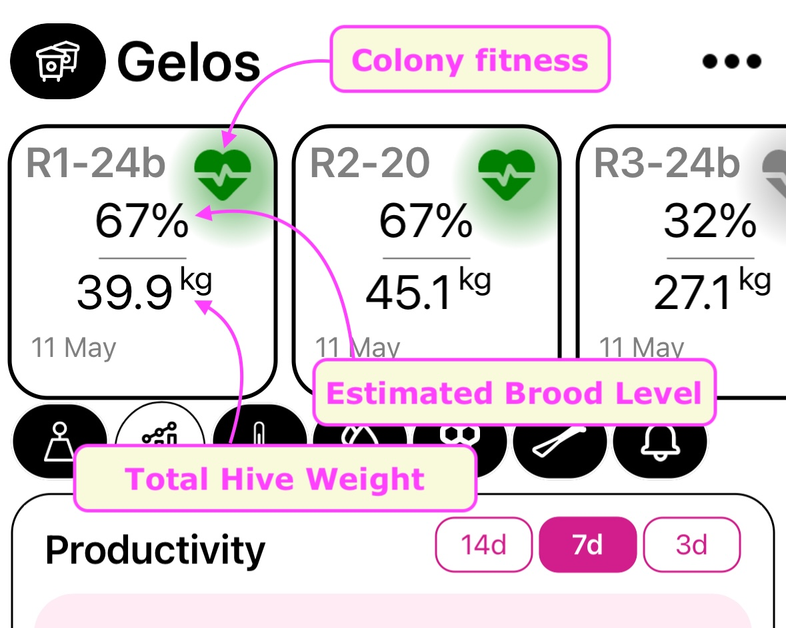

# Broodminder-BEES App 

## Overview

This section contains the nuts and bolts of using the app. There is a brief introductory [video](https://youtu.be/88kPkSxHzRE) that you can also watch.

We have released a major update in June 2024 with numerous new features. We recommend exploring the app, reading the manual, and watching our videos to understand the extensive range of features available to you. Our development team are all beekeepers so we have added many features that we love and know you will love too.

- One touch reading of all sensors within range of the phone/tablet
- Apiaries tab displays weather and nectar flow conditions -NEW 2024
- Hives tab displays brood level, productivity, and internal conditions - NEW 2024
- Powerful voice powered apiary and hive logbook with predefined tags
- Manage apiaries, hives, and device locations
- Set devices to battery saver mode with 5+ year battery life - NEW 2024
- Tightly integrated with MyBroodMinder.com w/automatic sync for remote apiaries which have no internet (cellular) access.
- BroodMinder-SubHub support
    - Real-time display of device signal levels
    - Read composite device log and assign data to proper BroodMinder devices

**Basic operation for a new user**

- First Time
    - Download BroodMinder-Bees from your app store
    - Start the app and enter (or create) your MyBroodMinder.com user ID & password
    - Create an Apiary and Hive using the MANAGE tab
    - The DEVICES tab will automatically display all BroodMinder devices you own *and* all BroodMinder devices it detects close by
    - Claim your devices and nssign your BroodMinder devices to a location within the hive
- Every Time
    - Choose the MANAGE tab and press SYNC. Stored data will read and local and MyBroodMinder.com databases will be updated. NOTE: You can skip this step if you have a Cellular/WIFI/LoRa hub.
    - Review your data with the Hives and Apiaries tabs
    - Add hive and apiary notes during inspections
    - If you do not have internet/cellular connection in your apiary, start the bees app when you return home and it will automatically sync data with MyBroodMinder.

## APIARIES Tab

The Apiaries tab displays information about the selected apiary.

1. Notes from the last inspection are displayed in the upper left and expected nectar flow (based on the weathersource.com forecast) is displayed on the graph. 
   - Note the "+" in the lower right corner. That will allow you to add notes about the apiary. Any place you see that "+" will take you to a new note for your logbook. There is more information about note taking below.

2. Weather log and forecast are shown in this screen.
3. Apiary notes can be reviewed here.
4. Alerts are displayed in the rightmost tab.

## HIVES Tab

We've created the Hives tab to make it easy to quickly see the status of each of the hives in your apiary. 

Your hives are listed across the top with the **brood level** and **total weight** displayed.  The heart displays the estimated **fitness** of the hive and the eventual number red dot in the upper right corner of the squared boxes indicates if there are any alerts to be reviewed. 

Selecting any hive will bring all of its data to the graph below.

1. **Productivity** displays the change in weight after removing any beekeeper instigated changes such as adding or removing a super. Both the daily change (bars) and the cumulative change (dots) are displayed.
2. **Brood** is the estimated brood level determined from the hive internal temperature and external (weather) temperature.
3. **Alerts** make you aware of any items needing attention. Note that the alerts are set up and adjusted in MyBroodMinder under the Configure|Alerts section.

*We have included in the Bees app and in MyBroodMinder powerful note taking features. Besides being a useful logbook to track your hives, the notes and tag selections are being used to drive our workflow engine that is under development. Soon we will be using workflows to track hive processes such as swarming and requeening.*

1. Hive notes are shown here. Pressing the "+" in the lower right corner will bring up screen 2.
2. You can choose to add an apiary or a hive note.
3. Hive notes will allow you to add notes to one or multiple hives at a time. The tags below will be used for automatic workflow notifications (added soon).

**Hint**:   The note function allows the use of your microphone for easy transcription.

## MANAGE Tab

The MANAGE tab is where you will sync your entire apiary at once as well as move and configure devices. You must have a MyBroodMinder account (free or premium) since your apiary/hive configuration is stored there.

1. This screen shows the hives and current values of the sensors. Clicking on the hive will reveal more details about device numbers as shown for hive "Package" above. Note the Sync button at the top, this button will attempt to sync all of the devices in this apiary. You can see the status of the sync in image 2 right below the apiary name. In this case, the sync completed with 7 devices but was canceled before 8 of the 15 devices were completed.
2. The  `...`  beside the apiary name allows you to create a new apiary or create new hives in this apiary.
3. The  `...`  beside the Hive name allows you do do all the things show above.
4. To move a device to a different hive, click the  `...`  beside device for example 43:e0:07 in image 1.

**Hint**: Sometimes it works better to sync Hive-by-Hive if they are far apart. You can choose Sync with the `...` for each hive. Start the hives close to the phone, you don’t have to wait for each hive to finish before starting the next one. Then move the phone to a new position close to the remaining hives and sync again. If you tap on the sync status that appear near the top, it will show more details about exactly where it is in the synchronizing process.

## DEVICES Tab

The DEVICES tab gives you full control of BroodMinder devices which are:

- In your device inventory on MyBroodMinder.com
- and/or seen by your phone via Bluetooth.
- If the device is new, a CLAIM DEVICE button will appear to take ownership
- If the device is owned by somebody else, that will also show on this screen
- Watch the icon to the left of the device, it will indicate "Nearby" when you are withing Bluetooth range
- If the device is "Nearby" it will display the current temperature/battery/weight/etc
- Tap any "!" and the app will inform you of an issue such as low battery or firmware update needed

You can Sync individual devices from this page by pressing the `...` beside the device.

**Hint**: Image 3 show the filter button and it is awesome. It will limit what is shown on this list. For example if you select `Nearby`, it will show only those device where the phone sees the BroodMinder. Then if you refresh the screen (pull down in iOS or Android) it will clear the list and then fill it back in as it see the Bluetooth signal from each BroodMinder. This is a great way to verify your BroodMinder is operating.

## USER SETTINGS Tab

The settings tab allows you to customize your Bees app. It will display the users account as well as a few items which can be modified.

Note that if we wish to update the firmware in your devices the "Show available firmware updates" must be selected. This toggle defaults to off unless a mandatory update is required. You can update your older devices in order to utilize the new (2024) battery saver features discussed below.

## Battery Saver

We recommend watching the [video](https://youtu.be/zst22oYWPS8) and reading these notes to fully understand battery saver.

You can extend the sensor battery life to 5+ years in two ways. 

- If you have a hub (SubHub, Cell, WiFi, or LoRa), you can set your devices to reduce advertising. This will add a year to your -T2 and -TH2 devices and 5+ years to your -W devices.
- Since swarms only happen during daylight hours and during part of the year, several years of battery life can be gained by reducing the detection time.

Note: If your devices are 5 years old or newer, you can update the firmware in the device using the Bees app. To enable updates, select "Show available firmware updates" in the User Settings screen.

1. Choose "Enable/Disable Battery Saver" to manage this option.
2. Once on the Battery Saver Screen, the Bees app will search for any BroodMinder devices that it can control. Note that you must be within Bluetooth range to configure the device. It will only display devices with firmware which supports battery saver. To see all of your devices within range, press "Include Ineligible".
3. Setup will let you adjust Battery Saver settings to best suit your purposes. Note that an estimated life for different BroodMinder devices is calculated and displayed based on your settings.   Select "Hub Present" if you own a hub and set when you want to detect swarms.
4. Once the setting are adjusted, return to screen 2 and press "Enable/Update". As the devices are configured, the icons to the left will indicate battery and/or scheduling enabled (green with check).
5. To turn off battery saver features, press "Disable". NOTE: It may take up to 10 minutes to shift devices from hub mode to normal because the devices "sleep" for 9.5 minutes between advertising.

Here are more details for the interested student.

BroodMinder -T2 and -TH2 devices transmit their current condition via "advertising pulses" every 5 seconds. Transmitting this data 24/7 is the major energy use for the system. If you have a hub in the apiary, it "listens" for these pulses every 10 minutes. If the data is only changing once per hour, then we only need to have the devices advertise for 10 minutes per hour extending battery life for 12-13 months.

The -T2 and -TH2 read  data every 60 seconds and watch for temperature events (swarms). This is the next largest energy consumption. When not detecting events, one hour sampling is adequate. So, by limiting the time one minute data is collected to the time swarms are likely, we can extend the life much longer. For example, battery life for T2/Th2 is 5.6 years if we only detect from May-August and from 9am to 4pm and have a hub present.

BeeDars also benefit from limiting swarm detection. While watching for swarms, the radar samples for 30 seconds in order to get an average and more accurate value. at night we can reduce this to 3 seconds and still see activity, but save a lot of energy.

Our weight scale devices transmit adverting pulses every one second. With a hub available, we reduce that to every 5 seconds and extend the battery life from 2 to 8 years for the -W and from 5 to 20 years for the W3.

## SubHub Devices

SubHub devices are a bit special since they are listening to all of your nearby BroodMinder devices.
When you press the three dots by a SubHub, this menu pops up

### SubHub Details

This page is where you control the SubHub. You can sync all of the data and you can view live data from here. See the next pages for more detail

### SubHub Show All Devices

When you set up your SubHub, you can use this display to know exactly which devices your SubHub sees. All BroodMinders advertise every 5 or every 1 second. That means you should see them all show up here if your close enough. It will also show any Bluetooth Low Energy (BLE) device in range if you uncheck the `BroodMinder Devices Only` box

**Hint**: This is an especially useful page to use when optimizing the position of your SubHub. It is handy even if you do not sync with your phone. You will see what devices are being extended to your remote hub device.

