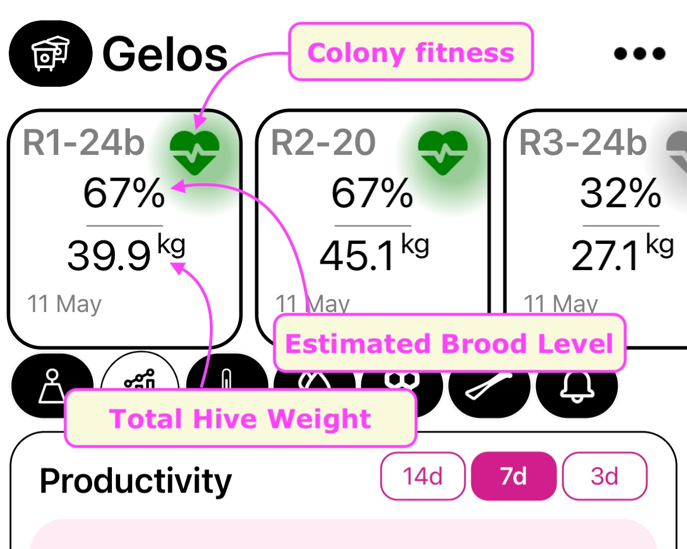

# BroodMinder-BEES App

## Overview

This section covers the core features of the BroodMinder BEES app and how to use them effectively. There is also a brief introductory [video](https://youtu.be/88kPkSxHzRE) available to help you get started.

The BEES app is designed by beekeepers for beekeepers, bringing together hive monitoring, inspections, device management, and record keeping into a single workflow.

Key features include:

- One-touch reading of all BroodMinder sensors within Bluetooth range
- Apiary overview with weather forecasts and nectar flow information
- Hive overview showing brood level, productivity, weight, and internal conditions
- Powerful voice-enabled apiary and hive logbook with predefined tags
- Inspection workflows with integrated **Queen Minder** support
- Manage apiaries, hives, plants, and device locations
- **Plants module** for recording and managing forage plants around your apiaries
- Battery Saver mode for supported devices to maximize battery life
- Automatic synchronization with MyBroodMinder.com
- Support for BroodMinder SubHub devices
    - Real-time device signal monitoring
    - Read composite logs and automatically assign data to the correct devices

## Basic Operation

### First Time

- Download BroodMinder BEES from your app store.
- Start the app and sign in with your MyBroodMinder.com account (or create one).
- Create an Apiary and Hive from the **Manage** tab.
- The **Devices** tab automatically displays:
    - all BroodMinder devices you own
    - nearby BroodMinder devices detected via Bluetooth
- Claim your devices and assign them to their locations within each hive.

### Daily Use

- Open the **Manage** tab and press **Sync** to read stored data and synchronize with MyBroodMinder.com.

!!! tip
    If your apiary uses a Cellular, WiFi, LoRa, or SubHub gateway, manual synchronization is generally unnecessary.

- Review hive and apiary status from the **Hives** and **Apiaries** tabs.
- Record inspection notes during hive visits.
- If you collected data while offline, simply open the app once internet connectivity is restored and synchronization will occur automatically.

## APIARIES Tab

The Apiaries tab displays information about the selected apiary.

1. Notes from the latest inspection appear in the upper-left corner, while expected nectar flow (based on WeatherSource forecasts) is shown on the graph.

    The **+** button lets you quickly create a new apiary note. Anywhere you see this button, you can add a new entry to your logbook.

2. View current weather conditions and forecasts.
3. Review apiary notes.
4. View alerts for the selected apiary.

## HIVES Tab

The Hives tab provides a quick overview of every hive within the selected apiary.

Across the top, each hive displays:

- Estimated brood level
- Total hive weight
- Hive fitness indicator
- Alert indicator (red badge) when attention is required

Selecting a hive updates the graphs below.

1. **Productivity** shows daily and cumulative weight changes after removing beekeeper actions such as adding or removing supers.
2. **Brood** estimates brood production using internal hive temperature and local weather.
3. **Alerts** highlight conditions requiring attention. Alert settings are configured in MyBroodMinder under **Configure → Alerts**.

The integrated note system provides a complete digital hive logbook and powers inspection workflows.

Inspection notes can include predefined tags, making it easier to track hive management activities over time.

**Queen Minder** is fully integrated into inspection workflows, allowing queen-related observations and management activities to be recorded alongside inspection notes.

1. Hive notes appear here.
2. Press **+** to create a new note.
3. Notes can be applied to one or multiple hives simultaneously.

!!! tip
    Notes support voice dictation, making inspections faster while wearing gloves or working in the apiary.

## MANAGE Tab

The **Manage** tab is used to synchronize apiaries, configure devices, and organize apiaries and hives.

A MyBroodMinder account (Free or Premium) is required because your hive configuration is stored securely in the cloud.

1. Displays all hives and their current sensor readings.

    Selecting a hive reveals detailed device information.

    The **Sync** button synchronizes every device in the selected apiary.

2. The **...** beside the apiary lets you create additional apiaries or hives.
3. The **...** beside each hive provides hive management actions.
4. The **...** beside a device allows you to move it to another hive or configure it.

!!! tip
    If hives are widely separated, syncing one hive at a time is often faster. Start synchronization while standing near each hive, then move to the next. Selecting the sync status provides detailed synchronization progress.

## DEVICES Tab

The Devices tab gives full control of your BroodMinder hardware.

Devices shown include:

- Devices in your MyBroodMinder inventory
- Nearby Bluetooth devices
- New devices available to claim
- Devices owned by another user (displayed accordingly)

When nearby, current sensor readings such as temperature, battery level, and weight are displayed.

Tap any warning icon to learn about battery, firmware, or other device issues.

Individual devices can be synchronized from the **...** menu.

!!! tip
    Use the filter button to display only nearby devices. Pull down to refresh the list and verify Bluetooth communication with each BroodMinder device.

---

## USER SETTINGS Tab

The Settings tab allows you to customize the BEES app.

It displays your account information together with configurable application options.

Firmware updates can be enabled by turning on **Show available firmware updates**.

This option is normally disabled unless firmware updates are available. 

---

### Battery Saver

We recommend watching the Battery Saver video together with the notes below to fully understand how the feature works.

Battery Saver extends battery life by reducing Bluetooth advertising and swarm detection activity when appropriate.

There are two primary methods:

- Devices connected to a SubHub, Cellular, WiFi, or LoRa gateway can significantly reduce Bluetooth advertising.
- Swarm detection can be limited to seasons and times of day when swarming is most likely.

If supported, device firmware can be updated directly from the BEES app.

1. Open **Enable/Disable Battery Saver**.
2. Nearby supported devices are automatically detected.
3. Configure Battery Saver settings appropriate for your installation.
4. Press **Enable/Update** to apply the configuration.
5. Press **Disable** to return devices to normal operation.

!!! tip
    Devices must be within Bluetooth range to configure Battery Saver settings.

Here are more details for the interested student.

BroodMinder -T2 and -TH2 devices transmit their current condition via "advertising pulses" every 5 seconds. Transmitting this data 24/7 is the major energy use for the system. If you have a hub in the apiary, it "listens" for these pulses every 10 minutes. If the data is only changing once per hour, then we only need to have the devices advertise for 10 minutes per hour extending battery life for 12-13 months.

The -T2 and -TH2 read  data every 60 seconds and watch for temperature events (swarms). This is the next largest energy consumption. When not detecting events, one hour sampling is adequate. So, by limiting the time one minute data is collected to the time swarms are likely, we can extend the life much longer. For example, battery life for T2/Th2 is 5.6 years if we only detect from May-August and from 9am to 4pm and have a hub present.

BeeDars also benefit from limiting swarm detection. While watching for swarms, the radar samples for 30 seconds in order to get an average and more accurate value. at night we can reduce this to 3 seconds and still see activity, but save a lot of energy.

Our weight scale devices transmit adverting pulses every one second. With a hub available, we reduce that to every 5 seconds and extend the battery life from 2 to 8 years for the -W and from 5 to 20 years for the W3.

## SubHub Devices

SubHub devices continuously listen for nearby BroodMinder sensors.

Selecting the **...** menu beside a SubHub opens additional management options.

### SubHub Details

This page allows you to:

- Synchronize all collected data
- View live sensor information

### SubHub Show All Devices

This screen displays every Bluetooth device currently detected by the SubHub.

By disabling **BroodMinder Devices Only**, you can view all Bluetooth Low Energy (BLE) devices within range.

!!! tip
    This page is especially useful when positioning a SubHub for maximum coverage. It lets you verify exactly which devices are being received before permanently installing the gateway.