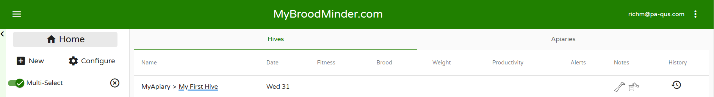
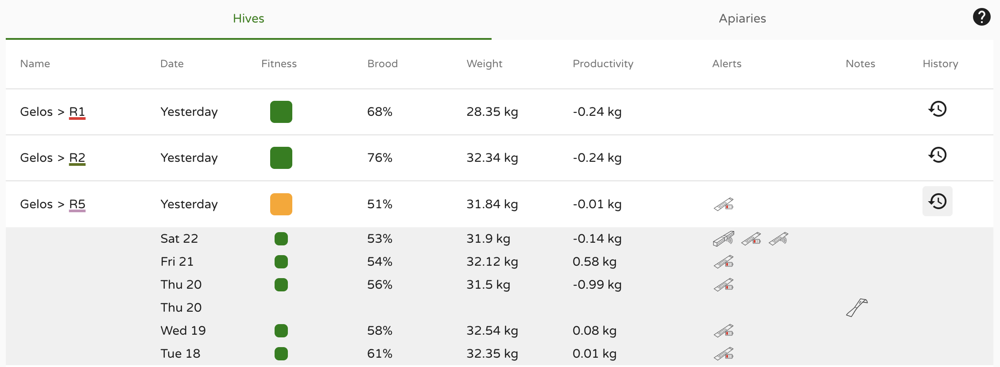
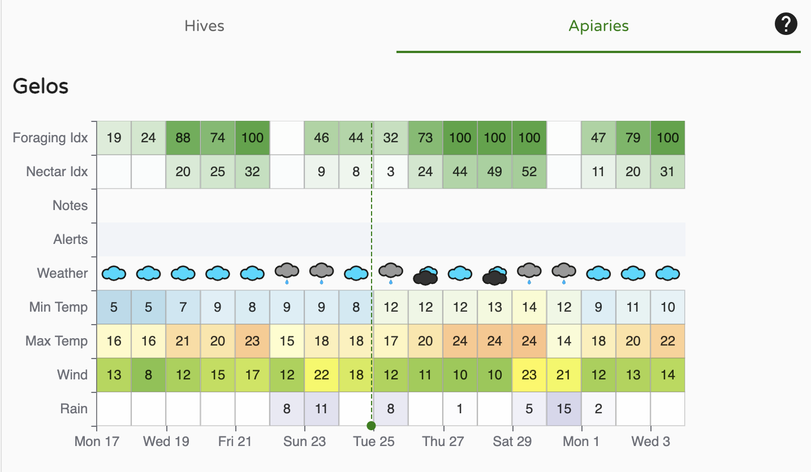
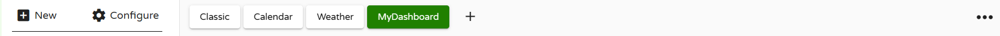
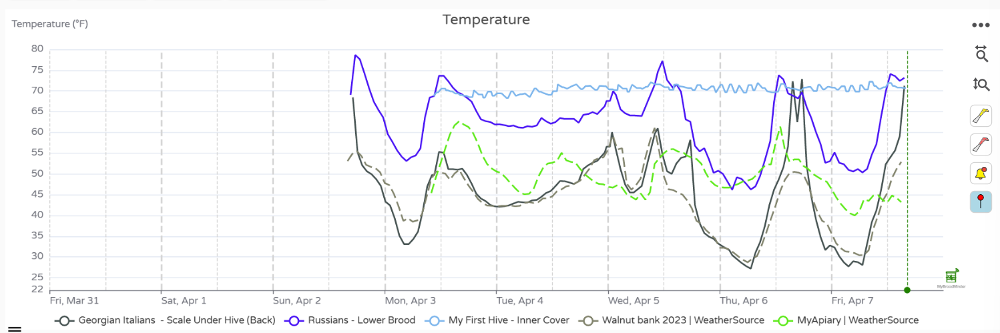

# MyBroodMinder Version 5

## Overview Quick Tour

There are many great features available in MyBroodMinder to view and analyze your data. Please note that there is a lot of context help by either hovering your cursor over an item or clicking the `?` next to an item.

We have updated the [video library](https://mybroodminder.com/app/resources) for Version 5. 

The quick tour is pretty long. There are a lot of useful features. Let's start by describing the functions available to you.

The best way to learn is to read this guide while looking at your MyBroodMinder account.

### Home Screen

##### Hives

Here you will find a quick glanceable view of all the hives that you own. Hives are shown here if you have sensors currently assigned in the hive. Learn more about device assignment and configuration [here](#configuring).

At a glance information shown here:

* Fitness - Daily hive fitness state, learn more [here](#colony-health-bfit)
* Brood - Daily brood level, learn more [here](#brood-level-bforce)
* Weight - Daily hive weight
* Productivity - Daily hive productivity, learn more [here](#productivity-bweight)
* Alerts
* Notes

Click the `History` icon on the right to view this data for the last 7 days for each hive.

##### Apiaries

Here you will find a quick glanceable view of all the apiaries that you own. Apiaries are shown if they have hives with currently assigned sensors. Learn more about apiary, hive, and device assignment and configuration [here](#configuring).

At a glance information shown here:

* Foraging Index - learn more [here](#weather)
* Nectar-Flow Index - learn more [here](#weather)
* Notes
* Alerts
* Other basic weather readings

### Left Sidebar - Choose which hives to view

The left sidebar is your key to navigating your apiaries and hives as well as apiaries shared with you by your friends. There is a lot of functionality built into this menu. Explore by clicking around.

- Clicking on `>` opens up hives in the apiary and devices in the hives
- Hovering over a BroodMinder device will display the ID number
- `...`
  - Apiary - Edit apiary info and location, add hives, share with friends, add apiary notes
  - Hive - Edit hive information, color of graph trace, move to new apiary, add BroodMinder devices, get link to BeeCounted.org, add hive notes
  - Device - Edit device name, adjust/move device location
- Multi-Select is a powerful feature that lets you overlay data from many different hives and apiaries. If you want to focus on one hive at a time, turn it off.
- When you click on an Apiary, it will display the hives in the apiary and bring up the data in the main window. Click it a second time and it removes the data from the view.
- Clicking a second apiary will add the hives to the view. Notice that the hives which are displayed are underlined. The color of the underline is the color of the graph line for that hive.
- Clicking a hive will toggle it to display or not display.
- The small `X` to the right of `Multi-Select` will clear all of the hive displays.

### Dashboard - Choose how to display the data

The buttons at the top of the view window let you chose how to display your information. We provide some standard views that we believe are useful. You can also add custom view to include many new analysis features.

- Classic
- Calendar
- Weather
- You can create your own custom displays using the `+` 
  - Sensor readings
  - Weather
  - Analysis
  - Maps and images
- Note - The `v` to the right of the notes section will expand the text of all of the notes within the timeframe shown. There are many powerful note features discussed below.
- `...` to the right of the dashboard buttons 
  - Create sharable link - *This is a powerful feature.* Once you get the display looking like you like it, you can create a browser link to share with anybody, even if they do not have a MyBroodMinder account. You can choose a fixed timeframe to share, or a variable timeframe such as the last 2 weeks. When you share it this way, it will always bring up the newest 2 weeks of data. You can also add a description which will display at the top of the graph.
  - Download - You can download the BroodMinder data, the weather data, and/or the notes to a CSV (Comma Separated Variable) file.

- Notice all the BroodMinder IDs of devices in the graph are identified at the very bottom of the view. If you click one, it will take you do the data graph for that device. In that view you will see all of the data for that device no matter where it has been installed.

#### Graph Controls

There are many terrific graph  controls available to get your reports looking just right.

- Time Range - Using the dropdown menu at the top, `Last 7 days`, you can chose the duration of the display
- Change the height of each individual graph using the `=` on the leftof the window between the graphs.
- Turn individual graph lines on/off by clicking the legend below the dates
- Highlight the line of a graph by placing the cursor directly over if. The other graph lines will dim.
- Tools to the right of the graph
  - Zoom time scale - click the horizontal tool, then drag the cursor over the region of interest while holding the left mouse button. Un-zoom by clicking the tool again.
  - Zoom vertical - click the vertical tool, then drag the cursor over the region of interest while holding the left mouse button. Un-zoom by clicking the tool again.
  - Clicking the yellow hive tool will hide/unhide hive notes
  - Clicking the red hive tool will hide/unhide the apiary notes
  - Clicking the bell tool will hide/unhide the alerts

#### Adding Notes

There are powerful new note capabilities in both MyBroodMinder and the Bees app. You can use the Bees app to add notes in the field, and then edit or add additional notes when you review them in MyBroodMinder.

The most simple way to add a note is to double click on a graph at the time you want to add a note. An editor will pop up. You can enter text and you can also add tags. Once you save the note it will show up on the graph as a hive tool. 

You can also add a note for the entire apiary such as `Performed OA treatment on all hives`. Do this by clicking the `...` to the right of the apiary in the side bar and choosing add note. This note will display in all hives.

## Managing

### New

*Note that we recommend setting up your apiaries, hives, and devices using the Bees app. The Bees app makes it easier to assign the devices.*

#### Apiary

When you add a new apiary to your setup you will name it and give it a location. We only track location by zip/postal code in order to preserve privacy. You can also set a default color for the graphs related to this apiary. This color will be used for the weather display of this apiary

#### Hive

It is easiest to add the hive using the `...` to the right of the apiary. This automatically enters the apiary as the location. When you add a hive, you can give a name and a color for the graphs related to this hive. 

#### Device

it is easiest to add the devices using the `...` to the right of the hive. This automatically enters the apiary and hive as the location. You will need to select the location of the device in the hive. You can not have two devices in one location. We include several custom locations if you want to do your own thing.

#### Custom Dashboard

You can create a number of custom dashboards. You can drag any or all of more than a dozen widgets and place them in your preferred order. This allows you to create reports exactly how you would like them. (Amanda and Lorenzo did a great job on this feature.)

#### Apiary Note

Apiary notes are assigned to all hives in an apiary. You will notice that the choices for tags are different than for hives. These notes will show up on the graph with the red hive tool.

#### Hive Note

Hive notes are not shared across an apiary. I suppose this is pretty obvious. Once you create a note, it can not be assigned to a different hive. These notes will show up on the graph with the yellow hive tool.

### Configure

Once you have apiaries/hives/devices added, you may need to move or delete them. All of this can be accomplished in the `Configure` screen. 

#### Apiaries

Here you can update your apiary. You can also set it to hide which will remove it from your Left Sidebar but keep the data. Deleting the apiary will remove all traces of it. Both of these changes can not be reversed.

You can also add a local source of weather information in the apiary. By default, we retrieve weather information from weathersource.com based on your postal code. You can replace this with a BroodMinder device that is in your apiary. You can use any of our devices which broadcast temperature and/or humidity values.

#### Hives

Hives can be configured and moved between apiaries, set inactive (data remains), or deleted (data is destroyed). From this menu you can also display which and when BroodMinder devices were installed and removed.

#### Devices

The devices section will display every BroodMinder device that you own. Note that you can sort this list by clicking the headings and you can filter the list to display only certain types. You can also download a CSV file that lists every device shown. This can be handy for taking care of inventory and battery replacement.

If you sell your device or give it to another beekeeper, you will need to delete it from your account. We only allow one owner of a device at a time for data management reasons.

If you reach out to support, we can rename your device (the "mac address") and then you can keep the data.

#### Hubs

If you own hubs, they will show up here. Hubs will send any data they receive from any apiary, but if you want the hub to show up in the Left Sidebar correctly, you must assign it to the proper apiary.

This is also where you manage and assign tokens which are required for real-time updates. See the Managing tokens section for more information on this.

#### Third Party Devices

Third party devices are sensors that are not made by BroodMinder. Currently we support YoLink sensors. They are managed in this section similar to the `Devices` section. See the Third Party section of this manual for more information.

#### Public Links

The public links feature is a powerful feature of MyBroodMinder. Once you start making them it can be difficult to keep track of them. You can do that here. You can change the notes and graph timeframe of the link.

#### Dashboards

Version 5 is all about dashboards and this is where you control them. You can hide any dashboard and/or duplicate and modify them quite easily.

#### Alerts

There are almost 30 events from hives, devices, & weather that can trigger an alert. In this section you can adjust the thresholds of these alerts and disable any that you do not want to see. It is important to note that you must enable the `Alert Summary Email` (at the top of this section) to enable alerts.

#### My Subscriptions

We wish everything was free, but we want to stay in business and keep paying our bills, so we ask for and appreciate your help. The more advance features, the ones that take a lot of programming work, come at a cost. Here is where you can keep track of your contributions to sustaining the effort.

## Sharing
From MyBroodMinder you have many options to share your hives with other beekeepers and friends:

### With another user
1. you can share an Apiary (in the Apiary `… > share` ) with another Mybroodminder user simply enter his/her account email. Acces is granted per apiary, in read only mode. They will see apiary and hives but not devices. 

### On beecounted

2. you can also share an apiary [beecounted.org](beecounted.org) (in the Apiary `… > share`, see above). By default, all free acounts are sharing on beecounted.

### With an URL

3. you can share a dashboard (in the Dashboards `… > share`): this produces an URL and anyone having it will see your dashboard. You can post it on social networks too.
When creating the url you will notice that you have some choices : which hives to share, what time frame, frozen or continuous etc..

### Educational Dashboards

4. And Last but not least, there's a fourth and the most classy way to share your hive : **Educational Dashboards**
This is a big screen mode for associations, schools or corporations that are willing to display their bees to colleagues and fellows. 
Send us an email to support@broodminder.com to know more about this service.

## Models & algorithms

In this section, we will discuss the more technical aspects of Mellisphera's way of functioning. We will thus present the different models - BFIT, BFORCE, BWEIGHT - as well as the WEATHER sources and ALERTS.

### Colony Health - BFit
BFIT for _Bee Fitness_ is the algorithm that informs the beekeeper of each hive's condition. We use benchmarks such as the time of the season and the surrounding hive state in order to define a "nominal" state. Then we position each hive in relation to this reference.

<!--The display is very easy to understand, with coloured stickers to indicate their condition. To complete the information, a tooltip (on the flyover) specifies the nature of the situation.

-->
The color code is the following:

| color | meaning |
|---|---|
|Green | Healthy |
|Orange | Disturbed (declining or with abnormal events) |
|Red | In trouble |
|Black | Dead |
|White | No data or no weather |

BFit is based on algorithms that collect events. The 'Learning' algorithm learns from previous events to preserve, or not, future events. Afterwards, it classifies the detected events between those affecting the hive state and the others. 

BFit also takes into account the results from BForce. In this way, it can determine the difference between the current hive dynamics and a theoretical brood dynamics that is constantly changing. These theoretical dynamics are regularly updated. It also takes into account the different regions of the world to provide relevant information according to latitude or climate. 

### Brood level - BForce
Brood development is a key factor for bee colonies. The aim of BForce is to provide an indication of the brood level in the hive on a range of 0 to 100%. 

When the colony is at its full capacity, it reaches a stable state of 35°C. This state is associated with 100% brood. This means that the hive is strong. 

On the contrary, when there is no brood, the bees do not need to regulate the cluster temperature. In this case, the hive internal temperature will roughly follow the ambient temperature. If this is the case, there will be 0% brood.

Between these two extreme points, we can imagine a lot of intermediate situations. 

In order to illustrate this, here are the hourly measurements on two hives from the same apiary. The first is represented in red and the second in grey. Each hive has a very different condition. The red one has an internal temperature close to 25°C/30°C - following the same fluctuations as the external temperature (dotted lines) - while the grey one is situated in the famous 'Optimal Brood Zone' with a constant temperature of 35°C.

In this example, the grey hive has a high proportion of brood, contrary to the red one. **BForce correlates this colony characteristic and translates the raw temperature measurement into standardized and understandable information**. The model takes a range of parameters into account to optimally estimate the brood level.

- hive internal temperature
- ambient temperature
- evolution of surrounding colonies
- season, latitude & climate
- other events identified in the hive

BForce is also a **strengthening tool in swarm detection**. In fact, when a swarm has been detected by one of our Machine Learning tools, the brood is impacted by the queen loss and thus the interruption of egg-laying. With BForce, we can classify the different swarms detected.

**Comprehensive results**

Brood calendars & charts show the daily progress of the brood in each hive. The values vary from 0% (no brood) to 100% (complete brood). Generally, 10% is one brood frame, 40% 4 frames, etc. Depending on your practice and the hive model used (Langstroth, Dadant) you might have to adjust these values. Therefore, **hives with a brood level higher than 80% generally produce honey**. 

You can visualize the season's history at a glance. The egg laying stops and restarts are clearly visible.

<i>Brood calendar</i>

You can also compare several hives with each other, whatever their apiary.

<i>Annual brood - same hive compared with two others</i>

With practice, we can identify several events on these graphs. We can identify when the egg-laying starts & stops, of course. But we can also detect swarms, bad weather periods that have impacted brood production, the effect of Asian hornets, etc.  

<i>Two hive path over a season, with some events</i>

### Productivity - BWeight
Having flowers does not necessarily imply nectar - and thus resources for bees. Indeed, many factors condition the occurence of a honeydew: the ambient temperature and humidity, the last rains and their intensity, the root depth for plants such as rapeseed or sunflower. Honeydews are therefore not acquired nor easy to identify. However, understanding them is a basic need for every beekeeper.

A weight sensor installed under a hive provides detailed information on weight gain and loss. However, this information takes into account several factors that are not necessarily related to productivity.

First of all, during the day, weight variations depend on the resources brought in or consumed. But they also depend on the bees' movements: during the day, they are more or less numerous to come out to forage. 

<i>In red: when bees get out of the hive

In blue: when they bring back nectar

In black: dehydration </i>

This is why the hive weight graph shows some "bumps". A bump every day, as you can see in the graph below. On the chart, you can also see sudden weight variations, related to the beekeeper's interventions.

<i>Gross weight history with beekeeper's interventions in blue</i>

With these facts, we can see that **for a proper productivity evaluation, we must only consider the weight variations coming exclusively from the bees' production**. In this way, external events must be ignored: feeding, swarming, addition/withdrawal of suppers, beekeeper interventions, unexplained loss or gain. The BWeight algorithm makes it easy to identify these distinct events and to exclude them from the productivity calculation.

## Weather
For each apiary, several information are presented from several sources.
- apiary weather: typically temperature, hygrometry, rainfall and wind.
- Foraging and Honeyflow indexes (see below)
- sources from which these values are derived or computed

### Readings
The weather data displayed in this space is derived from two main sources:

1. By default, they come from WeatherSource. This service provides real-time weather conditions for a given location defined by its country/postal code. The service also includes a 10-day forecast. The current day is indicated by the vertical dotted line. All users have access to this source.
2. When the user has defined a local weather source, the data measured by this personal source is also displayed.

On top of the raw weather data we have developed an algorithm translating this information into beekeeping specific metrics. The result takes the form of two indices on a scale of 0-100%: 

- Foraging Index: evaluates the atmospheric conditions for **bees** to forage. This index considers the outside temperature, the hygrometry, rain and wind.

- Honey flow index : evaluates the atmospheric conditions for the nectarification of the **flowers**. Here too, several factors are analyzed in relation to the honeyflow conditions. 0% means that the conditions for honeyflow are not met, 100% that it is damn great. But beware, depending on your climate zone, 100% may never be reached and you will have to be satisfied with lower rates! 
To validate the forecast range, this algorithm has been developed with apiaries located in various climatic zones (temperate, cold, very cold, tropical...); We ensure you that in some cases it can reach 100% 😉

The 10-day weather forecast allows to project these indices over a week and a half. These foraging and honeyflow forecasts are helpful for the beekeeper to identify the relevance of certain actions.

