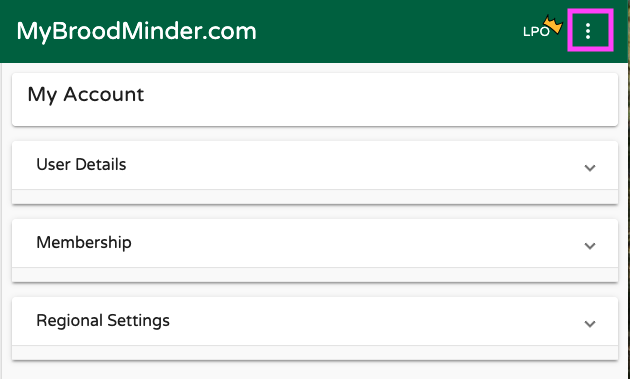

# Overview Quick Tour

There are many great features available in MyBroodMinder to view and analyze your data. Please note that there is a lot of context help by either hovering your cursor over an item or clicking the `?` next to an item.

We have updated the [video library](https://myBroodMinder.com/app/resources) for Version 5. 

The quick tour is pretty long. There are a lot of useful features. Let's start by describing the functions available to you. 

The best way to learn is to read this guide while looking at your MyBroodMinder account.

Note that some features are for MyBroodMinder premium users. The feature breakdown is [here](https://myBroodMinder.com/app/premium-subscription). We discuss more about Free and Premium at the end of this chapter.

## Home Screen

#### Hives

Here you will find a quick glanceable view of all the hives that you own. Hives are shown here if you have sensors currently assigned in the hive. Learn more about device assignment and configuration [here](#managing-hives-apiaries-devices-and-inspections).

At a glance information shown here:

* Fitness - Daily hive fitness state, learn more [here](#colony-health-bfit)
* Brood - Daily brood level, learn more [here](#brood-level-bforce)
* Weight - Daily hive weight
* Productivity - Daily hive productivity, learn more [here](#productivity-bweight)
* Alerts
* Notes

Click the `History` icon on the right to view this data for the last 7 days for each hive.

#### Apiaries

Here you will find a quick glanceable view of all the apiaries that you own. Apiaries are shown if they have hives with currently assigned sensors. Learn more about apiary, hive, and device assignment and configuration [here](#managing-hives-apiaries-devices-and-inspections).

At a glance information shown here:

* Foraging Index - learn more [here](#working-with-weather)
* Nectar-Flow Index - learn more [here](#working-with-weather)
* Notes
* Alerts
* Other basic weather readings

## Left Sidebar - Choose which hives to view

The left sidebar is your key to navigating your apiaries and hives as well as apiaries shared with you by your friends. There is a lot of functionality built into this menu. Explore by clicking around.

- Clicking on `>` opens up hives in the apiary and devices in the hives
- Hovering over a BroodMinder device will display the ID number
- `...`
  - Apiary - Edit apiary info and location, add hives, share with friends, add apiary notes
  - Hive - Edit hive information, color of graph trace, move to new apiary, add BroodMinder devices, get link to BeeCounted.org, add hive notes
  - Device - Edit device name, adjust/move device location
- Multi-Select is a powerful feature that lets you overlay data from many different hives and apiaries. If you want to focus on one hive at a time, turn it off.
- When you click on an Apiary, it will display the hives in the apiary and bring up the data in the main window. Click it a second time and it removes the data from the view.
- Clicking a second apiary will add the hives to the view. Notice that the hives which are displayed are underlined. The color of the underline is the color of the graph line for that hive.
- Clicking a hive will toggle it to display or not display.
- The small `X` to the right of `Multi-Select` will clear all of the hive displays.

## Dashboard - Choose how to display the data

The buttons at the top of the view window let you chose how to display your information. We provide some standard views that we believe are useful. You can also add custom view to include many new analysis features.

- Classic
- Calendar
- Weather
- You can create your own custom displays using the `+` 
  - Sensor readings
  - Weather
  - Analysis
  - Maps and images
- Note - The `v` to the right of the notes section will expand the text of all of the notes within the timeframe shown. There are many powerful note features discussed below.
- `...` to the right of the dashboard buttons 
  - Create sharable link - *This is a powerful feature.* Once you get the display looking like you like it, you can create a browser link to share with anybody, even if they do not have a MyBroodMinder account. You can choose a fixed timeframe to share, or a variable timeframe such as the last 2 weeks. When you share it this way, it will always bring up the newest 2 weeks of data. You can also add a description which will display at the top of the graph.
  - Download - You can download the BroodMinder data, the weather data, and/or the notes to a CSV (Comma Separated Variable) file.

- Notice all the BroodMinder IDs of devices in the graph are identified at the very bottom of the view. If you click one, it will take you do the data graph for that device. In that view you will see all of the data for that device no matter where it has been installed.

### Graph Controls

There are many terrific graph  controls available to get your reports looking just right.

- Time Range - Using the dropdown menu at the top, `Last 7 days`, you can chose the duration of the display
- Change the height of each individual graph using the `=` on the leftof the window between the graphs.
- Turn individual graph lines on/off by clicking the legend below the dates
- Highlight the line of a graph by placing the cursor directly over if. The other graph lines will dim.
- Tools to the right of the graph
  - Zoom time scale - click the horizontal tool, then drag the cursor over the region of interest while holding the left mouse button. Un-zoom by clicking the tool again.
  - Zoom vertical - click the vertical tool, then drag the cursor over the region of interest while holding the left mouse button. Un-zoom by clicking the tool again.
  - Clicking the yellow hive tool will hide/unhide hive notes
  - Clicking the red hive tool will hide/unhide the apiary notes
  - Clicking the bell tool will hide/unhide the alerts

### Adding Notes

There are powerful new note capabilities in both MyBroodMinder and the Bees app. You can use the Bees app to add notes in the field, and then edit or add additional notes when you review them in MyBroodMinder.

The most simple way to add a note is to double click on a graph at the time you want to add a note. An editor will pop up. You can enter text and you can also add tags. Once you save the note it will show up on the graph as a hive tool. 

You can also add a note for the entire apiary such as `Performed OA treatment on all hives`. Do this by clicking the `...` to the right of the apiary in the side bar and choosing add note. This note will display in all hives.

## User Settings

Before we move further you can configure your preferences and manage your membership in the User Settings panel.

- User details : your name, email, password but also account deletion
- Membership : Membership type, hives allowed, expiration date
- Regional Settings : Units, time zone and language are set to browser default but you can force specific aspects.
