# MyBroodMinder Version 5

## Overview Quick Tour

There are many great features available in MyBroodMinder to view and analyze your data. Please note that there is a lot of context help by either hovering your cursor over an item or clicking the `?` next to an item.

We have updated the [video library](https://myBroodMinder.com/app/resources) for Version 5. 

The quick tour is pretty long. There are a lot of useful features. Let's start by describing the functions available to you. 

The best way to learn is to read this guide while looking at your MyBroodMinder account.

Note that some features are for MyBroodMinder premium users. The feature breakdown is [here](https://myBroodMinder.com/app/premium-subscription). We discuss more about Free and Premium at the end of this chapter.

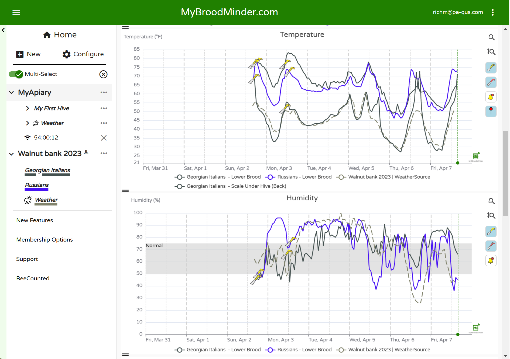

### Home Screen


##### Hives

Here you will find a quick glanceable view of all the hives that you own. Hives are shown here if you have sensors currently assigned in the hive. Learn more about device assignment and configuration [here](#managing-hives-apiaries-devices-and-inspections).


At a glance information shown here:

* Fitness - Daily hive fitness state, learn more [here](#colony-health-bfit)
* Brood - Daily brood level, learn more [here](#brood-level-bforce)
* Weight - Daily hive weight
* Productivity - Daily hive productivity, learn more [here](#productivity-bweight)
* Alerts
* Notes

Click the `History` icon on the right to view this data for the last 7 days for each hive.

##### Apiaries

Here you will find a quick glanceable view of all the apiaries that you own. Apiaries are shown if they have hives with currently assigned sensors. Learn more about apiary, hive, and device assignment and configuration [here](#managing-hives-apiaries-devices-and-inspections).

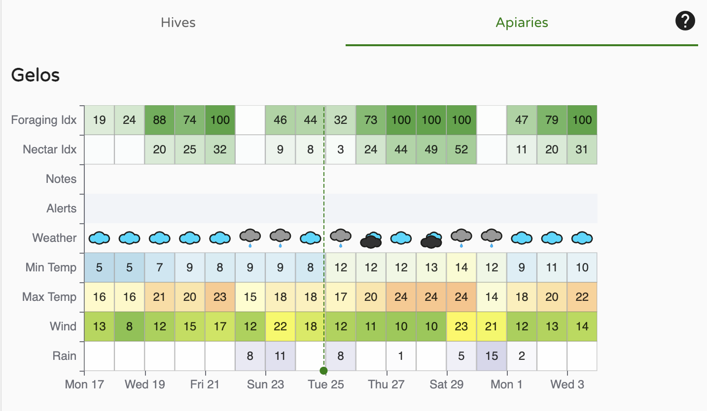

At a glance information shown here:

* Foraging Index - learn more [here](#working-with-weather)
* Nectar-Flow Index - learn more [here](#working-with-weather)
* Notes
* Alerts
* Other basic weather readings

### Left Sidebar - Choose which hives to view

The left sidebar is your key to navigating your apiaries and hives as well as apiaries shared with you by your friends. There is a lot of functionality built into this menu. Explore by clicking around.


- Clicking on `>` opens up hives in the apiary and devices in the hives
- Hovering over a BroodMinder device will display the ID number
- `...`
  - Apiary - Edit apiary info and location, add hives, share with friends, add apiary notes
  - Hive - Edit hive information, color of graph trace, move to new apiary, add BroodMinder devices, get link to BeeCounted.org, add hive notes
  - Device - Edit device name, adjust/move device location
- Multi-Select is a powerful feature that lets you overlay data from many different hives and apiaries. If you want to focus on one hive at a time, turn it off.
- When you click on an Apiary, it will display the hives in the apiary and bring up the data in the main window. Click it a second time and it removes the data from the view.
- Clicking a second apiary will add the hives to the view. Notice that the hives which are displayed are underlined. The color of the underline is the color of the graph line for that hive.
- Clicking a hive will toggle it to display or not display.
- The small `X` to the right of `Multi-Select` will clear all of the hive displays.

### Dashboard - Choose how to display the data

The buttons at the top of the view window let you chose how to display your information. We provide some standard views that we believe are useful. You can also add custom view to include many new analysis features.


- Classic
- Calendar
- Weather
- You can create your own custom displays using the `+` 
  - Sensor readings
  - Weather
  - Analysis
  - Maps and images
- Note - The `v` to the right of the notes section will expand the text of all of the notes within the timeframe shown. There are many powerful note features discussed below.
- `...` to the right of the dashboard buttons 
  - Create sharable link - *This is a powerful feature.* Once you get the display looking like you like it, you can create a browser link to share with anybody, even if they do not have a MyBroodMinder account. You can choose a fixed timeframe to share, or a variable timeframe such as the last 2 weeks. When you share it this way, it will always bring up the newest 2 weeks of data. You can also add a description which will display at the top of the graph.
  - Download - You can download the BroodMinder data, the weather data, and/or the notes to a CSV (Comma Separated Variable) file.

- Notice all the BroodMinder IDs of devices in the graph are identified at the very bottom of the view. If you click one, it will take you do the data graph for that device. In that view you will see all of the data for that device no matter where it has been installed.

#### Graph Controls

There are many terrific graph  controls available to get your reports looking just right.


- Time Range - Using the dropdown menu at the top, `Last 7 days`, you can chose the duration of the display
- Change the height of each individual graph using the `=` on the leftof the window between the graphs.
- Turn individual graph lines on/off by clicking the legend below the dates
- Highlight the line of a graph by placing the cursor directly over if. The other graph lines will dim.
- Tools to the right of the graph
  - Zoom time scale - click the horizontal tool, then drag the cursor over the region of interest while holding the left mouse button. Un-zoom by clicking the tool again.
  - Zoom vertical - click the vertical tool, then drag the cursor over the region of interest while holding the left mouse button. Un-zoom by clicking the tool again.
  - Clicking the yellow hive tool will hide/unhide hive notes
  - Clicking the red hive tool will hide/unhide the apiary notes
  - Clicking the bell tool will hide/unhide the alerts

#### Adding Notes

There are powerful new note capabilities in both MyBroodMinder and the Bees app. You can use the Bees app to add notes in the field, and then edit or add additional notes when you review them in MyBroodMinder.


The most simple way to add a note is to double click on a graph at the time you want to add a note. An editor will pop up. You can enter text and you can also add tags. Once you save the note it will show up on the graph as a hive tool. 

You can also add a note for the entire apiary such as `Performed OA treatment on all hives`. Do this by clicking the `...` to the right of the apiary in the side bar and choosing add note. This note will display in all hives.

--- 

## User Settings

Before we move further you can configure your preferences and manage your membership in the User Settings panel.


- User details : your name, email, password but also account deletion
- Membership : Membership type, hives allowed, expiration date
- Regional Settings : Units, time zone and language are set to browser default but you can force specific aspects.

--- 

Voici une version améliorée et structurée de ton texte pour le guide utilisateur, avec des corrections de grammaire, une meilleure fluidité et un ton plus professionnel :

---

## Managing Apiaries and Hives

One of the very first steps you’ll likely take is to **create an apiary and attach some hives** to it. This is a key part of building your hive monitoring setup.

You can do this using either the **Bees App** or **MyBroodMinder** like in the screenshot below, simply click the `New` button on the left sidebar:


---

### Creating a New Apiary

When adding a new apiary, you’ll be asked to:

- Give it a name  
- Set a location with a postal/ZIP code  
- Optionally pick a **graph color** for this apiary (used in weather charts)


!!! tip "ZIP code is used by the weather service"
    Choose your ZIP/postal code carefully — it determines the **local weather data** displayed for your apiary.

    For better accuracy, you can adjust the apiary location once it has been created. Click the three-dot menu `... > Edit Apiary > Edit Location`, then pick the new place on the map.

    

---

### Creating a New Hive

To add a hive, simply click the `...` menu next to an apiary. This automatically links the hive to that location. Name the hive and assign it a color for graph displays. You can edit those settings at any time.


### Moving Hives Between Apiaries

Hives are always attached to an apiary, but they **can be moved** freely. This feature allows you to track hive migrations over time.

To move a hive select `Move Hive` in the drop down:

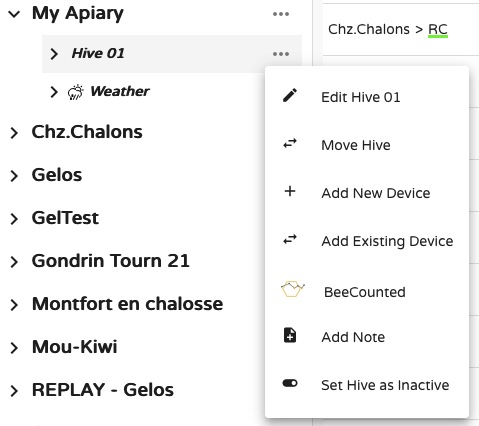

These movements will be materialized in the charts by **pink dashed vertical lines** — showing the transition between apiaries (e.g., from A to B to C in the example below):


> In this example, hive scales were removed during the move, which is reflected by the 0 kg/lb values.

To display the **weather history** the hive experienced throughout its life, you’ll need to combine weather data from each apiary (A, B, and C).

---

### Managing in Batches

So far, we’ve used the **sidebar tools** in MyBroodMinder. For more efficient bulk management, head over to the **Configure** page.

Click `Configure` in the left menu to view and manage every detail in MyBbroodMinder. For now we will focus on **Apiaries** and **Hives**  

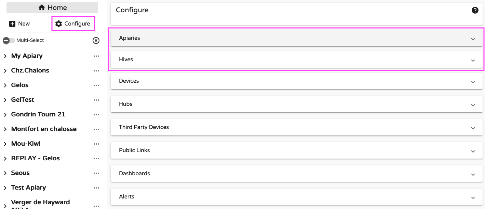


#### Configuring Apiaries

Under `Configure > Apiaries`, you can:

- Edit apiary names and locations  
- Add a **local weather source** (e.g., a BroodMinder device broadcasting temperature/humidity) to complete the default online weather service  
- Archive or delete apiaries


!!! tip "Inactive apiaries"
    You **cannot delete** an apiary if it still contains hives (active or inactive) — you’ll need to delete those first.

    However, the recommended approach is to **deactivate** the apiary. It will disappear from the sidebar but remain in the system for later recovery.

    Use the `Show inactive` checkbox in `Configure > Apiaries` to reveal them.


#### Configuring Hives

Under `Configure > Hives`, you can:

- Rename hives  
- Adjust device associations over time  
- Move hives between apiaries  
- Set hives as inactive (data retained)  
- Delete hives (data permanently removed)  
- Track the device history of each hive


Here’s an example of hive R2-20, which has used various devices over time. It currently has a **bee counter**, an **internal sensor**, and a **scale**, and previously used another internal sensor from April 10 to Nov. 16, 2024.

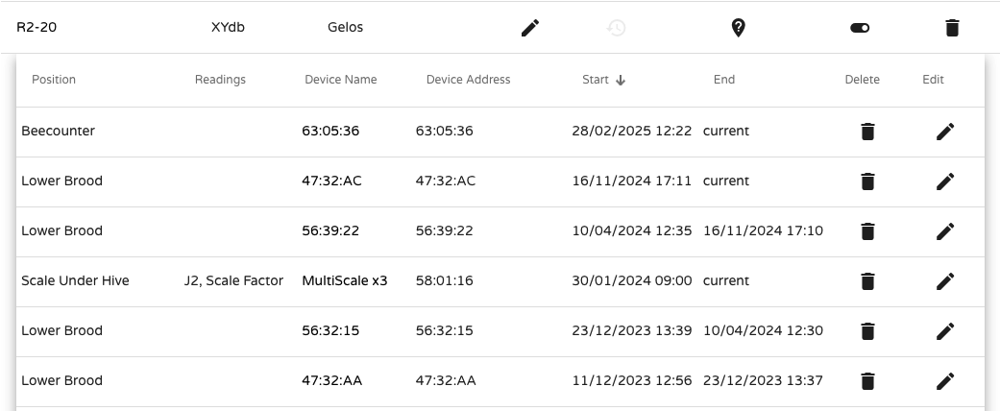


Tracking devices, hives, and apiary changes is one of MyBroodMinder’s most powerful capabilities.

With devices now in the picture, let’s move to the next chapter: **Managing Devices**.


---

## Managing Devices

There are three main categories of devices in the BroodMinder ecosystem:

- **Sensors** (e.g., scales, internal temperature sensors, weather stations, BeeDar)
- **Hubs** (e.g., 4G, Wi-Fi, LoRa)
- **Third-party devices**

These categories share common characteristics, but let’s start with **Sensors**.

### Sensors

The first thing to do when you receive a BroodMinder sensor is to **attach it to your account**. This is called **"claiming the device"**, and it can be done using either the **Bees App** (`Claim device`) or **MyBroodMinder** (`Add New Device`).


Both methods guide you through the process of attaching the device to a hive.

Once claimed, the device belongs to your account and will appear under `Configure > Devices`.


This table shows the device’s name, current location, last data received, battery level, and its movement history through different hives.

Devices are always assigned to **Hives**, and within hives, to a specific **Position**. Each time you assign a device, you must specify its position:

```
- Lower Brood
- Upper Brood
- Inner Cover
- Scale Under Hive
- Scale Under Hive (Back)
- Beecounter
- Outside Hive
- Other
- Custom (1-7)
- Incubator
```

!!! info "Important to know about positions"
    Each position has specific behavior and implications:

    - Brood levels are calculated only for the `Lower Brood` and `Upper Brood` positions.
    - `Incubator` positions trigger temperature threshold alerts.
    - **Each position can only be occupied by one sensor at a time**. If you assign a new sensor to a position already in use, you’ll need to first remove the current one.
    - **Start dates matter!** If a sensor spent time outside the hive before installation, update its start date accordingly to ensure correct data interpretation.
    - The data shown at the **sensor level** includes all locations it has visited. At the **hive level**, only the data recorded while in that hive is shown.


#### Moving Sensors

Let’s look at an example with sensor **56:39:3A**, a BroodMinder-TH device. In `Configure > Devices`, we can see it is currently at *Gelos Apiary*, in *Hive RD*, at the *Lower Brood* position.

It has previously been in **Hive T4-10cNCcTo** and **R7-24b**, making this its third hive since being claimed in March 2024.


Looking at its data at the device level:


We see a complete dataset from March 18, 2024 (device activation date). Markers labeled `S` (Start) and `E` (Exit) indicate when the device changed positions.


From the **hive view**, using Hive **R7-24b**, where the device was installed until October 21, 2024:


We see data only for the period the sensor was installed. It was replaced by another sensor (`56:39:20`), and to make it clear in this display we marked that transition by a green vertical line.

Colored boxes at the bottom left show which device provided the data. Bright colors = current devices, faded = past devices.

**This device/hive relationship is key in BroodMinder and may not exist in other monitoring systems. Unlike a room temperature sensor or truck GPS, beekeeping involves constant movement of hives, colonies, and devices.**

!!! tip "Why is sensor position tracking important?"
    Most systems only track the current location of a sensor. If you move a device without tracking its past, you lose valuable history. That history is critical for understanding long-term patterns such as nectar flows, brood cycles, or weather responses.

    While MyBroodMinder doesn't yet offer full tools to exploit this historical data, it's part of our development roadmap. Working in a proper way reserves benefits for the future 😉. 


#### Exploring Sensor-Level Data

You’ve seen how to assign a sensor to a hive and define its position. Let’s now explore **sensor-level data acquisition**.

Click on a hive position (e.g., for device **56:39:24**) to access raw data and the device’s location history:


This chart shows temperature and humidity readings. To investigate further, click `Show Data Editor` at the bottom of the screen:


Here’s what each column means:

- **Epoch**: Universal timestamp
- **Timestamp**: Local time of the measurement
- **Sample**: Sample number (counter)
- **RSSI**: Received Signal Strength Indicator (seen from the receiver)
- **Source**: Who harvested the data (e.g., Cell hub, Wifi, Bees App)
- **Battery**: Battery percentage
- **Charge Remaining**: Estimated battery life
- **Temp**: Temperature in °C
- **Humid**: Relative humidity
- **SM State**: Swarm Minder status (T and TH models only)
- **BatterySaver**: Indicates if battery-saving mode is enabled

In the example, Sample 574 appears twice:

- At 21:34 via Bees App (`BAPP` source)
- At 23:20 via a Hub (`H|54`)

But the sample itself was only recorded once. What happened?

The device doesn’t know the actual date/time when powered on. Time is added by the **receiver**:

- A **Hub** timestamps samples using network time.
- The **Bees App** sets the device clock during sync. If you skip this sync when installing a device, timestamps can drift.

!!! tip "What if no sync is done at first startup?"
    The device will store data with no timestamps. When a sync eventually happens, the app assigns time to the most recent sample, and calculates earlier times by counting backward. This may lead to timestamp errors.

    **Solution:** Always sync the device with the Bees App before installing it in the hive.

Timestamp misalignment can create "wavy" curves due to overlapping data from different sources:


To fix this, scroll to the bottom of the editor and use `Remove Duplicates`. This keeps the most reliable data (usually Hub-sourced, with network timestamps).


Here’s what the cleaned-up temperature curve looks like:


#### Moving Devices to Another Account

If you sell or give away your device, it must be **removed from your account**. For data integrity, each device can only be linked to one owner at a time.

Contact support, and we can:
- Rename the device (change its MAC address), so you retain historical data
- Allow the new user to claim it as a "new" device under their account


### Hubs

Hubs are a special category of BroodMinder devices. Their role is to **collect data** from all nearby BroodMinder sensors and **transmit it to the cloud**. The path that data takes depends on the hub's communication technology. Currently, BroodMinder supports the following hub types:

- **Cellular 4G Hub**
- **Wi-Fi Hub**
- **LoRa Hub**
- **SubHub**

The most widely used model is the **BroodMinder-T91 Cellular Hub**, a fully featured device built using Nordic Semiconductor hardware running custom BroodMinder firmware.

When you receive a hub, you must **claim it** just like any other device. Once claimed and attached to your account, the hub can be assigned to an apiary. If it starts sending data from sensors already assigned to an apiary, the system may auto-assign it based on this data.

Once active, hubs appear in your apiary list like this:


Clicking the cross icon removes it from the apiary. However, if the hub continues sending data from devices assigned to the apiary, it will reappear automatically.

You can also assign a hub manually by navigating to `Configure > Hubs` and editing the assignment:


Clicking the **hub ID** in the left sidebar opens its **detailed view**. This includes:

- Firmware version
- Last data upload time
- Various operational metrics such as temperature, humidity, signal strength, uptime, and more


These details are also accessible in the **Bees App** under `Devices > [Hub ID] > Show Details`. This information is extremely helpful for troubleshooting issues infield such as network instability or operational anomalies.


Key indicators:

- **RSRP** (Reference Signal Received Power): signal strength
- **RSRQ** (Reference Signal Received Quality): signal quality
- **SNR/SINR** (Signal-to-Noise Ratio): clarity of the connection


Other important values:

- **AcT**: the radio access technology in use (e.g., LTE-M, NB-IoT)
- **MNC**: the mobile network code, identifying the carrier

At the bottom of the hub detail screen, a **live console** shows real-time status logs. You may see entries like "booting", "starting modem", or "sending data". Most of the time, the hub will alternate between `tick` and `tock`, indicating normal operation.

We won’t go deeper into the technical specifications here. For more information on hardware and advanced usage, refer to the **Hub section in the Devices Documentation**.

!!! tip "Having issues with connectivity?"
    In some cases, your apiary may experience weak or no network coverage. When connectivity is limited, the tools available in the **Bees App** and **MyBroodMinder** can be extremely helpful in diagnosing the issue.

    To help us assist you more effectively:

    - Take **screenshots of the network metrics** (RSRP, RSRQ, SINR, etc.)
    - Take a **photo of the apiary and the hub's mounting location**
    - Share the **GPS coordinates (latitude/longitude)** of the apiary
    
    With these elements, we can analyze your setup, identify potential causes, and guide you toward achieving stable and reliable connectivity.

### Third Party Devices

Third party devices are sensors that are not made by BroodMinder. Currently we support YoLink sensors. 
You will be able to hook a yolink device to MyBroodminder and retrieve the data. Contact support@broodminder.com for more details.


---

## Recording Notes and Inspections

Tracking events in beekeeping is essential if you want to truly understand your colonies and make the right decisions. While carrying a smartphone or tablet into the apiary may not always be convenient, we’ve worked hard to make note-taking and inspection recording as simple and efficient as possible.

As always, you can take and edit your notes in **MyBroodMinder**, but by far the most convenient method is using the **Bees App**, where you can log information directly in the field — when your observations are fresh and most accurate.

In this section, we’ll explore in detail how to use notes and inspection records.

There are two types of notes:

- **Apiary Notes**: Assigned to all hives within an apiary. You’ll notice that the available tags differ from those used for hive notes. Apiary notes appear in charts using the **red hive tool** icon.
- **Hive Notes**: Assigned to one or more specific hives (not shared across the entire apiary). These notes are marked with a **yellow hive tool** icon.

---

### Taking a Note

In the **Bees App**, whether you’re in the `Apiaries` or `Hives` tab, you’ll find the note-taking icon. Tapping it brings up a screen where you choose whether your note is for the apiary or for a hive:


You’ll then be taken to a familiar note entry screen. Here you can select the hive, the date and time and also write some text. 

One particularly useful feature here is **Tags** — allowing you to log common actions or observations with a single tap, making note-taking much quicker. Once saved, your note will appear in the Bees App under the Hive Tool tab:


Your notes will also appear in **MyBroodMinder**, both in the **Notes List widget** and within **contextual charts**:

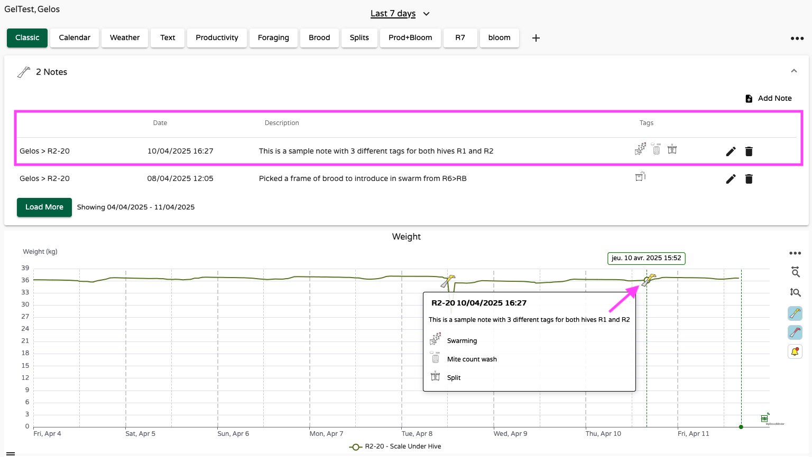

Having your notes linked to sensor data is incredibly useful, as it allows you to correlate events with sensor trends. For example, this note helps explain a weight fluctuation and subsequent drop:


In most charts, you can show or hide notes by using the toolbar buttons on the right-hand side:

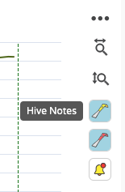

You can also add notes directly in **MyBroodMinder** using several methods:

- `Home > New > Apiary note`

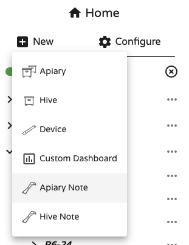

- `Notes widget > Add note`


- `Apiary name > ... > Add note`


- `Hive name > ... > Add note`


And finally, you can even double-click on any chart to bring up a **contextual pop-up** for quick hive note entry.


### Exporting Notes

Just like your other data, notes can be exported from any dashboard. Simply open the three-dot menu at the top right:  `... > Download Options > Notes CSV`

Your notes will also be included in every **shared dashboards**.


### Triggering a Workflow 🆕

Until now, notes were relatively static — recorded and viewed, but not active. Starting with the 2025 release of MyBroodMinder, notes enter a new phase with the introduction of **Workflows**.

Workflows allow notes to **trigger follow-up actions**. For example, recording a swarm event can now initiate a requeening process — prompting you to take the necessary steps in the days or weeks that follow.

This means your notes are no longer passive records but become **smart checkpoints** within a broader hive management strategy. It’s the beginning of a more intelligent inspection system designed to **guide you through key colony transitions**.

To learn more, continue to the next chapter: **QueenMinder – Colony Transitions**.


## QueenMinder - Colonies in Transition

🚧  Comming soon 🚧 


## Working with Temperature and Brood

Brood is arguably the most essential aspect of a beehive. Whether it is present or not, increasing or decreasing, compact or sparse... brood tells you if the hive is queen-right and it guides your inspections and beekeeping decisions.

Although we cannot (yet) measure everything about brood (e.g., diseases), we can do a lot with a **BroodMinder-T or TH**. These sensors measure in-hive temperature and humidity, and from that data, we compute a beekeeping-centered metric: **Brood Level**.

Because we don’t know what kind of hive you’re using (6-8-10-12 frame / Langstroth-Dadant-Topbar-Layens...), brood levels are expressed as **percentages**. The higher the percentage, the higher the brood level. While it’s not always possible to convert this directly into a number of frames, relative values are reliable. For instance, if you have two hives—one at 80% and the other at 90%—you can be confident the latter has more brood.

Familiarize yourself with these values in your own hives.  
As a starting point: in a 10-frame hive, 90% brood could mean 9 frames, 80% about 8 frames, and so on. However, this varies with hive configuration, so learn what these percentages mean for your bees.


<a href="https://www.youtube.com/watch?v=oiXLpn-AbrE" target="_blank">
  
</a>


### Why does temperature indicate brood?

Bees excel at thermoregulating their hive, and they do so primarily for one reason: **to raise brood**. When there’s no brood, there's little incentive to regulate temperature (with rare exceptions).

When the colony is strong and full of brood, it maintains a stable internal temperature of **35°C / 95°F**. This is what we call the **Optimal Brood Zone**, and it corresponds to **100% brood**.

Conversely, when there is no brood, the bees let the internal temperature follow ambient conditions. In this case, you’ll see values closer to outside temperatures, and the brood level will be near **0%**.

Between these two extremes lie many intermediate situations.

To illustrate this, here are hourly temperature measurements from two hives in the same apiary. The first hive is represented in red, the second in grey. Solid lines show internal temperature; dashed lines show external temperature.


We observe a clear difference: the red hive follows ambient fluctuations (25–30°C / 77–86°F), indicating little or no brood. The grey hive maintains a stable 35°C/95°F, clearly within the Optimal Brood Zone.

Some BroodMinder users have developed strong skills interpreting these internal temperature charts. A great reference is Theresa Martin’s book: ["Dead Bees Don't Make Honey: 10 Tips for Healthy Productive Bees"](https://www.amazon.com/Dead-Bees-Dont-Make-Honey/dp/B0CY9G9C89)


### Where is Brood displayed?

You can find brood levels in multiple places within **MyBroodMinder** and the **Bees App**.

One of the most convenient is the **Bees App**, where you can view temperature and brood charts. For example, in the chart below, a brood removal one week prior caused increased temperature fluctuation. This is expected when thermoregulation is disrupted due to reduced brood.


Following this example, in the following days, one should monitor the charts to check if brood levels recover (which would be expected), or continue to decline (indicating a possible queen issue—perhaps she was removed with the split or is no longer viable).

---

Brood values are also displayed on the **MyBroodMinder home page**, where you can see an overview of all your hives and apiaries. We find again the same hive as above R6-24 with 67% brood.


### Make your custom brood charts

To view your first brood chart in MyBroodMinder, create a custom dashboard and drag the **Brood Widget**. You can place it next to the temperature widget for easy comparison. While temperature is recorded hourly, brood levels are computed daily (typically after midnight when all data is available).

Here’s how such a widget might look:


And here’s a complete view with brood levels from multiple hives within an apiary. Since values are daily, the chart is cleaner and easier to interpret than temperature charts.


Another great feature in MyBroodMinder is the ability to visualize brood across longer time spans. Here for example is the full year for three hives. While each followed its seasonal rhythm, all stopped brood production in mid-November and resumed in mid-January.

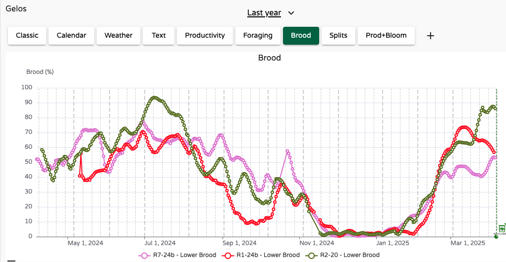

!!! tip "Use brood data to plan for treatments"
    Use the brood charts to identify the most appropriate time for broodless treatments. In winter, opportunities to open hives are limited. Having real-time data from inside the colony that shows when brood is decreasing—or completely absent—is incredibly helpful for choosing the optimal treatment window.


!!! info "FAQ: How accurate is the brood estimation?"
    Brood estimation is an **indirect measurement** of the hive thermoregulation, which itself depends on hive type and insulation. For example, well-insulated hives may display higher brood percentages simply because they retain heat better.

    Over time, you’ll learn to correlate brood percentages with your actual number of brood frames. For instance, "when brood shows 80%, I usually have 5 frames."

    While **absolute values** are affected by hive configuration and sensor placement, **relative values** are much more reliable. If you use the same model across hives, you can trust that a hive with a higher brood percentage truly has more brood.

    One important limitation is at **very low brood levels** (e.g. 1 frame or less). Because the sensor is single-point and the brood may be far from it, the reading can have a higher margin of error. In practice, values below 20% are less accurate.

---

## SwarmMinder – Detecting Thermal Events

In addition to monitoring brood temperature, the internal sensors BroodMinder-T and BroodMinder-TH offer an extra feature called **SwarmMinder**. This function actively detects **unusual temperature events**, characterized by **rapid rises in temperature**.  
For a detailed explanation of how the device works, see the section [SwarmMinder details](https://doc.mybroodminder.com/31_sensors_T_TH/#swarmminder-details) in the BroodMinder-T/TH device guide. This section focuses on how SwarmMinder can be interpreted **from a beekeeper’s perspective**.


### What is a Thermal Event?

A Thermal Event is defined by a **steeper-than-normal temperature increase** in the brood area. This can indicate several scenarios:

- 🐝 **Swarming behavior**: Bees become agitated and lose control of thermoregulation. This typically occurs during or de days before a swarm.
- ☀️ **Environmental overheating**: External temperature rises rapidly (e.g., midday sun), and heat transfers into the hive—especially if insulation is poor.
- 🔍 **Hive inspection**: Opening the hive and exposing the sensor to ambient air causes a temporary spike in temperature.

In MyBroodMinder, these events are automatically flagged as **red needles on the temperature chart**. Let’s look at a few real-life examples.

---

### Case 1 – Overheating in a Young Nucleus Colony

In the chart below, a new split colony experienced during its **first day of activity on April 1st** a sudden internal heat spike. This kind of stress is particularly harmful for a nuc: fewer bees, eggs to care for, and a queen to raise.

> Fortunately, the colony maintained brood temperature in range, but we still took action by **adding a second roof for shade**.

  
*Temperature spike on April 1st*

  
*Double-roof insulation added afterwards*

Notice that on **April 4th** (chart above), a similar external temperature rise occurred, but the colony handled it much better—thanks to the improved radiative protection.

---

### Case 2 – Chronic Overheating in Southern Spain

In some areas, especially in southern Spain, **overheating is a daily issue in summer**. The chart below shows continuous daily heat spikes.

> This not only stresses the colony but also wastes energy: the bees are constantly trying to regulate temperature, instead of foraging or raising brood.

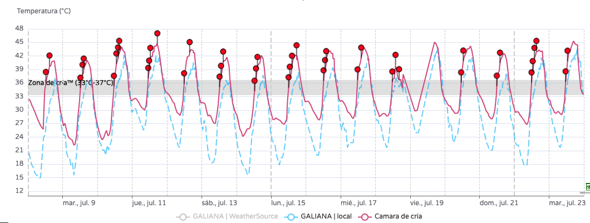
Good insulation and proper hive positioning become essential in these contexts.

---

### Case 3 – Swarming Detected After Thermal Warnings

In this final example, a colony displayed **multiple thermal events in the days leading up to a swarm**. These temperature spikes were an early sign of the bees’ preparation.

> Eventually, the colony swarmed – confirming the predictive value of SwarmMinder.

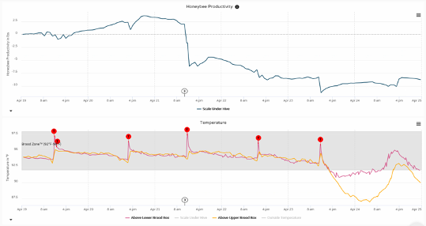  
*A thermal signature followed by an actual swarm*

---

!!! info "FAQ: How to interpret Thermal Events?"

    A **Thermal Event** simply means your hive's internal temperature rose unusually fast. But this does **not automatically indicate a swarm**. It could also result from hot weather or an inspection.  
    Your hive type and local climate play a key role in interpreting these events accurately.  
        
    We're working on improving detection through **machine learning**, and you can help!  
    If you'd like to contribute by tagging events in your hives, contact us at [support@broodminder.com](mailto:support@broodminder.com) to join our testers group.

---

## Working with Weight and Productivity

Tracking and experiencing nectar flows is one of the most fascinating aspects of beekeeping. Plants release nectar, bees find it, love it, and bring it home.  
That’s how it’s supposed to work, right?  
But the real questions are: **When does it happen? For how long? How intense is it?**

A hive scale answers all those questions — information that would otherwise remain hidden.  
Instead of just thinking *“I guess there was a nectar flow because the bees looked busy”* (if you even saw them), you’ll be able to **quantify** and **visualize** the event.  
It’s a truly amazing experience.

---
<a href="https://www.youtube.com/watch?v=ZUkm1N2izJ0" target="_blank">
  
</a>

### What does a nectar flow look like?

Tracking a **nectar flow** with a hive scale looks like the chart below. You’ll see the hive's weight increasing steadily each day.  
Rather than monitoring absolute weight, which changes slowly, we typically focus on **weight change**, offering a clearer hour-by-hour view.

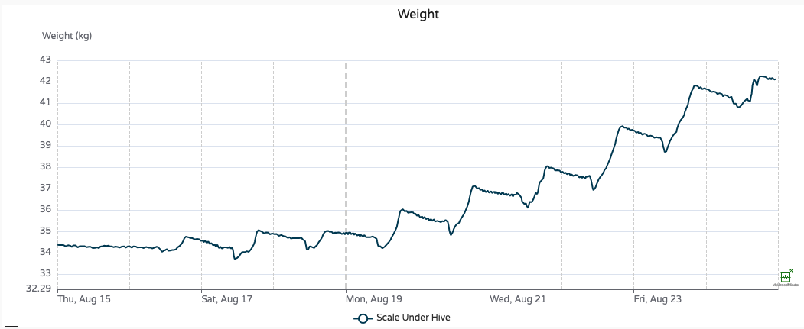

Each day follows a fairly consistent pattern — typical of nectar flow periods. Here's what usually happens:

- Foragers leave in the morning  
- Resources flow in during the afternoon  
- Bees return around sunset after a long day  
- Night work begins: **dehydrating** nectar and converting it into honey (you’ll see a downward slope in weight)  
- Then the cycle starts again the next morning

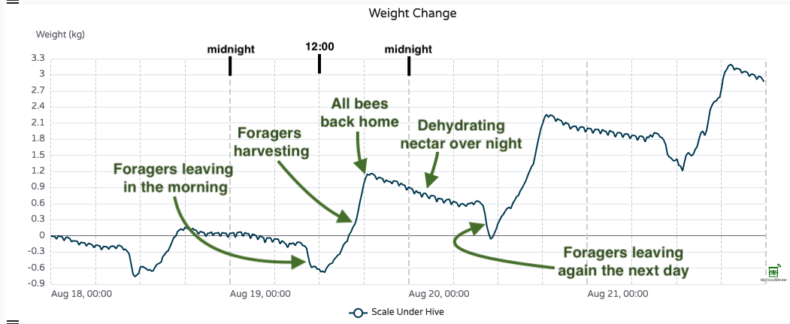

---

### Productivity

**Productivity** is the net work done by your bees.  
It’s a daily metric calculated from hourly weight data, and it **excludes** beekeeper interventions (like feeding, adding a super, or removing frames).  
So productivity reflects only the colony’s own performance.

The result? A clear view of whether the bees are **producing** or **consuming** — because productivity can be either positive or negative!

In the example below, we zoom out to see the **full nectar flow period**:


- **Bars** = daily productivity (e.g. +2 kg on Aug. 21)  
- **Line** = cumulative productivity since the first day shown (e.g. +5.5 kg between Aug. 12–21)

Notice the three distinct phases: **before**, **during**, and **after** the nectar flow.  
There’s also a **temporary stop** around Aug. 25, caused by poor weather and rain.  
With productivity metrics, it’s crystal clear when the nectar flow starts, pauses, and ends.

!!! tip "Cumulative Productivity"
    The cumulative value starts from day 0 of the selected chart.  
    If you want to analyze a nectar flow from a specific date (e.g. when you entered the apiary or a bloom started), just select that date in the date picker.

---

### Where to find Productivity?

In the **Bees App**, you’ll find both Weight and Productivity:


On **MyBroodMinder**'s homepage, you’ll also see the latest total weight and productivity values:

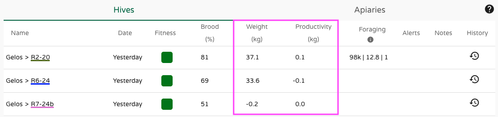

Need more history? Tap the `History` icon to review the past week:


And of course, you can build your **custom dashboard** with `Weight`, `Weight change`, and `Productivity` widgets:


---

### Notifications

You’ll receive **three types of automatic notifications** related to nectar flow:

- **Nectar flow start**: noticeable weight gain over 3 days  
- **Nectar flow stop**: no increase for 2 consecutive days  
- **Nectar flow restart**: after a temporary stop within 7 days.


---


## Working with Foraging

Forager bees embark daily on a mission to collect resources essential for the colony’s survival — and for pollination, of course! Monitoring foraging activity provides valuable insights into hive health and ecosystem interaction.

There are several ways to track forager activity, such as **bee counters** and **cameras**. But **BroodMinder-BeeDar** offers something different: a **non-invasive**, **battery-powered**, radar-based system that works on any hive, with **no optical setup required**. It uses the **Doppler effect** to measure motion at the hive entrance — quietly and efficiently.

Watch the video:

[](https://www.youtube.com/watch?v=itsttEXKm_I)

!!! tip "BeeDar also works with Bumblebees! 🐝"
    In 2021 we made extensive campaigns with bumblebees using BeeDar and the results are amazing. "BumbleDar" is a specific version of BeeDar with a dedicated firmware to adjust to bumple bees activity patterns. 

### What does BeeDar measure?

**BeeDar** captures **foraging activity** by detecting movement in front of the hive. The raw measurement is the **RMS signal strength**, a value proportional to overall bee traffic at the entrance.

!!! info "BeeDar History"
    **BeeDar** was invented by **Dr. Herbert Aumann**, a pioneer in radar systems. After fifty years as a senior scientist at MIT Lincoln Laboratory, Herb continued his research as an adjunct professor at the University of Maine, and later co-founded Maine Biosensors LLC.
    
    Also a passionate **beekeeper**, Herb brought together his expertise in radar and love for bees to create BeeDar. When we met him, it was clear that his invention deserved a place in the BroodMinder ecosystem.
    
    BeeDar is patented as:  
    "Doppler Radar Beehive Activity Monitoring System"
    – U.S. Patent 11,867,794 and EP 3820283A4


### Interpreting BeeDar data

Below is a chart showing **raw BeeDar data** (RMS signal strength).  
You can clearly see when foragers start and stop each day. Activity varies depending on weather and conditions — for example:

- March 28: very low activity  
- March 29: concentrated afternoon activity  
- March 30: a long, productive day

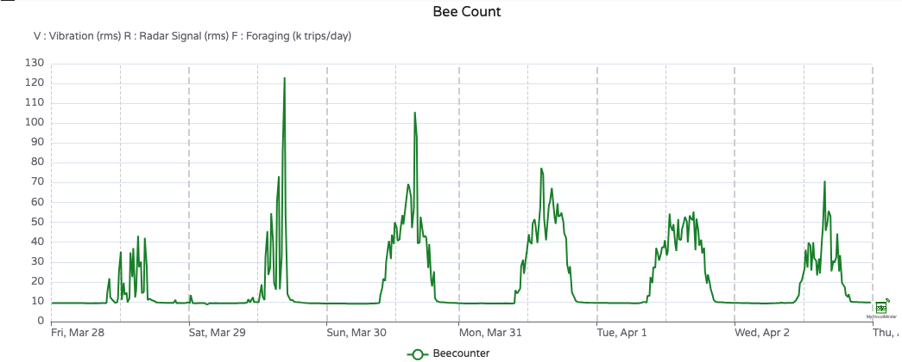

To make this data more actionable, we developed an algorithm that converts signal strength into **estimated bee trips**.  
Click the `F` button on the chart right toolbar to reveal this view as in the example below, March 30th shows 107,000 forager trips across 11.3 hours.

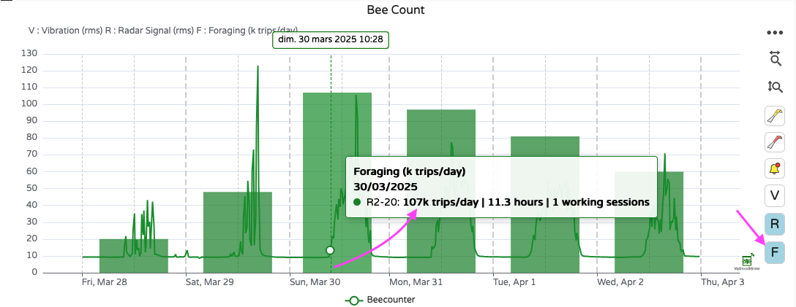

---

### How does BeeDar work?

Let’s be clear — BeeDar is **not exactly a bee counter**. It doesn’t track individual bees entering or leaving the hive. Instead, it's a **bee activity counter**.

Think of it like a **water flow sensor** on a river: it doesn’t count every drop, but gives an accurate picture of overall flow. Similarly, BeeDar provides a reliable estimate of bee activity — not a precise in/out count.

So no, BeeDar won’t say:  
*"Today, 12,728 bees exited and 11,424 returned, so you lost 1,304 bees."*  
But it **will** say:  
*"We estimate 107,000 bee trips today, with this activity curve."*

BeeDar also includes a **vibration sensor** to measure sound and movement near the hive entrance. While often correlated with radar data, it can sometimes reveal distinct events.

By default, BeeDar samples data **every 15 minutes** to preserve battery life. At that rate your 2 AA batteries will hold ~4 months or even a full season (~8 months) if you place 4 batteries. You can adjust the measurement rate to **every 5 minutes**, at the cost of a 4x battery usage rate.

---

### How accurate is BeeDar?

While BeeDar doesn’t track every bee, extensive calibration campaigns have shown its **very strong correlation** with camera-based systems.

Here’s a comparison with **EyesOnHives®**, which uses computer vision to count bees:


Each day displays two distributions:  
- **Black** = BeeDar  
- **Blue** = EyesOnHives

The alignment is striking, and this level of validation has been confirmed using other technologies, such as **infrared gate counters**.


---

### Where is foraging activity displayed?

You can explore foraging data in **MyBroodMinder**:

- **Home page**: Summary of bee trips, session duration, and number of sessions  
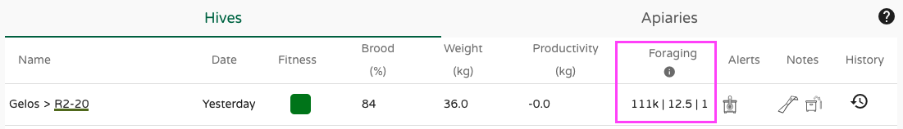

- **Classic tab** (bottom): Raw radar and vibration measurements  


- **Custom Dashboards**: Add the **BeeCount** widget for a tailored view  


!!! info "Coming Soon"
    BeeDar is not yet available in the **Bees App > Manage** tab.  
    🏗️ We're working on it!  
    In the meantime, you can always view data in  
    `Sensors > [device name] > Show Details`


---

## Working with Alerts

There are almost 30 events from hives, devices, & weather that can trigger an alert. There's different kind of alerts, those that you wanna track over time, those that are just contextual and informative, some notifications to make you aware..

Here is a sample of different alerts

- SwarMinder events
- Hive events
- Weather forectast events
- Nectar flow start/stop
- QueenMinder notifications
- Plants notifications 
- Device events
- etc.


### Configure

In `Configure > Alerts`, you’ll find a list of fully configurable alerts. You can:

- **Adjust alert thresholds** to better match your context
- **Disable any alerts** you don’t want to receive


### Email digest

At the top of the page, you can also enable the **Alert Summary Email** and choose how often you receive it. These emails provide a concise overview of the most recent alerts, like this:

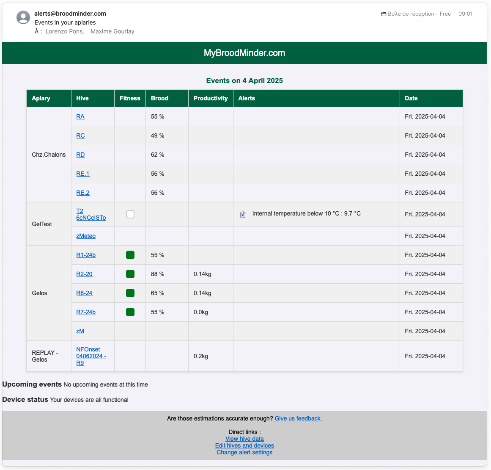


### Bees App

Not all alerts are handled within MyBroodMinder. Some — especially more **ephemeral notifications** — are managed and delivered directly through the **Bees App**.

These may include:
- Real-time connectivity issues
- Device status updates
- App-specific reminders or observations

These lightweight alerts are designed for immediate attention and are not stored long-term in your MyBroodMinder history.


Example of BAPP alerts "XXXXXXX" 

---

## Working with Plants

The **Plants** module is one of the key new features released in 2025. Since 2022, we’ve been developing a powerful model to **track and forecast phenological stages** of plants. The engine behind this feature is called **Phenocast**.
Plants are now fully integrated into MyBroodMinder, and support for Bees App will follow soon.


Each **apiary** can now be linked to an **unlimited number of plants**. Choose those that matter most for your bees, especially for nectar and pollen. We’ve built a database of over **500 species**, searchable by keyword.


Once you've selected your plants, you can explore the data in different ways. let's check them:

### Plant data Sheet
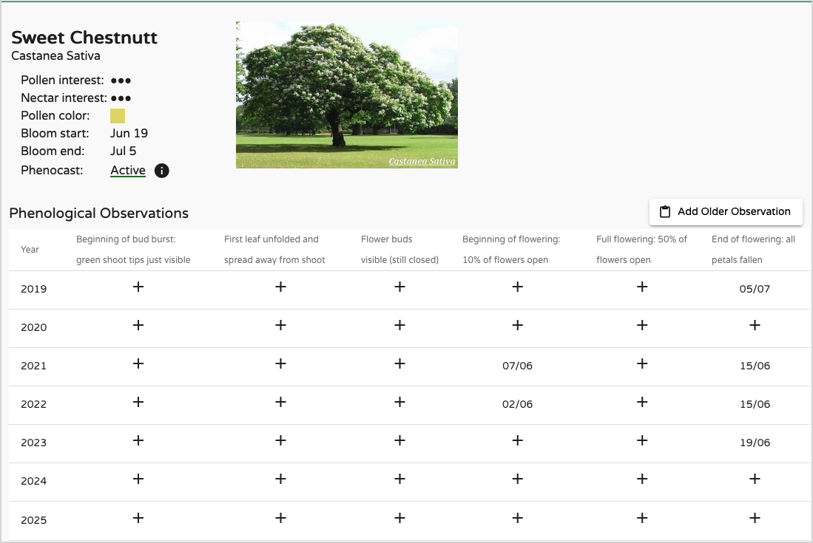 

Click on any plant to view all its properties:

- Common and **scientific names**
- **Nectar and pollen interest** for bees
- **Default bloom period**
- Whether a **Phenocast model** has been created from your observations

You’ll also see a **table of your historical observations**, which you can complete and edit. The more data you enter, the better the forecasts.


### Calendar View

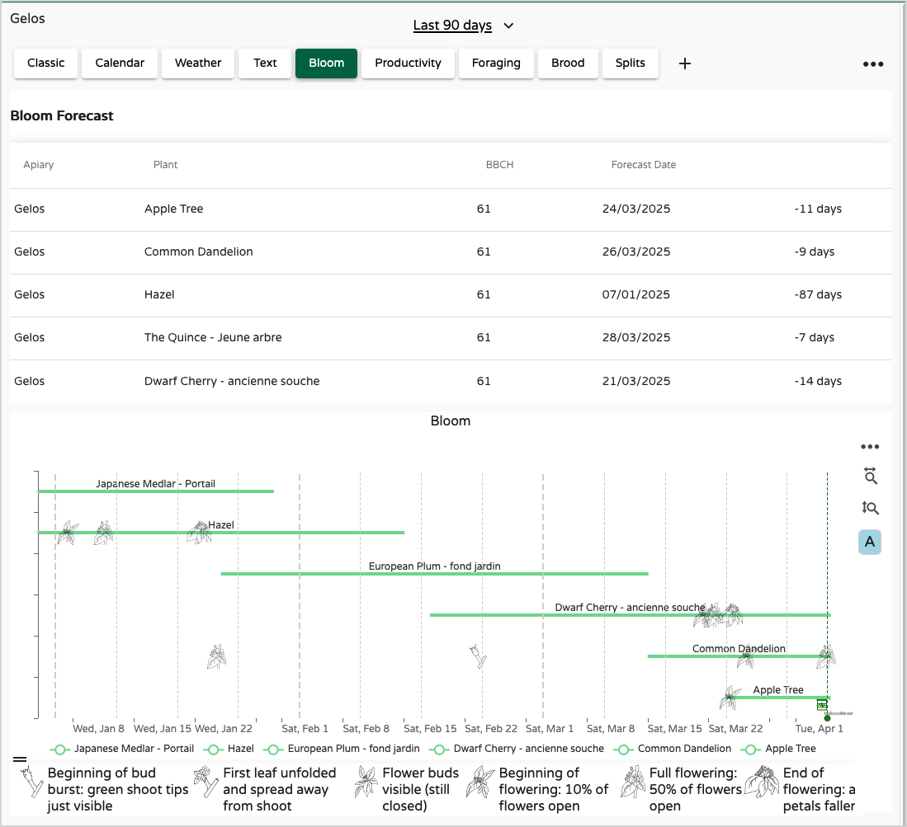

From the **Plants tab** in the left panel, you’ll access a calendar showing:

- A **forecast table** of phenological stages
- The theoretical **blooming span** (green lines)
- The **blooming schedule** of all your selected plants

Bloom timing is highly location-dependent. A cherry tree in southern Spain will bloom earlier than one in Seattle. You can adjust bloom ranges in `Plants > Edit > Advanced` for more regionally accurate timelines.

Icons over the lines represent the **actual dates** recorded in your observations.


### Custom Dashboards

You can add a **Plants chart widget** to any **Custom Dashboard**. Simply drag the “Plants” widget to the right-hand side. It pairs perfectly with **productivity data** or the **nectar flow index** — giving you a more complete picture of your apiary’s ecosystem.

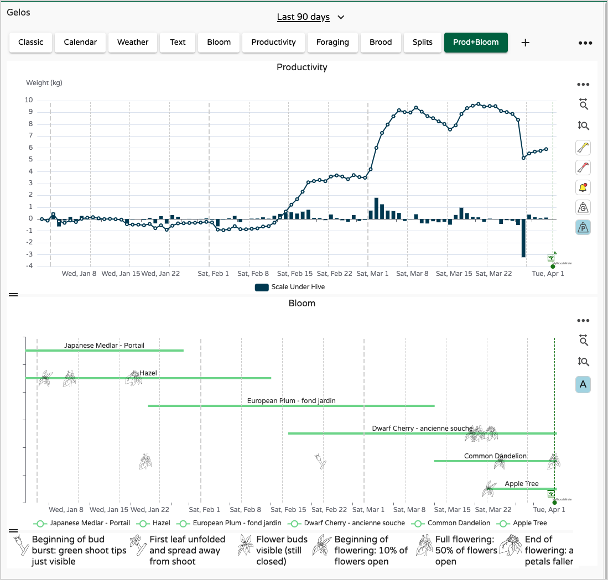


### Manage plants

You can edit or remove plants at any time from the `Configure > Apiaries` panel. Just click the **plant config icon** next to each apiary to unfold and manage your plant list.


### Phenocast

While it's possible to manage plants and observations using a traditional "logbook" approach, the true value of the system lies in its ability to **forecast phenological stages and send alerts**.

Better beekeeping starts **before** key events happen — not while you're reacting to them. That's exactly why we created **Phenocast**. This powerful and unique tool is designed to help **beekeepers and growers** alike anticipate what’s coming, so they can plan ahead and act at the right moment.


!!! info "What is Phenocast?"
    **Phenocast** is the forecasting service we’ve developed to predict **phenological stages** of plants based on:

    - Your **historical observations**
    - The **weather history** at your apiary

    To activate the model, you'll need to enter at least **3 bloom dates** from past years. Once this is done, Phenocast automatically builds and starts running.
    
    When the model is ready, you’ll receive a notification on your phone.

!!! tip "Improve forecast acuracy"
    You can improve the model by also recording **earlier stages** like **bud burst**, not just blooming. Every new observation **recomputes the model**, making it more accurate. 
    
    With high-quality input, we’ve achieved **1–2 day precision** for bloom predictions up to 5 days in advance.
    
    Check our [guide here] for tips on accurately observing phenological stages.


!!! warning "Phenocast Limitations" 
    Phenocast currently does **not** support annual plants (sunflower, rapeseed,...) reliably. Their pheno-stages depend heavily on sowing dates, so their bloom can’t be predicted accurately without that input. While you can still enter observations, the model may be unreliable.

---


## Working with Weather

Weather conditions are a key aspect of beekeeping. You simply can't manage your apiary without considering the weather. It influences everything — from **inspection timing**, **splitting**, and **feeding needs**, to **bloom onset** and **nectar flow** in the surrounding environment. In short, weather matters — a lot.

In MyBroodMinder, each apiary has its own **Weather** object.


When you expand this section, you'll see the default weather service **WeatherSource** attached. **WeatherSource Inc.** is a dedicated company that provides reliable historical and forecast weather data.

!!! tip "WeatherSource's location accuracy"
    WeatherSource estimates weather based on the ZIP code you entered when creating your apiary. This might be a few miles away from your actual location.  
    To improve accuracy, go to `Edit Apiary > Coordinates > Edit Location`, and move the map marker to the precise spot.
    
    


### Sources

You can also add a **local weather source** using the `...` menu. This allows you to assign a BroodMinder device (like a **Weather Hub** or **BroodMinder-T/TH**) to provide real-time weather readings from the apiary itself.


!!! tip "Get precise local weather data"
    The most accurate way to measure apiary weather is to use a **weather shield** enclosing a BroodMinder-T91 Hub or a BroodMinder-TH.


Now that you acquired a deeper understanding of the different weather sources into myBroodMinder, it's time to see how to manage them and exploit the most for your beekeeping practice.

### Weather tab

The best place to start is the **Weather tab** in your dashboard canvas. This tab displays all the selected weather sources for your apiary.

Click the **Weather** item on the left sidebar to display the data on the charts. For now, skip the first two — *Nectar Flow Index* and *Foraging Index* — as we'll cover them later.

You'll notice two time series:

- `Apiary | WeatherSource` — the default data from WeatherSource Inc.
- `Apiary | Local` — data from your own BroodMinder device, if configured.

Depending on the local source, you may see temperature, humidity, or both.


**WeatherSource** provides: Temperature, Humidity, Rainfall, Wind and Cloud cover. In the example above, compared with the local weather data, WeatherSource tracks temperature well, though it may underestimate peak temperatures. This is where comparing with your local device is useful. For instance, if your apiary is in full sun, afternoon temperatures can be significantly higher.

> The thick dashed vertical grey lines represent the start of each day; the thin ones mark noon.

### Forecast

Once you're familiar with your current weather sources, you can look ahead with the forecast. In the calendar picker, check the **"Show 10-day forecast"** option:


The weather charts will now extend 10 days into the future. The vertical green dashed line marks "today". In this example, the forecast shows stable conditions ahead — no sharp warm-ups or cool-downs.
  


However, rain is expected next Sunday/Monday, while wind conditions remain stable.  
Note that **cloud cover is not included in forecasts**.


At this stage, we have seen how to assess and compare multiple weather sources. **While this deep insight is useful, it's not always practical to analyze raw weather data every day**. That's why we’ve developed tools to automate the processing and translate weather into beekeeping-relevant insights. Let's check now in depth the **Foraging Index** and the **Nectar Flow Index**.


### Indexes

Indexes provide a synthetic view of weather suitability for bees and plants.


- **Foraging Index** answers: *"Can bees forage today?"* and considers the outside temperature, the hygrometry, rain and wind.

- **Nectar Flow Index** answers: *"Can plants produce nectar today?"* and evaluates the *atmospheric conditions* for the nectarification of the *flowers*. Here too, several factors are analyzed in relation to the nectar flow conditions. 0% means that the conditions for honeyflow are not met, 100% that it is damn great. But beware, depending on your climate zone, 100% may never be reached and you will have to be satisfied with lower rates! 
To validate the forecast range, this algorithm has been developed with apiaries located in various climatic zones (temperate, cold, very cold, tropical...); We ensure you that in some cases it can reach 100% 😉

These indexes are based purely on weather conditions.  
They don't consider whether plants are actually blooming or whether your bees are acclimated to local cold — they offer **general trends**.

In practice, the **Nectar Flow Index** is often the most informative. It helps you anticipate upcoming opportunities and plan accordingly. That’s why it's featured in the **first tab of the Bees App** — it sets the tone for your daily beekeeping decisions.


!!! note "Beekeepers as weather processors"
    Every experienced beekeeper instinctively does "weather processing" — interpreting forecasts and deciding if upcoming conditions are right for bees.  
    But it’s easy to overlook key factors: warm days with no sun, night-only rainfall, or too much wind.  
    The **Nectar Flow** and **Foraging Indexes** replicate this mental model using a consistent, methodical approach.


!!! Example "Practical use of the Nectar Flow Index (NFI)"

    Understanding and utilizing the Nectar Flow Index (NFI) can significantly enhance your beekeeping practices. Here’s a guide on how to practically apply the NFI:
    
    **1. Monitor Local Blooming Plants:**
        Keep track of the types of plants in your area and their blooming periods. The NFI is only useful if there are plants in bloom.
    
    **2. Understand Plant-Specific NFI Thresholds:**
        Different plants have varying NFI thresholds for nectar release. For instance:<br>
        a. Rapeseed: Nectar flow generally starts at an NFI > 7 because of the cooler early-season conditions.<br>
        b. Sunflower: Nectar flow typically begins at an NFI > 30 during the warmer summer months.
    
    **3. Observe and Record:**
        Regularly observe your hives and note when bees start to gather nectar from different plants.
        Record the NFI readings corresponding to these observations. Over time, you'll identify specific NFI thresholds for various plants in your area.
    
    **4. Make Informed Decisions:**
        Use your observations and recorded data to make informed decisions about hive management.
            For example, if the NFI indicates that nectar flow is likely but your bees are not active, check for other factors such as plants blooming, hive health or local microclimate conditions.<br>Plan hive movements or resource supplementation based on anticipated nectar flows.

### Overlay 

You can display weather data from **multiple apiaries side-by-side**. This is helpful when:

- Comparing conditions across different locations
- Analyzing a hive that has been moved from one location to another

Simply select the weather item from each apiary to view them together.

!!! tip "Color-coded weather series"
    Each apiary has a unique color assigned. Weather series follow this color for easy identification.  
    You can customize the color under `Apiary Name > ... > Edit Apiary > Color`.

### Colormaps

For a quick overview of upcoming weather, you can also use **colormaps**.  
These are available in the `Home > Apiary` panel and offer a compact, synthetic view of expected conditions over the next 10 days — great for comparing locations at a glance.


### Customize

All the weather magnitudes are avaialable as widgets in the toolbox to build your custom dashboard 


!!! info "FAQ: Can I connect a third-party weather station?"
    We do not offer connectors for third-party weather stations.  
    The reason is simple: the market includes a vast number of models, each with its own data format and API, making it extremely difficult to support and maintain compatibility over time.

    In the past, we attempted to support external systems, but it proved too complex for a team of our size.  
    Instead, we chose to focus our efforts on two reliable sources:
    
    - **WeatherSource**, a high-quality professional weather service  
    - **Our own BroodMinder devices**, which we know and fully control


---

## Sharing
From MyBroodMinder you have many options to share your hives with other beekeepers and friends:

### With another user
- you can share an Apiary (in the Apiary `… > share` ) with another MyBroodMinder user simply enter his/her account email. Acces is granted per apiary, in read only mode. They will see apiary and hives but not devices. 


### On beecounted

- you can also share an apiary [beecounted.org](https://www.beecounted.org) (in the Apiary `… > share`, see above). By default, all free acounts are sharing on beecounted.


### With an URL

- you can share a dashboard (in the Dashboards `… > share`): this produces an URL and anyone having it will see your dashboard. You can post it on social networks too.
When creating the url you will notice that you have some choices : which hives to share, what time frame, frozen or continuous etc..


### Educational Dashboards

- And Last but not least, there's a fourth and the most classy way to share your hive : **Educational Dashboards**
This is a big screen mode for associations, schools or corporations that are willing to display their bees to colleagues and fellows. 
Send us an email to [support@BroodMinder.com](mailto:support@BroodMinder.com) to know more about this service.


<div align="center" ><i>Educational Dashboards are fun!</i></div>


## Models & algorithms

In this section, we will discuss the more technical aspects of Mellisphera's way of functioning. We will thus present the different models - BFIT, BFORCE, BWEIGHT - as well as the WEATHER sources and ALERTS.

### Colony Health - BFit
BFIT for _Bee Fitness_ is the algorithm that informs the beekeeper of each hive's condition. We use benchmarks such as the time of the season and the surrounding hive state in order to define a "nominal" state. Then we position each hive in relation to this reference.

<!--The display is very easy to understand, with coloured stickers to indicate their condition. To complete the information, a tooltip (on the flyover) specifies the nature of the situation.


-->
The color code is the following:

| color | meaning |
|---|---|
|Green | Healthy |
|Orange | Disturbed (declining or with abnormal events) |
|Red | In trouble |
|Black | Dead |
|White | No data or no weather |


BFit is based on algorithms that collect events. The 'Learning' algorithm learns from previous events to preserve, or not, future events. Afterwards, it classifies the detected events between those affecting the hive state and the others. 

BFit also takes into account the results from BForce. In this way, it can determine the difference between the current hive dynamics and a theoretical brood dynamics that is constantly changing. These theoretical dynamics are regularly updated. It also takes into account the different regions of the world to provide relevant information according to latitude or climate. 


## MyBroodMinder-Free vs MyBroodMinder-Premium

We offer both a free and a [premium service](https://myBroodMinder.com/app/premium-subscription). We have attempted to establish an equitable and economical system for our wide variety of users.

Our team is self funded and  continues to make extraordinary efforts to create and refine the BroodMinder eco-system. That said, we realize the our customers are the ones that will decide if our services are worth the effort. 

If you do not desire the premium features, it is still possible to read and analyze your BroodMinder devices. 

BroodMinder-Free approach

- Create a MyBroodMinder account
- You will be allowed a maximum of 5 hives.
- If you have additional sensors they are still supported, but can not be assigned to additional hives.
  - Devices are read and transferred to MyBroodMinder with the Bees app using the "Devices" tab
  - Data/graphs are viewed in MyBroodMinder by clicking on the link in the "Configure | Devices" tab
- You can name devices to reflect their location if you wish
- Note that this approach will also work if you have a paid account to read additional sensors beyond your subscription level.
