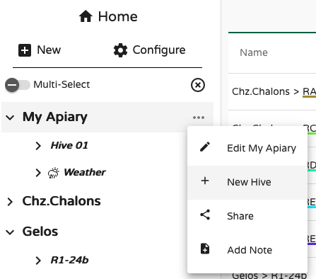
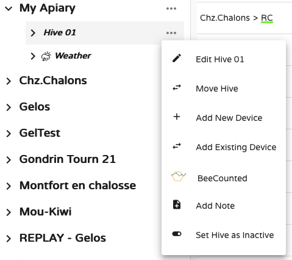
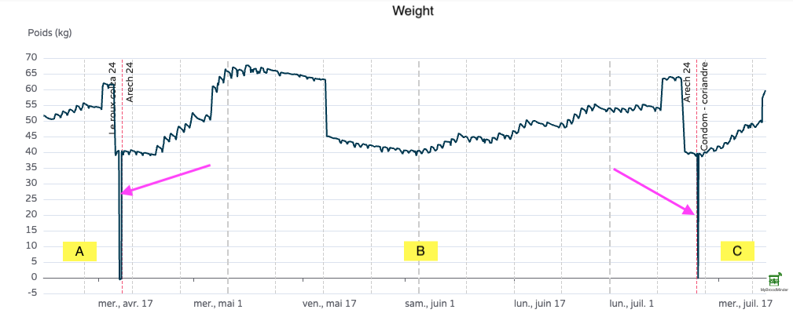
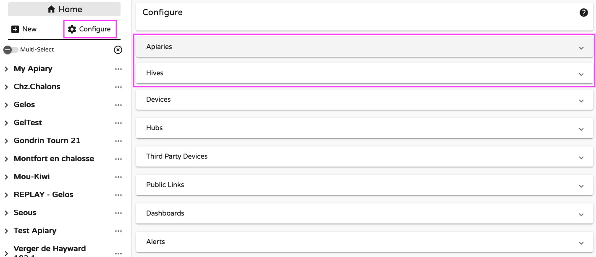
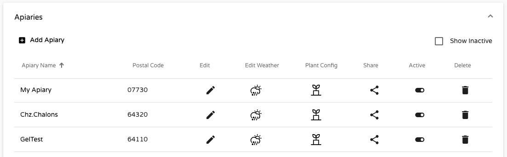
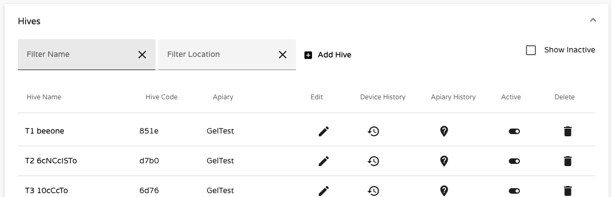
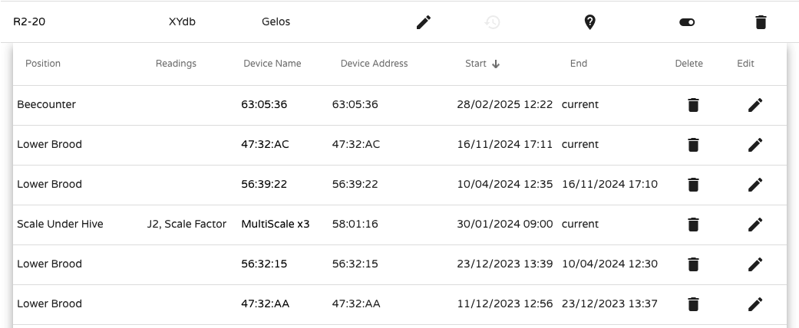

# Managing Apiaries and Hives

One of the very first steps you’ll likely take is to **create an apiary and attach some hives** to it. This is a key part of building your hive monitoring setup.

You can do this using either the **Bees App** or **MyBroodMinder** like in the screenshot below, simply click the `New` button on the left sidebar:

---

## Creating a New Apiary

When adding a new apiary, you’ll be asked to:

- Give it a name  
- Set a location with a postal/ZIP code  
- Optionally pick a **graph color** for this apiary (used in weather charts)

!!! tip "ZIP code is used by the weather service"
    Choose your ZIP/postal code carefully — it determines the **local weather data** displayed for your apiary.

    For better accuracy, you can adjust the apiary location once it has been created. Click the three-dot menu `... > Edit Apiary > Edit Location`, then pick the new place on the map.

    

---

## Creating a New Hive

To add a hive, simply click the `...` menu next to an apiary. This automatically links the hive to that location. Name the hive and assign it a color for graph displays. You can edit those settings at any time.

## Moving Hives Between Apiaries

Hives are always attached to an apiary, but they **can be moved** freely. This feature allows you to track hive migrations over time.

To move a hive select `Move Hive` in the drop down:

These movements will be materialized in the charts by **pink dashed vertical lines** — showing the transition between apiaries (e.g., from A to B to C in the example below):

> In this example, hive scales were removed during the move, which is reflected by the 0 kg/lb values.

To display the **weather history** the hive experienced throughout its life, you’ll need to combine weather data from each apiary (A, B, and C).

---

## Managing in Batches

So far, we’ve used the **sidebar tools** in MyBroodMinder. For more efficient bulk management, head over to the **Configure** page.

Click `Configure` in the left menu to view and manage every detail in MyBbroodMinder. For now we will focus on **Apiaries** and **Hives**  

### Configuring Apiaries

Under `Configure > Apiaries`, you can:

- Edit apiary names and locations  
- Add a **local weather source** (e.g., a BroodMinder device broadcasting temperature/humidity) to complete the default online weather service  
- Archive or delete apiaries

!!! tip "Inactive apiaries"
    You **cannot delete** an apiary if it still contains hives (active or inactive) — you’ll need to delete those first.

    However, the recommended approach is to **deactivate** the apiary. It will disappear from the sidebar but remain in the system for later recovery.

    Use the `Show inactive` checkbox in `Configure > Apiaries` to reveal them.

### Configuring Hives

Under `Configure > Hives`, you can:

- Rename hives  
- Adjust device associations over time  
- Move hives between apiaries  
- Set hives as inactive (data retained)  
- Delete hives (data permanently removed)  
- Track the device history of each hive

Here’s an example of hive R2-20, which has used various devices over time. It currently has a **bee counter**, an **internal sensor**, and a **scale**, and previously used another internal sensor from April 10 to Nov. 16, 2024.

Tracking devices, hives, and apiary changes is one of MyBroodMinder’s most powerful capabilities.

With devices now in the picture, let’s move to the next chapter: **Managing Devices**.

