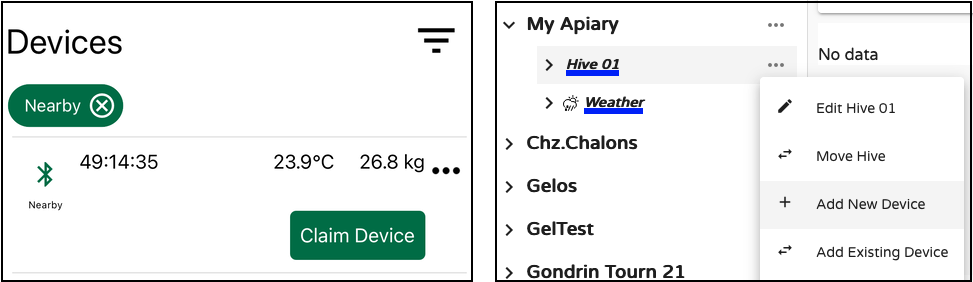
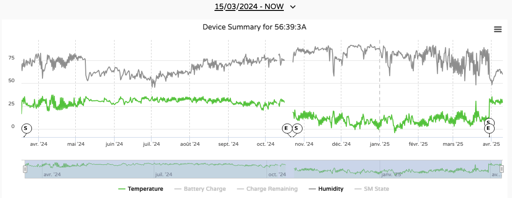
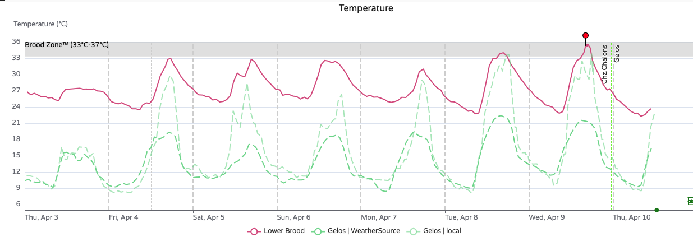
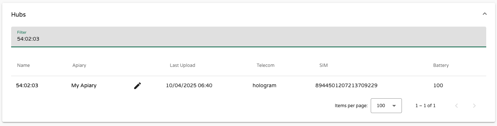

# Managing Devices

There are three main categories of devices in the BroodMinder ecosystem:

- **Sensors** (e.g., scales, internal temperature sensors, weather stations, BeeDar)
- **Hubs** (e.g., 4G, Wi-Fi, LoRa)
- **Third-party devices**

These categories share common characteristics, but let’s start with **Sensors**.

## Sensors

The first thing to do when you receive a BroodMinder sensor is to **attach it to your account**. This is called **"claiming the device"**, and it can be done using either the **Bees App** (`Claim device`) or **MyBroodMinder** (`Add New Device`).



Both methods guide you through the process of attaching the device to a hive.

Once claimed, the device belongs to your account and will appear under `Configure > Devices`.


This table shows the device’s name, current location, last data received, battery level, and its movement history through different hives.

Devices are always assigned to **Hives**, and within hives, to a specific **Position**. Each time you assign a device, you must specify its position:

```
- Lower Brood
- Upper Brood
- Inner Cover
- Scale Under Hive
- Scale Under Hive (Back)
- Beecounter
- Outside Hive
- Other
- Custom (1-7)
- Incubator
```

!!! info "Important to know about positions"
    Each position has specific behavior and implications:

    - Brood levels are calculated only for the `Lower Brood` and `Upper Brood` positions.
    - `Incubator` positions trigger temperature threshold alerts.
    - **Each position can only be occupied by one sensor at a time**. If you assign a new sensor to a position already in use, you’ll need to first remove the current one.
    - **Start dates matter!** If a sensor spent time outside the hive before installation, update its start date accordingly to ensure correct data interpretation.
    - The data shown at the **sensor level** includes all locations it has visited. At the **hive level**, only the data recorded while in that hive is shown.


### Moving Sensors

Let’s look at an example with sensor **56:39:3A**, a BroodMinder-TH device. In `Configure > Devices`, we can see it is currently at *Gelos Apiary*, in *Hive RD*, at the *Lower Brood* position.

It has previously been in **Hive T4-10cNCcTo** and **R7-24b**, making this its third hive since being claimed in March 2024.


Looking at its data at the device level:



We see a complete dataset from March 18, 2024 (device activation date). Markers labeled `S` (Start) and `E` (Exit) indicate when the device changed positions.


From the **hive view**, using Hive **R7-24b**, where the device was installed until October 21, 2024:


We see data only for the period the sensor was installed. It was replaced by another sensor (`56:39:20`), and to make it clear in this display we marked that transition by a green vertical line.

Colored boxes at the bottom left show which device provided the data. Bright colors = current devices, faded = past devices.

**This device/hive relationship is key in BroodMinder and may not exist in other monitoring systems. Unlike a room temperature sensor or truck GPS, beekeeping involves constant movement of hives, colonies, and devices.**

!!! tip "Why is sensor position tracking important?"
    Most systems only track the current location of a sensor. If you move a device without tracking its past, you lose valuable history. That history is critical for understanding long-term patterns such as nectar flows, brood cycles, or weather responses.

    While MyBroodMinder doesn't yet offer full tools to exploit this historical data, it's part of our development roadmap. Working in a proper way reserves benefits for the future 😉. 


### Exploring Sensor-Level Data

You’ve seen how to assign a sensor to a hive and define its position. Let’s now explore **sensor-level data acquisition**.

Click on a hive position (e.g., for device **56:39:24**) to access raw data and the device’s location history:


This chart shows temperature and humidity readings. To investigate further, click `Show Data Editor` at the bottom of the screen:


Here’s what each column means:

- **Epoch**: Universal timestamp
- **Timestamp**: Local time of the measurement
- **Sample**: Sample number (counter)
- **RSSI**: Received Signal Strength Indicator (seen from the receiver)
- **Source**: Who harvested the data (e.g., Cell hub, Wifi, Bees App)
- **Battery**: Battery percentage
- **Charge Remaining**: Estimated battery life
- **Temp**: Temperature in °C
- **Humid**: Relative humidity
- **SM State**: Swarm Minder status (T and TH models only)
- **BatterySaver**: Indicates if battery-saving mode is enabled

In the example, Sample 574 appears twice:

- At 21:34 via Bees App (`BAPP` source)
- At 23:20 via a Hub (`H|54`)

But the sample itself was only recorded once. What happened?

The device doesn’t know the actual date/time when powered on. Time is added by the **receiver**:

- A **Hub** timestamps samples using network time.
- The **Bees App** sets the device clock during sync. If you skip this sync when installing a device, timestamps can drift.

!!! tip "What if no sync is done at first startup?"
    The device will store data with no timestamps. When a sync eventually happens, the app assigns time to the most recent sample, and calculates earlier times by counting backward. This may lead to timestamp errors.

    **Solution:** Always sync the device with the Bees App before installing it in the hive.

Timestamp misalignment can create "wavy" curves due to overlapping data from different sources:


To fix this, scroll to the bottom of the editor and use `Remove Duplicates`. This keeps the most reliable data (usually Hub-sourced, with network timestamps).


Here’s what the cleaned-up temperature curve looks like:



## Hubs

Hubs are a special category of BroodMinder devices. Their role is to **collect data** from all nearby BroodMinder sensors and **transmit it to the cloud**. The path that data takes depends on the hub's communication technology. Currently, BroodMinder supports the following hub types:

- **Cellular 4G Hub**
- **Wi-Fi Hub**
- **LoRa Hub**
- **SubHub**

The most widely used model is the **BroodMinder-T91 Cellular Hub**, a fully featured device built using Nordic Semiconductor hardware running custom BroodMinder firmware.

When you receive a hub, you must **claim it** just like any other device. Once claimed and attached to your account, the hub can be assigned to an apiary. If it starts sending data from sensors already assigned to an apiary, the system may auto-assign it based on this data.

Once active, hubs appear in your apiary list like this:


Clicking the cross icon removes it from the apiary. However, if the hub continues sending data from devices assigned to the apiary, it will reappear automatically.

You can also assign a hub manually by navigating to `Configure > Hubs` and editing the assignment:



Clicking the **hub ID** in the left sidebar opens its **detailed view**. This includes:

- Firmware version
- Last data upload time
- Various operational metrics such as temperature, humidity, signal strength, uptime, and more


These details are also accessible in the **Bees App** under `Devices > [Hub ID] > Show Details`. This information is extremely helpful for troubleshooting issues infield such as network instability or operational anomalies.


Key indicators:

- **RSRP** (Reference Signal Received Power): signal strength
- **RSRQ** (Reference Signal Received Quality): signal quality
- **SNR/SINR** (Signal-to-Noise Ratio): clarity of the connection


Other important values:

- **AcT**: the radio access technology in use (e.g., LTE-M, NB-IoT)
- **MNC**: the mobile network code, identifying the carrier

At the bottom of the hub detail screen, a **live console** shows real-time status logs. You may see entries like "booting", "starting modem", or "sending data". Most of the time, the hub will alternate between `tick` and `tock`, indicating normal operation.

We won’t go deeper into the technical specifications here. For more information on hardware and advanced usage, refer to the **Hub section in the Devices Documentation**.

!!! tip "Having issues with connectivity?"
    In some cases, your apiary may experience weak or no network coverage. When connectivity is limited, the tools available in the **Bees App** and **MyBroodMinder** can be extremely helpful in diagnosing the issue.

    To help us assist you more effectively:

    - Take **screenshots of the network metrics** (RSRP, RSRQ, SINR, etc.)
    - Take a **photo of the apiary and the hub's mounting location**
    - Share the **GPS coordinates (latitude/longitude)** of the apiary
    
    With these elements, we can analyze your setup, identify potential causes, and guide you toward achieving stable and reliable connectivity.

## Third Party Devices

Third party devices are sensors that are not made by BroodMinder. Currently we support YoLink sensors. 
You will be able to hook a yolink device to MyBroodminder and retrieve the data. Contact support@broodminder.com for more details.


## Moving Devices to Another Account

If you sell or give away your device, it must be **removed from your account**. For data integrity, each device can only be linked to one owner at a time.

Contact support, and we can:

- Rename the device (change its MAC address), so you retain historical data
- Allow the new user to claim it as a "new" device under their account