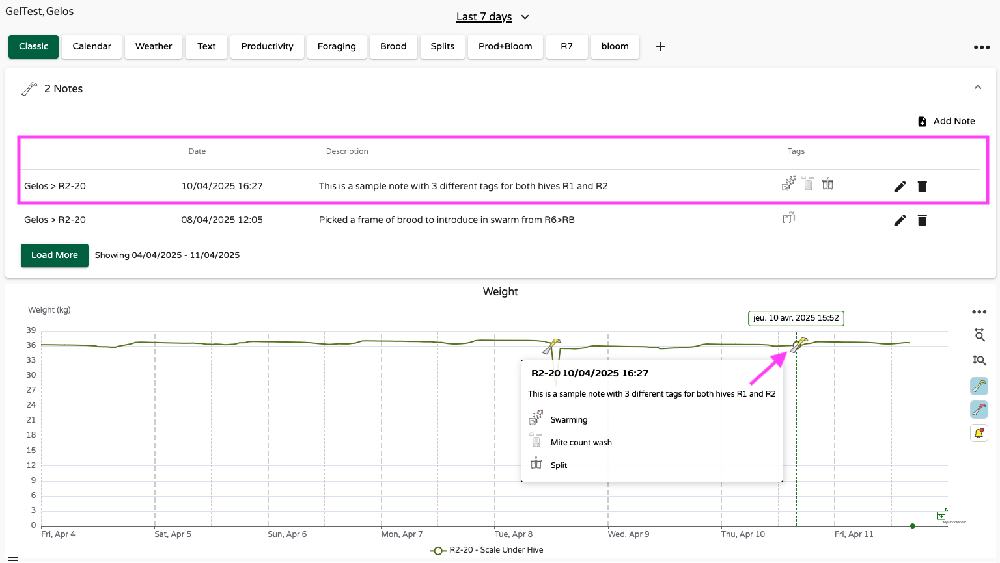
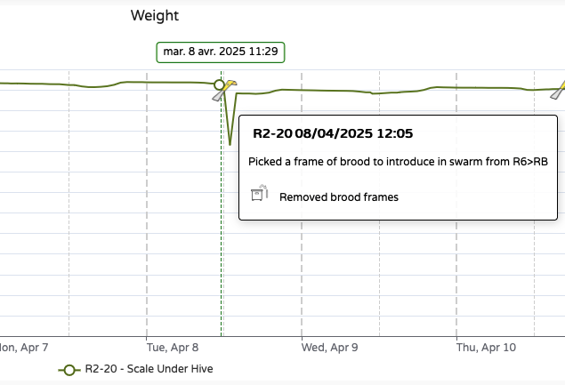
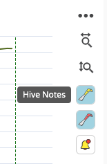
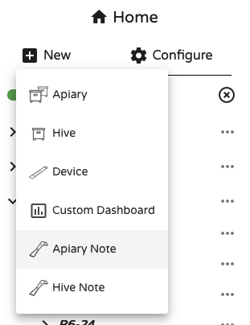
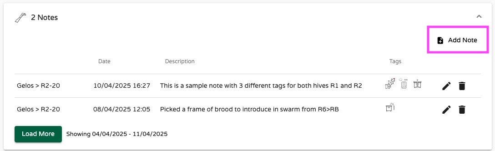
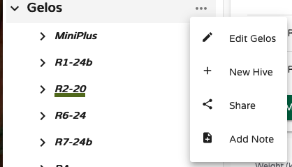
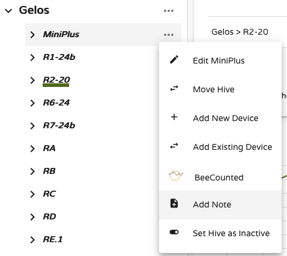

# Recording Notes and Inspections

!!! abstract "What you'll learn in this chapter"
    In this chapter, you'll learn how to **record and manage notes and inspections** using both the Bees App and MyBroodMinder.  
    You'll explore the difference between **apiary notes** and **hive notes**, and how to efficiently log observations in the field or at your desk.  
    You'll also see how notes integrate with your sensor data, how to export them, and how they now serve as **triggers for automated workflows** — helping you turn observations into actionable beekeeping steps.

Tracking events in beekeeping is essential if you want to truly understand your colonies and make the right decisions. While carrying a smartphone or tablet into the apiary may not always be convenient, we’ve worked hard to make note-taking and inspection recording as simple and efficient as possible.

As always, you can take and edit your notes in **MyBroodMinder**, but by far the most convenient method is using the **Bees App**, where you can log information directly in the field — when your observations are fresh and most accurate.

In this section, we’ll explore in detail how to use notes and inspection records.

There are two types of notes:

- **Apiary Notes**: Assigned to all hives within an apiary. You’ll notice that the available tags differ from those used for hive notes. Apiary notes appear in charts using the **red hive tool** icon.
- **Hive Notes**: Assigned to one or more specific hives (not shared across the entire apiary). These notes are marked with a **yellow hive tool** icon.

---

## Taking Notes

In the **Bees App**, whether you’re in the `Apiaries` or `Hives` tab, you’ll find the note-taking icon. Tapping it brings up a screen where you choose whether your note is for the apiary or for a hive:

You’ll then be taken to a familiar note entry screen. Here you can select the hive, the date and time and also write some text. 

One particularly useful feature here is **Tags** — allowing you to log common actions or observations with a single tap, making note-taking much quicker. Once saved, your note will appear in the Bees App under the Hive Tool tab:

Your notes will also appear in **MyBroodMinder**, both in the **Notes List widget** and within **contextual charts**:

Having your notes linked to sensor data is incredibly useful, as it allows you to correlate events with sensor trends. For example, this note helps explain a weight fluctuation and subsequent drop:

In most charts, you can show or hide notes by using the toolbar buttons on the right-hand side:

You can also add notes directly in **MyBroodMinder** using several methods:

- `Home > New > Apiary note`

- `Notes widget > Add note`

- `Apiary name > ... > Add note`

- `Hive name > ... > Add note`

And finally, you can even double-click on any chart to bring up a **contextual pop-up** for quick hive note entry.

## Exporting Notes

Just like your other data, notes can be exported from any dashboard. Simply open the three-dot menu at the top right:  `... > Download Options > Notes CSV`

Your notes will also be included in every **shared dashboards**.

## Triggering a Workflow 🆕

Until now, notes were relatively static — recorded and viewed, but not active. Starting with the 2025 release of MyBroodMinder, notes enter a new phase with the introduction of **Workflows**.

Workflows allow notes to **trigger follow-up actions**. For example, recording a swarm event can now initiate a requeening process — prompting you to take the necessary steps in the days or weeks that follow.

This means your notes are no longer passive records but become **smart checkpoints** within a broader hive management strategy. It’s the beginning of a more intelligent inspection system designed to **guide you through key colony transitions**.

To learn more, continue to the next chapter: **QueenMinder – Colony Transitions**.

