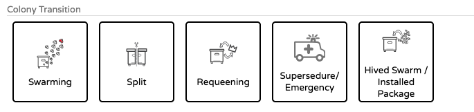

# QueenMinder - Colonies in Transition

Queen replacement is a complex and delicate process that unfolds over several weeks.
It can begin in various ways — swarming, introduction, supersedure — and involves several phases, some of which can be unpredictable.
But the goal remains the same: to establish a fully functional queen and ensure a sustained resumption of egg-laying.

QueenMinder supports you every step of the way — from planning and recording to monitoring and evaluation.
With QueenMinder, you improve your success rates and maintain full control over your queen replacement process.

!!! Warning " 🚧 QueenMinder is currently in beta testing 🚧 " 
    We’re still fine-tuning this module and plan to release it in a few weeks (Summer 2025) 
    If you’re curious and would like to explore the beta version, we’d truly value your feedback — it can help shape the final release.
    
    Feel free to reach out at support@broodminder.com — we’d love to hear from you!

!!! Warning "ONLY available on MyBroodMinder Desktop" 
    These features are currently available exclusively on the MyBroodMinder web platform. Implementation in the Bees mobile app will follow in a second phase.

## Watch the intro video :

## Getting started

The process of queen replacement is triggered when you add a note with one of those tags : 

## More documentation comming soon

<pre style="font-family: monospace;">

__        _____  ____  _  __  ___ _   _ 
\ \      / / _ \|  _ \| |/ / |_ _| \ | |
 \ \ /\ / / | | | |_) | ' /   | ||  \| |
  \ V  V /| |_| |  _ <| . \   | || |\  |
   \_/\_/  \___/|_| \_\_|\_\ |___|_| \_|
                                        
 ____  ____   ___   ____ ____  _____ ____ ____  
|  _ \|  _ \ / _ \ / ___|  _ \| ____/ ___/ ___| 
| |_) | |_) | | | | |  _| |_) |  _| \___ \___ \ 
|  __/|  _ <| |_| | |_| |  _ <| |___ ___) |__) |
|_|   |_| \_\\___/ \____|_| \_\_____|____/____/ 
                                                
</pre>