# QueenMinder - Colonies in Transition

Queen replacement is a complex and delicate process that unfolds over several weeks.
It can begin in various ways — swarming, introduction, supersedure — and involves several phases, some of which can be unpredictable.
But the goal remains the same: to establish a fully functional queen and ensure a sustained resumption of egg-laying.

QueenMinder supports you every step of the way — from planning and recording to monitoring and evaluation.
With QueenMinder, you improve your success rates and maintain full control over your queen replacement process.

!!! Warning " 🚧 QueenMinder is currently in beta testing 🚧 " 
    We’re still fine-tuning this module and plan to release it in a few weeks (Summer 2025) 
    If you’re curious and would like to explore the beta version, we’d truly value your feedback — it can help shape the final release.
    
    Feel free to reach out at support@broodminder.com — we’d love to hear from you!

!!! Warning "ONLY available on MyBroodMinder Desktop" 
    These features are currently available exclusively on the MyBroodMinder web platform. Implementation in the Bees mobile app will follow in a second phase.

## Watch the intro video

  

    
    
  

## Getting started

  

    
    
  

The process of queen replacement is triggered when you add a note with one of those tags : 

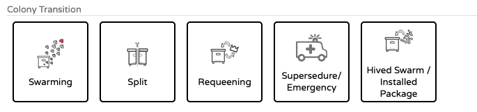

--- 
Here is the documentation written by Theo Hartmann 2025-07-15

## Overview
Queen replacement is a complex and delicate process that unfolds over several weeks. It can begin in various ways — swarming, requeening, supersedure — and involves several phases, some of which can be unpredictable. But the goal remains the same:

**A thriving colony with well-mated queen laying predominantly worker brood and no signs of the colony wanting to replace her.**

The tracking of a colony transition is triggered when you add a note with one of the tags in the Colony Transition category:

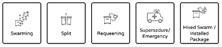

- Swarming 
 A swarm can either be a primary swarm with the mother queen leaving the hive or an afterswarm with a virgin leaving. It's crucial to identify the primary swarm event as the trigger for the cycle start and not an afterswarm.

- Split 
The beekeeper creates a new colony by splitting off a portion from a queenright, healthy colony. The queenless portion either raises a new queen from its own resources or is provided with a queen cell or live queen by the beekeeper.

- Requeening 
The beekeeper replaces the current queen. If a new queen is raised from within, the colony uses its own resources; otherwise, the beekeeper introduces a new queen or queen cell, especially in cases like aggressive genetics.

- Supersedure/Emergency  
The colony raises a new queen naturally due to the failure or loss of the current queen. This can happen as part of the colony’s natural lifecycle (supersedure) or in response to an emergency.

- Hived Swarm / Installed Package  
A swarm is captured, or a package of bees is installed into a hive. The beekeeper verifies that the new queen is well-mated and laying worker brood properly.

## Data Entry
The colony transition tags can be accessed via hive notes.

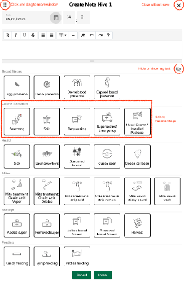

Selecting any of the transition cycle tags displays a pop-up asking you to confirm that this is what you would like to do.

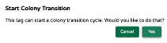

Selecting “Yes” will start the cycle. “Cancel” will let you back out.

A small icon appears after the hive name once a cycle is started. This indicates that the hive is currently in a transition and special care should be taken when doing inspections. This icon disappears once the transition is complete.

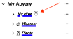

## QueenMinder Dashboard
A QueenMinder tab is available as a default dashboard in mybroodminder.com.

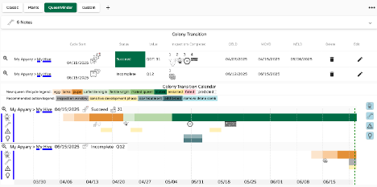

It contains hive Notes, a Colony Transition summary, the Colony Transition Calendar and the two most important hive metrics which are brood nest temperature and hive weight. As with other default dashboards, the QueenMinder dashboard can be customized by creating a new dashboard and adding the dashboard elements one-by-one. The default dashboard can then be hidden to avoid duplication.

The Colony Transition summary line displays the following key values which are calculated based on the inspection information entered.

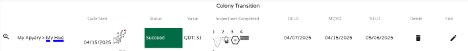

**Cycle Start** is the date when the cycle was started either by the colony or by the beekeeper. The icon shows the transition type selected.

**Status** is the current cycle state:

- Incomplete for running cycles
- Succeed for successfully completed cycles: New queen is laying predominantly worker brood
- Restart for interrupted cycles prior to completion: Afterswarm or requeening
- Fail for failed cycles: No eggs, drone brood only or incomplete data

**Value** is a progress indicator for the cycle using codes Q (queen) or W (worker).
These codes are a transition cycle progress indicator and represent the day in the respective development cycles. The Q code starts with Q1 on the date when the egg of the new queen is laid (Queen Egg Lay Date: QELD) and ends with Qx on the date the new queen begins laying eggs (New Egg Lay Date: NELD). The W code starts on the NELD date and stops once the cycle is complete.

The Queen Development Time (QDT) is shown for transitions which start with a virgin queen or younger.  It describes the time it takes for a new queen to develop.

**Inspections Completed** shows icons with inspection findings for up to 4 inspections per transition cycle.

**QELD** Queen Egg Lay Date:
- Date when the egg for the new queen was laid
- Starts the Q code clock
- Defines the start of the sensitive queen development period
- Defines the date of the inspection for new brood

**MQVD** Mother Queen Vanished Date:
- Date when the mother queen vanished from the hive
- Defines the following:
  - end of the sensitive queen development period
  - Drone comb removal period
  - Start of broodless period

**NELD** New Egg Lay Date:
- Date when the new queen laid her first eggs
- Stops the Q code clock
- Starts the W code clock
- Defines end of the broodless period
- Defines first new worker brood capped date

**QDT** Queen Development Time:
- is the time it takes for a new queen to develop, is measured as the time between when the new queen was an egg and when she lays her first eggs. This period serves as a benchmark for assessing plausibility. Typically, the average duration ranges from 28 to 30 days. If the Queen Development Time (QDT) is below 22 days, it suggests an error in observation or data entry. Conversely, values exceeding 40 days may indicate a failure in queen development.

The Colony Transition Calendar consists of 4 rows that visualize:
- The development timeline for the new queen
- Past inspection results and recommended future inspection dates
- Sensitive queen development periods
- Opportunities for the beekeeper (drone comb removal, OA treatment, adding brood to prevent laying workers)

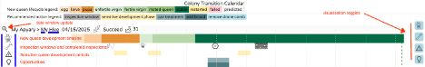

The start and end dates of the timeline can be optimized by clicking the `(+)` magnifier to the left of the hive name on the calendar. Each of the visualizations (rows) can be toggled on and off individually to reduce clutter which can happen with many cycles running simultaneously on multiple hives. To toggle a visualization on or off click the blue icons to the right of the relevant row.

## Entering Inspection Data

Let's walk through a swarming transition cycle and use it as a guide to illustrate data entry requirements. Correctly identifying the Primary Swarm, where the mature mother queen departs the hive, is crucial. Calculations will be inaccurate if this identification is incorrect. The Primary Swarm is the initial and largest swarm to leave a honeybee colony during reproduction. If uncertain about whether the swarm is primary or not, review the available data (hive temperature and/or hive weight) for the previous two weeks carefully to see if earlier swarms may have occurred.

1. Start the transition cycle by entering a hive note with the date and time of the swarm

    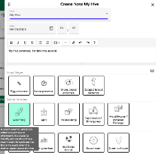

2. Scroll down and click `Create`. Answer `Yes` when the pop-up appears.

3. It takes you to the inspection window pop-up which consists of 4 sections (0-3) with section 1 open as shown below:

    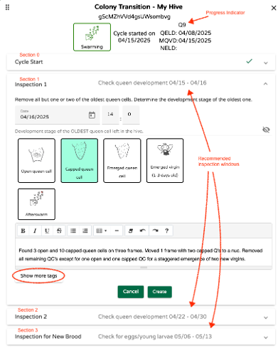

4. Before continuing with our example, let’s briefly look at all the sections/inspections in the above window. Section 0 shows the cycle summary with start date, the cycle progress indicator (Q-code), the Queen Egg Lay Date (QELD) and the Mother Queen Vanished Date (MQVD). These values are calculated with default values for the “Swarming” cycle type and are updated as inspection results become available. The defaults are:
    - Mother queen left with the swarm since it was a primary swarm
    - She laid her last batch of eggs on the morning before the swarm
    - Oldest queen cell is capped on swarm departure date

    Sections 1-3, indicate possible dates for three suggested inspections as well as recommended actions to complete:

    - Post Swarming Inspection 1: The day of or the day after the swarm to remove excessive number of queen cells to prevent afterswarms and to determine the development stage of the new queen. This inspection is optional. Click “Cancel” if it was not carried out.

    - Post Swarming Inspection 2: One week after the swarm to remove any additional queen cells which may have been raised since the first inspection and to check on the status of the queen cell(s) left in the hive during the first inspection. This inspection is also optional. Click “Cancel” if it was not carried out. Bear in mind that skipping inspections significantly increases the Afterswarm risk.

    - New Brood Inspection 3: The purpose of this inspection is to assess the progress of the new queen by looking for eggs, larva and capped brood.  This inspection is required.  The cycle will close out if capped brood is found. Another inspection will be required if only eggs or larvae are found. It is recommended that Inspection 3 be carried out between day Q30 and Q37 of the queen development cycle. This provides a good chance to find new brood as most queens begin to lay between day Q22 and Q35. If this inspection is carried out after Q37 you may miss a possible supersedure event.  As brood dwindles during the queen replacement process some colonies attempt an immediate supersedure without giving the new queen a chance to prove herself. A new queen can start laying on Q22 and a supersedure virgin can emerge 16 days later, on Q38. Inspecting beforehand gives the beekeeper the chance to decide if he/she wants to let the supersedure proceed or to intervene.

5. Now that you have an overview of all the inspections, let’s go back and complete the first inspection for our example. Four queen development stages are available for selection. In addition, there is an “Afterswarm” option for the case where an afterswarm happens before the inspection is done. Only one of the options available can be selected. Inspect the hive carefully and select the option which best matches the development stage of the OLDEST queen cell or emerged virgin. Your selection is used to update QELD and the development progress indicator (Q-code) from the default value to a value based on your inspection results. It is important to select the development stage of the oldest queen cell left in the hive at the end of the inspection and not what was found when the hive was opened since you may have elected to remove some queen cells. In the example here, the note we made (see the window above) indicates queen cells were removed and one capped and one open queen cell were left in the hive. In this case, “Capped Queen Cell” is the oldest development stage and this is what was selected.
There is a “Show more tags” button near the bottom which will open most of the tags you normally see when entering notes. They can be used at your leisure as their selection does not affect any of the calculations. Click “Create” when done which will close the window.

6. At any point in time, you can open the QueenMinder dashboard to access the timeline for the development of the new queen together with all the other details, inspection recommendations, cautions and opportunities. You may have to extend the display window to see everything.
The Notes section at the top shows the detailed information entered.
Hover over the different colored regions in the Colony Transition Calendar to reveal the meaning of each. The grey inspection bars are clickable and open the respective inspection data entry field.

      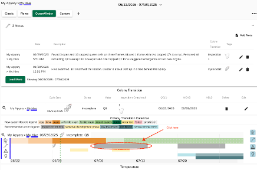

7. To continue with our example, suppose it is time for our next inspection. Click on the first grey inspection bar. This will open the data entry window for the next inspection. This time the dialog opens with the data entry window for the second inspection. Again, select the development stage of the oldest queen cell (or emerged virgin) and remove any additional queen cells which may have been raised since the last inspection.

      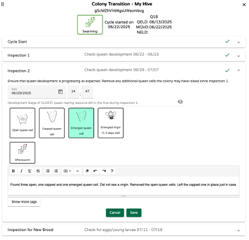

8. Click “Save” to save the data entered and to recalculate the dates for the next inspection window. It will take you back to the QueenMinder dashboard. Time for a break of about two weeks before any further action is needed.

9. Go back to the QueenMinder dashboard by the time the next inspection window rolls around and do the hive inspection. Click the grey inspection bar in the timeline or the edit pencil in the Colony Transition summary to enter the findings.

      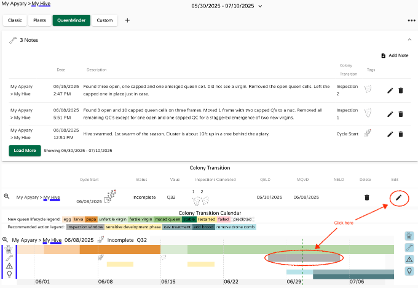

10. Once again, the inspection data entry pop-up window opens to the appropriate section. A lot of things are happening at this point. Let’s go thru them one-by-one. In our example we are at day 32 of the queen development cycle as indicated by the Q32 code at the top. We have completed the start of the cycle and the first two inspections as indicated by the check marks. 
The “Inspection for New Brood” tags have the following groupings and meanings:
    - Green “Worker/Drone Brood”: All is on track, and we have a new laying queen.
    - Red “Capped Drone Brood Only” or “No egg”: Queen development may have failed
    - Yellow “Supersedure Queen”: Queen development was successful, but colony does not accept the new queen and wants to replace her.
    - Yellow “Afterswarm” or “Requeening”: Colony or beekeeper-initiated cycle restart.

    In our example we have found eggs and young larvae. We therefore select “Young larvae” as the state of the oldest brood found. Click “Create” at the bottom to close the window.      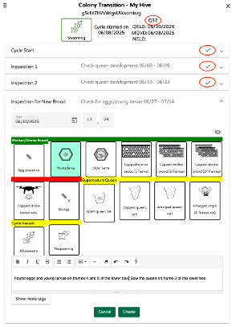

11. Back at the QueenMinder dashboard we now see the following:
    - The Colony Transition summary shows W8 as the progress code and QDT: 26. This means that it took 26 days for the new queen to develop (from egg-to-egg) and that the new brood is now 8 days old.
    - The New Egg Lay Date (NELD) is now shown. This is the date the new queen laid her first eggs.
    - The onset of stable brood production is shown which marks the end of the transition period.
    - The last inspection window now appears. When you are ready to inspect again to check for capped brood and to make sure that indeed the transition period is complete, you will click the grey box for the next step.

      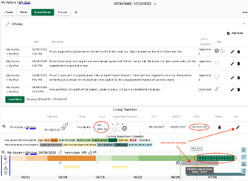

12. Once you click on the grey inspection box, the data entry window is opened one last time to close out the cycle. The “Egg” and “Larvae” options are no longer available since it is expected that the oldest brood is capped by now. In our example, we found capped brood on 1 frame and we click the corresponding tag. Click “Create” to save and close the window.

      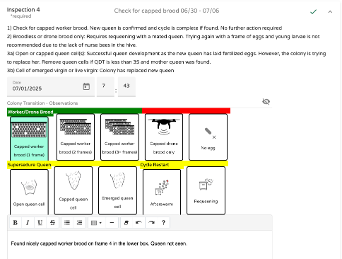

13. Back at the Colony Transition summary we now see that the cycle has been completed successfully. The final stage of the queen development timeline has turned solid green as an indication that we now have a stable brood production again.

      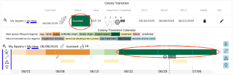

The above is an example of a successful cycle. New brood was found when first checked during step 10). This is not always the case. If brood is not found at this stage, it is suggested to go back in 5-7 days to check again.  Requeening of the hive should be considered once the Q counter is above 35. The next chapter explains the process.

## Cycle Restart

There is the option to abort a running cycle and initiate a restart. This is done by the colony in the case of an Afterswarm or by the beekeeper in the case where s/he decides to requeen the hive during an incomplete cycle.

14. Let’s assume that during the previous example we did not find any new brood during the inspection on June 30th:

      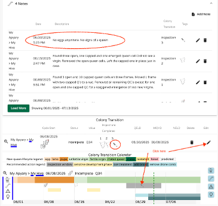

15. Click to open the inspection window. Let’s assume there is still no new brood (eggs or larva). There are the two cycle restart options at the bottom right. Selecting either of them will abort the current cycle and start a new one. It is assumed that there has not been a queen laying any brood since the start of the now aborted cycle, thus the Mother Queen Vanished Day from the aborted cycle can be carried over. Select “Requeening” and click “Create”.

      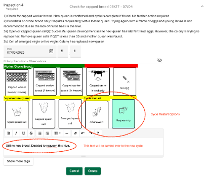

    A pop-up appears asking you to confirm. Click “Yes” to continue.

16. A new transition cycle window opens with the text entry from the previous cycle which was carried over. This is considered the first inspection of the new cycle with a lot of different requeening options in three categories: 

    - Options requiring young nurse bees to produce royal jelly

        1.	No queen cell, has eggs/larvae
        2. Open queen cell
    - No royal jelly needed, before mating flight

      3. Capped queen cell (9 days or older)
      4. Breeder queen cell (1 day before emerging)
      5. Emerged virgin (1-3 days old)
      6. Fertile virgin (4 or more days old)
    - After mating flight

        7. Mated queen
        8. Confirmed (or tested) queen

    The default for this cycle type is 1), “No Queen cell, has eggs/larvae” and the Q code for this option is Q4 as seen at the top of the window.

      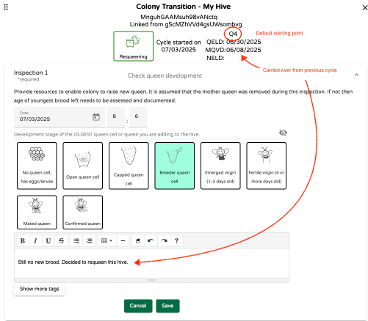

    It is up to you to select the appropriate option for the case at hand. Typically, I would not start with open brood again if the mother queen vanished more than 4 weeks ago.  In our example I inserted a capped queen cell from a breeder. The virgin should emerge within a day or two. Select breeder queen cell and click “Save” to close the window.

17. Back at the QueenMinder dashboard we now see a second cycle appear. The first one was restarted at Q34 and the second cycle sits at Q15 considering the resource option we selected (Breeder queen cell). The next inspection is to check for new brood in about 2 weeks and then continue with the steps previously described starting with section 10.

      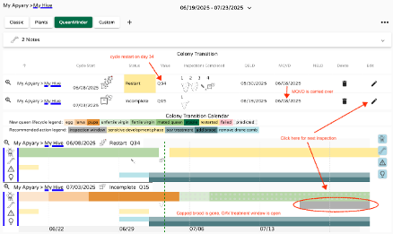

## Requeening from Scratch
This requeening scenario is initiated by the beekeeper and is not the result of a cycle restart.
Make sure that there is no cycle running on the hive you want to requeen. Consecutive cycles on the same hive are not possible. Select requeening and click “Create” and confirm with “Yes”. 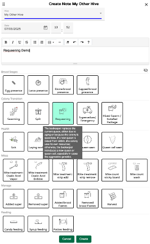

19. This opens the first inspection window which has extra options when compared to the window shown in step 16) which was a restart, and the Mother Queen Vanished Date (MQVD) was known. This time around, this information is not available. The default is that the mother queen was removed during this inspection. There is however the possibility that a hive was found queenless and it is not known when the mother queen vanished. In this case, the vanished date of the mother queen is determined based on the condition found of the remaining brood in the hive. It is important to look for the YOUNGEST brood anywhere. Use the bottom group of icons to record the finding and the MQVD will be recalculated accordingly.

      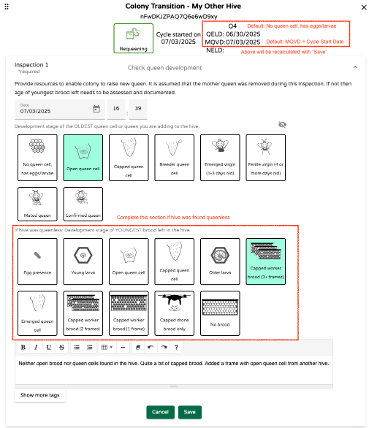

    In our example, no open brood or queen cells were found in the hive. Capped worker brood on 3+ frames was the youngest brood found and that’s the correct selection. The frame with the open queen cell which was added does not count since it came from another hive. Click “Save” when done.

20. Back at the Colony Transition Summary we now see the recalculated values:

    - Q4 went to Q6
    - QELD went from 6/30/25 to 6/28/25
    - MQVD went from 7/3/25 to 6/18/25

It is now apparent that the egg for the new queen was laid ten days after the queen in the hive vanished thus it had to originate from another hive.

  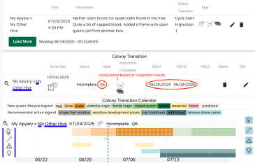

The remaining steps in this cycle are the same as shown before.

## Supersedure/Emergency Requeening, Hive Splits
We have gone thru the “Swarming” and “Requeening” cycles in detail. The Supersedure/Emergency and the Split cycles are very similar to the Requeening cycle with fewer options. This simplifies data entry.

The **Supersedure/Emergency** cycle always requires the beekeeper to assess the state of the old brood for determination when the mother queen was lost. Queen development options are few and include open, capped and emerged queen cell. This looks too simplistic at first but always remember that if brood from another hive is added and a queen is raised from that brood then it is a requeening by the beekeeper with external resources vs resources from within the hive for the true Supersedure/Emergency requeening done by the colony without external help.

The **Split** cycle is another simplified requeening option for the split off and queenless portion of the colony where the mother queen is no longer present after the time of the split and the split colony raises a new queen from resources available within the hive or is provided with external resources.
## Swarm Capture / Package Installation

This is a special case and uses another simplified cycle to ensure that hiving a swarm or installing a package into a hive is successful.

The cycle is started with the initial discovery of the swarm or with the receipt of the package of bees.
The first observation of a swarm can be a swarm:
- Leaving a hive
- Occupying a swarm trap aka bait hive
- Discovery of an open swarm on a tree or similar in the bivouac state.

The goal is to capture as good as possible the start of the broodless period which starts when the cycle is initiated. This determines the start of the Q clock. The default is Q24 for a mated queen. This drops down to Q20 for a virgin.

The second step is the installation of the package or swarm into the hive. Here it is required to make an educated guess if the colony has a mated queen (primary swarm or package of bees) or a virgin (Afterswarm).
There is no option to select a queenless swarm since it is nearly impossible to determine if this is the case during installation unless the exact heritage of the swarm is known. It is suggested that in this case the Requeening cycle is used to track progress.

The first inspection for new brood after the installation is at Q30 to Q37 which is in synch with all the other cycles and the steps are the same as shown previously in steps 10) – 13). All options are available for a cycle restart with requeening in case the colony turns out to be queenless.

