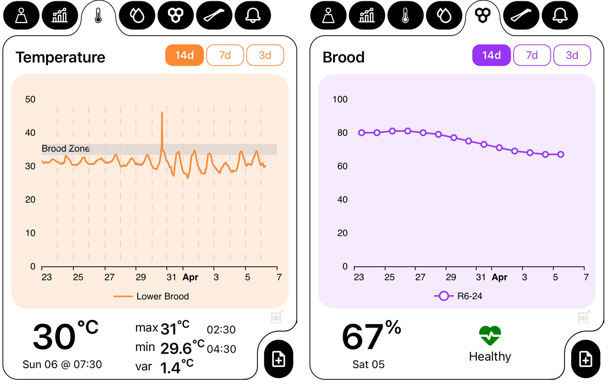
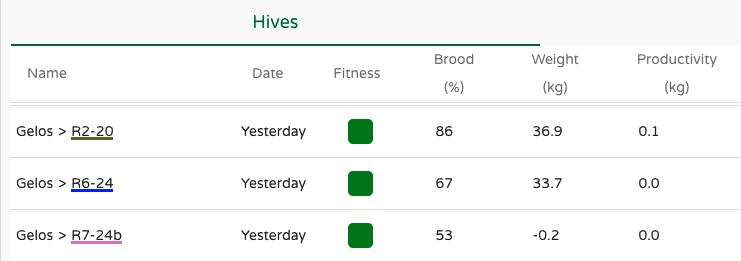
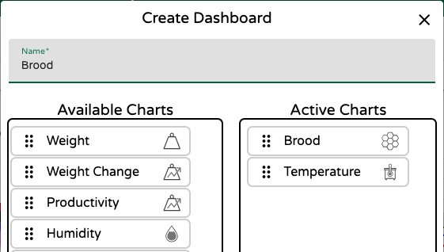
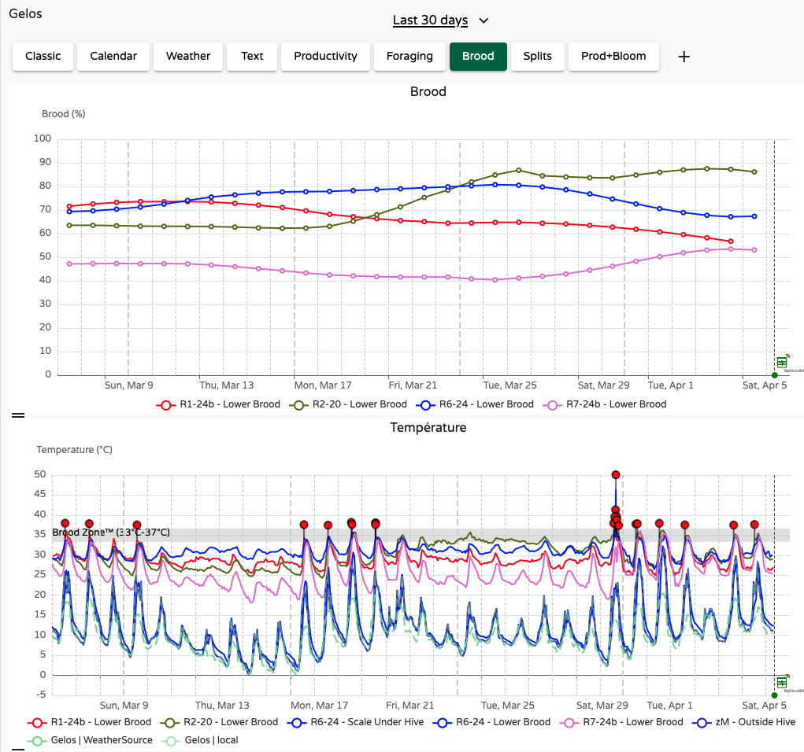
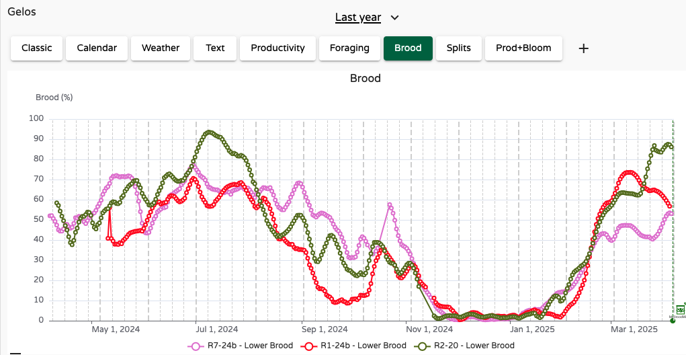
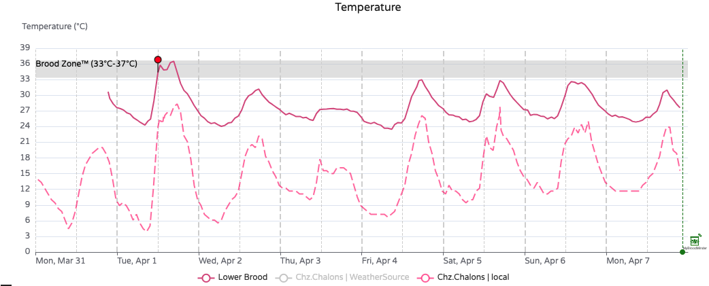
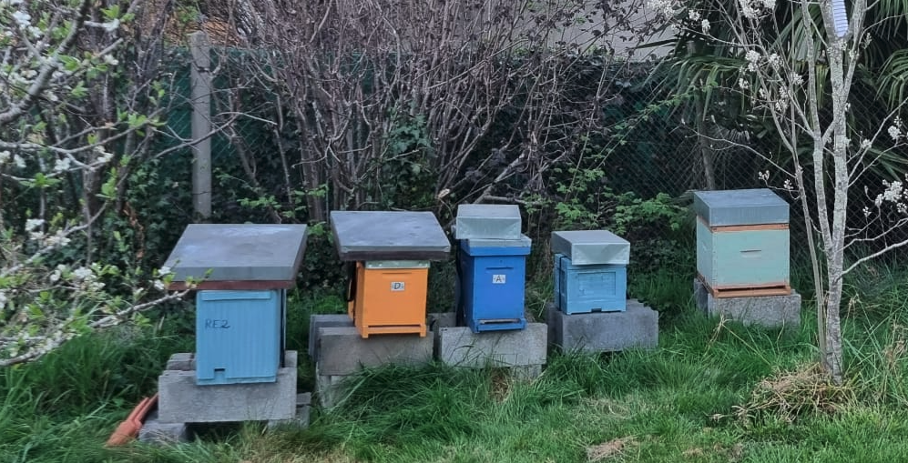
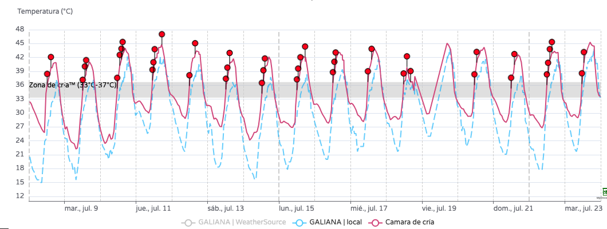
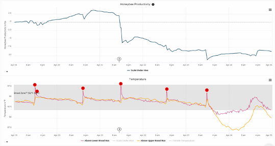
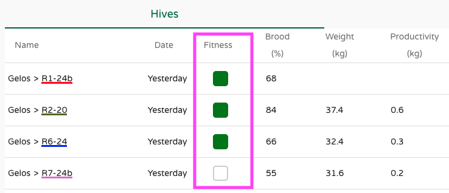

# Working with Temperature and Brood

Brood is arguably the most essential aspect of a beehive. Whether it is present or not, increasing or decreasing, compact or sparse... brood tells you if the hive is queen-right and it guides your inspections and beekeeping decisions.

Although we cannot (yet) measure everything about brood (e.g., diseases), we can do a lot with a **BroodMinder-T or TH**. These sensors measure in-hive temperature and humidity, and from that data, we compute a beekeeping-centered metric: **Brood Level**.

Because we don’t know what kind of hive you’re using (6-8-10-12 frame / Langstroth-Dadant-Topbar-Layens...), brood levels are expressed as **percentages**. The higher the percentage, the higher the brood level. While it’s not always possible to convert this directly into a number of frames, relative values are reliable. For instance, if you have two hives—one at 80% and the other at 90%—you can be confident the latter has more brood.

Familiarize yourself with these values in your own hives.  
As a starting point: in a 10-frame hive, 90% brood could mean 9 frames, 80% about 8 frames, and so on. However, this varies with hive configuration, so learn what these percentages mean for your bees.

## Why does temperature indicate brood?

Bees excel at thermoregulating their hive, and they do so primarily for one reason: **to raise brood**. When there’s no brood, there's little incentive to regulate temperature (with rare exceptions).

When the colony is strong and full of brood, it maintains a stable internal temperature of **35°C / 95°F**. This is what we call the **Optimal Brood Zone**, and it corresponds to **100% brood**.

Conversely, when there is no brood, the bees let the internal temperature follow ambient conditions. In this case, you’ll see values closer to outside temperatures, and the brood level will be near **0%**.

Between these two extremes lie many intermediate situations.

To illustrate this, here are hourly temperature measurements from two hives in the same apiary. The first hive is represented in red, the second in grey. Solid lines show internal temperature; dashed lines show external temperature.

We observe a clear difference: the red hive follows ambient fluctuations (25–30°C / 77–86°F), indicating little or no brood. The grey hive maintains a stable 35°C/95°F, clearly within the Optimal Brood Zone.

Some BroodMinder users have developed strong skills interpreting these internal temperature charts. A great reference is Theresa Martin’s book: ["Dead Bees Don't Make Honey: 10 Tips for Healthy Productive Bees"](https://www.amazon.com/Dead-Bees-Dont-Make-Honey/dp/B0CY9G9C89)

## Where is Brood displayed?

You can find brood levels in multiple places within **MyBroodMinder** and the **Bees App**.

One of the most convenient is the **Bees App**, where you can view temperature and brood charts. For example, in the chart below, a brood removal one week prior caused increased temperature fluctuation. This is expected when thermoregulation is disrupted due to reduced brood.

Following this example, in the following days, one should monitor the charts to check if brood levels recover (which would be expected), or continue to decline (indicating a possible queen issue—perhaps she was removed with the split or is no longer viable).

---

Brood values are also displayed on the **MyBroodMinder home page**, where you can see an overview of all your hives and apiaries. We find again the same hive as above R6-24 with 67% brood.

## Make your custom brood charts

To view your first brood chart in MyBroodMinder, create a custom dashboard and drag the **Brood Widget**. You can place it next to the temperature widget for easy comparison. While temperature is recorded hourly, brood levels are computed daily (typically after midnight when all data is available).

Here’s how such a widget might look:

And here’s a complete view with brood levels from multiple hives within an apiary. Since values are daily, the chart is cleaner and easier to interpret than temperature charts.

Another great feature in MyBroodMinder is the ability to visualize brood across longer time spans. Here for example is the full year for three hives. While each followed its seasonal rhythm, all stopped brood production in mid-November and resumed in mid-January.

!!! tip "Use brood data to plan for treatments"
    Use the brood charts to identify the most appropriate time for broodless treatments. In winter, opportunities to open hives are limited. Having real-time data from inside the colony that shows when brood is decreasing—or completely absent—is incredibly helpful for choosing the optimal treatment window.

!!! info "FAQ: How accurate is the brood estimation?"
    Brood estimation is an **indirect measurement** of the hive thermoregulation, which itself depends on hive type and insulation. For example, well-insulated hives may display higher brood percentages simply because they retain heat better.

    Over time, you’ll learn to correlate brood percentages with your actual number of brood frames. For instance, "when brood shows 80%, I usually have 5 frames."

    While **absolute values** are affected by hive configuration and sensor placement, **relative values** are much more reliable. If you use the same model across hives, you can trust that a hive with a higher brood percentage truly has more brood.

    One important limitation is at **very low brood levels** (e.g. 1 frame or less). Because the sensor is single-point and the brood may be far from it, the reading can have a higher margin of error. In practice, values below 20% are less accurate.

---

## SwarmMinder – Detecting Thermal Events

In addition to monitoring brood temperature, the internal sensors BroodMinder-T and BroodMinder-TH offer an extra feature called **SwarmMinder**. This function actively detects **unusual temperature events**, characterized by **rapid rises in temperature**.  
For a detailed explanation of how the device works, see the section [SwarmMinder details](https://doc.mybroodminder.com/31_sensors_T_TH/#swarmminder-details) in the BroodMinder-T/TH device guide. This section focuses on how SwarmMinder can be interpreted **from a beekeeper’s perspective**.

## What is a Thermal Event?

A Thermal Event is defined by a **steeper-than-normal temperature increase** in the brood area. This can indicate several scenarios:

- 🐝 **Swarming behavior**: Bees become agitated and lose control of thermoregulation. This typically occurs during or de days before a swarm.
- ☀️ **Environmental overheating**: External temperature rises rapidly (e.g., midday sun), and heat transfers into the hive—especially if insulation is poor.
- 🔍 **Hive inspection**: Opening the hive and exposing the sensor to ambient air causes a temporary spike in temperature.

In MyBroodMinder, these events are automatically flagged as **red needles on the temperature chart**. Let’s look at a few real-life examples.

---

### Case 1 – Overheating in a Young Nucleus Colony

In the chart below, a new split colony experienced during its **first day of activity on April 1st** a sudden internal heat spike. This kind of stress is particularly harmful for a nuc: fewer bees, eggs to care for, and a queen to raise.

> Fortunately, the colony maintained brood temperature in range, but we still took action by **adding a second roof for shade**.

  
*Temperature spike on April 1st*

  
*Double-roof insulation added afterwards*

Notice that on **April 4th** (chart above), a similar external temperature rise occurred, but the colony handled it much better—thanks to the improved radiative protection.

---

### Case 2 – Chronic Overheating in Southern Spain

In some areas, especially in southern Spain, **overheating is a daily issue in summer**. The chart below shows continuous daily heat spikes.

> This not only stresses the colony but also wastes energy: the bees are constantly trying to regulate temperature, instead of foraging or raising brood.

Good insulation and proper hive positioning become essential in these contexts.

---

### Case 3 – Swarming Detected After Thermal Warnings

In this final example, a colony displayed **multiple thermal events in the days leading up to a swarm**. These temperature spikes were an early sign of the bees’ preparation.

> Eventually, the colony swarmed – confirming the predictive value of SwarmMinder.

  
*A thermal signature followed by an actual swarm*

---

!!! info "FAQ: How to interpret Thermal Events?"

    A **Thermal Event** simply means your hive's internal temperature rose unusually fast. But this does **not automatically indicate a swarm**. It could also result from hot weather or an inspection.  
    Your hive type and local climate play a key role in interpreting these events accurately.  
        
    We're working on improving detection through **machine learning**, and you can help!  
    If you'd like to contribute by tagging events in your hives, contact us at [support@broodminder.com](mailto:support@broodminder.com) to join our testers group.

## Intriducing Fitness
_Bee Fitness_ is the algorithm that informs the beekeeper of each hive's condition. We use benchmarks such as the time of the season and the surrounding hive state in order to define a "nominal" state. Then we position each hive in relation to this reference.

The color code is the following:

| color | meaning |
|---|---|
|Green | Healthy |
|Orange | Disturbed (declining or with abnormal events) |
|Red | In trouble |
|Black | Dead |
|White | No data or no weather |

You can find fitness estimation on Bees App in the hive "boxes" and also in the brood tab.

  

Also available in MyBroodMinder Home page

  

!!! Warning "Don’t confuse fitness with health!"
    While we strive to provide tools that deliver the most accurate information based on available data, it’s essential to understand that **colony health** encompasses more than just temperature or weight readings. 

    Sensors cannot currently detect issues such as excessive varroa load or diseases like foulbrood or nosema. The data we provide should be seen as guidance, not a diagnosis. 

    These conditions will eventually impact colony fitness—but by the time that happens, it may be too late to intervene effectively. That’s why regular inspections and a critical eye remain crucial for accurately assessing colony health.