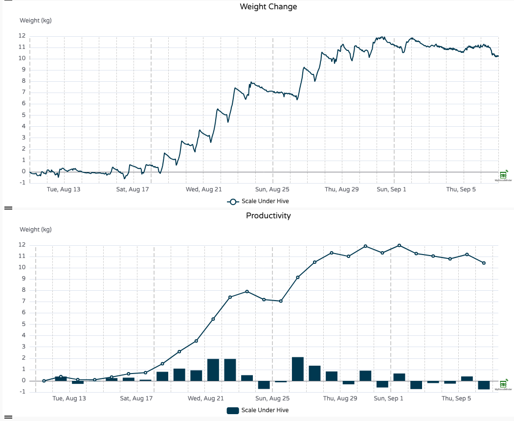
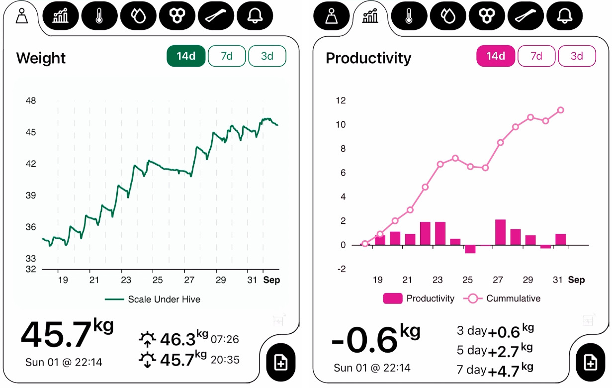
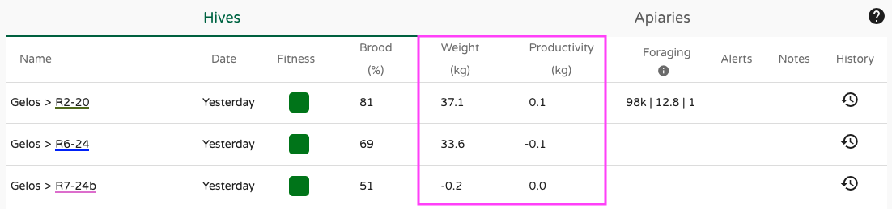
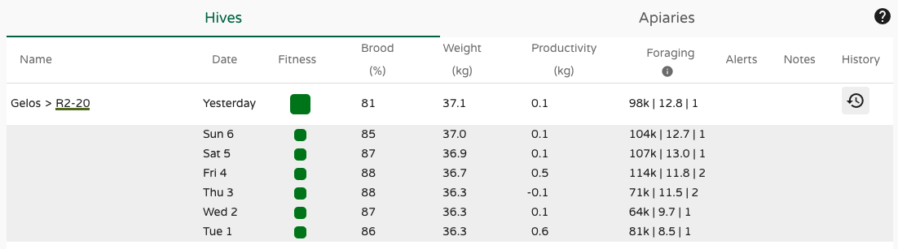

# Working with Weight and Productivity

Tracking and experiencing nectar flows is one of the most fascinating aspects of beekeeping. Plants release nectar, bees find it, love it, and bring it home.  
That’s how it’s supposed to work, right?  
But the real questions are: **When does it happen? For how long? How intense is it?**

A hive scale answers all those questions — information that would otherwise remain hidden.  
Instead of just thinking *“I guess there was a nectar flow because the bees looked busy”* (if you even saw them), you’ll be able to **quantify** and **visualize** the event.  
It’s a truly amazing experience.

---

## Spotting a nectar flow

Tracking a **nectar flow** with a hive scale looks like the chart below. You’ll see the hive's weight increasing steadily each day.  
Rather than monitoring absolute weight, which changes slowly, we typically focus on **weight change**, offering a clearer hour-by-hour view.

Each day follows a fairly consistent pattern — typical of nectar flow periods. Here's what usually happens:

- Foragers leave in the morning  
- Resources flow in during the afternoon  
- Bees return around sunset after a long day  
- Night work begins: **dehydrating** nectar and converting it into honey (you’ll see a downward slope in weight)  
- Then the cycle starts again the next morning

---

## Productivity

**Productivity** is the net work done by your bees.  
It’s a daily metric calculated from hourly weight data, and it **excludes** beekeeper interventions (like feeding, adding a super, or removing frames).  
So productivity reflects only the colony’s own performance.

The result? A clear view of whether the bees are **producing** or **consuming** — because productivity can be either positive or negative!

In the example below, we zoom out to see the **full nectar flow period**:

- **Bars** = daily productivity (e.g. +2 kg on Aug. 21)  
- **Line** = cumulative productivity since the first day shown (e.g. +5.5 kg between Aug. 12–21)

Notice the three distinct phases: **before**, **during**, and **after** the nectar flow.  
There’s also a **temporary stop** around Aug. 25, caused by poor weather and rain.  
With productivity metrics, it’s crystal clear when the nectar flow starts, pauses, and ends.

!!! tip "Cumulative Productivity"
    The cumulative value starts from day 0 of the selected chart.  
    If you want to analyze a nectar flow from a specific date (e.g. when you entered the apiary or a bloom started), just select that date in the date picker.

---

### Where to find Productivity?

In the **Bees App**, you’ll find both Weight and Productivity:

On **MyBroodMinder**'s homepage, you’ll also see the latest total weight and productivity values:

Need more history? Tap the `History` icon to review the past week:

And of course, you can build your **custom dashboard** with `Weight`, `Weight change`, and `Productivity` widgets:

---

### Notifications

You’ll receive **three types of automatic notifications** related to nectar flow:

- **Nectar flow start**: noticeable weight gain over 3 days  
- **Nectar flow stop**: no increase for 2 consecutive days  
- **Nectar flow restart**: after a temporary stop within 7 days.

---

