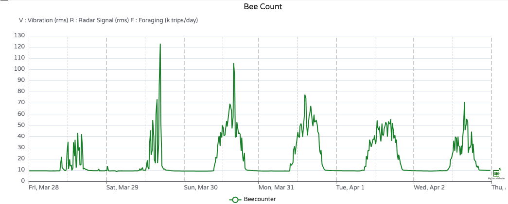
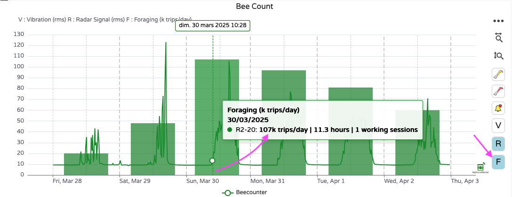
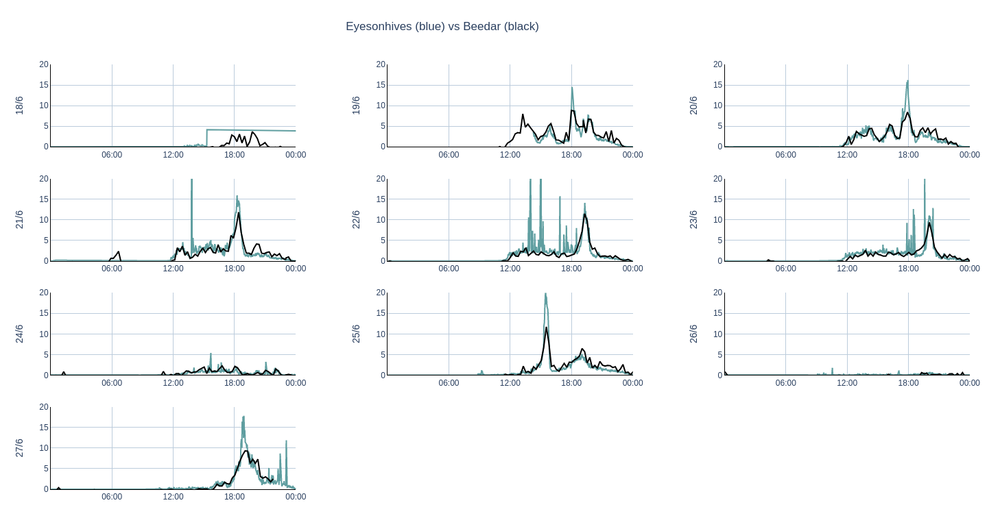
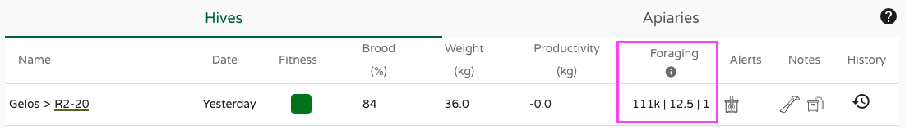
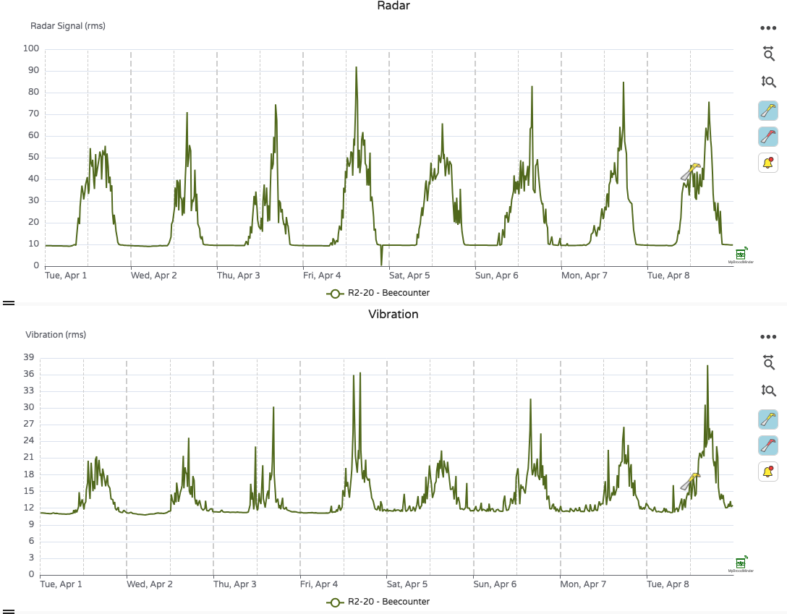
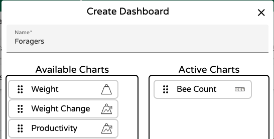

# Working with Foraging

Forager bees embark daily on a mission to collect resources essential for the colony’s survival — and for pollination, of course! Monitoring foraging activity provides valuable insights into hive health and ecosystem interaction.

There are several ways to track forager activity, such as **bee counters** and **cameras**. But **BroodMinder-BeeDar** offers something different: a **non-invasive**, **battery-powered**, radar-based system that works on any hive, with **no optical setup required**. It uses the **Doppler effect** to measure motion at the hive entrance — quietly and efficiently.

Watch the video:

!!! tip "BeeDar also works with Bumblebees! 🐝"
    In 2021 we made extensive campaigns with bumblebees using BeeDar and the results are amazing. "BumbleDar" is a specific version of BeeDar with a dedicated firmware to adjust to bumple bees activity patterns. 

## What does BeeDar measure?

**BeeDar** captures **foraging activity** by detecting movement in front of the hive. The raw measurement is the **RMS signal strength**, a value proportional to overall bee traffic at the entrance.

!!! info "BeeDar History"
    **BeeDar** was invented by **Dr. Herbert Aumann**, a pioneer in radar systems. After fifty years as a senior scientist at MIT Lincoln Laboratory, Herb continued his research as an adjunct professor at the University of Maine, and later co-founded Maine Biosensors LLC.
    
    Also a passionate **beekeeper**, Herb brought together his expertise in radar and love for bees to create BeeDar. When we met him, it was clear that his invention deserved a place in the BroodMinder ecosystem.
    
    BeeDar is patented as:  
    "Doppler Radar Beehive Activity Monitoring System"
    – U.S. Patent 11,867,794 and EP 3820283A4

## Interpreting BeeDar data

Below is a chart showing **raw BeeDar data** (RMS signal strength).  
You can clearly see when foragers start and stop each day. Activity varies depending on weather and conditions — for example:

- March 28: very low activity  
- March 29: concentrated afternoon activity  
- March 30: a long, productive day

To make this data more actionable, we developed an algorithm that converts signal strength into **estimated bee trips**.  
Click the `F` button on the chart right toolbar to reveal this view as in the example below, March 30th shows 107,000 forager trips across 11.3 hours.

---

## How does BeeDar work?

Let’s be clear — BeeDar is **not exactly a bee counter**. It doesn’t track individual bees entering or leaving the hive. Instead, it's a **bee activity counter**.

Think of it like a **water flow sensor** on a river: it doesn’t count every drop, but gives an accurate picture of overall flow. Similarly, BeeDar provides a reliable estimate of bee activity — not a precise in/out count.

So no, BeeDar won’t say:  
*"Today, 12,728 bees exited and 11,424 returned, so you lost 1,304 bees."*  
But it **will** say:  
*"We estimate 107,000 bee trips today, with this activity curve."*

BeeDar also includes a **vibration sensor** to measure sound and movement near the hive entrance. While often correlated with radar data, it can sometimes reveal distinct events.

By default, BeeDar samples data **every 15 minutes** to preserve battery life. At that rate your 2 AA batteries will hold ~4 months or even a full season (~8 months) if you place 4 batteries. You can adjust the measurement rate to **every 5 minutes**, at the cost of a 4x battery usage rate.

---

## How accurate is BeeDar?

While BeeDar doesn’t track every bee, extensive calibration campaigns have shown its **very strong correlation** with camera-based systems.

Here’s a comparison with **EyesOnHives®**, which uses computer vision to count bees:

Each day displays two distributions:  
- **Black** = BeeDar  
- **Blue** = EyesOnHives

The alignment is striking, and this level of validation has been confirmed using other technologies, such as **infrared gate counters**.

---

## Where is foraging activity displayed?

You can explore foraging data in **MyBroodMinder**:

- **Home page**: Summary of bee trips, session duration, and number of sessions  

- **Classic tab** (bottom): Raw radar and vibration measurements  

- **Custom Dashboards**: Add the **BeeCount** widget for a tailored view  

!!! info "Coming Soon"
    BeeDar is not yet available in the **Bees App > Hives** tab.  
    🚧 We're working on it! 🚧 
    In the meantime, you can always view data in  
    `Sensors > [device name] > Show Details`

