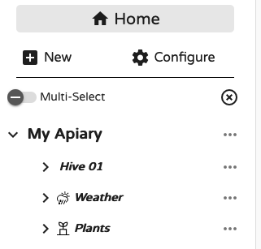
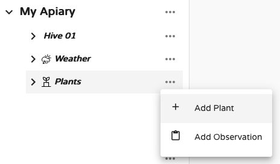
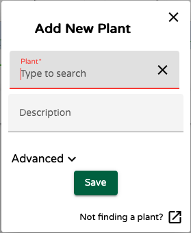
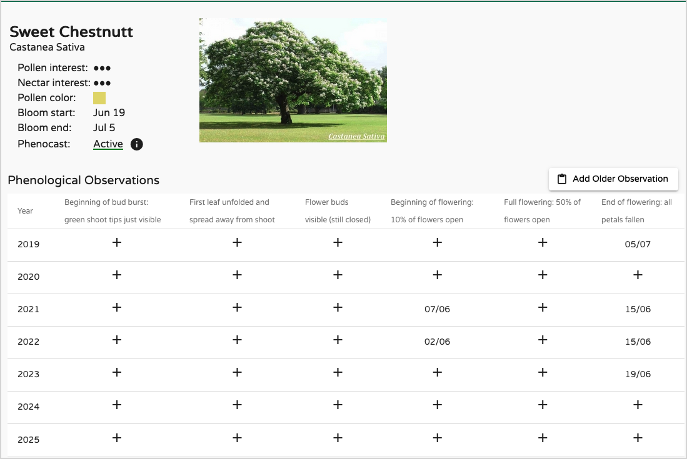
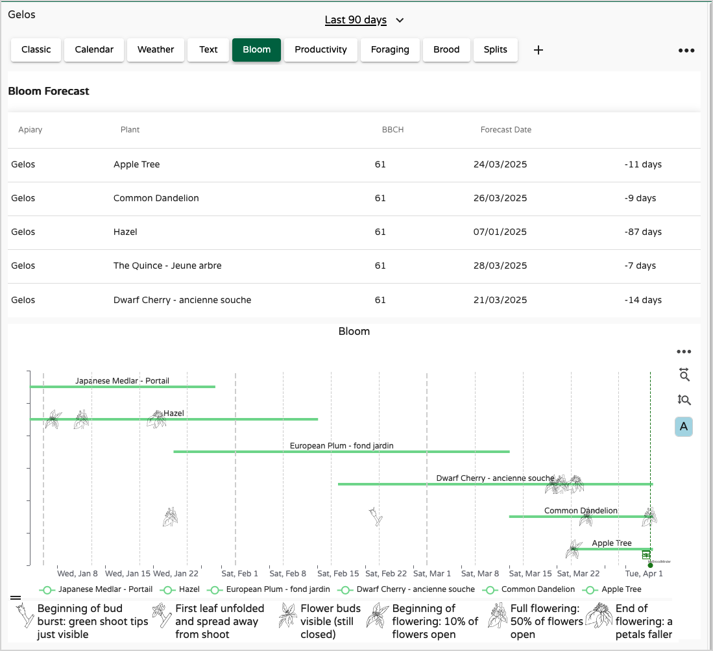
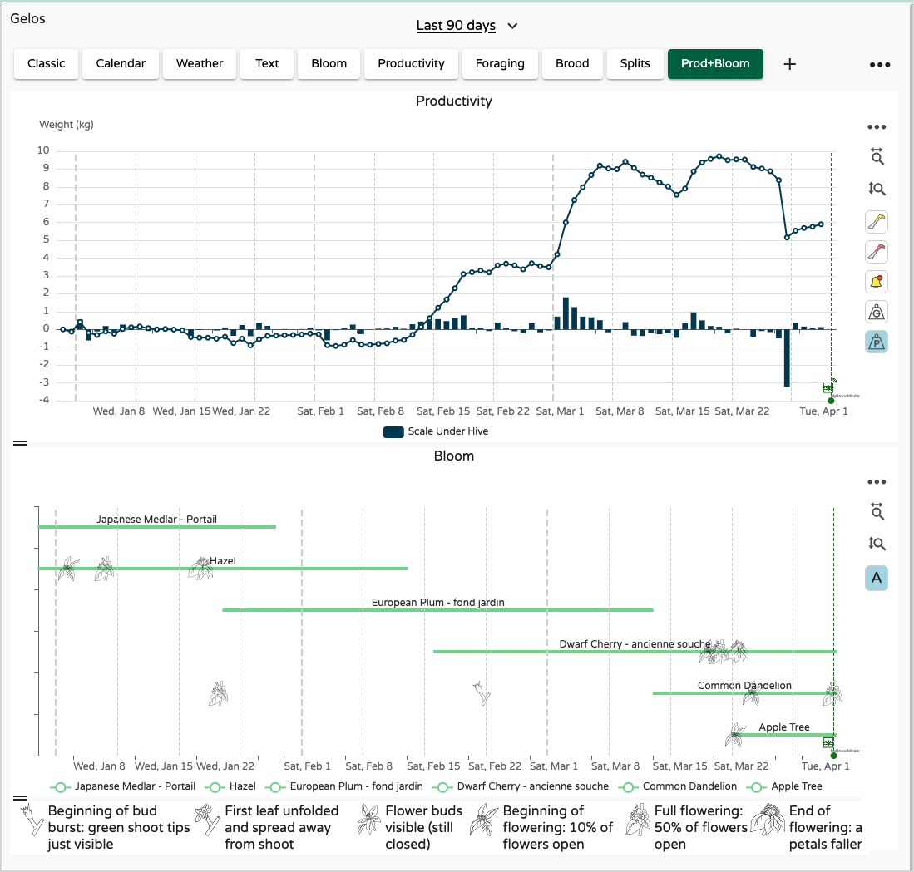
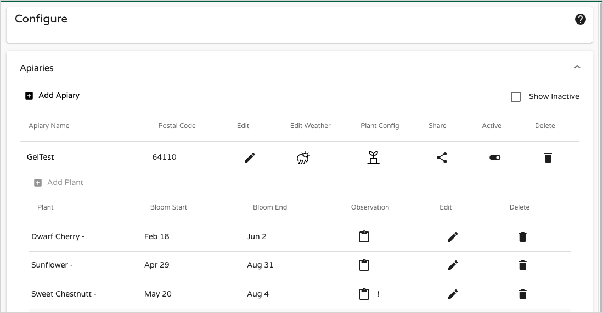

# Working with Plants

!!! abstract "What you'll learn in this chapter"
    In this chapter, you’ll explore how to use the **Plants module** to monitor and forecast bloom periods critical to your bees.  
    You’ll learn how to link plants to apiaries, browse species data, and use **calendar and dashboard views** to track nectar sources over time.  
    Most importantly, you’ll discover **Phenocast**, BroodMinder’s powerful forecasting tool that uses your local observations and weather history to predict phenological stages — helping you plan interventions and optimize pollination like never before.

    

The **Plants** module is one of the key new features released in 2025. Since 2022, we’ve been developing a powerful model to **track and forecast phenological stages** of plants. The engine behind this feature is called **Phenocast**.
Plants are now fully integrated into MyBroodMinder, and support for Bees App will follow soon.

Each **apiary** can now be linked to an **unlimited number of plants**. Choose those that matter most for your bees, especially for nectar and pollen. We’ve built a database of over **500 species**, searchable by keyword.  

!!! tip 
    you can search your plants through their Scientific (latin), english, french or spanish name

Once you've selected your plants, you can explore the data in different ways. let's check them:

## Plant data Sheet
 

Click on any plant to view all its properties:

- Common and **scientific names**
- **Nectar and pollen interest** for bees
- **Default bloom period**
- Whether a **Phenocast model** has been created from your observations

You’ll also see a **table of your historical observations**, which you can complete and edit. The more data you enter, the better the forecasts.

## Calendar View

From the **Plants tab** in the left panel, you’ll access a calendar showing:

- A **forecast table** of phenological stages
- The theoretical **blooming span** (green lines)
- The **blooming schedule** of all your selected plants

Bloom timing is highly location-dependent. A cherry tree in southern Spain will bloom earlier than one in Seattle. You can adjust bloom ranges in `Plants > Edit > Advanced` for more regionally accurate timelines.

Icons over the lines represent the **actual dates** recorded in your observations.

## Custom Dashboards

You can add a **Plants chart widget** to any **Custom Dashboard**. Simply drag the “Plants” widget to the right-hand side. It pairs perfectly with **productivity data** or the **nectar flow index** — giving you a more complete picture of your apiary’s ecosystem.

## Manage plants

You can edit or remove plants at any time from the `Configure > Apiaries` panel. Just click the **plant config icon** next to each apiary to unfold and manage your plant list.

## Phenocast

While it's possible to manage plants and observations using a traditional "logbook" approach, the true value of the system lies in its ability to **forecast phenological stages and send alerts**.

Better beekeeping starts **before** key events happen — not while you're reacting to them. That's exactly why we created **Phenocast**. This powerful and unique tool is designed to help **beekeepers and growers** alike anticipate what’s coming, so they can plan ahead and act at the right moment.

!!! info "What is Phenocast?"
    **Phenocast** is the forecasting service we’ve developed to predict **phenological stages** of plants based on:

    - Your **historical observations**
    - The **weather history** at your apiary

    To activate the model, you'll need to enter at least **3 bloom dates** from past years. Once this is done, Phenocast automatically builds and starts running.
    
    When the model is ready, you’ll receive a notification on your phone.

!!! tip "Improve forecast acuracy"
    You can improve the model by also recording **earlier stages** like **bud burst**, not just blooming. Every new observation **recomputes the model**, making it more accurate. 
    
    With high-quality input, we’ve achieved **1–2 day precision** for bloom predictions up to 5 days in advance.
    
    Check our [guide here] for tips on accurately observing phenological stages.

!!! warning "Phenocast Limitations" 
    Phenocast currently does **not** support annual plants (sunflower, rapeseed,...) reliably. Their pheno-stages depend heavily on sowing dates, so their bloom can’t be predicted accurately without that input. While you can still enter observations, the model may be unreliable.

### Credits 

The development of PhenoCast began in early 2022. The system architecture and algorithmics are led by our colleague Maxime, while the user interface is implemented by Amanda. Their work was supported by the invaluable contributions of a small group of beekeepers based in four regions of France (Gers, Rhône, Chalosse, and the Pyrénées-Atlantiques). By sharing their blooming dates — especially for acacia — and offering insights into local dynamics, they played a key role in enriching and gradually refining the model.

Special thanks to Rucher de Jouanchiq, Le Rucher des Opies, L’Abeille de Lesterel, Le Rucher de la Montagne Verte, Pascal Mariette, and also Ray Walker in Delaware, USA.